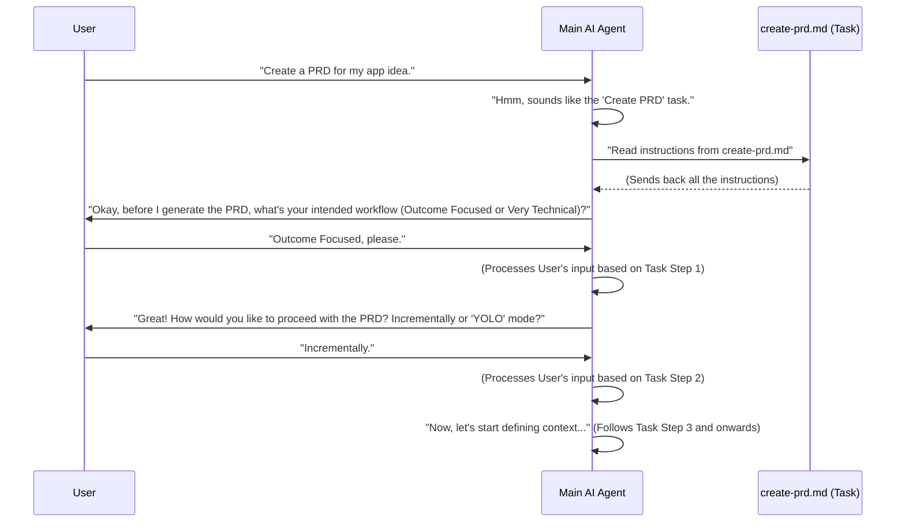

# Chapter 1: Tasks

Hey there, future AI builder! Welcome to the exciting world of BMAD-METHOD! We're going to start our journey by understanding a super important concept called "Tasks." Don't worry, it's simpler than it sounds.

Imagine you have a very smart assistant, let's call her your Main AI. Your Main AI is great at understanding what you want and talking to you. But sometimes, you ask her to do something a bit more complex, like "Please write a detailed plan for our new product."

Instead of your Main AI having to remember **every single step** to write a detailed plan (like researching, outlining, checking requirements, organizing ideas), she can actually look up a "recipe" or an "instruction manual" for that specific job. These "recipes" are what we call **Tasks**.

### What Problem Do Tasks Solve?

Think of it this way:

*   **Without Tasks:** Your Main AI would need to know how to do *everything* in great detail. Her brain would get super cluttered and it would be hard to update her for new jobs. It's like having one giant recipe book for your entire life, making it hard to find anything!
*   **With Tasks:** Your Main AI stays simple and powerful. When you ask her to "Create a PRD" (which stands for Product Requirements Document - basically, a detailed plan for a product), she doesn't try to figure out all the steps herself. Instead, she finds the "Create PRD" Task, opens it up, and follows the instructions inside. This makes her super efficient and flexible!

**Our Use Case:** Let's say we want our AI agent to "Create a PRD." This is a perfect job for a Task!

### What are 'Tasks'?

At its core, a "Task" is just a file that contains clear, step-by-step instructions for an AI agent on how to complete a specific job.

Let's look at a real-world example in our project! Imagine you have a file named `create-prd.md` in a special folder called `bmad-agent/tasks/`. This file is a "Task."

Here's a tiny peek at what it might contain:

```markdown
--- File: bmad-agent/tasks/create-prd.md ---
# PRD Generate Task

## Purpose

- Transform inputs into core product definition documents...
- Define clear MVP scope...

## Instructions

### 1. Define Project Workflow Context

- Before PRD generation, ask the user to choose their intended workflow...

### 2. Determine Interaction Mode (for PRD Structure & Detail)

- Confirm with the user their preferred interaction style...

... (many more instructions follow)
```

**Explanation:**

*   `# PRD Generate Task`: This is the clear title of our Task. It tells us what this file is all about.
*   `## Purpose`: This section explains *why* this Task exists – what it aims to achieve.
*   `## Instructions`: This is the most important part! It's a numbered list of steps that the AI agent needs to follow. Each step tells the agent exactly what to do.

So, when your Main AI agent is asked to "Create PRD," it literally opens this file and starts following these instructions, step by step!

### How Does an AI Agent Use a Task?

Let's trace how our Main AI (we'll call her the "Orchestrator Agent" later, but for now, she's just our smart assistant) uses the "Create PRD" task.

Imagine you, the user, say: "Hey AI, I want you to create a PRD for my new app idea."

Here's what happens:



**Explanation of the sequence:**

1.  **User Request:** You, the user, tell the Main AI what you want.
2.  **AI Recognizes Task:** The Main AI knows that "Create PRD" is a job defined in a Task file.
3.  **Read Task Instructions:** The Main AI goes to the `create-prd.md` file and reads all the instructions.
4.  **Execute Step 1 (and onwards):** The Main AI then starts executing the instructions from the Task file, usually by asking you questions or performing actions as guided by the Task. It's like she's reading from a script!

This process makes the Main AI incredibly powerful because she can handle many different complex jobs by simply using the right "Task" file.

### Under the Hood: How Tasks are Stored and Used

Tasks are stored as plain text files, usually in Markdown format (`.md`), inside the `bmad-agent/tasks/` directory. This is super handy because:

*   **Easy to Read:** Humans can easily open and understand what each Task does.
*   **Easy to Edit:** You can easily change or add steps to a Task using any text editor, making our AI agents very adaptable.
*   **Reusable:** Once a Task is defined, it can be used again and again for the same job across different projects. For example, the `create-prd.md` Task can be used for every new product idea!

When the Main AI agent wants to use a task, it's essentially just reading the text content of that file and then processing the instructions within it. This text-based approach is key to the flexibility of the BMAD-METHOD.

Here's how a typical task file might be structured:

```markdown
# My New Task Title

## Purpose
A brief explanation of what this task intends to achieve.

## Instructions
1. First step.
2. Second step, explain clearly.
   - Sub-point for more detail.
   - Another sub-point.
3. Next step, what the AI should do.
```

The AI agent is "trained" to understand common headings like "Purpose" and "Instructions" and how to follow numbered lists. This simple structure is enough to guide complex operations!

### Conclusion

You've just learned about "Tasks," a fundamental building block of the BMAD-METHOD! We saw that Tasks are like instruction manuals for AI agents, allowing them to perform complex jobs by following detailed, step-by-step guidance. This keeps our main AI agent lean and flexible, ready to take on any job you throw at her, as long as there's a Task file for it.

Next, we'll dive into who is using these Tasks: the AI Agent Persona. Think of it as the AI's "personality" and "job role"!

[Chapter 2: AI Agent Persona](02_ai_agent_persona_.md)

---

Generated by [AI Codebase Knowledge Builder](https://github.com/The-Pocket/Tutorial-Codebase-Knowledge)