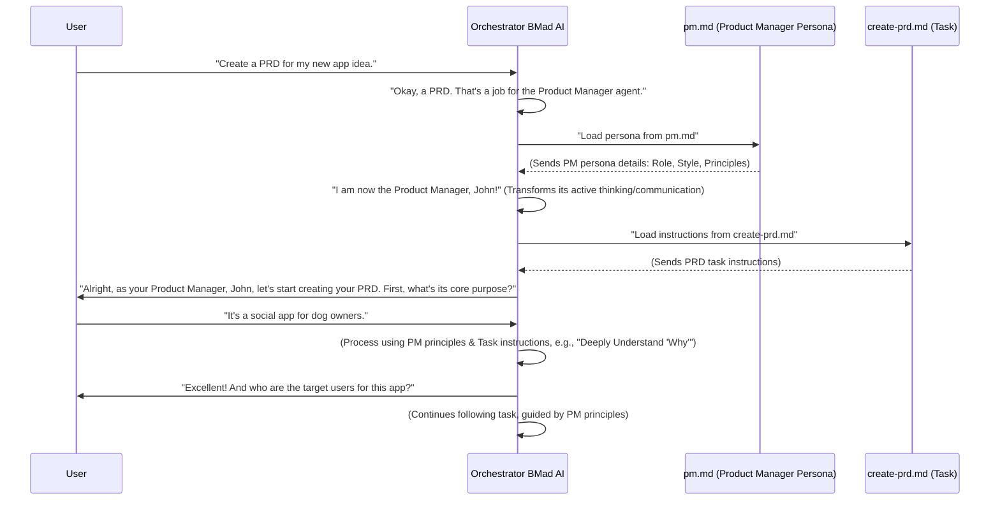

# Chapter 2: AI Agent Persona

Welcome back, future AI architect! In [Chapter 1: Tasks](01_tasks_.md), we learned how "Tasks" are like instruction manuals that tell an AI *what to do*. Now, we're going to explore *who* does those tasks: the **AI Agent Persona**.

### What Problem Do AI Agent Personas Solve?

Imagine you have a really big project, like building a new house. You wouldn't ask just one person to do *everything* – design the house, pour the concrete, do the wiring, and paint the walls. That would be chaotic! Instead, you'd hire specialists: an architect, a builder, an electrician, a painter. Each has a specific job, knows their field well, and uses their own tools and lingo.

An AI is similar. If you ask a general AI, "Write a detailed plan for our new product," it might struggle because "product planning" is a huge field. It needs to know about markets, users, features, technical feasibility, and more.

This is where **AI Agent Personas** come in!

Think of an AI Agent Persona as a specialized role or character that an AI can adopt. Each persona, like a "Product Manager" or an "Architect," has its own set of responsibilities, communication style, and core principles. This helps the AI act like a human expert in a specific field, making it much more effective at tasks within that domain.

**Our Use Case:** Let's say we want our AI to "Create a PRD" (Product Requirements Document), just like in our last chapter. Instead of a general AI trying to guess how to be a Product Manager, we can tell it: "Okay AI, for this job, you need to *be* the Product Manager Agent!"

### What are 'AI Agent Personas'?

At its heart, an AI Agent Persona is a file that defines the *personality*, *expertise*, and *rules* for how an AI should behave when it takes on a specific role. It's like giving your general AI a temporary, very specific job description and a matching expert brain.

Let's look at a real-world example from our project. Imagine you have a file named `pm.md` in a special folder called `bmad-agent/personas/`. This file defines the "Product Manager" persona.

Here's a tiny peek at what it might contain:

```markdown
--- File: bmad-agent/personas/pm.md ---
# Role: Product Manager (PM) Agent

## Persona

- Role: Investigative Product Strategist & Market-Savvy PM
- Style: Analytical, inquisitive, data-driven, user-focused, pragmatic.

## Core PM Principles (Always Active)

- **Deeply Understand "Why":** Always strive to understand the underlying problem...
- **Champion the User:** Maintain a relentless focus on the target user...
- **Ruthless Prioritization & MVP Focus:** Constantly evaluate scope...

... (many more principles and instructions follow)
```

**Explanation:**

*   `# Role: Product Manager (PM) Agent`: This tells us the role of this persona.
*   `## Persona`: Describes the overall character and style of this PM.
*   `## Core PM Principles (Always Active)`: This is the most important part! These are the fundamental rules and ways of thinking the AI **must always follow** when acting as the Product Manager. It's like the PM's "code of conduct."

So, when our AI is told to "become the Product Manager," it literally loads this `pm.md` file, internalizes its principles, and starts thinking and communicating like a human Product Manager!

### How Does an AI Agent Use a Persona?

Let's trace how our Main AI (the "Orchestrator Agent" from the context – more on this in [Chapter 3: Orchestrator Agent](03_orchestrator_agent_.md)) uses the "Product Manager" persona to "Create a PRD."

Remember, the user wants a PRD.



**Explanation of the sequence:**

1.  **User Request:** You ask the Orchestrator AI for a PRD.
2.  **Orchestrator Selects Persona:** The Orchestrator knows that a PRD is best handled by a "Product Manager." It looks up the configuration for the Product Manager.
3.  **Load Persona:** The Orchestrator loads the `pm.md` persona file. Crucially, the Orchestrator then *becomes* that persona. Its internal "rules" for how it thinks and communicates change to match the Product Manager's "Core PM Principles."
4.  **Load Task:** The now-active Product Manager persona (whose name is "John" in our example config!) then loads the specific "Create PRD" [Task](01_tasks_.md) instructions.
5.  **Behave and Execute:** From this point on, the AI responds as "Product Manager John," using PM-specific language and applying the PM's core principles as it follows the instructions from the `create-prd.md` [Task](01_tasks_.md). Notice how the Product Manager might ask "Why?" more often or focus on user needs because its persona guides it to do so.

This transformation is key! The AI isn't just following instructions; it's following them *as a specialized expert*.

### Under the Hood: How Personas are Stored and Used

Personas are plain text files, usually in Markdown format (`.md`), stored inside the `bmad-agent/personas/` directory.

The beauty of this system is in its simplicity and flexibility:

*   **Human-Readable:** You can easily open and understand an AI's "personality" and rules.
*   **Easily Customizable:** Want your Product Manager AI to be more "agile-focused"? Just edit its `pm.md` file to add more agile principles! This makes our AI agents incredibly adaptable without needing complex programming.
*   **Modular and Reusable:** Each persona is self-contained. You can use the same Product Manager persona across many different projects that need product planning.

When the Orchestrator AI wants to activate a persona, it first checks a configuration file (like `web-bmad-orchestrator-agent.cfg.md` or `ide-bmad-orchestrator.cfg.md` seen in the context). This file maps general role names (like "Product Manager") to their specific persona files (like `pm.md`).

Here's how a typical persona definition might look in one of these config files:

```markdown
--- File: bmad-agent/web-bmad-orchestrator-agent.cfg.md ---
...
## Title: Product Manager

- Name: John
- Customize: ""
- Description: "For PRDs, project planning, PM checklists and potential replans."
- Persona: "personas#pm"
- checklists:
  - [Pm Checklist](checklists#pm-checklist)
...
```

**Explanation:**

*   `Title: Product Manager`: The friendly name you'd use to refer to this agent.
*   `Name: John`: A unique name for this specific instance of the persona (helpful for party mode!).
*   `Persona: "personas#pm"`: This is the critical line! It tells the Orchestrator *where* to find the actual persona definition. `personas#pm` tells it to look in the `personas.txt` file (or `personas.md` or whatever the full path resolves to based on the configuration's `data resolution`) and find the section marked as `pm`. If it was `pm.md`, it would load the entire `pm.md` file.

The `web-bmad-orchestrator-agent.md` file (which defines the Orchestrator's own behavior) contains rules for how it loads these persona files and transforms its own behavior.

```markdown
--- File: bmad-agent/web-bmad-orchestrator-agent.md ---
# AI Orchestrator Instructions
...
  3.  **Initial Agent Response (As activated agent):** Your first response MUST:
      a. Begin with self-introduction: new `Name` and `Title`.
      b. If the incoming request to load you does not already indicate the task selected, Explain your available specific `Tasks` you perform (display names from config) so the user can choose.
...
```

This snippet shows that once a persona is loaded, the Orchestrator, now *being* that agent, will introduce itself with the new name and title (e.g., "Hello, I am John, your Product Manager!"). This is the external manifestation of the internal persona adoption.

The system is designed so that when an AI switches personas, its "brain" is essentially reconfigured according to these persona files. All subsequent interactions and task executions will be filtered through the lens of that persona's principles.

### Conclusion

You've now learned about **AI Agent Personas**, a crucial concept in the BMAD-METHOD! We saw that personas are like specialized job descriptions for our AI agents, giving them unique expertise, communication styles, and guiding principles. This allows our AI system to tackle complex, domain-specific problems by becoming the right expert for the job.

Next, we'll connect the pieces by looking at the **Orchestrator Agent**, the "brain" that manages these personas and tasks, bringing our entire system to life!

[Chapter 3: Orchestrator Agent](03_orchestrator_agent_.md)

---

Generated by [AI Codebase Knowledge Builder](https://github.com/The-Pocket/Tutorial-Codebase-Knowledge)