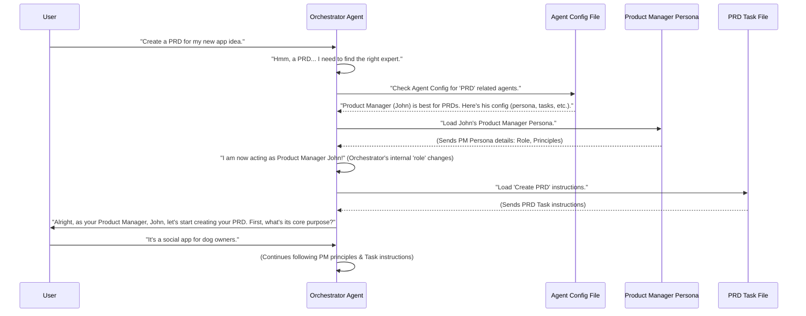

# Chapter 3: Orchestrator Agent

Welcome back, aspiring AI conductor! In [Chapter 1: Tasks](01_tasks_.md), we learned about "Tasks" – the instruction manuals for our AI. Then, in [Chapter 2: AI Agent Persona](02_ai_agent_persona_.md), we discovered "Personas" – how our AI can become a specialized expert. But who decides which expert does which task? Who is the "boss" of this AI team?

That's where the **Orchestrator Agent** comes in!

### What Problem Does the Orchestrator Agent Solve?

Imagine you have a highly skilled team of human experts: a Product Manager, an Architect, a Designer, and so on. If you want a new product built, you don't just shout orders into a room and hope someone picks them up. You need a project manager or a team lead. This person needs to:

1.  Understand your request.
2.  Figure out *which* expert is best suited for the job.
3.  Tell that expert what to do.
4.  Make sure everyone works together smoothly.

Without this "conductor," your team of experts, no matter how brilliant, would be a mess! They might all try to do the same thing, or no one would know where to start.

An AI team is very similar. The **Orchestrator Agent** is like the **"conductor"** of your AI team. It's the central brain that hears your requests and then directs the appropriate "specialist AI expert" (the [AI Agent Persona](02_ai_agent_persona_.md)) to handle the specific [Task](01_tasks_.md).

**Our Use Case:** Let's stick with our goal: "Create a PRD" (Product Requirements Document). We've seen how a Product Manager persona knows how to do this, using a specific task. But who knows that the Product Manager is the right one, and who activates them? That's the Orchestrator!

### What is an 'Orchestrator Agent'?

The Orchestrator Agent is the **central AI brain** that manages the entire BMAD-METHOD system. It's always listening, ready to take your requests, and then intelligently dispatches them to the right specialized AI persona.

Here's its main job:

1.  **Listen to you:** It understands what you want to achieve.
2.  **Know its team:** It has a "rolodex" (a list) of all available [AI Agent Personas](02_ai_agent_persona_.md) (like Product Manager, Architect, etc.) and what each of them is good at.
3.  **Make decisions:** It decides which persona is the best fit for your request.
4.  **Activate the expert:** It "wakes up" and "activates" the chosen specialist persona, loading its unique rules and style.
5.  **Guide the task:** Once activated, the specialist persona then takes over to execute the specific [Task](01_tasks_.md) you asked for.

Think of it like a smart switchboard operator for your AI team.

### How Does an AI Orchestrator Agent Work?

Let's trace how the Orchestrator Agent brings together the user's request, the chosen [AI Agent Persona](02_ai_agent_persona_.md), and the specific [Task](01_tasks_.md) to "Create a PRD."



**Explanation of the sequence:**

1.  **User Request:** You tell the Orchestrator what you want.
2.  **Orchestrator Decides:** The Orchestrator hears "PRD" and consults its "Agent Config" (a kind of menu or rulebook) to find out which specialist AI is best for a PRD. It finds the "Product Manager."
3.  **Load Persona:** The Orchestrator then *loads* the Product Manager's [AI Agent Persona](02_ai_agent_persona_.md) file (e.g., `pm.md`). This is the magic part! The Orchestrator **transforms itself** into that persona. It literally starts *thinking* and *acting* like the Product Manager, adopting its name, style, and core principles.
4.  **Load Task:** Now, acting *as* the Product Manager, the AI loads the `create-prd.md` [Task](01_tasks_.md) file.
5.  **Behave and Execute:** From this point on, the AI interacts with you as "Product Manager John," following the PRD task instructions, but always guided by the Product Manager's inherent principles (e.g., focusing on user needs, asking "why").

The key idea is that the Orchestrator Agent is both the initial "traffic cop" and the "actor" that *becomes* the selected persona to perform the work.

### Under the Hood: The Orchestrator's Rulebook

The Orchestrator Agent bases its decisions on a special file called the "Agent Config." This file tells the Orchestrator where to find all the different [AI Agent Personas](02_ai_agent_persona_.md), their associated tasks, and general rules.

Let's look at parts of an `Agent Config` file (`web-bmad-orchestrator-agent.cfg.md` or `ide-bmad-orchestrator.cfg.md`):

```markdown
--- File: bmad-agent/web-bmad-orchestrator-agent.cfg.md ---
## Title: Product Manager

- Name: John
- Customize: ""
- Description: "For PRDs, project planning, PM checklists and potential replans."
- Persona: "personas#pm" # This links to the PM persona file
- checklists:
  - [Pm Checklist](checklists#pm-checklist)
  - [Change Checklist](checklists#change-checklist)
- templates:
  - [Prd Tmpl](templates#prd-tmpl)
- tasks:
  - [Create Prd](tasks#create-prd) # This links to the Create PRD task file
  - [Correct Course](tasks#correct-course)
  - [Create Deep Research Prompt](tasks#create-deep-research-prompt)
- Interaction Modes:
  - "Interactive"
  - "YOLO"
```

**Explanation:**

*   `## Title: Product Manager`: This is the friendly name for one of the specialist AIs.
*   `Name: John`: A nickname for this specific AI.
*   `Description`: A brief explanation of what this AI is good at. This helps the Orchestrator decide.
*   `Persona: "personas#pm"`: This tells the Orchestrator *where* to find the actual `pm.md` file that defines John's Product Manager persona.
*   `tasks: - [Create Prd](tasks#create-prd)`: This lists the specific `tasks` this "Product Manager" AI can perform, along with where to find the instructions for that task (e.g., `create-prd.md`).

The Orchestrator reads this `Agent Config` file when it starts up. This gives it a complete map of its team.

When you make a request, the Orchestrator uses its own default `BMAD Orchestrator Agent` persona (defined in `bmad-agent/personas/bmad.md` and configured initially as `BMAD` in the `Agent Config`). This `BMAD` persona has core principles that guide its orchestration, such as:

```markdown
--- File: bmad-agent/personas/bmad.md ---
# Role: BMAD Orchestrator Agent

## Core BMAD Orchestrator Principles (Always Active)

1.  **Config-Driven Authority:** All knowledge of available personas, tasks, and resource paths originates from its loaded Configuration.
2.  **Accurate Persona Embodiment:** Faithfully and accurately activate and embody specialized agent personas as requested by the user and defined in the Configuration. When embodied, the specialized persona's principles take precedence.
3.  **Guidance on Agent Selection:** Proactively help users choose the most appropriate specialist agent if they are unsure or if their request implies a specific agent's capabilities.
...
```

These principles, found in `bmad.md` (which itself is a [AI Agent Persona](02_ai_agent_persona_.md)!), make the Orchestrator smart enough to handle requests and switch roles. The Orchestrator essentially *is* the `BMAD Orchestrator Agent` persona until it *becomes* another specialized persona.

The overall `web-bmad-orchestrator-agent.md` file (or `ide-bmad-orchestrator.md`) contains the detailed "operational workflow" instructions for the Orchestrator:

```markdown
--- File: bmad-agent/web-bmad-orchestrator-agent.md ---
## Operational Workflow

### 2. Executing Based on Persona Selection:

- **Identify Target Agent:** Match user's request against an agent's `Title` or `Name` in `AgentConfig`. If ambiguous, ask for clarification.

- **If an Agent Persona is identified:**

  1.  Inform user: "Activating the {Title} Agent, {Name}..."
  2.  **Load Agent Context (from `AgentConfig` definitions):**
      a. For the agent, retrieve its `Persona` reference (e.g., `"personas#pm"` or `"analyst.md"`), and any lists/references for `templates`, `checklists`, `data`, and `tasks`.
      c. The active system prompt is the content from agent's `Persona` reference. This defines your new being.
      e. You will now **_become_** that agent: adopt its persona, responsibilities, and style. Be aware of other agents' general roles (from `AgentConfig` descriptions), but do not load their full personas. Your Orchestrator persona is now dormant.
...
```

This snippet shows the step-by-step logic the Orchestrator follows: identifying the right agent from the config, loading its persona, and then *becoming* that agent. This entire process is how the Orchestrator seamlessly guides your AI team.

### Conclusion

You've just uncovered the mastermind behind the BMAD-METHOD: the **Orchestrator Agent**! We learned that it's the "conductor" of an AI team, responsible for understanding your requests, selecting the right specialist [AI Agent Persona](02_ai_agent_persona_.md) to handle the job, and then directing that persona to execute the correct [Task](01_tasks_.md). It's the central brain that brings all the pieces together, making our AI system smart, flexible, and powerful.

Next, we'll explore "Checklists," a vital tool that helps our specialized AI agents ensure they cover all the necessary steps and considerations when performing a task.

[Chapter 4: Checklists](04_checklists_.md)

---

Generated by [AI Codebase Knowledge Builder](https://github.com/The-Pocket/Tutorial-Codebase-Knowledge)