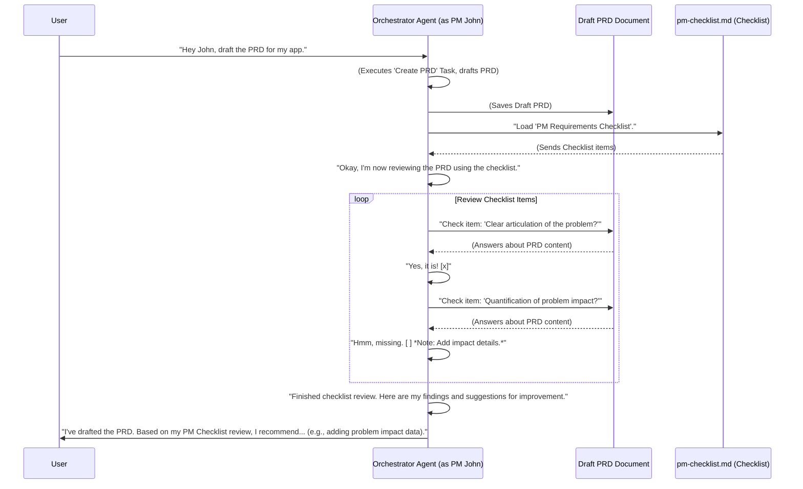

# Chapter 4: Checklists

Hello again, intrepid AI explorer! In our last chapters, we built up quite a team: [Chapter 1: Tasks](01_tasks_.md) showed us how to give specific instructions, [Chapter 2: AI Agent Persona](02_ai_agent_persona_.md) taught our AI how to "become" an expert, and [Chapter 3: Orchestrator Agent](03_orchestrator_agent_.md) became the smart boss managing everyone.

Now, imagine our Product Manager AI, "John," is hard at work creating that Product Requirements Document (PRD). John follows all the steps in the "Create PRD" task. But how does John ensure that nothing is missed? How does he make sure the PRD is truly excellent and covers everything a good PRD should?

This is where **"Checklists"** come in!

### What Problem Do Checklists Solve?

Think about flying a plane. Pilots don't just "wing it." Before takeoff, they go through a detailed pre-flight checklist: "Flaps set? Check. Landing gear: up? Check. All instruments: green? Check." This ensures safety, completeness, and that no critical step is forgotten, no matter how experienced the pilot is.

Our AI agents are super smart, but just like human experts, they can benefit from a systematic way to verify their work. When an AI creates a document (like a PRD or an architectural design) or performs a complex action, it needs to make sure it includes all the necessary sections, adheres to quality standards, and covers all relevant aspects.

Without checklists:
*   The AI might forget to include a certain section.
*   The output might not meet the required quality.
*   There's no systematic way to verify completeness.

With **Checklists**:
*   The AI has a step-by-step guide to review its own work or the work it generates.
*   It ensures completeness and adherence to pre-defined standards.
*   The quality of the output is consistently high.

**Our Use Case:** Our Product Manager AI, "John," needs to create a top-notch PRD. After he's done drafting it using the `create-prd.md` task, we want him to use a "PM Checklist" to review his own work and make sure the PRD is perfect!

### What are 'Checklists'?

At its core, a "Checklist" is just a document that contains a list of items or criteria that an AI agent should review and verify. It's like a quality assurance form, designed to ensure completeness, correctness, and adherence to standards.

Checklists often appear as a simple list of questions or statements, typically with checkboxes, indicating things that need to be true or present in the final output.

Let's look at a real example from our project: the `pm-checklist.md` file.

```markdown
--- File: bmad-agent/checklists/pm-checklist.md ---
# Product Manager (PM) Requirements Checklist

This checklist ensures the PRD is complete, well-structured, and scoped for MVP.

## 1. PROBLEM DEFINITION & CONTEXT

### 1.1 Problem Statement
- [ ] Clear articulation of the problem being solved
- [ ] Identification of who experiences the problem
- [ ] Explanation of why solving this problem matters

... (many more items follow)
```

**Explanation:**

*   `# Product Manager (PM) Requirements Checklist`: This is the clear title.
*   `## 1. PROBLEM DEFINITION & CONTEXT`: Checklists are often organized into logical sections, just like a well-structured document.
*   `- [ ] Clear articulation of the problem being solved`: This is a checklist item! The `[ ]` indicates an empty checkbox. The AI's job is to "mentally (or actually)" check off these boxes as it verifies each point in the PRD it just created.

So, after "PM John" finishes writing the PRD, he will load this checklist and go through each point, comparing it to the PRD he just wrote, just like a human product manager would!

### How Does an AI Agent Use a Checklist?

Let's trace how our Orchestrator Agent, acting as the Product Manager, uses the PM Checklist.



**Explanation of the sequence:**

1.  **User Request:** You ask the Orchestrator (who is acting as PM John) to draft a PRD.
2.  **Draft PRD:** PM John, guided by the `Create Prd` [Task](01_tasks_.md), drafts the PRD.
3.  **Load Checklist:** Once the draft is complete, PM John loads the `pm-checklist.md` file.
4.  **Review Loop:** PM John then goes through each item on the checklist. For each item, he "looks" at the PRD he just drafted and determines if that item is met.
    *   If it's met, he mentally (or actually) marks it as `[x]`.
    *   If it's not met, he keeps it as `[ ]` and makes a note or suggestion for improvement.
5.  **Report Findings:** After reviewing all items, PM John summarizes his findings and provides feedback to the user on how the PRD can be improved, based on the checklist.

This systematic review process helps the AI ensure its output is high quality and meets all pre-defined criteria.

### Under the Hood: How Checklists are Stored and Used

Checklists, like tasks and personas, are very simple: plain text files, usually in Markdown format (`.md`), stored in the `bmad-agent/checklists/` directory.

The Orchestrator Agent (or the specific [AI Agent Persona](02_ai_agent_persona_.md) it's embodying) knows about which checklists to use based on its configuration. Remember the `Agent Config` file from [Chapter 3: Orchestrator Agent](03_orchestrator_agent_.md)?

```markdown
--- File: bmad-agent/web-bmad-orchestrator-agent.cfg.md ---
## Title: Product Manager

- Name: John
- Customize: ""
- Description: "For PRDs, project planning, PM checklists and potential replans."
- Persona: "personas#pm"
- checklists:
  - [Pm Checklist](checklists#pm-checklist) # This links to the PM Checklist!
  - [Change Checklist](checklists#change-checklist)
- templates:
  - [Prd Tmpl](templates#prd-tmpl)
- tasks:
  - [Create Prd](tasks#create-prd)
  ...
```

**Explanation:**

*   `checklists: - [Pm Checklist](checklists#pm-checklist)`: This line tells the Orchestrator (when it's acting as the Product Manager) that it has a "Pm Checklist" available. The `checklists#pm-checklist` part specifies where to find the actual checklist content (it refers to the `pm-checklist.md` file).

When prompted to use a checklist, the AI reads the content of the specified Markdown file. Its internal programming (or its *persona's* instructions) then guides it to interpret the `[ ]` or `[x]` syntax and the plain text descriptions as actionable items.

The content of a checklist file can be quite detailed, as seen in `frontend-architecture-checklist.md` or `architect-checklist.md`. These aren't just simple lists; they are structured documents with headings and sub-sections, just like a professional review document.

For example, a snippet from the `frontend-architecture-checklist.md` shows its structured nature:

```markdown
--- File: bmad-agent/checklists/frontend-architecture-checklist.md ---
# Frontend Architecture Document Review Checklist

## Purpose
This checklist is for the Design Architect to use...

## I. Introduction

- [ ] Is the `{Project Name}` correctly filled in throughout the Introduction?
- [ ] Is the link to the Main Architecture Document present and correct?

## II. Overall Frontend Philosophy & Patterns

- [ ] Are the chosen Framework & Core Libraries clearly stated...?
- [ ] Is the Component Architecture ... clearly described?
...
```

The AI reads this detailed, structured checklist and follows its internal instructions to go through each item. It can then generate a report that indicates which items were satisfied, which were not, and possibly suggest how to address the missing items. This is a powerful form of self-correction and quality control for our AI agents.

### Conclusion

You've now got the lowdown on **Checklists**! We learned that they are essential "quality assurance forms" for our AI agents, helping them systematically review their work (like a drafted PRD) to ensure completeness, adherence to standards, and high quality. They're a fantastic tool for making our AI agents reliable and their outputs consistently excellent.

Next up, we'll dive into "Templates," which are like pre-filled forms that help our AI agents generate structured documents quickly and consistently.

[Chapter 5: Templates](05_templates_.md)

---

Generated by [AI Codebase Knowledge Builder](https://github.com/The-Pocket/Tutorial-Codebase-Knowledge)