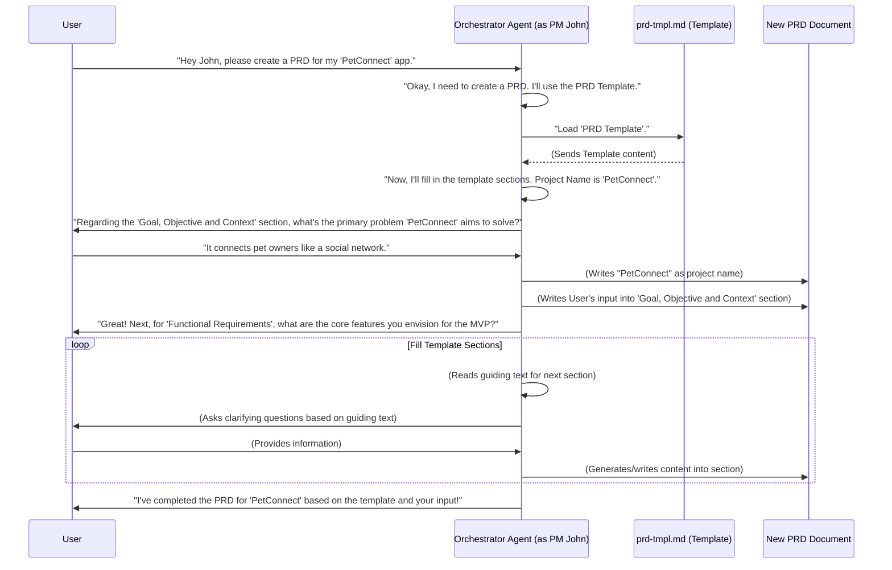

# Chapter 5: Templates

Hello again, intrepid AI explorer! In our last chapters, we built up quite a team: [Chapter 1: Tasks](01_tasks_.md) showed us how to give specific instructions, [Chapter 2: AI Agent Persona](02_ai_agent_persona_.md) taught our AI how to "become" an expert, [Chapter 3: Orchestrator Agent](03_orchestrator_agent_.md) became the smart boss managing everyone, and [Chapter 4: Checklists](04_checklists_.md) helped our AI ensure quality.

Now, imagine our Product Manager AI, "John," is ready to start creating that big Product Requirements Document (PRD). We know he can use the "Create PRD" task to get instructions. And we know he can use the "PM Checklist" to check his work. But how does he *create* the PRD in the first place? Does he just start typing from a blank page?

No! Just like you wouldn't start writing a business report without some kind of format, our AI agents use **"Templates"**!

### What Problem Do Templates Solve?

Think about writing a school report or a business letter. You usually don't just open a blank document and start typing. You might use a template:

*   A **report template** might have sections already laid out: "Introduction," "Body Paragraphs," "Conclusion," "References."
*   A **letter template** might have spaces for "Date," "Recipient Name," "Address," "Salutation," and "Closing."

These templates save you time, ensure you include all the important sections, and make your document look professional and consistent.

Our AI agents need the same kind of help. When an AI creates a document (like a PRD), it needs to know the correct structure, what sections to include, and sometimes even placeholder text to guide it.

Without templates:
*   The AI might create documents with inconsistent structures.
*   It might forget important sections.
*   It would take longer, as it has to "reinvent the wheel" for each document type.

With **Templates**:
*   The AI has a pre-formatted structure for documents.
*   It ensures consistency across all generated documents of that type.
*   It guides the AI on what information to include in each section.
*   It speeds up document creation.

**Our Use Case:** Our Product Manager AI, "John," needs to create a top-notch PRD. Instead of starting from scratch, he will use a "PRD Template" to ensure the document has all the standard sections and guiding text.

### What are 'Templates'?

At its core, a "Template" is just a pre-formatted blueprint for creating documents. It's a file that contains the basic structure, headings, sub-headings, and sometimes even guiding questions or placeholder text that the AI agent should fill in.

Templates are designed to be filled out by the AI. They tell the AI: "Here are the sections you need, now go find or generate the right information to put into them."

Let's look at a real example from our project: the `prd-tmpl.md` file.

```markdown
--- File: bmad-agent/templates/prd-tmpl.md ---
# {Project Name} Product Requirements Document (PRD)

## Goal, Objective and Context

This should come mostly from the user or the provided brief, but ask for clarifications as needed.

## Functional Requirements (MVP)

You should have a good idea at this point, but clarify suggest question and explain to ensure these are correct.

... (many more sections follow)
```

**Explanation:**

*   `# {Project Name} Product Requirements Document (PRD)`: This is the main title. Notice the `{Project Name}` part – this is a placeholder! The AI knows it needs to replace this with the actual project's name.
*   `## Goal, Objective and Context`: This is a standard heading for a PRD section.
*   `This should come mostly from the user or the provided brief, but ask for clarifications as needed.`: This is *guiding text* for the AI. It tells the AI *what kind of information* should go into this section and even *how it should get that information* (from the user or a brief, asking for clarifications).

So, when "PM John" starts creating the PRD, he will load this template. He'll then go through each section, using the guiding text to figure out what content to generate or pull from other sources (like a user's prompt).

### How Does an AI Agent Use a Template?

Let's trace how our Orchestrator Agent, acting as the Product Manager, uses the PRD Template.



**Explanation of the sequence:**

1.  **User Request:** You ask the Orchestrator (who is acting as PM John) to create a PRD for your app.
2.  **Load Template:** PM John knows that creating a PRD starts with a template. He loads the `prd-tmpl.md` file.
3.  **Fill Placeholders/Sections:** The template content (like the headings and guiding text) is loaded. PM John then starts to process this template:
    *   He replaces placeholders (like `{Project Name}`).
    *   For each section, he reads the guiding text and uses his [AI Agent Persona's](02_ai_agent_persona_.md) knowledge and the [Task](01_tasks_.md) instructions to generate relevant content or ask you for input.
4.  **Generate Document:** As he fills out each section, he's effectively writing the new PRD document.
5.  **Complete Document:** Once all sections are processed (or as many as needed for the current interaction), the PRD document is complete.

This process ensures that every PRD created by PM John will have a consistent structure, making it easier to read and manage.

### Under the Hood: How Templates are Stored and Used

Templates, like tasks, personas, and checklists, are simple plain text files, usually in Markdown format (`.md`), stored in the `bmad-agent/templates/` directory.

The Orchestrator Agent (or the specific [AI Agent Persona](02_ai_agent_persona_.md) it's embodying) knows about which templates to use based on its configuration. Remember the `Agent Config` file from [Chapter 3: Orchestrator Agent](03_orchestrator_agent_.md)?

```markdown
--- File: bmad-agent/web-bmad-orchestrator-agent.cfg.md ---
## Title: Product Manager

- Name: John
- Customize: ""
- Description: "For PRDs, project planning, PM checklists and potential replans."
- Persona: "personas#pm"
- checklists:
  - [Pm Checklist](checklists#pm-checklist)
  - [Change Checklist](checklists#change-checklist)
- templates:
  - [Prd Tmpl](templates#prd-tmpl) # This links to the PRD Template!
- tasks:
  - [Create Prd](tasks#create-prd)
  ...
```

**Explanation:**

*   `templates: - [Prd Tmpl](templates#prd-tmpl)`: This line tells the Orchestrator (when it's acting as the Product Manager) that it has a "Prd Tmpl" available. The `templates#prd-tmpl` part specifies where to find the actual template content (it refers to the `prd-tmpl.md` file).

When an AI agent (acting as its persona) is instructed to "create a PRD," it first looks at its configuration for available templates, then loads the content of the `prd-tmpl.md` file.

The AI's internal logic (which is guided by its [AI Agent Persona](02_ai_agent_persona_.md) and the current [Task](01_tasks_.md)) is designed to:

1.  **Read the template:** It processes the Markdown content, recognizing headings, paragraphs, and special placeholder syntax (like `{Project Name}`).
2.  **Identify placeholders:** It sees `{Project Name}` and knows it needs to be replaced.
3.  **Interpret guiding text:** It understands instructions like "This should come mostly from the user..."
4.  **Fill in content:** Based on the guiding text, it either asks the user for information, generates text using its knowledge, or pulls data from other internal sources.

Here's an example logic outline an AI might follow (conceptually):

```python
# Pseudo-code for how an AI might process a template section
def process_template_section(section_heading, guiding_text, current_context):
    print(f"Processing section: {section_heading}")
    print(f"Guiding text: {guiding_text}")

    if "comes mostly from the user" in guiding_text:
        user_input = ask_user_for_info(section_heading)
        generated_content = user_input
    elif "clarify suggest question" in guiding_text:
        clarifying_question = generate_question_for_user(section_heading, current_context)
        user_response = ask_user_for_info(clarifying_question)
        generated_content = synthesize_info(current_context, user_response)
    else:
        generated_content = generate_content_based_on_knowledge(section_heading, current_context)

    return generated_content

# Example of how to use a template
template_content = load_file("bmad-agent/templates/prd-tmpl.md")
sections = parse_template_into_sections(template_content) # Breaks into headings and guiding text

final_prd_document = ""
for section in sections:
    if section.is_placeholder:
        filled_value = get_project_name_from_user_or_config()
        final_prd_document += section.replace_placeholder(filled_value)
    else:
        generated_section_content = process_template_section(section.heading, section.guiding_text, current_data)
        final_prd_document += f"{section.heading}\n\n{generated_section_content}\n\n"

save_document(final_prd_document, "PetConnect_PRD.md")
```
This simplified pseudo-code shows how the AI agent reads the template, understands the different parts, and then takes action (like asking you questions or generating text) to fill in the document.

You can also see other template files in the `bmad-agent/templates/` folder, such as `project-brief-tmpl.md` (for starting new projects), `architecture-tmpl.md` (for architecting systems), and `story-tmpl.md` (for writing user stories). Each has its own structure and guiding text, tailored to the specific type of document it's meant to create.

For instance, the `doc-sharding-tmpl.md` template is particularly interesting as it tells the AI how to break down (or "shard") a large document into smaller, more manageable files, which is useful for organizing information.

```markdown
--- File: bmad-agent/templates/doc-sharding-tmpl.md ---
# Document Sharding Plan Template

This plan directs the agent on how to break down large source documents into smaller, granular files...

## 1. Source Document: PRD (Project Requirements Document)

- **Note to Agent:** Confirm the exact filename of the PRD with the user...

### 1.1. Epic Granulation

- **Instruction:** For each Epic identified within the PRD:
- **Source Section(s) to Copy:** The complete text for the Epic...
- **Target File Pattern:** `docs/epic-<id>.md`
  - _Agent Note: `<id>` should correspond to the Epic number._
```

This template doesn't *create* a document; it provides a *plan* for how to *process* existing documents to create new, smaller ones. This demonstrates the flexibility of templates beyond just generating initial documents.

### Conclusion

You've successfully mastered **Templates**! We learned that templates are like pre-formatted blueprints that guide our AI agents in creating structured, consistent, and high-quality documents rapidly. They ensure that all the necessary sections are included and even provide guiding instructions for the AI on what content should go where.

This wraps up our foundational concepts in BMAD-METHOD! You now understand the core building blocks: how [Tasks](01_tasks_.md) give instructions, [AI Agent Personas](02_ai_agent_persona_.md) provide expertise, the [Orchestrator Agent](03_orchestrator_agent_.md) manages the team, [Checklists](04_checklists_.md) ensure quality, and Templates provide structure.

This is the end of our beginner-friendly tutorial series on the concepts of BMAD-METHOD. You're now equipped with the basic understanding to dive deeper into building and using powerful AI-driven processes!

---

Generated by [AI Codebase Knowledge Builder](https://github.com/The-Pocket/Tutorial-Codebase-Knowledge)