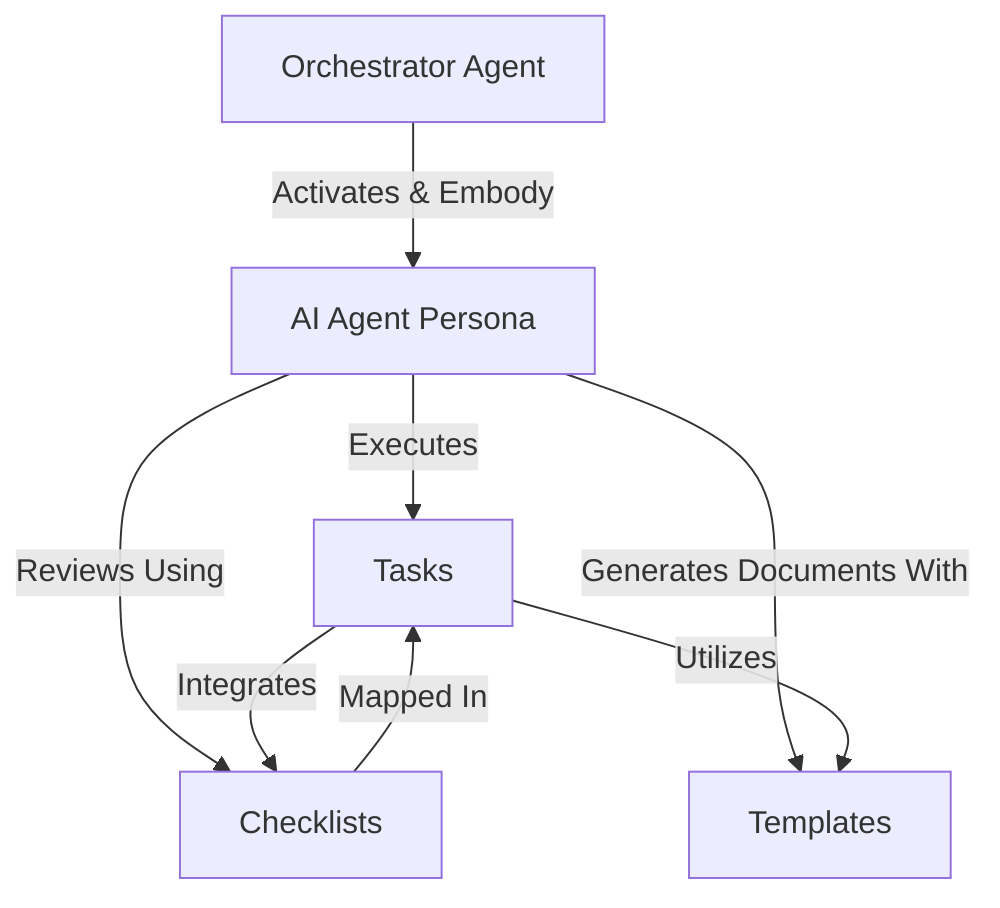

# Tutorial: BMAD-METHOD

The **BMAD-METHOD** project provides an AI-driven framework for agile development. It uses *specialized AI agents* with defined personas to orchestrate workflows, manage project tasks, apply quality checklists, and generate documents from templates, streamlining the software development lifecycle.

**Source Repository:** [https://github.com/bmadcode/BMAD-METHOD.git](https://github.com/bmadcode/BMAD-METHOD.git)

## Chapters

1. [Tasks
](01_tasks_.md)
2. [AI Agent Persona
](02_ai_agent_persona_.md)
3. [Orchestrator Agent
](03_orchestrator_agent_.md)
4. [Checklists
](04_checklists_.md)
5. [Templates
](05_templates_.md)

---

Generated by [AI Codebase Knowledge Builder](https://github.com/The-Pocket/Tutorial-Codebase-Knowledge)