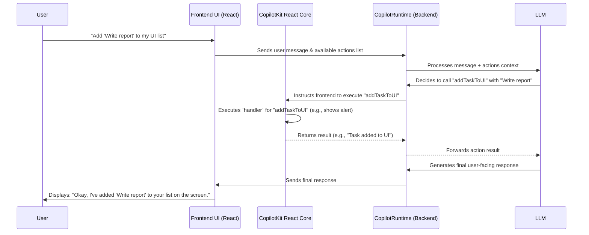

# Chapter 1: Actions (Frontend & Backend)

Welcome to the CopilotKit tutorial! We're excited to help you build amazing AI-powered applications. In this first chapter, we'll dive into one of the most fundamental concepts: **Actions**.

Imagine you're building a smart assistant for a project management app. You want your users to be able to say things like, "Hey Copilot, create a new task called 'Design new logo' and assign it to Sarah." For the AI to actually *create that task*, it needs a specific instruction or a "tool" to do so. That's where Actions come in!

**What Problem Do Actions Solve?**

Large Language Models (LLMs) are fantastic at understanding language and generating text. However, on their own, they can't directly interact with your application's features or external services. They can't click buttons, save data to your database, or send emails.

**Actions bridge this gap.** They are specific tasks or capabilities you define that your AI copilot can perform. Think of them as giving your AI a set of tools. For our project management example, an action could be "createTask" or "assignUserToTask." The AI, based on the conversation, can then decide to use these tools to fulfill the user's request.

Actions can be defined in two main places:

1.  **Frontend (React):** These actions typically interact with your application's user interface (UI). For example, an action could update a list on the screen, display a confirmation pop-up, or fill out a form.
2.  **Backend (Python/Node.js):** These actions are for server-side operations, like saving data to a database, calling other APIs (e.g., sending an email via SendGrid), or performing complex calculations.

Let's see how this works with a very simple example: a to-do list application. We want our copilot to be able to add a new task to our list.

### Frontend Action: Adding a Task to the UI

In your React application, you might want an action that adds a task directly to the list displayed on the user's screen. You can define this using the `useCopilotAction` hook, which we'll learn more about in the [Frontend Hooks (`@copilotkit/react-core`)](03_frontend_hooks____copilotkit_react_core___.md) chapter.

Here's a simplified example:

```tsx
// In your React component (e.g., TodoListComponent.tsx)
import { useCopilotAction } from "@copilotkit/react-core";
// import { useState } from "react"; // You'd use this for a real list

// Let's imagine you have a function to update your UI
// const [tasks, setTasks] = useState([]);

useCopilotAction({
  name: "addTaskToUI",
  description: "Adds a new task to the to-do list visible on the screen.",
  parameters: [ // Defines what information the action needs
    { name: "taskText", type: "string", description: "The content of the task." }
  ],
  handler: async ({ taskText }) => {
    // In a real app, you'd update your React state here:
    // setTasks(prevTasks => [...prevTasks, taskText]);
    alert(`Task added to UI: ${taskText}`);
    return `${taskText} has been added to your list on the screen.`;
  },
});
```

Let's break this down:
*   `name: "addTaskToUI"`: This is the unique identifier for your action. The AI will use this name to call it.
*   `description: "Adds a new task..."`: This helps the AI understand what the action does and when to use it. Good descriptions are key!
*   `parameters: [...]`: This tells the AI what pieces of information the action needs to run. Here, it needs a `taskText` which should be a `string`. The AI will try to extract this from the user's conversation.
*   `handler: async ({ taskText }) => { ... }`: This is the actual JavaScript function that gets executed when the AI decides to use this action. It receives the `taskText` (extracted by the AI) as an argument. In this example, it just shows an alert, but in a real app, it would update your React component's state to re-render the list with the new task.

**Input/Output:**
*   **User says:** "Copilot, add 'Buy groceries' to my list."
*   **AI understands:** It likely needs to use an action related to adding tasks. It sees `addTaskToUI` and its description.
*   **AI extracts parameters:** It identifies "Buy groceries" as the `taskText`.
*   **Action executes:** The `handler` function runs with `taskText` being "Buy groceries".
*   **Result:** An alert pops up saying "Task added to UI: Buy groceries", and the handler returns a message that the Copilot can use to respond to the user.

### Backend Action: Saving a Task to a Database

Sometimes, interacting with the UI isn't enough. You might want to save the task permanently in a database. This is where backend actions come in handy. Here's a conceptual Python example:

```python
# In your Python backend (e.g., actions_backend.py)
from copilotkit.action import Action # From sdk-python/copilotkit/action.py
from typing import List, Optional, Callable # For type hinting

# Dummy function to simulate saving to a database
async def save_task_to_database(task_text: str):
    print(f"Attempting to save to DB: {taskText}")
    # ... actual database saving logic would go here ...
    return f"Task '{task_text}' has been saved to the database."

# Define the action
saveTaskAction = Action(
    name="saveTaskPersistent",
    description="Saves a new task to the persistent storage (database).",
    parameters=[ # These are Parameter objects
      {"name": "task_text", "type": "string", "description": "The task to save."}
    ],
    handler=save_task_to_database
)
```

Breaking it down:
*   `Action(...)`: This is how you define an action in the Python SDK.
*   `name: "saveTaskPersistent"`: Again, a unique name.
*   `description: "Saves a new task..."`: Helps the AI differentiate this from the UI-only action.
*   `parameters: [...]`: Same idea as the frontend, defining the inputs. The structure might look slightly different based on the SDK's requirements (e.g., a list of dictionaries).
*   `handler=save_task_to_database`: The function (`save_task_to_database`) that will be called. This function would contain your Python logic to interact with a database.

**Input/Output:**
*   **User says:** "Hey Copilot, make sure 'Book flight tickets' is saved."
*   **AI understands:** The keyword "saved" might make it prefer the `saveTaskPersistent` action.
*   **AI extracts parameters:** It identifies "Book flight tickets" as `task_text`.
*   **Action executes:** The `save_task_to_database` Python function runs.
*   **Result:** The Python function prints to the server console and returns a success message like "Task 'Book flight tickets' has been saved to the database." The AI can then relay this confirmation to the user.

### How It Works Under the Hood (A Simplified View)

When you use CopilotKit, you're setting up a system where your frontend and backend can communicate efficiently with an AI model.

1.  **User Interaction:** The user types a message into a chat interface (likely one of the [UI Components (`@copilotkit/react-ui`)](04_ui_components____copilotkit_react_ui__.md)).
2.  **Message to Backend:** This message, along with information about available actions (both frontend and backend ones), is sent to the [CopilotRuntime (Backend Engine)](06_copilotruntime__backend_engine__.md). The `CopilotKitProvider` (covered in [CopilotKitProvider (React Component)](02_copilotkitprovider__react_component__.md)) helps manage this.
3.  **AI Processing:** The backend runtime forwards the request to an LLM (like OpenAI's GPT). The LLM analyzes the user's intent and looks at the descriptions of all available actions.
4.  **Action Decision:** The LLM decides if an action should be performed. If so, it specifies which action and what arguments to use.
5.  **Execution:**
    *   **Backend Action:** If it's a backend action (like `saveTaskPersistent`), the [CopilotRuntime (Backend Engine)](06_copilotruntime__backend_engine__.md) executes the action's handler function directly on the server.
    *   **Frontend Action:** If it's a frontend action (like `addTaskToUI`), the backend runtime sends a command back to the frontend. The frontend, using hooks like `useCopilotAction` from [`@copilotkit/react-core`](03_frontend_hooks____copilotkit_react_core___.md), then executes the appropriate handler.
6.  **Result & Response:** The result of the action (e.g., a success message or data) is sent back to the LLM via the backend. The LLM can then use this result to formulate a natural language response to the user.

Here's a diagram illustrating the flow:



### Diving a Bit Deeper into the Code

**Frontend Action Registration (`useCopilotAction`)**

When you use `useCopilotAction` in your React component, you're essentially telling CopilotKit, "Hey, here's a capability my frontend can perform."

```typescript
// Simplified concept from CopilotKit/packages/react-core/src/hooks/use-copilot-action.ts
function useCopilotAction(action: FrontendAction) {
  // CopilotContext is provided by CopilotKitProvider
  const { setAction } = useCopilotContext();
  const uniqueActionId = "some_unique_id_for_this_action_instance"; // Generated internally

  // When the component mounts or action definition changes:
  useEffect(() => {
    setAction(uniqueActionId, action); // Register the action
    // ... cleanup to removeAction when component unmounts ...
  }, [action.name /*, other dependencies like handler, description */]);
}
```
This `setAction` function, part of the `CopilotContext` (which we'll explore with the [CopilotKitProvider (React Component)](02_copilotkitprovider__react_component__.md)), makes the action known to the CopilotKit system running in the browser. This list of frontend actions is then communicated to the [CopilotRuntime (Backend Engine)](06_copilotruntime__backend_engine__.md).

**Backend Action Definition (Python SDK)**

In Python, the `Action` class is a straightforward way to structure your backend capabilities.

```python
# Simplified from sdk-python/copilotkit/action.py
class Action:
    def __init__(
            self,
            name: str,
            handler: Callable, # The function to execute
            description: Optional[str] = None,
            parameters: Optional[List[Parameter]] = None, # Expected inputs
        ):
        self.name = name
        self.description = description
        self.parameters = parameters
        self.handler = handler
        # ... some validation for the name ...
```
This class simply holds all the necessary information about an action: its name, what it does (`description`), what inputs it needs (`parameters`), and the function to call (`handler`). Your [CopilotRuntime (Backend Engine)](06_copilotruntime__backend_engine__.md) will maintain a list of these `Action` objects.

**Executing a Backend Action**

When the LLM decides to use a backend action, the Python runtime will find the corresponding `Action` object and invoke its `execute` method (or directly call the handler).

```python
# Simplified concept from sdk-python/copilotkit/action.py
# class Action:
    async def execute(self, arguments: dict) -> ActionResultDict:
        # The handler is the function you provided, like 'save_task_to_database'
        result = self.handler(**arguments) # Call your function with extracted args

        # Handle if your handler is an async function
        if iscoroutinefunction(self.handler):
            actual_result = await result
        else:
            actual_result = result
        return {"result": actual_result}
```

**Action Schemas: `FrontendAction` and `ActionDict`**

For the AI to understand what an action does and what data it needs, actions must be described in a structured way.
In the frontend (TypeScript), this is often represented by types like `FrontendAction`:

```typescript
// Snippet from CopilotKit/packages/react-core/src/types/frontend-action.ts
export type FrontendAction<T extends Parameter[] | [] = []> = Action<T> & {
  name: string; // e.g., "addTaskToUI"
  description?: string; // Explains what it does
  parameters?: T; // Defines expected arguments like { name: "taskText", type: "string" }
  handler?: (args: MappedParameterTypes<T>) => any | Promise<any>;
  // ... other properties like 'render' for UI customization ...
};
```

In Python, an action can be represented as a dictionary (`ActionDict`) for communication or when being prepared for the LLM:

```python
# From sdk-python/copilotkit/action.py
class ActionDict(TypedDict):
    name: str
    description: str
    parameters: List[Parameter] # Parameter is another TypedDict describing an argument
```

These structures (often converted into a format like JSON Schema, as seen in `processActionsForRuntimeRequest` in `frontend-action.ts` or `actionParametersToJsonSchema` in `@copilotkit/shared`) are crucial. They allow the LLM to "see" the tools you've provided, understand their purpose, and know how to use them by providing the correct arguments. The communication details are part of the [Runtime Events & Protocol](09_runtime_events___protocol_.md).

### Conclusion

You've just taken your first step into empowering your AI copilot! Actions are the bridge between the AI's understanding and your application's capabilities. By defining actions, you give your AI the "tools" it needs to perform useful tasks, whether it's updating the UI on the frontend or executing logic on the backend.

Key takeaways:
*   Actions define specific tasks your AI can perform (e.g., `sendEmail`, `updateSpreadsheet`).
*   They can be frontend-based (React, for UI interactions) or backend-based (Python/Node.js, for server logic).
*   Each action has a `name`, `description`, `parameters` (inputs it needs), and a `handler` (the function that does the work).
*   CopilotKit uses these definitions to allow the AI to intelligently choose and execute your custom functions based on the user's conversation.

Now that you have a grasp of what Actions are, let's move on to setting up the foundational piece for your CopilotKit application in React: the [CopilotKitProvider (React Component)](02_copilotkitprovider__react_component__.md). This provider is essential for making everything work together.

---

Generated by [AI Codebase Knowledge Builder](https://github.com/The-Pocket/Tutorial-Codebase-Knowledge)