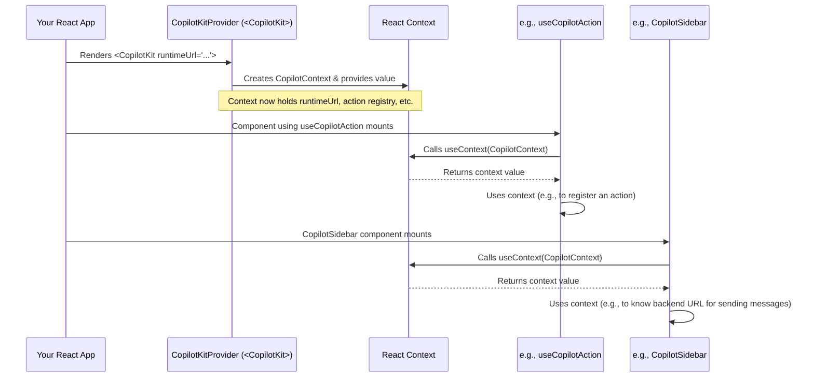

# Chapter 2: CopilotKitProvider (React Component)

In [Chapter 1: Actions (Frontend & Backend)](01_actions__frontend___backend__.md), we learned how to define specific tasks ("Actions") that our AI copilot can perform. These actions are like giving our AI a toolbox. But how do all these tools, and the AI itself, get connected and powered up within our React application? That's where the `CopilotKitProvider` comes in!

**What's the Big Idea? The Central Power Hub**

Imagine you're building a house (your React app) and you want to install a bunch of smart, AI-powered appliances (like an AI assistant in your chat, or AI that can automatically fill forms). These appliances need electricity and a way to talk to each other and to the main control system.

The `CopilotKitProvider` is like the main electrical panel and wiring system for all CopilotKit features in your app. You wrap it around your application, or the parts of your app that need AI capabilities.

**What Problem Does It Solve?**

Without `CopilotKitProvider`, other CopilotKit components (like a chat window) or hooks (like `useCopilotAction` we saw in Chapter 1) wouldn't work. They'd be like unplugged appliances. The provider supplies:

1.  **Configuration:** It tells other CopilotKit parts where your backend AI engine ([CopilotRuntime (Backend Engine)](06_copilotruntime__backend_engine__.md)) is located.
2.  **Context:** It shares important information and functions. For example, when you define a frontend action using `useCopilotAction`, that action needs to register itself with a central system. The `CopilotKitProvider` provides this system.
3.  **Communication Lines:** It facilitates the communication between your frontend AI components and your backend AI engine.

Essentially, it's the foundational piece that "activates" CopilotKit in your React application.

**How to Use `CopilotKitProvider`**

Using it is quite straightforward. You import `CopilotKit` (which is the component providing the context, often aliased or re-exported as `CopilotKitProvider` in spirit, though the actual component name used in examples is `CopilotKit`) from `@copilotkit/react-core` and wrap it around the parts of your application that will use AI features.

Most commonly, you'll wrap your entire application.

Let's look at a very basic example:

```tsx
// App.tsx (or your main application file)
import React from "react";
import { CopilotKit } from "@copilotkit/react-core";
import { CopilotSidebar } from "@copilotkit/react-ui"; // A UI component we'll see later
import "./App.css"; // Your app's styles

function MyAwesomeApp() {
  return (
    <div>
      <h1>My AI-Powered App</h1>
      {/* Other app content can go here */}
    </div>
  );
}

function App() {
  return (
    <CopilotKit runtimeUrl="/api/copilotkit"> {/* Power ON! */}
      <MyAwesomeApp />
      <CopilotSidebar /> {/* This chat UI needs the Provider */}
    </CopilotKit>
  );
}

export default App;
```

Let's break this down:
*   `import { CopilotKit } from "@copilotkit/react-core";`: We import the necessary component.
*   `<CopilotKit runtimeUrl="/api/copilotkit">`: This is the magic part!
    *   `CopilotKit`: This is the provider component.
    *   `runtimeUrl="/api/copilotkit"`: This is a crucial prop. It tells `CopilotKit` where your backend AI logic (the [CopilotRuntime (Backend Engine)](06_copilotruntime__backend_engine__.md)) is running. This URL is the endpoint that your frontend will communicate with for AI tasks. We'll cover setting up this backend endpoint in a later chapter.
*   `<MyAwesomeApp />` and `<CopilotSidebar />`: Any components placed *inside* `CopilotKit` (like `MyAwesomeApp` or the `CopilotSidebar` UI component) can now use CopilotKit features. The `CopilotSidebar` is a pre-built chat interface from [`@copilotkit/react-ui`](04_ui_components____copilotkit_react_ui___.md) that needs the provider to function.

**What Happens When You Use It?**

When you add `<CopilotKit ...>`, it does a few important things:
1.  **Sets up a "Copilot Context":** Think of this as a special backpack of information that all child components can access. This backpack contains the `runtimeUrl`, functions to manage actions, and other necessary settings.
2.  **Initializes Communication:** It prepares to talk to your backend AI service specified by `runtimeUrl`.
3.  **Enables Hooks and Components:** Hooks like `useCopilotAction` (from [Frontend Hooks (`@copilotkit/react-core`)](03_frontend_hooks____copilotkit_react_core___.md)) and UI components like `CopilotSidebar` (from [UI Components (`@copilotkit/react-ui`)](04_ui_components____copilotkit_react_ui___.md)) can now "reach into" this context to get what they need.

If you tried to use `CopilotSidebar` or `useCopilotAction` *outside* of a `CopilotKitProvider`, your app would likely throw an error because they wouldn't find the necessary context. It's like trying to turn on a lamp that isn't plugged into a power outlet.

**Key Props for `CopilotKitProvider`**

While `runtimeUrl` is the most fundamental, here are a few other important props you might encounter (from `CopilotKit/packages/react-core/src/components/copilot-provider/copilotkit-props.tsx`):

*   `publicApiKey`: If you're using CopilotKit Cloud services, you'll provide your API key here.
*   `headers`: Allows you to send custom HTTP headers with requests to your backend, useful for authentication.
    ```tsx
    <CopilotKit
      runtimeUrl="/api/copilotkit"
      headers={{
        'Authorization': 'Bearer YOUR_AUTH_TOKEN'
      }}
    >
      {/* ...your app... */}
    </CopilotKit>
    ```
*   `children`: This is a standard React prop representing the components nested inside the provider.

**Under the Hood: A Peek into the Mechanism**

So, how does `CopilotKitProvider` make all this information available? It uses a core React concept called **Context**.

1.  **React Context API:** React's Context API provides a way to pass data through the component tree without having to pass props down manually at every level. It's perfect for global data like themes, user information, or in our case, CopilotKit's configuration and core functionalities.

2.  **`CopilotContext`:** `CopilotKit` creates a `CopilotContext`. This context object holds all the shared state and functions.
    (Simplified from `CopilotKit/packages/react-core/src/context/copilot-context.tsx`)
    ```typescript
    // Simplified concept of what the context might hold
    interface CopilotContextParams {
      copilotApiConfig: { chatApiEndpoint: string; /* ...other configs */ };
      actions: Record<string, FrontendAction<any>>;
      setAction: (id: string, action: FrontendAction<any>) => void;
      // ... many other useful things!
    }

    // Creates the actual context with a default empty value
    const CopilotContext = React.createContext<CopilotContextParams>(/* default value */);
    ```
    This `CopilotContext` is defined with all the properties and functions that CopilotKit components and hooks will need.

3.  **`<CopilotContext.Provider>`:** The `CopilotKit` component (from `CopilotKit/packages/react-core/src/components/copilot-provider/copilotkit.tsx`) internally uses `<CopilotContext.Provider>` to make the context value available to all its descendant components.
    ```tsx
    // Simplified inside CopilotKitInternal component
    function CopilotKitInternal(props: CopilotKitProps) {
      // ... lots of state and setup logic ...
      const [actions, setActions] = useState({});
      const copilotApiConfig = { chatApiEndpoint: props.runtimeUrl, /* ... */ };

      const contextValue = {
        copilotApiConfig,
        actions,
        setAction: (id, action) => { /* ... logic to add action ... */ },
        // ... and all other context values
      };

      return (
        <CopilotContext.Provider value={contextValue}>
          {props.children}
        </CopilotContext.Provider>
      );
    }
    ```
    When you write `<CopilotKit runtimeUrl="...">`, it's essentially setting up this provider with the `runtimeUrl` and other configurations.

4.  **Accessing the Context:** Other CopilotKit hooks (like `useCopilotAction` or the internal `useCopilotContext` hook) and components then use React's `useContext` hook to access the data provided by `CopilotKitProvider`.
    ```typescript
    // Simplified from CopilotKit/packages/react-core/src/context/copilot-context.tsx
    function useCopilotContext(): CopilotContextParams {
      const context = React.useContext(CopilotContext);
      if (context === /* default empty value */) {
        // This error is a helpful reminder!
        throw new Error("Remember to wrap your app in a `<CopilotKit> ... </CopilotKit>` !!!");
      }
      return context;
    }
    ```
    If a component tries to use `useCopilotContext` without a `CopilotKit` ancestor, it gets the default empty value, triggering the helpful error message.

Here's a visual representation of how it works:



The `CopilotKitProvider` effectively acts as the root of the CopilotKit system within your React component tree, initializing and making available all necessary configurations and functionalities to its children. The actual component you use is `<CopilotKit>`, as seen in the `CopilotKit/examples/next-openai/src/app/page.tsx` example. This component sets up the context using `CopilotContext.Provider` (visible in `CopilotKit/packages/react-core/src/components/copilot-provider/copilotkit.tsx`).

**Recap and What's Next**

The `CopilotKitProvider` (used as `<CopilotKit>`) is the heart of your CopilotKit integration in React. It's the main switch that powers everything up.

*   **It's Essential:** You *must* wrap your AI-enabled components with it.
*   **Provides Context:** It uses React's Context API to share configuration (like `runtimeUrl`) and core functions with other CopilotKit parts.
*   **Enables Communication:** It's the bridge allowing frontend components to interact with the backend AI engine.

Without it, your AI features simply won't have the power or information they need to operate.

Now that we understand how to "power on" CopilotKit in our app, we're ready to explore the specific tools that interact with this provider. Next, we'll dive into [Frontend Hooks (`@copilotkit/react-core`)](03_frontend_hooks____copilotkit_react_core___.md), which allow us to define frontend actions and manage chat state.

---

Generated by [AI Codebase Knowledge Builder](https://github.com/The-Pocket/Tutorial-Codebase-Knowledge)