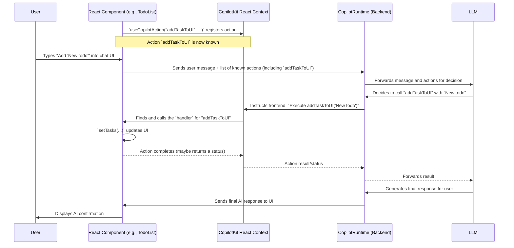

# Chapter 3: Frontend Hooks (`@copilotkit/react-core`)

In [Chapter 2: CopilotKitProvider (React Component)](02_copilotkitprovider__react_component__.md), we learned how to set up the `CopilotKitProvider` (used as `<CopilotKit>`), which is like the central power station for CopilotKit features in our React app. Now that our app is "powered up," let's explore some special tools that let us directly wire AI capabilities into our user interface: **Frontend Hooks** from the `@copilotkit/react-core` package.

**What's the Big Idea? Connecting Your UI to AI Magic**

Imagine your web application is a house. The `CopilotKitProvider` is the main electrical system. Frontend Hooks are like specialized outlets and switches you install in different rooms (your React components) to control AI-powered appliances or let those appliances understand what's happening in the room.

These hooks are special JavaScript functions (specifically, React Hooks) that you use in your frontend React components. They are the primary way you'll make your application's UI interactive with the AI.

**What Problem Do They Solve?**

Frontend Hooks provide easy ways to:

1.  **Tell the AI what's happening in your app:** For example, if you have a list of tasks, you can use a hook to make this list "readable" by the AI.
2.  **Let the AI control parts of your app:** You can define "actions" that the AI can trigger, like adding an item to that list directly within the UI.
3.  **Build custom AI chat experiences:** If you don't want to use pre-built chat windows, you can use hooks to manage chat messages and interactions yourself.
4.  **Communicate with more advanced backend AI agents:** For sophisticated AI behaviors, hooks can help your frontend talk to these agents.

Essentially, they act as the bridge between your app's user interface and CopilotKit's AI capabilities.

Let's meet the main hooks:

*   `useCopilotChat`: Lets you build custom chat UIs or directly interact with the chat's state (messages, loading status, etc.).
*   `useCopilotReadable`: Makes your application's data (like text, lists, or state variables) available to the AI as context. This helps the AI understand the current state of your app.
*   `useCopilotAction`: Allows you to define client-side functions (actions) that the AI can decide to call. For example, "add a new item to the shopping cart UI."
*   `useCoAgent`: Used for more advanced scenarios where you want to interact with AI agents running on the backend.

Let's see how these work with a simple to-do list example. Imagine we want our AI to help manage a to-do list displayed on our webpage.

### 1. `useCopilotAction`: Letting the AI Perform UI Tasks

This hook lets you define actions the AI can trigger in your frontend. In [Chapter 1: Actions (Frontend & Backend)](01_actions__frontend___backend__.md), we saw a conceptual example. Let's make it a bit more concrete.

Suppose you have a React component displaying a list of tasks, and you want the AI to be able to add a new task to this list.

```tsx
// In your TodoListComponent.tsx
import React, { useState } } from "react";
import { useCopilotAction } from "@copilotkit/react-core";

function TodoList() {
  const [tasks, setTasks] = useState<string[]>(["Buy milk"]);

  useCopilotAction({
    name: "addTaskToUI",
    description: "Adds a new task to the to-do list on the screen.",
    parameters: [{ name: "taskText", type: "string", description: "The task." }],
    handler: async ({ taskText }) => {
      setTasks(prevTasks => [...prevTasks, taskText]);
      alert(`Task added: ${taskText}`); // Simple feedback
    },
  });

  return (
    <div>
      <h2>My Todos</h2>
      <ul>{tasks.map(task => <li key={task}>{task}</li>)}</ul>
    </div>
  );
}
```

Let's break it down:
*   `useState(["Buy milk"])`: We have a simple state to hold our tasks.
*   `useCopilotAction({...})`: We define an action.
    *   `name: "addTaskToUI"`: The AI will use this name to call the action.
    *   `description`: Helps the AI understand what this action does.
    *   `parameters`: Tells the AI it needs a `taskText` (string).
    *   `handler`: The function that runs when the AI calls this action. Here, it updates our `tasks` state using `setTasks`, causing React to re-render the list with the new task. It also shows an alert.

**Input/Output:**
*   **User types into a Copilot chat (e.g., using `CopilotSidebar`):** "Add 'Finish report' to my to-do list."
*   **AI processes:** The AI understands the intent and sees the `addTaskToUI` action is available.
*   **Action executed:** The `handler` function runs with `taskText` being "Finish report".
*   **Result:** The `tasks` state in your `TodoList` component updates, the list on the screen shows "Finish report", and an alert pops up.

### 2. `useCopilotReadable`: Making Your App's Data Visible to the AI

What if you want the AI to know what tasks are *already* on your list? For example, if the user asks, "What's on my to-do list?" or "Is 'Buy milk' on my list?"

The `useCopilotReadable` hook makes parts of your application's state "readable" by the AI.

```tsx
// In your TodoListComponent.tsx (continuing from above)
import React, { useState } } from "react";
import { useCopilotAction, useCopilotReadable } from "@copilotkit/react-core";

function TodoList() {
  const [tasks, setTasks] = useState<string[]>(["Buy milk", "Call John"]);

  // ... (useCopilotAction for addTaskToUI remains the same) ...
  useCopilotAction({ /* ... as before ... */ });

  useCopilotReadable({
    description: "The current list of to-do items visible to the user.",
    value: tasks, // We provide the current tasks array
  });

  return (
    <div>
      <h2>My Todos</h2>
      <ul>{tasks.map(task => <li key={task}>{task}</li>)}</ul>
    </div>
  );
}
```
Here:
*   `useCopilotReadable({...})`:
    *   `description`: Explains to the AI what this data represents.
    *   `value: tasks`: We pass the `tasks` array (our component's state) to the AI. CopilotKit will automatically stringify this (e.g., `["Buy milk", "Call John"]`) and include it in the context sent to the LLM.

**Input/Output:**
*   **User asks:** "What tasks do I have?"
*   **AI processes:** The AI now has access to the `tasks` array (e.g., `["Buy milk", "Call John"]`) because of `useCopilotReadable`.
*   **AI responds:** "You have 'Buy milk' and 'Call John' on your list."

This hook can be used for any data you want the AI to be aware of – text content, form values, settings, etc.

### 3. `useCopilotChat`: Building Your Own Chat Interface

CopilotKit provides ready-to-use UI components like `CopilotSidebar` (which we'll see in [Chapter 4: UI Components (`@copilotkit/react-ui`)](04_ui_components____copilotkit_react_ui___.md)). But what if you want to build a completely custom chat interface, or just programmatically send messages or read the chat history? `useCopilotChat` is your tool.

```tsx
// In a custom chat component, e.g., MyCustomChat.tsx
import React, { useState } from "react";
import { useCopilotChat } from "@copilotkit/react-core";
import { TextMessage, Role } from "@copilotkit/runtime-client-gql"; // For message types

function MyCustomChatInput() {
  const [inputText, setInputText] = useState("");
  const { appendMessage, visibleMessages, isLoading } = useCopilotChat();

  const handleSubmit = () => {
    if (!inputText.trim()) return;
    // Create a user message object
    const userMessage = new TextMessage({ content: inputText, role: Role.User });
    appendMessage(userMessage); // Send the message to the AI
    setInputText("");
  };

  return (
    <div>
      {/* You would display visibleMessages here */}
      <input value={inputText} onChange={(e) => setInputText(e.target.value)} />
      <button onClick={handleSubmit} disabled={isLoading}>
        {isLoading ? "Thinking..." : "Send"}
      </button>
    </div>
  );
}
```
Let's break this down:
*   `useCopilotChat()`: This hook gives you several useful things:
    *   `appendMessage`: A function to send a new message to the AI (and trigger a response).
    *   `visibleMessages`: An array of current chat messages (user, AI, system).
    *   `isLoading`: A boolean indicating if the AI is currently processing a response.
    *   ...and other utilities like `stopGeneration`, `reloadMessages`, etc.
*   `handleSubmit`: When the user clicks "Send", we create a `TextMessage` and use `appendMessage` to send it. CopilotKit then handles sending this to the backend AI, getting a response, and updating `visibleMessages`.

This hook gives you full control over the chat experience if you choose to build it from scratch.

### 4. `useCoAgent`: Interacting with Backend Agents

Sometimes, you'll have more complex AI logic defined as "agents" on your backend (we'll touch on these in [Chapter 7: Agents (Backend Focus)](07_agents__backend_focus__.md)). The `useCoAgent` hook is designed to help your frontend UI interact with these backend agents, often to display or manipulate shared state that the agent is working on.

For example, an AI agent might be building a complex document collaboratively with the user. `useCoAgent` could be used to:
*   Display the current state of the document part the agent is focused on.
*   Allow the user to make changes that the agent then incorporates.

```tsx
// Highly simplified concept for illustration
import { useCoAgent } from "@copilotkit/react-core";

function MyAgentDrivenComponent() {
  // Assume 'documentEditorAgent' is a defined backend agent
  const { state, setState } = useCoAgent<{ content: string }>({
    name: "documentEditorAgent",
    initialState: { content: "Start writing..." },
  });

  return (
    <textarea
      value={state.content}
      onChange={(e) => setState({ content: e.target.value })}
    />
  );
}
```
In this conceptual snippet:
*   `useCoAgent` connects to a backend agent named "documentEditorAgent".
*   It provides the current `state` from the agent (e.g., `{ content: "..." }`).
*   It provides a `setState` function. When the user types in the textarea, `setState` updates the local UI and also informs the backend agent about the change. The agent might then react to this new content.

`useCoAgent` facilitates a more dynamic, shared-state interaction between your UI and backend AI agents. Its usage is more advanced and often tied to how you structure your backend agents with tools like LangGraph.

**How Do These Hooks Work? Under the Hood**

Remember the `CopilotKitProvider` (from `<CopilotKit>`) we discussed in [Chapter 2: CopilotKitProvider (React Component)](02_copilotkitprovider__react_component__.md)? It creates a shared "Copilot Context" for your application. These frontend hooks tap into that context.

1.  **Registration (for `useCopilotAction` and `useCopilotReadable`):**
    *   When `useCopilotAction` is called in your component, it tells the `CopilotContext`: "Hey, here's a frontend action named 'X' with this handler function."
    *   When `useCopilotReadable` is called, it tells the `CopilotContext`: "Here's some data labeled 'Y', its current value is Z."
    *   The `CopilotContext` keeps track of all registered actions and readable context. This information is periodically sent to the [CopilotRuntime (Backend Engine)](06_copilotruntime__backend_engine__.md) so the AI knows what frontend capabilities and information are available.

2.  **Execution (for `useCopilotAction`):**
    *   User sends a message.
    *   The backend AI decides to use a frontend action (e.g., `addTaskToUI`).
    *   The backend runtime sends a command back to the frontend: "Execute 'addTaskToUI' with these arguments."
    *   The `CopilotContext` on the frontend receives this command, finds the registered `handler` for `addTaskToUI`, and executes it.

3.  **Data Flow (for `useCopilotChat`):**
    *   `useCopilotChat` also uses the `CopilotContext` to know the `runtimeUrl` (your backend AI endpoint).
    *   When you call `appendMessage`, the message is sent to this backend endpoint.
    *   The hook manages the state of messages, loading indicators, etc., based on the communication with the backend.

Here's a simplified diagram showing `useCopilotAction` at play:



**Diving a Bit Deeper into the Code:**

*   **`useCopilotAction`**:
    (Simplified from `CopilotKit/packages/react-core/src/hooks/use-copilot-action.ts`)
    ```typescript
    // Simplified concept
    export function useCopilotAction<T extends Parameter[] | [] = []>(
      action: FrontendAction<T>,
      // ... dependencies
    ): void {
      const { setAction, removeAction } = useCopilotContext(); // Get functions from context
      const idRef = useRef<string>(/* some unique ID */);

      useEffect(() => {
        setAction(idRef.current, action as any); // Register the action with the context
        return () => {
          removeAction(idRef.current); // Clean up when component unmounts
        };
      }, [/* dependencies like action.name, action.handler */]);
    }
    ```
    This hook essentially uses `useEffect` to register (and unregister) the action definition with the central `CopilotContext` provided by `<CopilotKit>`.

*   **`useCopilotReadable`**:
    (Simplified from `CopilotKit/packages/react-core/src/hooks/use-copilot-readable.ts`)
    ```typescript
    // Simplified concept
    export function useCopilotReadable(
      options: UseCopilotReadableOptions,
      // ... dependencies
    ): string | undefined {
      const { addContext, removeContext } = useCopilotContext(); // Get functions from context
      const idRef = useRef<string>();

      useEffect(() => {
        const id = addContext(options.value, options.parentId, options.categories);
        idRef.current = id;
        return () => {
          removeContext(id); // Clean up
        };
      }, [/* dependencies like options.value */]);
      return idRef.current;
    }
    ```
    Similar to `useCopilotAction`, this hook registers the readable data with the `CopilotContext`. The context is then responsible for gathering all such readable pieces when constructing the information payload for the AI.

*   **`useCopilotChat`**:
    (Simplified from `CopilotKit/packages/react-core/src/hooks/use-copilot-chat.ts`)
    This hook is more complex as it wraps the `useChat` hook (an internal helper).
    ```typescript
    // Simplified concept
    export function useCopilotChat(options: UseCopilotChatOptions = {}): UseCopilotChatReturn {
      const context = useCopilotContext(); // Access runtimeUrl, actions, etc.
      const { messages, setMessages } = useCopilotMessagesContext(); // Access shared messages

      // ... lots of setup ...

      const { append, reload, stop } = useChat({ // Internal hook for chat logic
        ...options,
        actions: Object.values(context.actions), // Pass known actions to chat
        copilotConfig: context.copilotApiConfig, // Backend URL etc.
        messages,
        setMessages,
        // ... other callbacks and configurations ...
      });

      return {
        visibleMessages: messages,
        appendMessage: append, // Expose append function
        // ... other chat utilities ...
        isLoading: context.isLoading,
      };
    }
    ```
    `useCopilotChat` leverages the shared `CopilotContext` for configuration (like the backend URL and available actions) and another context (`CopilotMessagesContext`) for managing the actual list of messages. It then uses an internal `useChat` hook to handle the core logic of sending/receiving messages and interacting with the AI.

**Conclusion**

Frontend Hooks like `useCopilotAction`, `useCopilotReadable`, `useCopilotChat`, and `useCoAgent` are your workhorses for deeply integrating AI into your React application's UI. They provide the crucial connections between what the user sees and does on the frontend, and the AI's understanding and capabilities.

*   `useCopilotAction` gives your AI hands to interact with the UI.
*   `useCopilotReadable` gives your AI eyes to see the state of your UI.
*   `useCopilotChat` gives you the tools to build custom chat experiences.
*   `useCoAgent` bridges the gap to more complex backend AI agents.

By mastering these hooks, you can create rich, interactive, and intelligent user experiences.

Now that we've seen how to define actions and make data readable programmatically, what about pre-built UI elements to get a chat interface up and running quickly? That's what we'll explore in the next chapter: [UI Components (`@copilotkit/react-ui`)](04_ui_components____copilotkit_react_ui___.md).

---

Generated by [AI Codebase Knowledge Builder](https://github.com/The-Pocket/Tutorial-Codebase-Knowledge)