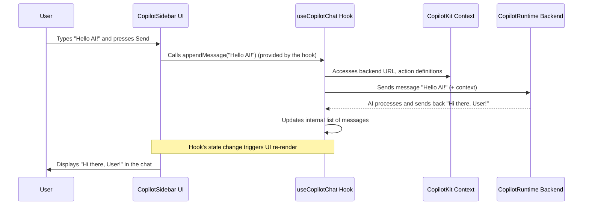

# Chapter 4: UI Components (`@copilotkit/react-ui`)

In [Chapter 3: Frontend Hooks (`@copilotkit/react-core`)](03_frontend_hooks____copilotkit_react_core___.md), we explored powerful hooks like `useCopilotAction` and `useCopilotChat`. These hooks give you fine-grained control to weave AI capabilities directly into your React components. But what if you want to add a standard AI chat interface to your app quickly, without building all the UI from scratch?

That's where the **UI Components** from the `@copilotkit/react-ui` package shine!

**What's the Big Idea? Ready-Made AI Interfaces**

Imagine you're building an e-commerce website. You've set up your AI with actions to find products and answer questions. Now, you need a chat window where users can talk to this AI. Instead of painstakingly building a chat box, message list, and input field yourself, you can just drop in a pre-built component from CopilotKit.

**What Problem Do They Solve?**

The `@copilotkit/react-ui` package provides ready-to-use React components for common AI interaction patterns, especially chat. These components save you a lot of time and effort:

1.  **Speed:** Add a polished AI chat interface to your app in minutes.
2.  **Consistency:** They offer a clean, standard look and feel (which you can customize!).
3.  **Integration:** They are designed to work seamlessly with the [CopilotKitProvider (React Component)](02_copilotkitprovider__react_component__.md) and the core hooks we've learned about.
4.  **Common Patterns:** Components like `CopilotSidebar` (a chat window that docks to the side), `CopilotPopup` (a chat window that pops up), and `CopilotChat` (a flexible chat panel) cover most needs for direct AI interaction.

Let's see how easy it is to add an AI chat sidebar to your application.

**Meet the Main UI Components:**

*   `CopilotSidebar`: A chat interface that appears as a sidebar, often alongside your main app content.
*   `CopilotPopup`: A chat interface that pops up, usually triggered by a button.
*   `CopilotChat`: A more general chat panel component that can be embedded anywhere in your UI. It's the foundation for `CopilotSidebar` and `CopilotPopup`.

We'll focus on `CopilotSidebar` for our main example.

**How to Use `CopilotSidebar`**

Let's add a chat sidebar to a simple application.

**1. Installation:**
First, make sure you have the necessary packages installed. If you haven't already, add `@copilotkit/react-ui`:

```bash
npm install @copilotkit/react-core @copilotkit/react-ui
# or
yarn add @copilotkit/react-core @copilotkit/react-ui
```

**2. Import Styles:**
CopilotKit UI components come with default styling. To use them, import the CSS file in your main application file (e.g., `App.tsx` or `main.tsx`):

```tsx
// In your App.tsx or main.tsx
import "@copilotkit/react-ui/styles.css"; // <-- Add this line!

// ... rest of your imports and app setup
```
This ensures your chat components look good out of the box.

**3. Add the Component:**
Now, let's add `CopilotSidebar` to our app. Remember, it needs to be inside a `<CopilotKit>` provider, which we learned about in [Chapter 2: CopilotKitProvider (React Component)](02_copilotkitprovider__react_component__.md).

```tsx
// App.tsx
import React from "react";
import { CopilotKit } from "@copilotkit/react-core";
import { CopilotSidebar } from "@copilotkit/react-ui";
import "@copilotkit/react-ui/styles.css"; // Already did this, but good reminder!

function App() {
  return (
    <CopilotKit runtimeUrl="/api/copilotkit"> {/* Provider setup */}
      <div id="app-content">
        <h1>My Awesome App</h1>
        <p>Welcome to my application!</p>
        {/* Your main application components would go here */}
      </div>

      <CopilotSidebar /> {/* <-- And here's our AI chat sidebar! */}
    </CopilotKit>
  );
}

export default App;
```

Breaking it down:
*   `import { CopilotSidebar } from "@copilotkit/react-ui";`: We import the sidebar component.
*   `<CopilotSidebar />`: We simply render the component within our `CopilotKit` provider.

**Input/Output:**
*   **What happens?** When you run your app, you'll see a chat icon or a docked sidebar. Clicking it opens a full chat interface.
*   **User Interaction:** Users can type messages into this sidebar.
*   **AI Interaction:** The sidebar handles sending messages to your AI backend (configured via `runtimeUrl` in `CopilotKit`) and displaying the AI's responses. It also works with any frontend or backend [Actions (Frontend & Backend)](01_actions__frontend___backend__.md) you've defined.

That's it! You've added a fully functional AI chat sidebar.

**4. Simple Customization:**
You can easily customize some of the text in the chat interface using the `labels` prop.

```tsx
// App.tsx (showing only the CopilotSidebar part)
import { CopilotSidebar } from "@copilotkit/react-ui";

// ... inside your App component and CopilotKit provider
      <CopilotSidebar
        labels={{
          title: "My AI Assistant",
          initial: "Hello! Ask me anything about this app.",
        }}
      />
// ...
```
*   `labels.title`: Changes the title displayed at the top of the chat window.
*   `labels.initial`: Sets the initial greeting message from the AI.

These UI components offer many more customization options for appearance and behavior. You can check out the official documentation for more advanced styling and prop details.

**Other UI Components: `CopilotPopup` and `CopilotChat`**

*   **`CopilotPopup`**: Behaves similarly to `CopilotSidebar` but appears as a modal dialog or popup window, usually triggered by a floating action button.
    ```tsx
    // To use CopilotPopup, just replace CopilotSidebar:
    import { CopilotPopup } from "@copilotkit/react-ui";

    // ...
          <CopilotPopup labels={{ title: "Chat Helper" }} />
    // ...
    ```
    (See `CopilotKit/packages/react-ui/src/components/chat/Popup.tsx` for its simple structure.)

*   **`CopilotChat`**: This is a more fundamental component that provides the chat panel itself. `CopilotSidebar` and `CopilotPopup` use `CopilotChat` internally. You can use `CopilotChat` directly if you want to embed the chat interface within a specific part of your page layout, rather than as an overlay sidebar or popup.
    ```tsx
    // To use CopilotChat directly in a div:
    import { CopilotChat } from "@copilotkit/react-ui";

    // ...
          <div style={{ width: "300px", height: "500px", border: "1px solid #ccc" }}>
            <CopilotChat labels={{ title: "Embedded Chat" }}/>
          </div>
    // ...
    ```

**How Do They Work Under the Hood?**

These UI components are not magic! They are built using the same core concepts and hooks we've already discussed.

**Simplified Flow:**

1.  **Provider Power:** The UI component (e.g., `CopilotSidebar`) lives inside a `<CopilotKit>` provider, giving it access to the CopilotKit context (like your backend `runtimeUrl`).
2.  **Hook Magic:** Internally, components like `CopilotSidebar` and `CopilotChat` heavily rely on the `useCopilotChat` hook (from [Frontend Hooks (`@copilotkit/react-core`)](03_frontend_hooks____copilotkit_react_core___.md)). This hook manages the actual chat logic:
    *   Keeping track of messages.
    *   Handling user input.
    *   Sending messages to the AI backend.
    *   Receiving responses from the AI.
    *   Managing loading states.
3.  **Rendering UI:** The UI component then takes the state from `useCopilotChat` (like the list of messages) and renders the chat interface (message bubbles, input field, etc.).

Here's a sequence diagram showing how `CopilotSidebar` might work:



**A Peek into the Code Structure:**

*   **`CopilotSidebar` and `CopilotPopup` are Wrappers:**
    If you look at the source code (e.g., `CopilotKit/packages/react-ui/src/components/chat/Sidebar.tsx` and `Popup.tsx`), you'll see they are relatively thin wrappers. They mainly manage their presentation (as a sidebar or popup) and delegate the core chat functionality to a component often called `CopilotModal` or directly to `CopilotChat`.

    ```tsx
    // Simplified from CopilotKit/packages/react-ui/src/components/chat/Popup.tsx
    // CopilotPopup passes its props to CopilotModal
    export function CopilotPopup(props: CopilotModalProps) {
      return <CopilotModal {...props} />; // Manages popup presentation
    }
    ```

    ```tsx
    // Simplified from CopilotKit/packages/react-ui/src/components/chat/Sidebar.tsx
    // CopilotSidebar also uses CopilotModal but adds sidebar-specific styling & behavior
    export function CopilotSidebar(props: CopilotModalProps) {
      // ... sidebar specific logic ...
      return (
        <div className="copilotKitSidebarContentWrapper">
          <CopilotModal {...props} /> {/* Manages sidebar presentation */}
        </div>
      );
    }
    ```
    Both `CopilotSidebar` and `CopilotPopup` ultimately rely on a shared modal or chat component that houses the actual chat logic.

*   **`CopilotChat` is the Core Engine:**
    The `CopilotChat` component (from `CopilotKit/packages/react-ui/src/components/chat/Chat.tsx`) is where the main chat UI and logic reside.

    ```tsx
    // Super simplified concept from CopilotKit/packages/react-ui/src/components/chat/Chat.tsx
    import { useCopilotChatLogic } from "./useCopilotChatLogic"; // Internal hook
    import { Messages } from "./Messages"; // Component to display messages
    import { Input } from "./Input"; // Component for text input

    export function CopilotChat(props: CopilotChatProps) {
      // This custom hook uses useCopilotChat from @copilotkit/react-core
      const { visibleMessages, isLoading, sendMessage } = useCopilotChatLogic(/*...*/);

      return (
        <div className="copilotKitChat"> {/* Main chat container */}
          <Messages messages={visibleMessages} inProgress={isLoading} /* ... */ />
          <Input onSend={sendMessage} inProgress={isLoading} /* ... */ />
          {/* Other elements like suggestions can also be here */}
        </div>
      );
    }
    ```
    Here:
    *   It uses a hook like `useCopilotChatLogic` (which itself wraps `useCopilotChat` from `@copilotkit/react-core`) to get the chat state (`visibleMessages`, `isLoading`) and functions (`sendMessage`).
    *   It then renders sub-components like `Messages` (to display the chat bubbles) and `Input` (for the user to type their messages).

So, these UI components cleverly package the power of the core hooks into easy-to-use, pre-styled elements!

**Benefits of Using `@copilotkit/react-ui` Components:**

*   **Rapid Development:** Get a functional AI chat interface up and running very quickly.
*   **Polished UI:** Comes with sensible default styles, making your AI copilot look professional.
*   **Customizable:** Offers props for common label changes and can be further styled with CSS.
*   **Best Practices:** Built on top of the core CopilotKit hooks and context, ensuring they work well within the ecosystem.

**Conclusion**

The UI components in `@copilotkit/react-ui`, like `CopilotSidebar`, `CopilotPopup`, and `CopilotChat`, are fantastic tools for quickly adding polished and functional AI chat interfaces to your React applications. They abstract away much of the boilerplate involved in building chat UIs from scratch, letting you focus on defining what your AI can *do*.

By leveraging these components, you save development time and ensure a consistent user experience for AI interactions.

So far, we've seen how to define what our AI can do ([Actions (Frontend & Backend)](01_actions__frontend___backend__.md)), how to power it up ([CopilotKitProvider (React Component)](02_copilotkitprovider__react_component__.md)), how to connect our UI to it programmatically ([Frontend Hooks (`@copilotkit/react-core`)](03_frontend_hooks____copilotkit_react_core___.md)), and now, how to add pre-built chat UIs.

But what if you want AI assistance directly within a text input field, helping users write content? That's where our next topic comes in. Let's explore the [CopilotTextarea (`@copilotkit/react-textarea`)](05_copilottextarea____copilotkit_react_textarea___.md).

---

Generated by [AI Codebase Knowledge Builder](https://github.com/The-Pocket/Tutorial-Codebase-Knowledge)