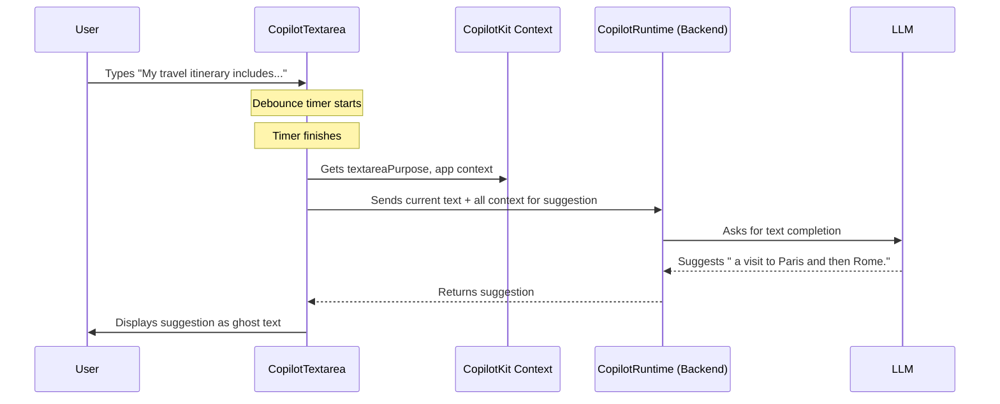

# Chapter 5: CopilotTextarea (`@copilotkit/react-textarea`)

In [Chapter 4: UI Components (`@copilotkit/react-ui`)](04_ui_components____copilotkit_react_ui___.md), we saw how to quickly add pre-built chat interfaces to our applications. Those are great for conversational AI. But what if you want AI assistance *while* you're writing, directly within a text field? That's where the `CopilotTextarea` comes in!

**What's the Big Idea? A Superpowered Text Box**

Imagine you're writing an important email, and you're a bit stuck on how to phrase a sentence or what to write next. A standard `<textarea>` on a webpage is just a plain box for typing. It doesn't offer any help.

The `CopilotTextarea` from `@copilotkit/react-textarea` is different. It looks and feels like a regular textarea, but it's packed with AI smarts! It can suggest how to complete your sentences, help you rephrase text, or even generate content based on a prompt, all right where you're typing.

**What Problem Does It Solve?**

`CopilotTextarea` solves the problem of "writer's block" or needing a quick AI assist directly within input fields. It enhances the standard textarea experience by:

1.  **Providing AI-powered autosuggestions:** As you type, it can offer suggestions to complete your thoughts.
2.  **Offering content insertion and editing:** A handy hovering editor (usually opened with `Cmd+K` or `Ctrl+K`) lets you ask the AI to write new text, summarize, or edit selected text.
3.  **Leveraging application context:** It can use information from your application (made available via the `useCopilotReadable` hook from [Chapter 3: Frontend Hooks (`@copilotkit/react-core`)](03_frontend_hooks____copilotkit_react_core___.md)) to make its suggestions even more relevant and intelligent.

Think of it as a drop-in replacement for a standard `<textarea>` that comes with its own mini AI writing assistant.

**How to Use `CopilotTextarea`**

Let's get started with a simple example. Imagine we're building a note-taking app for vacation planning.

**1. Installation (if you haven't already):**
You'll need the `@copilotkit/react-textarea` package, along with `@copilotkit/react-core` (which you should already have if you followed previous chapters).

```bash
npm install @copilotkit/react-core @copilotkit/react-textarea
# or
yarn add @copilotkit/react-core @copilotkit/react-textarea
```

**2. Import Styles:**
Like other CopilotKit UI components, `CopilotTextarea` comes with default styling. Import its CSS in your main application file (e.g., `App.tsx` or your root component):

```tsx
// In your App.tsx or main.tsx (or your root component)
import "@copilotkit/react-textarea/styles.css"; // <-- Add this line!
import "@copilotkit/react-ui/styles.css"; // If you use other UI components
// ... rest of your imports and app setup

// Remember to wrap your app in CopilotKitProvider
import { CopilotKit } from "@copilotkit/react-core";

function App() {
  return (
    <CopilotKit runtimeUrl="/api/copilotkit">
      {/* ... Your app content ... */}
    </CopilotKit>
  );
}
```

**3. Basic Usage:**
Using `CopilotTextarea` is very similar to using a regular `<textarea>`. You'll typically manage its value with React state.

Let's create a simple component for our vacation notes:

```tsx
// VacationNotes.tsx
import React, { useState } from "react";
import { CopilotTextarea } from "@copilotkit/react-textarea";

function VacationNotes() {
  const [notes, setNotes] = useState("");

  return (
    <div>
      <h2>My Vacation Ideas</h2>
      <CopilotTextarea
        value={notes}
        onValueChange={(newText) => setNotes(newText)}
        placeholder="What are your dream vacation plans?"
        autosuggestionsConfig={{
          textareaPurpose: "Brainstorming notes for an upcoming vacation. Focus on destinations and activities.",
        }}
      />
    </div>
  );
}

export default VacationNotes;
```

Let's break this down:
*   `import { CopilotTextarea } from "@copilotkit/react-textarea";`: We import the component.
*   `const [notes, setNotes] = useState("");`: Standard React state to hold the textarea's content.
*   `<CopilotTextarea ... />`: This is our AI-powered textarea.
    *   `value={notes}`: Binds the textarea's content to our `notes` state.
    *   `onValueChange={(newText) => setNotes(newText)}`: Updates our state when the user types or when AI makes changes. This prop is specific to `CopilotTextarea`.
    *   `placeholder="What are your dream vacation plans?"`: Just like a regular textarea placeholder.
    *   `autosuggestionsConfig={{ ... }}`: This is where we configure the AI magic!
        *   `textareaPurpose: "Brainstorming notes..."`: This is crucial! It tells the AI the general topic or goal of the text being written in this textarea. Clear purpose leads to better suggestions.

**Input/Output:**
*   **What happens?** You'll see a textarea. As you start typing, say "I want to go to...", the AI might suggest " a sunny beach destination" or " the mountains for hiking." The suggestion appears as faint text that you can accept (usually by pressing Tab).
*   If you select some text and press `Cmd+K` (Mac) or `Ctrl+K` (Windows), a small editing window pops up. You can type a command like "make this sound more exciting" or "list three activities for this place."

**Key Features in Action**

*   **Autosuggestions:**
    As you type, `CopilotTextarea` sends your current text (and the `textareaPurpose`) to the AI, which tries to predict what you might type next.
    *   For example, if `textareaPurpose` is "writing a professional email cover letter" and you type "I am writing to express my interest in the...", the AI might suggest "...Software Engineer position advertised on [Platform]."
    *   You can configure how quickly suggestions appear (`debounceTime`) and if they should be disabled when the textarea is empty (`disableWhenEmpty`) within the `autosuggestionsConfig`.

*   **Hovering Editor (Quick Edit / "Ask AI"):**
    This is a powerful feature. Select some text (or just place your cursor) and press the shortcut (default `Cmd+K` / `Ctrl+K`). A small input field appears.
    *   **Editing:** Select text, invoke the editor, and type "Rephrase this" or "Make this shorter."
    *   **Insertion/Generation:** Place your cursor, invoke the editor, and type "Write a paragraph about the best beaches in Italy" or "Suggest three packing essentials for a ski trip." The AI will generate and insert the text.

**Using Application Context**

Remember `useCopilotReadable` from [Chapter 3: Frontend Hooks (`@copilotkit/react-core`)](03_frontend_hooks____copilotkit_react_core___.md)? If you've used it elsewhere in your app to make certain data available to the AI (e.g., a list of user preferences, previous travel history), `CopilotTextarea` can automatically leverage this context. This makes its suggestions and generations even more tailored and intelligent because it "knows" more about what the user is doing or what data is relevant in the application. You don't need to do anything extra in `CopilotTextarea` itself; if the context is available via `CopilotKitProvider`, it will be used.

**Configuration Deep Dive: `autosuggestionsConfig`**

The `autosuggestionsConfig` prop is your main control panel for the AI features. Here are some important sub-properties:

*   `textareaPurpose: string` (Required): As we've seen, this tells the AI the goal of this specific textarea. Be descriptive!
*   `contextCategories: string[]` (Optional): If you are using `useCopilotReadable` with categories, you can specify which categories of context are most relevant for this textarea. Defaults to all available context.
*   `chatApiConfigs`: This object configures the underlying calls to the AI model for different features.
    *   `suggestionsApiConfig`: Controls inline autosuggestions. You can set parameters like `maxTokens` (how long suggestions can be) or `stop` (characters that tell the AI to finish its suggestion, e.g., ".", "?", "!").
    *   `insertionApiConfig`: Configures AI calls when the hovering editor is used to *insert or generate new* text.
    *   `editingApiConfig`: Configures AI calls when the hovering editor is used to *edit existing* text.

Here's a slightly more detailed config example:

```tsx
// Inside your component, for the CopilotTextarea
autosuggestionsConfig={{
  textareaPurpose: "Drafting a polite follow-up email to a client after a meeting.",
  chatApiConfigs: {
    suggestionsApiConfig: { // For inline autocomplete
      maxTokens: 25,
      stop: [".", "\n"], // Stop suggestion at period or new line
    },
    insertionApiConfig: { // For "Ask AI" to generate text
      // You can specify model parameters here too if needed
    },
    editingApiConfig: { // For "Ask AI" to edit text
      // Model parameters for editing tasks
    }
  },
  debounceTime: 200, // Wait 200ms after user stops typing to get suggestions
  disableWhenEmpty: true, // No suggestions if textarea is empty
}}
```

You can find the full set of options in the `AutosuggestionsConfig` type definition within the CopilotKit library (see `CopilotKit/packages/react-textarea/src/types/autosuggestions-config/autosuggestions-config.tsx`). The example `CopilotKit/examples/next-openai/src/app/components/vacation-notes.tsx` also showcases several of these options.

**Under the Hood: How Does It Work?**

Let's peek behind the curtain.

**Simplified Flow for an Autosuggestion:**

1.  **User Types:** You type "My travel itinerary includes..." into the `CopilotTextarea`.
2.  **Debounce & Trigger:** After a short pause (the `debounceTime`), the component decides it's time to fetch a suggestion.
3.  **Context Gathering:** `CopilotTextarea` takes the current text, its `textareaPurpose`, and any relevant application context (provided globally by `CopilotKitProvider` and `useCopilotReadable`).
4.  **API Call:** It sends this information to your backend AI endpoint (specified in `CopilotKitProvider`'s `runtimeUrl`). This is handled by internal functions that prepare the request for the AI.
5.  **AI Processing:** Your backend, using the [CopilotRuntime (Backend Engine)](06_copilotruntime__backend_engine__.md), forwards this to an LLM (like GPT). The LLM generates a plausible completion.
6.  **Suggestion Displayed:** The LLM's suggestion (e.g., "a visit to Paris and then Rome.") is sent back to the `CopilotTextarea`, which displays it as faint "ghost text."
7.  **User Accepts/Rejects:** You can press Tab to accept the suggestion or just keep typing to ignore it.

Here's a sequence diagram illustrating this:



The hovering editor works similarly: it takes the selected text (if any), your instruction (e.g., "summarize this"), and context, then sends it to the AI for processing.

**A Glimpse into the Code Structure:**

*   The `CopilotTextarea` component you import (from `CopilotKit/packages/react-textarea/src/components/copilot-textarea/copilot-textarea.tsx`) is a smart wrapper.
*   It internally uses a more fundamental component called `BaseCopilotTextarea`.
*   Before rendering `BaseCopilotTextarea`, `CopilotTextarea` sets up the AI interaction functions using hooks like:
    *   `useMakeStandardAutosuggestionFunction`: This hook takes your `textareaPurpose`, `contextCategories`, and `suggestionsApiConfig` to create the actual function that will be called to get autosuggestions.
    *   `useMakeStandardInsertionOrEditingFunction`: Similarly, this prepares the function for handling insertions and edits from the hovering editor, using the `insertionApiConfig` and `editingApiConfig`.
*   The `autosuggestionsConfig` you provide is merged with default configurations (`merge(defaultAutosuggestionsConfig, autosuggestionsConfigUserSpecified)`) to ensure all necessary settings are present.
*   `BaseCopilotTextarea` then handles the user input events, manages the display of suggestions, integrates the hovering editor UI, and calls the prepared AI functions when needed.

These prepared functions ultimately use the core communication mechanisms provided by `CopilotKitProvider` (like the `runtimeUrl` to know where your AI backend is) to interact with the LLM.

**Conclusion**

The `CopilotTextarea` is a powerful component that seamlessly blends AI assistance into the familiar textarea element. It empowers users by providing intelligent autosuggestions, easy content generation, and quick editing capabilities, all within their typing flow.

Key takeaways:
*   It's a drop-in replacement for `<textarea>` with added AI superpowers.
*   Configure its behavior primarily through the `autosuggestionsConfig` prop, especially the `textareaPurpose`.
*   It offers both inline autosuggestions and a hovering editor for more complex AI interactions.
*   It automatically benefits from application-wide context provided by `useCopilotReadable`.

Now that you've seen how AI can enhance UI components on the frontend, you might be wondering about the backend engine that powers all these AI interactions. Let's dive into that next, with [CopilotRuntime (Backend Engine)](06_copilotruntime__backend_engine__.md).

---

Generated by [AI Codebase Knowledge Builder](https://github.com/The-Pocket/Tutorial-Codebase-Knowledge)