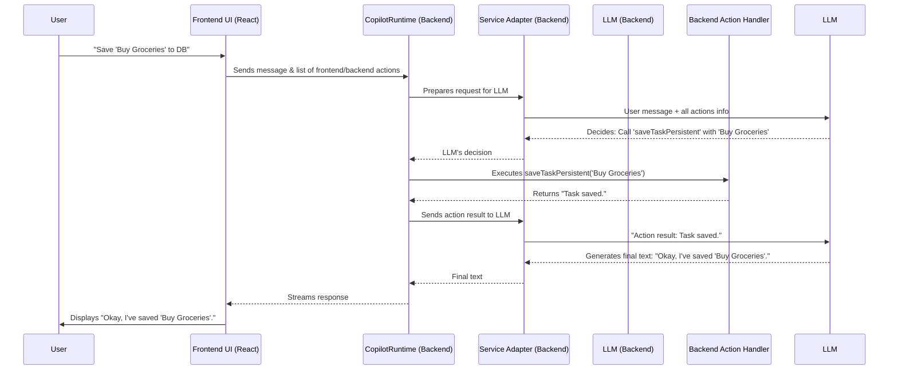

# Chapter 6: CopilotRuntime (Backend Engine)

In [Chapter 5: CopilotTextarea (`@copilotkit/react-textarea`)](05_copilottextarea____copilotkit_react_textarea___.md), we saw how AI can supercharge a simple textarea, offering suggestions and helping with writing. You might be wondering: where does all that intelligence actually come from? How does the `CopilotTextarea`, or the chat UIs from [Chapter 4: UI Components (`@copilotkit/react-ui`)](04_ui_components____copilotkit_react_ui___.md), actually talk to an AI and get smart responses?

The answer lies in the **CopilotRuntime**, the backend "brain" of your CopilotKit application!

**What's the Big Idea? The AI's Command Center**

Imagine your AI copilot is like a sophisticated robot. The frontend components we've discussed (like chat windows or the smart textarea) are its eyes, ears, and voice. But the robot needs a central processing unit (CPU) to understand requests, think, and decide what to do.

The **CopilotRuntime** is that CPU. It's a piece of software that lives on your server (your backend, which could be built with Node.js, Python, Next.js, etc.). It's the engine that drives the AI logic.

**What Problem Does It Solve?**

The CopilotRuntime acts as the central coordinator for all AI-related tasks:

1.  **Conversation Management:** It keeps track of the conversation between the user and the AI.
2.  **LLM Communication:** It's responsible for actually talking to Large Language Models (LLMs) like OpenAI's GPT, Anthropic's Claude, or others.
3.  **Action Orchestration:** Remember [Actions (Frontend & Backend)](01_actions__frontend___backend__.md)? The CopilotRuntime receives information about *all* available actions (both frontend and backend). It tells the LLM about these tools. When the LLM decides to use an action, the CopilotRuntime either executes backend actions directly or tells the frontend to execute a frontend action.
4.  **Agent Integration:** It can work with more advanced [Agents (Backend Focus)](07_agents__backend_focus__.md) to handle complex, multi-step tasks (we'll learn more about this in the next chapter!).

Think of it as the **air traffic controller** for AI requests. It ensures that user input is correctly understood, the right AI model is consulted, appropriate actions are taken, and a coherent response is sent back to the user. Without it, your frontend AI components wouldn't have anyone to talk to!

**Setting Up Your CopilotRuntime**

Let's see how you'd typically set up a CopilotRuntime on your backend. The exact code depends on your backend language and framework (e.g., Node.js with Express, Next.js API Routes, Python with FastAPI).

The core idea is to:
1.  Instantiate the runtime.
2.  Define any backend actions it should know about.
3.  Connect it to an LLM using a [Service Adapters (Backend)](08_service_adapters__backend__.md).
4.  Expose it as an HTTP endpoint. This endpoint URL is what you provide to the `CopilotKitProvider` in your frontend (as the `runtimeUrl` prop from [Chapter 2: CopilotKitProvider (React Component)](02_copilotkitprovider__react_component__.md)).

### Example: Node.js (using `@copilotkit/runtime`)

Here's a highly simplified example for a Node.js backend. Let's imagine we want a backend action that can look up a product price.

```typescript
// In your backend server file (e.g., server.ts or index.ts)
import { CopilotRuntime, OpenAIAdapter } from "@copilotkit/runtime";
// import { createServer } from "node:http"; // For a basic Node HTTP server
// import { copilotRuntimeNodeHttpEndpoint } from "@copilotkit/runtime"; // Helper

// 1. Instantiate the CopilotRuntime
const runtime = new CopilotRuntime({
  // 2. Define backend actions
  actions: [
    {
      name: "getProductPrice",
      description: "Gets the price of a product.",
      parameters: [{ name: "productName", type: "string", required: true }],
      handler: async ({ productName }) => {
        // In a real app, you'd look this up in a database
        if (productName.toLowerCase() === "super widget") return "$99.99";
        return "Sorry, product not found.";
      },
    },
  ],
});

// 3. Connect to an LLM (e.g., OpenAI)
// Ensure your OPENAI_API_KEY environment variable is set
// const serviceAdapter = new OpenAIAdapter(); // Uses OpenAI

// 4. Expose as an HTTP endpoint (simplified concept)
// const handler = copilotRuntimeNodeHttpEndpoint({
//   runtime,
//   serviceAdapter,
//   endpoint: "/api/copilotkit", // This becomes your runtimeUrl
// });
// createServer(handler).listen(4000);
// console.log("Backend AI runtime listening on http://localhost:4000/api/copilotkit");
```
Let's break this down:
*   `new CopilotRuntime(...)`: We create an instance of our backend engine.
*   `actions: [...]`: We pass an array of backend action definitions. Each action has a `name`, `description`, `parameters` it expects, and a `handler` function that contains the actual logic to execute on the server.
*   `OpenAIAdapter()`: This part (which we'll cover in detail in [Service Adapters (Backend)](08_service_adapters__backend__.md)) tells the runtime *how* to talk to a specific LLM, in this case, OpenAI's models.
*   `copilotRuntimeNodeHttpEndpoint`: This helper (or similar ones for Next.js, etc.) takes your runtime and service adapter and creates an HTTP request handler. This handler is what listens for requests from your frontend. The `endpoint` path (`/api/copilotkit`) is what you'd use as `runtimeUrl` in your frontend's `CopilotKitProvider`.

**Input/Output:**
*   **Frontend asks (via `runtimeUrl`):** "What's the price of a Super Widget?"
*   **CopilotRuntime (with LLM's help):** Understands the intent, sees the `getProductPrice` action, and figures out `productName` is "Super Widget".
*   **Action Execution:** Runs the `handler` for `getProductPrice`.
*   **Result:** The handler returns "$99.99".
*   **LLM generates response:** "The price of a Super Widget is $99.99."
*   **CopilotRuntime streams back to frontend:** The frontend UI displays the answer.

You can see a more complete Node.js example in `CopilotKit/examples/node-http/src/index.ts` or for Next.js in `CopilotKit/examples/next-openai/src/app/api/copilotkit/route.ts`.

### Example: Python (using the `copilotkit` SDK)

The concept is similar in Python. You'd typically use the `CopilotKitRemoteEndpoint` class.

```python
# In your Python backend (e.g., main.py)
from copilotkit import CopilotKitRemoteEndpoint, Action
# from copilotkit.integrations.fastapi import add_fastapi_endpoint # For FastAPI
# from fastapi import FastAPI # For FastAPI

# Dummy handler function for our action
async def get_product_price_handler(productName: str):
    if productName.lower() == "pythonic gadget":
        return "€42.00"
    return "Sorry, product not found in Python land."

# 1. Instantiate CopilotKitRemoteEndpoint (similar to CopilotRuntime)
copilot_sdk = CopilotKitRemoteEndpoint(
    # 2. Define backend actions
    actions=[
        Action(
            name="getProductPricePython",
            description="Gets the price of a product from the Python backend.",
            parameters=[
                {"name": "productName", "type": "string", "description": "Product name"}
            ],
            handler=get_product_price_handler
        )
    ]
)

# 3. Connect to an LLM: This is handled differently.
# The Python SDK often works with a frontend that already has a service adapter.
# The primary role here is to expose actions and agents.

# 4. Expose as an HTTP endpoint (e.g., with FastAPI)
# app = FastAPI()
# add_fastapi_endpoint(
#   app,
#   copilot_sdk,
#   "/api/copilotkit_python" # This becomes your runtimeUrl
# )
# # Then run with Uvicorn: uvicorn main:app --reload
# print("Python backend AI runtime likely on http://localhost:8000/api/copilotkit_python")
```
Breakdown:
*   `CopilotKitRemoteEndpoint(...)`: This is the Python equivalent for setting up your backend logic.
*   `Action(...)`: Defines a backend action, similar to the TypeScript version.
*   `add_fastapi_endpoint`: A helper to integrate with the FastAPI web framework, making your actions available at a specific URL.

You can find more details in the Python SDK documentation, like `sdk-python/copilotkit/sdk.py`.

**How It Works: The Journey of a Request**

Let's trace what happens when a user interacts with a CopilotKit-powered frontend component (like `CopilotSidebar` or `CopilotTextarea`):

1.  **User Input:** The user types a message (e.g., "Add 'buy milk' to my to-do list and save it").
2.  **Frontend to Backend:** The frontend (via `CopilotKitProvider`) packages this message, along with descriptions of any *frontend* [Actions (Frontend & Backend)](01_actions__frontend___backend__.md) (like `addTaskToUI` from Chapter 1), and sends it all to the `runtimeUrl` (your CopilotRuntime backend endpoint).
3.  **CopilotRuntime Receives:** Your backend (Node.js, Python, etc.) receives this HTTP request.
4.  **Context Preparation:** The CopilotRuntime combines:
    *   The user's message.
    *   Descriptions of frontend actions (sent from the client).
    *   Descriptions of its own backend actions (like `getProductPrice` or `saveTaskPersistent`).
5.  **LLM Interaction:** The CopilotRuntime, using a [Service Adapters (Backend)](08_service_adapters__backend__.md) (e.g., `OpenAIAdapter`), sends all this context to an LLM (like GPT). It essentially asks the LLM, "Based on this conversation and these available tools (actions), what should we do?"
6.  **LLM Decides:** The LLM analyzes the request and might decide:
    *   To just generate a text response.
    *   To use one or more of the available actions. If so, it specifies which action(s) and what arguments to use (e.g., "call `saveTaskPersistent` with `task_text` = 'buy milk'").
7.  **Action Execution:**
    *   **Backend Action:** If the LLM chose a backend action, the CopilotRuntime executes its handler function directly on the server.
    *   **Frontend Action:** If it's a frontend action, the CopilotRuntime sends a specific instruction back to the client, telling it which frontend action to run and with what arguments. The client (using hooks like `useCopilotAction`) then executes it.
8.  **Result to LLM (if action executed):** The result of the action (e.g., "Task saved successfully" or data from a database) is sent back to the LLM. This helps the LLM formulate a more informed final response.
9.  **Final Response Generation:** The LLM generates a final, natural language response for the user.
10. **Stream to Frontend:** The CopilotRuntime streams this response back to the frontend, which then displays it in the UI.

Here's a simplified diagram:



**A Peek into the Code (Conceptual)**

*   **`CopilotRuntime` Class (TypeScript):**
    (From `CopilotKit/packages/runtime/src/lib/runtime/copilot-runtime.ts`)
    When you instantiate `new CopilotRuntime({ actions: [...] })`, you're providing the list of backend functions the AI can call.
    ```typescript
    // Simplified constructor concept
    export class CopilotRuntime {
      public actions: Action<any>[]; // Stores your backend actions
      // ... other properties for remote agents, langserve, middleware ...

      constructor(params?: CopilotRuntimeConstructorParams) {
        this.actions = params?.actions || [];
        // ... initialization of other features ...
      }

      // Core method that handles incoming requests
      async processRuntimeRequest(request: CopilotRuntimeRequest): Promise<CopilotRuntimeResponse> {
        // 1. Gets server-side actions (including any from remote_endpoints or mcpServers)
        // 2. Prepares messages and actions for the LLM
        // 3. Calls serviceAdapter.process(...) to talk to LLM
        // 4. Handles LLM's decision (text response or action call)
        // 5. Returns a streamable response (eventSource)
        // ... lots of logic here ...
      }
    }
    ```
    The `processRuntimeRequest` method is the heart of the runtime, orchestrating the flow described above. It works closely with a [Service Adapters (Backend)](08_service_adapters__backend__.md) to communicate with the chosen LLM.

*   **`CopilotKitRemoteEndpoint` Class (Python):**
    (From `sdk-python/copilotkit/sdk.py`)
    Similarly, this class in the Python SDK holds your backend actions and agent definitions.
    ```python
    # Simplified constructor concept
    class CopilotKitRemoteEndpoint:
        def __init__(
            self,
            *,
            actions: Optional[List[Action]] = None,
            agents: Optional[List[Agent]] = None,
        ):
            self.actions = actions or [] # Stores your backend actions
            self.agents = agents or []   # Stores your backend agents

        # Method to execute a specific action
        async def execute_action(self, name: str, arguments: dict, context: CopilotKitContext):
            action_to_execute = self._get_action(name=name, context=context)
            # ... calls action_to_execute.execute(arguments) ...
            # ... (actual method returns a Coroutine)
            pass
        
        # There are also methods for execute_agent, info, etc.
    ```
    When an HTTP request comes to an endpoint managed by `CopilotKitRemoteEndpoint` (e.g., via a FastAPI integration), the SDK routes it to methods like `execute_action` if the LLM decided to call one of your Python actions.

**Conclusion**

The CopilotRuntime is the indispensable backend engine that powers your AI copilot's intelligence. It lives on your server, manages conversations, talks to LLMs, and intelligently decides when and how to use the tools (Actions) you've provided—whether those actions live on the frontend or the backend.

Key Takeaways:
*   It's the server-side "brain" of CopilotKit.
*   You configure it with your backend actions and connect it to an LLM via a Service Adapter.
*   It's exposed as an HTTP endpoint that your frontend communicates with (the `runtimeUrl`).
*   It orchestrates the entire AI interaction flow, from understanding user input to generating responses and executing tasks.

While simple actions are powerful, sometimes you need more complex, stateful, and long-running AI logic. For that, CopilotKit offers the concept of Agents. Let's explore them in the next chapter: [Agents (Backend Focus)](07_agents__backend_focus__.md).

---

Generated by [AI Codebase Knowledge Builder](https://github.com/The-Pocket/Tutorial-Codebase-Knowledge)