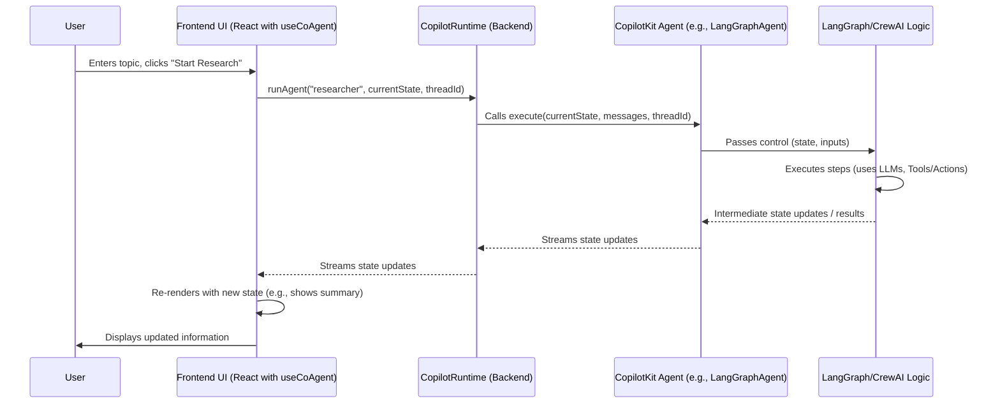

# Chapter 7: Agents (Backend Focus)

In [Chapter 6: CopilotRuntime (Backend Engine)](06_copilotruntime__backend_engine__.md), we learned about the backend engine that powers our AI interactions and executes actions. That's great for single, well-defined tasks. But what if you need your AI to perform more complex, multi-step operations, almost like a dedicated assistant for a specific job? That's where **Agents** come into play!

**What's the Big Idea? Your AI Specialist**

Imagine you want to build an AI research assistant. You might ask it: "Hey Copilot, find the latest trends in solar panel technology, compare their efficiency, and write a short summary for me."

This isn't a single action. It involves:
1.  Searching for "latest trends in solar panel technology."
2.  Perhaps searching for "solar panel efficiency comparisons."
3.  Reading and understanding multiple sources.
4.  Synthesizing this information.
5.  Finally, writing a summary.

A simple action can't do all that. You need something smarter, something that can follow a plan, use different tools, and maybe even remember what it has learned along the way. That's an **Agent**.

**What Problem Do Agents Solve?**

Agents are more advanced AI entities designed for:

1.  **Complex, Multi-Step Tasks:** Like our research assistant example.
2.  **State Management/Memory:** Agents can often keep track of information over time or across several steps (e.g., remembering previous search results).
3.  **Tool Usage (Actions):** They can use the [Actions (Frontend & Backend)](01_actions__frontend___backend__.md) we defined earlier as tools to achieve parts of their goal.
4.  **Orchestration:** Some agents can even coordinate other agents or specialized services.

Think of them as specialized AI workers you can hire for particular jobs. CopilotKit allows you to integrate these advanced agents, especially those built with popular frameworks like LangGraph (for building stateful, multi-actor applications with LLMs) or CrewAI (for orchestrating role-playing, autonomous AI agents). These agents are primarily managed and executed on your **backend** using CopilotKit's Python or JavaScript SDKs.

**Agents in CopilotKit: The Backend Powerhouse**

While your frontend (using components like `CopilotSidebar` from [UI Components (`@copilotkit/react-ui`)](04_ui_components____copilotkit_react_ui___.md)) is where the user interacts, the heavy lifting for agents happens on the server.

Let's look at how you might define and integrate an agent, conceptually, using Python (as LangGraph and CrewAI are popular Python libraries).

### 1. The Basic Idea: An `Agent` Contract

CopilotKit's Python SDK provides a base `Agent` class. If you were building an agent from scratch (or an adapter for a new framework), it would need to implement a couple of key methods.

```python
# Conceptual: from sdk-python/copilotkit/agent.py
from abc import ABC, abstractmethod
from typing import List, Dict, Optional
# from .types import Message # For full type hints

class Agent(ABC):
    def __init__(self, name: str, description: Optional[str] = None):
        self.name = name
        self.description = description
        # Validation for agent name...

    @abstractmethod
    def execute(self, state: Dict, messages: List[Message], **kwargs): # Simplified
        # This is where the agent does its work
        pass

    @abstractmethod
    async def get_state(self, thread_id: str):
        # This is how an agent reports its current status/memory
        pass
```
*   `name`: A unique identifier for the agent.
*   `description`: Helps CopilotKit (and potentially an LLM) understand what this agent does and when to use it.
*   `execute(...)`: The main function that gets called to run the agent. It receives the current conversation `messages`, the agent's current `state`, and other parameters. This function would contain the logic for the agent to plan, use tools, and achieve its goal.
*   `get_state(...)`: A function to retrieve the current state of the agent for a given conversation or task `thread_id`.

This defines the basic "contract" an agent needs to fulfill to work with CopilotKit.

### 2. Integrating with LangGraph or CrewAI

More commonly, you'll use established agent frameworks. CopilotKit provides convenient wrappers like `LangGraphAgent` and `CrewAIAgent` to integrate agents built with these tools.

**Example: Using `LangGraphAgent` (Conceptual)**

LangGraph allows you to define agents as "graphs" where nodes represent steps or actors, and edges represent transitions.

```python
# Conceptual: based on sdk-python/copilotkit/langgraph_agent.py
from copilotkit import LangGraphAgent
# Assume 'my_research_graph' is a compiled LangGraph graph
# from langgraph.graph.graph import CompiledGraph
# my_research_graph: CompiledGraph = ... # Your LangGraph definition

research_agent = LangGraphAgent(
    name="researcher",
    description="An agent that researches topics and provides summaries.",
    graph=my_research_graph, # Your actual LangGraph agent
    # langgraph_config can also be provided here
)
```
*   `LangGraphAgent(...)`: We wrap our existing LangGraph agent (`my_research_graph`).
*   `name` and `description`: Tell CopilotKit about this agent.
*   `graph`: This is your pre-built LangGraph. The complexity of building this graph (defining its nodes, edges, logic using LLMs and tools) is part of using LangGraph itself. CopilotKit just needs the final, compiled graph to integrate it.

The `CrewAIAgent` (from `sdk-python/copilotkit/crewai/crewai_agent.py`) works similarly, allowing you to plug in a CrewAI `Crew` or `Flow`.

### 3. Exposing Agents via CopilotRuntime

Once you have your agent defined (e.g., `research_agent`), you tell your [CopilotRuntime (Backend Engine)](06_copilotruntime__backend_engine__.md) about it.

In Python, using `CopilotKitRemoteEndpoint` (which is part of the backend setup):

```python
# In your Python backend (e.g., main.py where you set up FastAPI)
from copilotkit import CopilotKitRemoteEndpoint
# from .my_agents import research_agent # Assuming research_agent is defined elsewhere

copilot_sdk = CopilotKitRemoteEndpoint(
    agents=[research_agent] # Add your agent here
    # You can also list backend actions here
)

# ... then expose copilot_sdk via FastAPI or another framework ...
```
By including `research_agent` in the `agents` list, you make it available for the CopilotKit system to use. Your frontend can now potentially trigger this agent.

### 4. Frontend Interaction: `useCoAgent`

On the frontend, you'd typically use the `useCoAgent` hook from [Frontend Hooks (`@copilotkit/react-core`)](03_frontend_hooks____copilotkit_react_core___.md) to interact with a backend agent. This hook allows your React components to:

*   Connect to a specific backend agent by its `name`.
*   Send initial instructions or data to the agent.
*   Display the agent's current `state`.
*   Allow the user to update parts of the state, which then synchronizes back to the backend agent.
*   Trigger the agent to `run` or `continue` its process.

```tsx
// Simplified frontend component (e.g., ResearchComponent.tsx)
import { useCoAgent } from "@copilotkit/react-core";

interface ResearchState {
  topic?: string;
  summary?: string;
  status?: string;
}

function ResearchManager() {
  const { state, setState, run } = useCoAgent<ResearchState>({
    name: "researcher", // Matches backend agent name
    initialState: { topic: "", summary: "Not started", status: "idle" },
  });

  const handleResearch = () => {
    // 'run' will trigger the backend "researcher" agent
    // The agent will use 'state.topic' and update 'state.summary' etc.
    if (state.topic) run();
  };

  return (
    <div>
      <input
        value={state.topic}
        onChange={(e) => setState(prev => ({ ...prev, topic: e.target.value }))}
        placeholder="Enter research topic"
      />
      <button onClick={handleResearch}>Start Research</button>
      <p>Status: {state.status}</p>
      <textarea readOnly value={state.summary} />
    </div>
  );
}
```
*   `useCoAgent({ name: "researcher", ... })`: Connects to our backend agent.
*   `state`: Holds the shared state between the frontend and the backend agent (e.g., the research topic, the current summary, status).
*   `setState`: Allows the UI to update the state (e.g., when the user types a topic). This change is also sent to the backend agent.
*   `run()`: This function signals the backend agent to start or continue its execution. The agent will pick up the current `state` (including the `topic`) and begin its work. As the backend agent works (e.g., performing searches, writing summaries), it will update its state, and these updates will be reflected back in the `state` object on the frontend, causing the UI to re-render.

**Input/Output:**
*   **User types:** "Solar panel efficiency" into the input field and clicks "Start Research."
*   **Frontend (`useCoAgent`):** Calls `run()`. This sends a request to the [CopilotRuntime (Backend Engine)](06_copilotruntime__backend_engine__.md), indicating the "researcher" agent should run with the current state (which includes `topic: "Solar panel efficiency"`).
*   **Backend Agent (`research_agent`):** Its `execute` method (or LangGraph/CrewAI flow) kicks off. It uses tools (Actions) to search, analyze, etc. As it makes progress, it updates its internal state (e.g., `status: "Searching..."`, then `status: "Summarizing..."`, `summary: "..."`).
*   **State Sync:** These state changes are streamed back to the frontend via CopilotKit's communication channel.
*   **Frontend UI:** The `ResearchManager` component re-renders, showing the updated status and summary.

**How It Works Under the Hood: Agent Execution Flow**

Let's simplify the journey of an agent interaction:

1.  **Frontend Initiation:** The user interacts with a UI element (e.g., clicks a button) that calls a function from `useCoAgent` (like `run` or `setState` which implicitly might trigger a run).
2.  **Request to Backend:** The frontend, via the `CopilotKitProvider`'s `runtimeUrl`, sends a request to your [CopilotRuntime (Backend Engine)](06_copilotruntime__backend_engine__.md). This request specifies:
    *   The `agentName` to execute (e.g., "researcher").
    *   The current `threadId` (a unique ID for this ongoing task or conversation).
    *   The latest `state` from the frontend (e.g., `{ topic: "Solar panel efficiency" }`).
    *   Any new `messages` from the user.
    *   The `AgentSessionInput` (from `CopilotKit/packages/runtime/src/graphql/inputs/agent-session.input.ts`) is an example of how the frontend might structure part of this request.
3.  **Backend Runtime Routes to Agent:** The CopilotRuntime identifies the correct agent (e.g., our `research_agent` which is a `LangGraphAgent`).
4.  **Agent Execution:**
    *   The `execute` method of the agent wrapper (e.g., `LangGraphAgent.execute`) is called.
    *   This method takes the incoming `state`, `messages`, etc., and typically:
        *   Merges the new frontend state with the agent's existing internal state for that `threadId`.
        *   Passes control to the underlying agent framework (LangGraph or CrewAI).
        *   The LangGraph/CrewAI agent then runs its defined logic: calling LLMs, using tools (which could be CopilotKit [Actions (Frontend & Backend)](01_actions__frontend___backend__.md) you've defined elsewhere), making decisions.
5.  **State Updates & Streaming:** As the agent operates, it updates its state. The `LangGraphAgent` (for example) is designed to stream these state changes and other events (like intermediate tool outputs or LLM thoughts, if configured) back to the CopilotRuntime.
6.  **Runtime Relays to Frontend:** The CopilotRuntime forwards these streamed updates to the connected frontend client.
7.  **Frontend Reacts:** The `useCoAgent` hook on the frontend receives these state updates, updates its local `state` object, causing the React component to re-render and display the latest information (e.g., progress status, partial results, final summary).

Here’s a diagram of this flow:



**Diving Deeper into Code (Conceptual):**

*   **`LangGraphAgent.execute` (from `sdk-python/copilotkit/langgraph_agent.py`):**
    The `execute` method in `LangGraphAgent` is responsible for bridging CopilotKit's request to the LangGraph stream.
    ```python
    # Simplified from sdk-python/copilotkit/langgraph_agent.py
    # class LangGraphAgent(Agent):
    async def _stream_events( # Called by execute
            self,
            state: Any, # Current state from frontend/CopilotKit
            messages: List[Message], # User messages
            thread_id: str,
            # ... other params ...
        ):
        # 1. Get current LangGraph state for thread_id
        agent_state = await self.graph.aget_state(config_with_thread_id)
        
        # 2. Merge CopilotKit state and messages into LangGraph state
        #    (using self.merge_state and self.convert_messages)
        merged_langgraph_state = self.merge_state(
            state=agent_state.values, messages=self.convert_messages(messages), ...
        )

        # 3. Stream events from the LangGraph graph
        async for event in self.graph.astream_events(merged_langgraph_state, ...):
            # Process 'event' (could be LLM token, tool call, state update)
            # If it's a state update relevant to CopilotKit (on_copilotkit_state_sync),
            # yield it back to CopilotRuntime.
            if event_is_state_sync:
                yield self._emit_state_sync_event(...) # Formats for CopilotKit
            
            # Yield other LangGraph events as well
            yield langchain_dumps(event) + "\n"
        # ... final state emission ...
    ```
    This shows how `LangGraphAgent` prepares the input for the LangGraph `graph` and then iterates over the events produced by the graph, forwarding relevant information back.

*   **`useCoAgent` Frontend Logic (from `CopilotKit/packages/react-core/src/hooks/use-coagent.ts`):**
    The `runAgent` function (called internally when you invoke `run()` from `useCoAgent`) is what kicks off the process from the frontend.
    ```typescript
    // Simplified from useCoAgent hook
    async function runAgent(
      name: string, // Agent name, e.g., "researcher"
      context: CopilotContextParams & CopilotMessagesContextParams,
      appendMessage: (message: Message) => Promise<void>,
      runChatCompletion: () => Promise<Message[]>, // This is key
      hint?: HintFunction,
    ) {
      // ... set agent session ...
      
      // If a hint is provided (e.g., why we're re-running), append it as a message
      if (hint) {
        const hintMessage = hint({ /* previousState, currentState */ });
        if (hintMessage) await appendMessage(hintMessage);
      }
      
      // Crucially, it triggers the standard chat completion flow.
      // The CopilotRuntime backend, when processing this chat completion,
      // will see that an agent session is active (e.g., for "researcher").
      // It will then route the request to the agent's 'execute' method
      // instead of just a simple LLM call.
      await runChatCompletion();
    }
    ```
    When `runChatCompletion()` is called while an agent session is active (set by `useCoAgent` via `setAgentSession`), the backend [CopilotRuntime (Backend Engine)](06_copilotruntime__backend_engine__.md) knows to invoke the specified agent (`name`) with the current messages and state. The agent's execution (and any state updates it generates) are then streamed back.

**Conclusion**

Agents are your solution for building sophisticated AI capabilities that go beyond simple question-answering or single-shot actions. They allow for complex, multi-step task execution, often maintaining memory and using a variety of tools. CopilotKit focuses on making it easy to integrate agents built with powerful backend frameworks like LangGraph and CrewAI into your application, and to connect them with your frontend using hooks like `useCoAgent` for a dynamic, stateful user experience.

Key Takeaways:
*   Agents handle complex, multi-step tasks with state.
*   They are primarily defined and run on the backend (Python/JS).
*   CopilotKit helps integrate agents from frameworks like LangGraph or CrewAI.
*   The `useCoAgent` hook on the frontend allows interactive, stateful communication with backend agents.
*   The [CopilotRuntime (Backend Engine)](06_copilotruntime__backend_engine__.md) orchestrates the execution of these agents.

Now that we've seen how to build actions and complex agents, you might wonder how the CopilotRuntime actually talks to different Large Language Models (like OpenAI, Anthropic, etc.). That's what we'll explore next in [Chapter 8: Service Adapters (Backend)](08_service_adapters__backend__.md).

---

Generated by [AI Codebase Knowledge Builder](https://github.com/The-Pocket/Tutorial-Codebase-Knowledge)