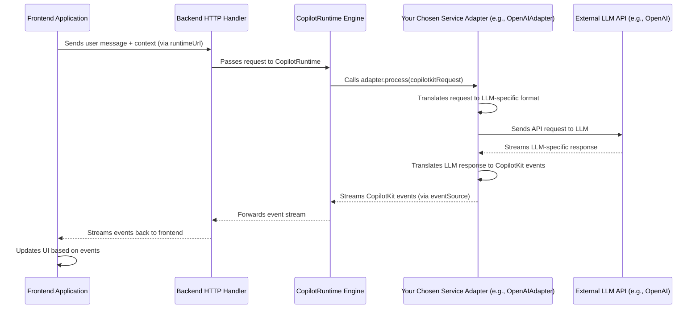

# Chapter 8: Service Adapters (Backend)

In the [previous chapter on Agents (Backend Focus)](07_agents__backend_focus__.md), we saw how to create powerful, multi-step AI assistants. Both simple [Actions (Frontend & Backend)](01_actions__frontend___backend__.md) and complex Agents ultimately need to communicate with a Large Language Model (LLM) to get their intelligence. But there are many different LLMs out there – OpenAI's GPT models, Anthropic's Claude, Google's Gemini, models on Groq, and more!

How does your CopilotKit application talk to these different "brains" without you having to rewrite your backend code every time you want to try a new LLM? That's where **Service Adapters** come in!

**What's the Big Idea? The Universal Remote for LLMs**

Imagine you have a universal TV remote. You want it to control your Sony TV, your Samsung soundbar, and your LG Blu-ray player. Each device "speaks" a different command language. Your universal remote needs special codes or settings for each brand to translate your button presses (like "Volume Up") into commands each specific device understands.

**Service Adapters** in CopilotKit are just like that!
*   Your **CopilotKit application** (specifically the [CopilotRuntime (Backend Engine)](06_copilotruntime__backend_engine__.md)) is like the **universal remote**.
*   Different **LLMs** (OpenAI, Anthropic, Google, Groq) are like the different **TV brands**.
*   A **Service Adapter** for a specific LLM (e.g., `OpenAIAdapter`, `AnthropicAdapter`) is like the **special code** that allows your CopilotKit "remote" to "talk" to that particular LLM "brand."

Each LLM provider has its own unique way of receiving requests (e.g., the format of messages, how to specify tools/actions) and sending back responses. Service Adapters handle this translation, allowing your core CopilotKit logic to remain the same, regardless of which LLM you're using.

**Why Do We Need Them? Speaking Different AI Languages**

When your [CopilotRuntime (Backend Engine)](06_copilotruntime__backend_engine__.md) needs an LLM to process a user's message or decide on an action, it prepares a standard request. However:
*   OpenAI's API expects this request in one format.
*   Anthropic's API expects it in another.
*   Google's Gemini API in yet another.

Without Service Adapters, you'd have to write custom code for each LLM you want to support. This would be complex and hard to maintain. Service Adapters solve this by providing a plug-and-play way to connect to various LLMs.

**How CopilotKit Uses Service Adapters**

On your backend, you'll have an instance of the [CopilotRuntime (Backend Engine)](06_copilotruntime__backend_engine__.md). This runtime is responsible for managing conversations and orchestrating actions. When it needs to interact with an LLM, it uses a Service Adapter that you provide.

You typically:
1.  Instantiate `CopilotRuntime` (perhaps with your backend actions or agents).
2.  Instantiate your chosen `ServiceAdapter` (e.g., `OpenAIAdapter`).
3.  Pass *both* of these to your HTTP endpoint handler logic. This handler is the URL your frontend communicates with (the `runtimeUrl` from [Chapter 2: CopilotKitProvider (React Component)](02_copilotkitprovider__react_component__.md)).

Let's look at a conceptual example of how you might set this up in a Node.js environment (like a Next.js API route or an Express server):

```typescript
// In your backend API endpoint (e.g., pages/api/copilotkit/[[...params]].ts)
import { CopilotRuntime } from "@copilotkit/runtime";
import { OpenAIAdapter } from "@copilotkit/runtime"; // Or other adapters
import { copilotRuntimeNodeHttpEndpoint } from "@copilotkit/runtime"; // Helper for Node.js

// 1. Instantiate CopilotRuntime with your backend actions, agents, etc.
const runtime = new CopilotRuntime({
  actions: [ /* your backend actions if any */ ],
  // agents: [ /* your backend agents if any */ ],
});

// 2. Choose and instantiate your Service Adapter
// Make sure you have the necessary API key set as an environment variable!
// For OpenAI (e.g., OPENAI_API_KEY)
const serviceAdapter = new OpenAIAdapter({ model: "gpt-4o" });

// For Anthropic (e.g., ANTHROPIC_API_KEY)
// import { AnthropicAdapter } from "@copilotkit/runtime";
// const serviceAdapter = new AnthropicAdapter({ model: "claude-3-sonnet-20240229" });

// For Google Gemini (e.g., GOOGLE_API_KEY)
// import { GoogleGenerativeAIAdapter } from "@copilotkit/runtime";
// const serviceAdapter = new GoogleGenerativeAIAdapter({ model: "gemini-1.5-pro" });

// 3. Create an HTTP handler that uses both runtime and adapter
const handler = copilotRuntimeNodeHttpEndpoint({
  runtime,
  serviceAdapter,
  // other options like endpoint, etc.
});

export default handler; // Expose the handler
```
In this setup:
*   We create our `runtime` which knows about our application's specific AI capabilities (actions/agents).
*   We then choose a `serviceAdapter` (here, `OpenAIAdapter`). If we wanted to switch to Anthropic's Claude, we'd just instantiate `AnthropicAdapter` instead. The `runtime` itself doesn't need to change!
*   The `copilotRuntimeNodeHttpEndpoint` (or a similar helper for your framework, like `copilotKitNextJsEndpoint` from `@copilotkit/nextjs`) wires everything together. When a request comes from the frontend, this handler uses the `runtime` to prepare the AI task and the `serviceAdapter` to communicate with the chosen LLM.

**Input/Output:**
*   **Frontend (via `runtimeUrl`) sends a request:** e.g., user's message "What's the weather in London?".
*   **Backend Handler (`handler`):**
    *   Uses `runtime` to process the request (gather context, available actions).
    *   Uses `serviceAdapter` (e.g., `OpenAIAdapter`) to send this processed information to OpenAI's GPT-4.
*   **OpenAIAdapter:**
    *   Translates the request into OpenAI's API format.
    *   Sends it to OpenAI.
    *   Receives OpenAI's response (likely a stream of text).
    *   Translates this stream back into a format CopilotKit understands.
*   **Backend Handler (`handler`):** Streams the translated response back to the frontend.
*   **Frontend:** Displays the AI's answer, "The weather in London is..."

**Popular Service Adapters in CopilotKit**

CopilotKit comes with built-in adapters for several popular LLM providers:

*   **`OpenAIAdapter`**: For all OpenAI models like GPT-4, GPT-4o, GPT-3.5-turbo.
    *   Find it in: `CopilotKit/packages/runtime/src/service-adapters/openai/openai-adapter.ts`
    *   Typically requires the `OPENAI_API_KEY` environment variable.
    *   Usage: `new OpenAIAdapter({ model: "gpt-4o" })`

*   **`AnthropicAdapter`**: For Anthropic's Claude models (Claude 3 Opus, Sonnet, Haiku).
    *   Find it in: `CopilotKit/packages/runtime/src/service-adapters/anthropic/anthropic-adapter.ts`
    *   Typically requires the `ANTHROPIC_API_KEY` environment variable.
    *   Usage: `new AnthropicAdapter({ model: "claude-3-sonnet-20240229" })`

*   **`GoogleGenerativeAIAdapter`**: For Google's Gemini family of models.
    *   Find it in: `CopilotKit/packages/runtime/src/service-adapters/google/google-genai-adapter.ts`
    *   Typically requires a Google API key (often `GOOGLE_API_KEY`). This adapter internally uses the `LangChainAdapter`.
    *   Usage: `new GoogleGenerativeAIAdapter({ model: "gemini-1.5-pro" })`

*   **`GroqAdapter`**: For accessing various open-source models (like Llama 3, Mixtral) with very fast inference speeds via GroqCloud.
    *   Find it in: `CopilotKit/packages/runtime/src/service-adapters/groq/groq-adapter.ts`
    *   Requires a `GROQ_API_KEY` environment variable.
    *   Usage: `new GroqAdapter({ model: "llama3-70b-8192" })`

*   **`LangChainAdapter`**: A very flexible adapter that allows you to use any model or chain compatible with the LangChain.js library. This is powerful if you have custom LLM setups or want to use models not directly supported by other adapters.
    *   Find it in: `CopilotKit/packages/runtime/src/service-adapters/langchain/langchain-adapter.ts`
    *   You provide a `chainFn` function that contains your LangChain logic.
    *   Usage:
        ```typescript
        import { LangChainAdapter } from "@copilotkit/runtime";
        // import { ChatOpenAI } from "@langchain/openai"; // Example LangChain model

        const serviceAdapter = new LangChainAdapter({
          chainFn: async ({ messages, tools, model: modelName }) => {
            // const model = new ChatOpenAI({ modelName });
            // return model.bindTools(tools).stream(messages);
            // Your custom LangChain logic here...
            return "Hello from LangChain!"; // Simplest example
          },
        });
        ```

**Under the Hood: The `CopilotServiceAdapter` Interface**

All these different adapters work because they follow a common set of rules, or an "interface," defined by CopilotKit. This interface is called `CopilotServiceAdapter`.

You can see its definition in `CopilotKit/packages/runtime/src/service-adapters/service-adapter.ts`. The most important part of this interface is the `process` method:

```typescript
// Simplified from service-adapter.ts
export interface CopilotRuntimeChatCompletionRequest {
  eventSource: RuntimeEventSource; // For streaming events back
  messages: Message[]; // The conversation history
  actions: ActionInput[]; // Available tools/actions
  model?: string; // Optional model name override
  // ... other parameters like threadId, agentSession ...
}

export interface CopilotServiceAdapter {
  process(
    request: CopilotRuntimeChatCompletionRequest,
  ): Promise<CopilotRuntimeChatCompletionResponse>; // Response includes threadId etc.
}
```
Here's what happens:
1.  The [CopilotRuntime (Backend Engine)](06_copilotruntime__backend_engine__.md) (via your HTTP endpoint handler) gathers all necessary information (user messages, available actions, etc.) into a `CopilotRuntimeChatCompletionRequest` object.
2.  It then calls the `process()` method of the *specific Service Adapter* you configured (e.g., `OpenAIAdapter.process()`).
3.  Inside the adapter's `process()` method:
    *   It takes the `request` data.
    *   It **translates** the `messages` and `actions` into the format expected by its target LLM (e.g., OpenAI's API format).
    *   It makes the actual API call to the LLM.
    *   It receives the LLM's response (usually a stream).
    *   It **translates** this LLM-specific stream back into a series of standard CopilotKit events (like "text started," "text content," "action requested," etc.). It uses the `eventSource` from the `request` to send these standardized events. These events are what we'll explore in the next chapter, [Runtime Events & Protocol](09_runtime_events___protocol_.md).

Let's look at a simplified conceptual flow for an `OpenAIAdapter`:

```typescript
// Highly simplified concept of OpenAIAdapter.process()
// Based on CopilotKit/packages/runtime/src/service-adapters/openai/openai-adapter.ts
import { randomUUID } from "@copilotkit/shared"; // For generating IDs

class SimplifiedOpenAIAdapter implements CopilotServiceAdapter {
  // openai: OpenAI; // Actual OpenAI client initialized in constructor

  async process(request: CopilotRuntimeChatCompletionRequest) {
    const { eventSource, messages, actions, model } = request;

    // 1. Translate CopilotKit data to OpenAI format
    const openaiMessages = messages.map(convertToOpenAIMessage); // Helper function
    const openaiTools = actions.map(convertActionInputToOpenAITool); // Helper function

    // 2. Call the OpenAI API (conceptual)
    const stream = await this.openai.chat.completions.create({
      model: model || "gpt-4o", // Use provided model or default
      messages: openaiMessages,
      tools: openaiTools.length > 0 ? openaiTools : undefined,
      stream: true,
    });

    // 3. Translate OpenAI stream to CopilotKit events using eventSource
    eventSource.stream(async (eventStream$) => { // eventStream$ is how we send events
      for await (const chunk of stream) {
        const content = chunk.choices[0]?.delta?.content;
        const toolCall = chunk.choices[0]?.delta?.tool_calls?.[0];

        if (content) {
          // eventStream$.sendTextMessageStartIfNotStartedYet();
          eventStream$.sendTextMessageContent({ messageId: chunk.id, content });
        }
        if (toolCall?.function?.name) {
          // eventStream$.sendActionExecutionStart(...);
        }
        // ... and other event types for arguments, end of messages/actions ...
      }
      eventStream$.complete(); // Signal end of all events
    });

    return { threadId: request.threadId || randomUUID() };
  }
  // Helper methods like convertToOpenAIMessage, convertActionInputToOpenAITool would exist
}
```
This `process` method is the heart of each adapter, doing the crucial translation work.

**Visualizing the Flow**

Here's a sequence diagram showing how a Service Adapter fits into the request lifecycle:



**Conclusion**

Service Adapters are the unsung heroes that give CopilotKit its flexibility in choosing LLMs. They act as translators, allowing your main application logic in the [CopilotRuntime (Backend Engine)](06_copilotruntime__backend_engine__.md) to remain consistent while effortlessly switching between different AI "brains" like OpenAI's GPT, Anthropic's Claude, Google's Gemini, or models on Groq.

Key Takeaways:
*   Service Adapters connect CopilotKit to various Large Language Models.
*   Each adapter translates requests and responses between CopilotKit's standard format and the LLM's specific API.
*   You configure your backend to use a specific adapter (e.g., `OpenAIAdapter`, `AnthropicAdapter`).
*   This makes it easy to switch LLM providers without major code changes.
*   All adapters implement the `CopilotServiceAdapter` interface, primarily its `process` method.

Now that we understand how the backend talks to different LLMs, you might be curious about the exact "language" or format of messages and events that flow between the frontend, the CopilotRuntime, and the Service Adapters. That's what we'll explore in the next chapter: [Runtime Events & Protocol](09_runtime_events___protocol_.md).

---

Generated by [AI Codebase Knowledge Builder](https://github.com/The-Pocket/Tutorial-Codebase-Knowledge)