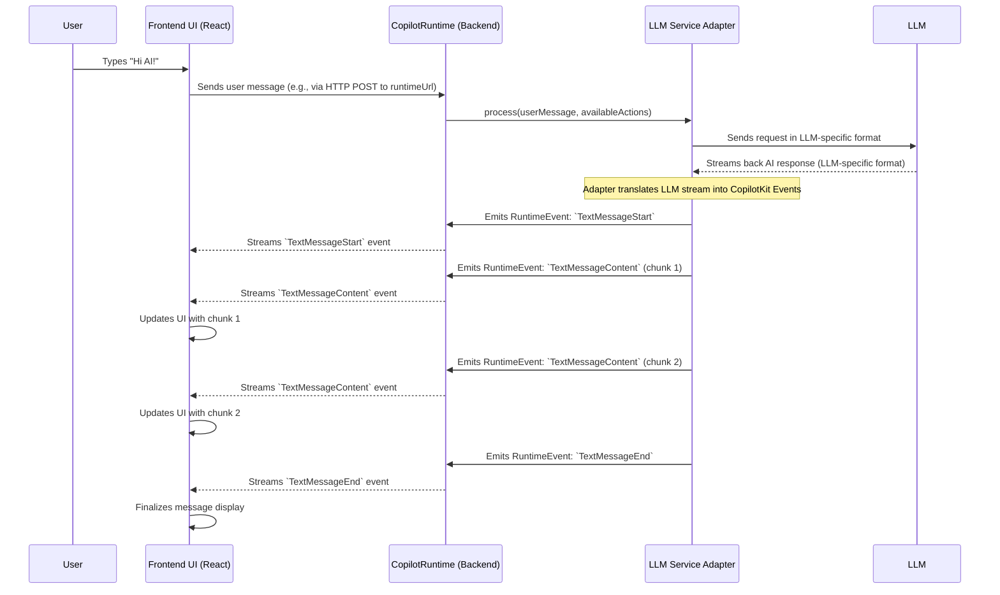

# Chapter 9: Runtime Events & Protocol

Welcome to the final chapter of our core tutorial! In [Chapter 8: Service Adapters (Backend)](08_service_adapters__backend__.md), we saw how CopilotKit can flexibly connect to different Large Language Models (LLMs) like OpenAI's GPT or Anthropic's Claude. This is crucial for choosing the "brain" of your AI.

But how do all the different pieces of CopilotKit – your frontend UI, your backend [CopilotRuntime (Backend Engine)](06_copilotruntime__backend_engine__.md), and the various [Service Adapters (Backend)](08_service_adapters__backend__.md) – actually *talk* to each other? Especially when information isn't just a single request and response, but a continuous flow, like an AI typing out a message word by word?

That's where **Runtime Events & Protocol** come in. This is the underlying "language" and set of rules they all agree to use.

**What's the Big Idea? A Common Language for AI Chatter**

Imagine you have people from different countries trying to collaborate on a project. They need a common language (like English) and some rules for conversation (like taking turns to speak) to understand each other.

Similarly, different parts of CopilotKit need a common way to exchange information.
*   Your **frontend** (e.g., a chat window) needs to tell the backend what the user said.
*   The **backend runtime engine** needs to tell the frontend that the AI is starting to "type" a response.
*   The **service adapter** (talking to the LLM) needs to send back chunks of the AI's generated text as they arrive.
*   The backend might need to tell the frontend that the AI wants to execute a specific [Actions (Frontend & Backend)](01_actions__frontend___backend__.md).

The **Runtime Events & Protocol** define this common language and the rules for how messages, action requests, state updates, and streaming content are structured and exchanged.

**What Problem Does It Solve? Enabling Complex, Real-time Communication**

Standard web communication often involves a simple request (e.g., "give me this webpage") and a single response. But AI interactions are more dynamic:
1.  **Streaming Content:** AI responses often arrive in pieces (tokens or words) to give the user a sense of real-time interaction, rather than waiting for the entire message.
2.  **Tool/Action Calls:** An LLM might decide mid-conversation that it needs to use a tool (an Action). This decision needs to be communicated.
3.  **Multi-step Processes:** [Agents (Backend Focus)](07_agents__backend_focus__.md) can involve many steps, and the UI might need updates on the agent's progress or internal state.

A simple request-response model isn't enough. We need a way to send multiple "updates" or "events" over a single connection. The Runtime Events & Protocol provide this structured way.

**Key Concepts: Events and Streaming**

*   **Events:** These are discrete pieces of information that represent something specific happening. Each event has a `type` (like "AI started typing a message") and some data related to that event (like the ID of the message being typed).
*   **Protocol:** This refers to the defined structure of these events (what fields they have, what the types mean) and how they are typically sent (e.g., as JSON objects).
*   **Streaming:** Instead of waiting for all information to be ready, events are often "streamed" – sent one by one as they occur. This is how you see an AI's message appear word by word.

**Core Runtime Event Types**

Let's look at some of the most common types of events that flow through the CopilotKit system. You'll find these defined in both the Python SDK (in `sdk-python/copilotkit/protocol.py`) and the TypeScript runtime (in `CopilotKit/packages/runtime/src/service-adapters/events.ts`).

Developers using CopilotKit typically don't need to *create* these events manually. They are generated by components like [Service Adapters (Backend)](08_service_adapters__backend__.md) and consumed by frontend hooks or UI components. Understanding them helps you see "under the hood."

Here are a few important ones:

1.  **`TextMessageStart`**:
    *   **Meaning:** Signals that the AI is about to start sending a new text message.
    *   **Key Data:** `messageId` (a unique ID for this message), `parentMessageId` (if it's a reply).
    *   **Example (conceptual JSON):**
        ```json
        { "type": "TextMessageStart", "messageId": "msg_abc123" }
        ```

2.  **`TextMessageContent`**:
    *   **Meaning:** Contains a piece (a "chunk") of the AI's text message.
    *   **Key Data:** `messageId` (to link it to the correct message), `content` (the actual text chunk).
    *   **Example:**
        ```json
        { "type": "TextMessageContent", "messageId": "msg_abc123", "content": "Hello " }
        ```
        (Another event might follow with `content: "world!"`)

3.  **`TextMessageEnd`**:
    *   **Meaning:** Signals that the AI has finished sending all chunks for this particular text message.
    *   **Key Data:** `messageId`.
    *   **Example:**
        ```json
        { "type": "TextMessageEnd", "messageId": "msg_abc123" }
        ```

4.  **`ActionExecutionStart`**:
    *   **Meaning:** The AI has decided to call an [Actions (Frontend & Backend)](01_actions__frontend___backend__.md) (a "tool").
    *   **Key Data:** `actionExecutionId` (unique ID for this call), `actionName` (name of the action to run), `parentMessageId`.
    *   **Example:**
        ```json
        {
          "type": "ActionExecutionStart",
          "actionExecutionId": "exec_xyz789",
          "actionName": "searchWeb"
        }
        ```

5.  **`ActionExecutionArgs`**:
    *   **Meaning:** Contains a chunk of the arguments (parameters) for the action being called. Arguments might also be streamed if they are large.
    *   **Key Data:** `actionExecutionId`, `args` (a string chunk of the JSON arguments).
    *   **Example:**
        ```json
        {
          "type": "ActionExecutionArgs",
          "actionExecutionId": "exec_xyz789",
          "args": "{\"query\":\"latest AI news\""
        }
        ```
        (Another event might follow with `args: "}"` to complete the JSON.)

6.  **`ActionExecutionEnd`**:
    *   **Meaning:** The AI has finished specifying all arguments for the action call.
    *   **Key Data:** `actionExecutionId`.
    *   **Example:**
        ```json
        { "type": "ActionExecutionEnd", "actionExecutionId": "exec_xyz789" }
        ```

7.  **`ActionExecutionResult`**:
    *   **Meaning:** This event carries the result *after* an action has been executed (either on the frontend or backend). This result is often sent back to the LLM so it can continue the conversation.
    *   **Key Data:** `actionName`, `actionExecutionId`, `result` (the output from the action).
    *   **Example:**
        ```json
        {
          "type": "ActionExecutionResult",
          "actionName": "searchWeb",
          "actionExecutionId": "exec_xyz789",
          "result": "[{\"title\": \"AI Breakthrough...\", ...}]"
        }
        ```

8.  **`AgentStateMessage`**:
    *   **Meaning:** Provides an update on the state of a backend [Agents (Backend Focus)](07_agents__backend_focus__.md).
    *   **Key Data:** `threadId`, `agentName`, `nodeName` (if using LangGraph), `runId`, `state` (current state data as JSON string), `running` (boolean).
    *   **Example:**
        ```json
        {
          "type": "AgentStateMessage",
          "threadId": "thread_123",
          "agentName": "researchAssistant",
          "nodeName": "webSearchNode",
          "runId": "run_456",
          "active": true,
          "role": "assistant", /* or agent specific role */
          "state": "{\"status\":\"Searching Google for 'CopilotKit'\"}",
          "running": true
        }
        ```

These are just some of the primary events. The full list (like `RunStarted`, `RunFinished`, `MetaEvent`) can be found in the SDK files mentioned.

**How It Works: The Flow of Events**

Let's trace a simplified scenario: a user asks a question in a chat UI, and the AI responds with streaming text.



1.  **User Input:** The user sends a message.
2.  **To Backend:** The frontend sends this to the [CopilotRuntime (Backend Engine)](06_copilotruntime__backend_engine__.md) (this initial request is usually a standard HTTP request).
3.  **LLM Interaction:** The backend runtime uses a [Service Adapters (Backend)](08_service_adapters__backend__.md) to talk to an LLM.
4.  **Adapter Translation (LLM to Events):** As the LLM streams its response back to the Service Adapter, the adapter's job is to translate this LLM-specific stream into a series of standard CopilotKit Runtime Events. For example, it would generate `TextMessageStart`, then multiple `TextMessageContent` events for each piece of text, and finally `TextMessageEnd`.
5.  **Streaming to Frontend:** The backend runtime takes these events and streams them back to the frontend.
    *   For the JavaScript/TypeScript stack, this streaming is often handled via the GraphQL layer. The main JS runtime uses GraphQL, and a resolver function (like in `CopilotKit/packages/runtime/src/graphql/resolvers/copilot.resolver.ts`) uses a mechanism called `Repeater` to send these events as they arrive. This could be over a WebSocket, Server-Sent Events (SSE), or chunked HTTP responses, depending on the GraphQL client/server setup.
    *   The Python backend can also stream these events, typically as newline-delimited JSON strings over an HTTP connection.
6.  **Frontend Updates UI:** Frontend components (like `CopilotSidebar` from [UI Components (`@copilotkit/react-ui`)](04_ui_components____copilotkit_react_ui___.md) or custom ones using `useCopilotChat` from [Frontend Hooks (`@copilotkit/react-core`)](03_frontend_hooks____copilotkit_react_core___.md)) listen for these incoming events. When a `TextMessageContent` event arrives, the UI appends the new text to the current message bubble, making it look like the AI is typing.

**A Peek at the Definitions**

Let's see how these events are defined in code. You usually don't write this code, but seeing it helps understand the structure.

**Python SDK (`sdk-python/copilotkit/protocol.py`)**

The Python SDK defines event types using an `Enum` and structures using `TypedDict`.

```python
# From sdk-python/copilotkit/protocol.py

class RuntimeEventTypes(Enum):
    TEXT_MESSAGE_START = "TextMessageStart"
    TEXT_MESSAGE_CONTENT = "TextMessageContent"
    # ... other event types ...

class TextMessageContent(TypedDict):
    type: Literal[RuntimeEventTypes.TEXT_MESSAGE_CONTENT] # The event type
    messageId: str                                      # Links to a specific message
    content: str                                        # The actual text
```
This snippet shows the `RuntimeEventTypes` enum and the `TypedDict` for `TextMessageContent`. Other events like `ActionExecutionStart` are defined similarly. The SDK also provides utility functions (like `text_message_content(...)`) to create these event dictionaries easily. These dictionaries are then typically converted to JSON strings (often one event per line) for streaming.

**TypeScript Runtime (`CopilotKit/packages/runtime/src/service-adapters/events.ts`)**

The TypeScript runtime uses string enums and type aliases.

```typescript
// From CopilotKit/packages/runtime/src/service-adapters/events.ts

export enum RuntimeEventTypes {
  TextMessageStart = "TextMessageStart",
  TextMessageContent = "TextMessageContent",
  // ... other event types ...
}

export type RuntimeEvent =
  // ...
  | {
      type: RuntimeEventTypes.TextMessageContent; // The event type
      messageId: string;                          // Links to a specific message
      content: string;                            // The actual text
    }
  // ... other event type definitions ...
```
Here, `RuntimeEventTypes` is an enum, and `RuntimeEvent` is a union type that includes all possible event structures. The `RuntimeEventSource` class in this file has methods like `sendTextMessageContent()` that allow different parts of the backend (especially [Service Adapters (Backend)](08_service_adapters__backend__.md)) to easily create and emit these events onto a stream.

**The GraphQL Connection (for JavaScript/TypeScript Frontend)**

For applications using the JavaScript/TypeScript frontend libraries (`@copilotkit/react-core`, `@copilotkit/react-ui`), the primary way the frontend receives these streamed events from the backend JS runtime is through GraphQL.

*   **GraphQL Types:** The backend defines GraphQL types that mirror these runtime events (see `CopilotKit/packages/runtime/src/graphql/types/copilot-response.type.ts`). For example, `TextMessageOutput` in GraphQL corresponds to the `TextMessageStart/Content/End` runtime events.
*   **GraphQL Resolver:** A GraphQL resolver function (in `CopilotKit/packages/runtime/src/graphql/resolvers/copilot.resolver.ts`) is responsible for handling the AI request. When it gets events from the `RuntimeEventSource`, it pushes them into a `Repeater` object.
*   **Streaming via Repeater:** The `Repeater` allows GraphQL to stream these messages/events to the client as they become available. The frontend GraphQL client receives these events and updates the UI.

This GraphQL layer provides a well-defined API contract for the JavaScript frontend to consume the stream of runtime events.

**Conclusion**

The Runtime Events & Protocol are the lifeblood of communication within CopilotKit. They define a common "language" that allows your frontend, backend, and various AI services to exchange information in a structured way, enabling complex, real-time interactions like streaming text, tool usage by the AI, and agent state updates.

Key Takeaways:
*   CopilotKit uses a defined set of **Runtime Events** (like `TextMessageStart`, `ActionExecutionStart`) as its internal communication language.
*   This **Protocol** allows different parts of the system (frontend, backend, adapters) to understand each other.
*   **Streaming** of these events enables real-time features like live message updates.
*   Service Adapters translate LLM-specific outputs into these standard events.
*   Frontend libraries consume these events to update the UI. For JavaScript frontends, this is often facilitated by a GraphQL layer in the backend JS runtime.

While you, as a developer, might not often construct these events by hand, understanding that they exist and what they represent helps demystify how CopilotKit achieves its dynamic AI capabilities. This knowledge can be particularly useful if you ever need to debug interactions or extend CopilotKit in advanced ways.

This concludes our core journey through CopilotKit! You've learned about actions, providers, hooks, UI components, the textarea, the backend runtime, agents, service adapters, and now, the events that tie them all together. You're well-equipped to start building amazing AI-powered applications!

---

Generated by [AI Codebase Knowledge Builder](https://github.com/The-Pocket/Tutorial-Codebase-Knowledge)