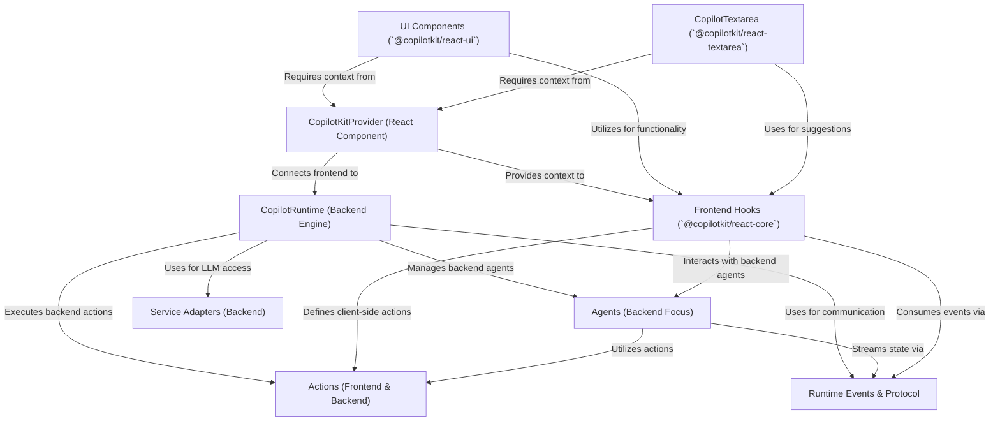

# Tutorial: CopilotKit

CopilotKit is a **framework** for building *AI-powered assistants* (copilots) directly into your web applications.
It provides tools for both the *frontend* user interface (like **CopilotKitProvider**, **UI Components**, **CopilotTextarea**, and **Frontend Hooks**) and the *backend* logic (such as **CopilotRuntime** and **Service Adapters** for connecting to AI models).
Developers can define specific **Actions** (tasks the AI can perform) and more complex, stateful **Agents** (specialized AI helpers).
The entire system uses a defined **Runtime Events & Protocol** to allow all these parts to communicate seamlessly, enabling the AI to understand application context and execute tasks effectively.

**Source Repository:** [https://github.com/CopilotKit/CopilotKit.git](https://github.com/CopilotKit/CopilotKit.git)

## Chapters

1. [Actions (Frontend & Backend)
](01_actions__frontend___backend__.md)
2. [CopilotKitProvider (React Component)
](02_copilotkitprovider__react_component__.md)
3. [Frontend Hooks (`@copilotkit/react-core`)
](03_frontend_hooks____copilotkit_react_core___.md)
4. [UI Components (`@copilotkit/react-ui`)
](04_ui_components____copilotkit_react_ui___.md)
5. [CopilotTextarea (`@copilotkit/react-textarea`)
](05_copilottextarea____copilotkit_react_textarea___.md)
6. [CopilotRuntime (Backend Engine)
](06_copilotruntime__backend_engine__.md)
7. [Agents (Backend Focus)
](07_agents__backend_focus__.md)
8. [Service Adapters (Backend)
](08_service_adapters__backend__.md)
9. [Runtime Events & Protocol
](09_runtime_events___protocol_.md)

---

Generated by [AI Codebase Knowledge Builder](https://github.com/The-Pocket/Tutorial-Codebase-Knowledge)