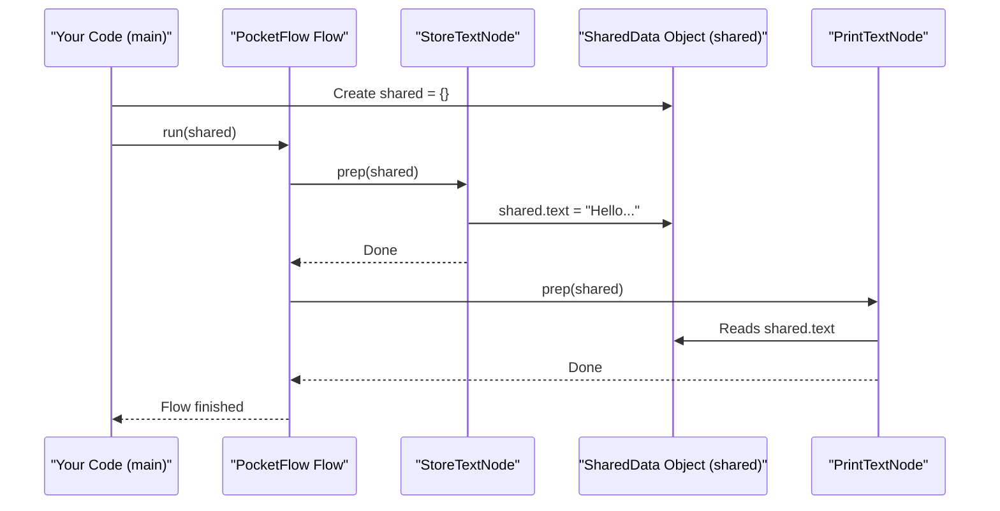

# Chapter 1: SharedData (Concept)

Welcome to the PocketFlow-Typescript tutorial! We're excited to help you learn how to build powerful and flexible workflows.

Imagine you're working on a team project, maybe building something with LEGOs. One person builds the base, another adds the walls, and a third puts on the roof. How do they coordinate? They all work on the *same* LEGO creation, right? The base builder leaves the creation for the wall builder, who then modifies it and leaves it for the roof builder.

In PocketFlow, **`SharedData`** is like that shared LEGO creation or a shared Google Doc for your project. It's the common place where different parts of your workflow, called [Nodes](02_node.md), can read information from and write their results to.

## What Problem Does SharedData Solve?

Let's consider a simple task:
1.  **Step 1:** Get a piece of text (like "Hello, PocketFlow!").
2.  **Step 2:** Print that piece of text to the screen.

How does Step 2 know what text Step 1 prepared? They could be two separate workers. They need a common place to pass this information.

Without a shared space, Step 1 would have to somehow directly hand the text to Step 2. This can get complicated if you have many steps, or if Step 1 doesn't even know which specific step comes next.

`SharedData` solves this by providing a central "bulletin board" or "workspace".
*   Step 1 writes the text to this `SharedData`.
*   Step 2 reads the text from the *same* `SharedData`.

This way, your steps (which we'll soon learn are called [Nodes](02_node.md)) don't need to be tightly linked for every piece of information. They just need to know about the shared workspace.

## SharedData: The Central Workspace

In PocketFlow, `SharedData` is essentially a JavaScript object that all [Nodes](02_node.md) in a [Flow](03_flow.md) (a sequence of [Nodes](02_node.md)) can access.

*   **Reading:** A [Node](02_node.md) can look into `SharedData` to find information it needs for its task.
*   **Writing:** After a [Node](02_node.md) completes its task, it can add new information or update existing information in `SharedData`.

Think of it like this:
*   Your `SharedData` object is a container (e.g., `let mySharedSpace = {};`).
*   The first [Node](02_node.md) might add a property: `mySharedSpace.message = "Hello!";`.
*   The next [Node](02_node.md) can then read `mySharedSpace.message`.

### Defining the "Shape" of SharedData with `S`

When we define our [Nodes](02_node.md) and [Flows](03_flow.md) in PocketFlow, we often use a generic type placeholder, usually `S`. This `S` represents the **structure** or **shape** of our `SharedData` object for that particular workflow.

You, the developer, decide what goes into `SharedData`. For our "get text and print text" example, our `SharedData` might need a place to store that text. We could define its shape like this:

```typescript
// This defines what our SharedData can hold
type MyTextData = {
  message?: string; // The '?' means 'message' is optional
};
```
Here, `MyTextData` is the specific "shape" (the `S`) for our workflow. It says our `SharedData` can have a property called `message` which will be a string.

## Using SharedData: A Simple Example

Let's look at a simplified version of the "Hello World" example from PocketFlow's cookbook.

**1. Define the SharedData Structure:**
First, we decide what our shared space will look like. For this example, it just needs to hold some text.

```typescript
// Define a shared storage type
type SharedStorage = { text?: string };
```
This `SharedStorage` type tells TypeScript that our shared data object might have a property called `text`, and if it does, `text` will be a string.

**2. Create a Node to Store Text:**
This [Node](02_node.md) will take some text and put it into our `SharedData`.

```typescript
// Node that stores text into SharedData
class StoreTextNode extends Node<SharedStorage> { // Notice <SharedStorage>
  constructor(private textToStore: string) {
    super();
  }
  
  async prep(shared: SharedStorage): Promise<void> {
    // Write to the shared space
    shared.text = this.textToStore;
  }
}
```
*   `extends Node<SharedStorage>`: This tells PocketFlow that `StoreTextNode` will work with `SharedData` that looks like `SharedStorage`.
*   `async prep(shared: SharedStorage)`: The `prep` method is one of the places a [Node](02_node.md) can interact with `SharedData`. Notice the `shared` parameter is of type `SharedStorage`.
*   `shared.text = this.textToStore;`: This line is where the magic happens! It takes the text given to `StoreTextNode` and stores it in the `text` property of the `shared` object.

**3. Create a Node to Print Text:**
This [Node](02_node.md) will look for text in `SharedData` and print it.

```typescript
// Node that prints text from SharedData
class PrintTextNode extends Node<SharedStorage> { // Also uses <SharedStorage>
  async prep(shared: SharedStorage): Promise<void> {
    // Read from the shared space
    console.log(shared.text || "No text found");
  }
}
```
*   It also uses `Node<SharedStorage>` because it expects the same `SharedData` structure.
*   `console.log(shared.text || "No text found");`: This line reads the `text` property from the `shared` object. If `shared.text` doesn't exist, it prints "No text found".

**4. Running the Workflow:**
Here's how you'd use these [Nodes](02_node.md) with a [Flow](03_flow.md) and `SharedData`:

```typescript
async function main() {
  // 1. Create an empty SharedData object
  const shared: SharedStorage = {};
  
  // 2. Create instances of our nodes
  const storeNode = new StoreTextNode("Hello from SharedData!");
  const printNode = new PrintTextNode();
  
  // 3. Define the order: storeNode runs, then printNode
  storeNode.next(printNode);
  
  // 4. Create a Flow starting with storeNode
  const flow = new Flow(storeNode);
  
  // 5. Run the flow, passing in our shared object
  await flow.run(shared);
  
  // What's in shared now?
  console.log("Final SharedData:", shared);
}

main();
```

**Expected Output:**
When you run this:
1.  The console will first print: `Hello from SharedData!` (from `PrintTextNode`)
2.  Then it will print: `Final SharedData: { text: 'Hello from SharedData!' }`

The `shared` object, which started empty (`{}`), was modified by `StoreTextNode` and then read by `PrintTextNode`. Both [Nodes](02_node.md) interacted through this common `SharedData`!

## How It Works Under the Hood (Conceptually)

When a [Flow](03_flow.md) runs, it passes the *same* `SharedData` object from one [Node](02_node.md) to the next.

Here's a simplified sequence:



1.  **Initialization**: Your code creates an initial `SharedData` object (e.g., `const shared: SharedStorage = {};`).
2.  **Flow Execution**: You tell a [Flow](03_flow.md) to run, passing this `shared` object to it.
3.  **Node Interaction**:
    *   The [Flow](03_flow.md) calls the first [Node](02_node.md) (e.g., `StoreTextNode`) and gives it the `shared` object.
    *   `StoreTextNode` modifies the `shared` object (e.g., `shared.text = "Hello..."`).
    *   The [Flow](03_flow.md) then calls the next [Node](02_node.md) (e.g., `PrintTextNode`) and gives it the *exact same, now modified*, `shared` object.
    *   `PrintTextNode` reads from the `shared` object (e.g., reads `shared.text`).
4.  **Continuation**: This process continues for all [Nodes](02_node.md) in the [Flow](03_flow.md). Each [Node](02_node.md) receives the `SharedData` object, potentially reads from it, and potentially writes to it, before it's passed to the next [Node](02_node.md).

### The Generic `S` in PocketFlow's Core

In PocketFlow's source code (like in `src/index.ts`), you'll see base classes like `BaseNode` defined with a generic type `S`:

```typescript
// Simplified from src/index.ts
class BaseNode<S = unknown, ...> {
  // ...
  async prep(shared: S): Promise<unknown> {
    // 'shared' is your SharedData object.
    // Its type is 'S', which you define.
    return undefined; 
  }

  async post(shared: S, /*...other params...*/): Promise<Action | undefined> {
    // 'shared' is also available here.
    return undefined;
  }
  // ...
}
```
When you create your own [Node](02_node.md) by extending `Node` (which itself extends `BaseNode`), you specify what `S` will be for your [Node](02_node.md):

```typescript
type MyCustomData = { count?: number; name?: string; };

class MyCustomNode extends Node<MyCustomData> { // Here, S becomes MyCustomData
  async prep(shared: MyCustomData): Promise<void> {
    // Now, 'shared' is known to be of type MyCustomData
    if (shared.count === undefined) {
      shared.count = 0;
    }
    shared.count++;
    shared.name = "Processed by MyCustomNode";
  }
}
```
This use of generics (`<S>`) allows PocketFlow to be flexible. You define the structure of `SharedData` that makes sense for your specific workflow, and TypeScript helps ensure you're using it correctly.

### Examples of SharedData Structures

`SharedData` can be simple or complex, depending on your needs.

From `cookbook/pocketflow-batch-node/src/types.ts`:
```typescript
// For a workflow analyzing sales records
export interface SharedData {
  filePath?: string; // Path to a sales data file
  batchResults?: { totalSales: number; /* ... */ }[]; // Results from processing batches
  finalStats?: { totalSales: number; /* ... */ }; // Final aggregated stats
}
```

From `cookbook/pocketflow-batch-flow/src/type.ts`:
```typescript
// For an image processing workflow
export interface SharedData {
  imageName?: string;
  imageBuffer?: Buffer; // Raw image data
  processedImage?: Buffer; // Image data after processing
  filterType?: 'grayscale' | 'blur' | 'sepia';
}
```
These examples show that `SharedData` is just a regular TypeScript `interface` or `type` that you design to hold the information your workflow needs to share between its steps.

## Conclusion

You've now learned about `SharedData`, a core concept in PocketFlow!

*   **It's a common workspace:** Like a shared Google Doc, it allows different parts of your workflow ([Nodes](02_node.md)) to communicate.
*   **Flexible Structure:** You define the "shape" of your `SharedData` (using a type or interface for `S`) to fit your workflow's needs.
*   **Decoupled Nodes:** [Nodes](02_node.md) read from and write to `SharedData` without needing direct, hardcoded links for every piece of data. This makes your workflows more modular and easier to change.

`SharedData` is the backbone for communication. The actual "workers" that perform tasks and interact with this `SharedData` are called [Nodes](02_node.md).

Ready to learn about the individual workers? Let's dive into the next chapter: [Node](02_node.md).

---

Generated by [AI Codebase Knowledge Builder](https://github.com/The-Pocket/Tutorial-Codebase-Knowledge)