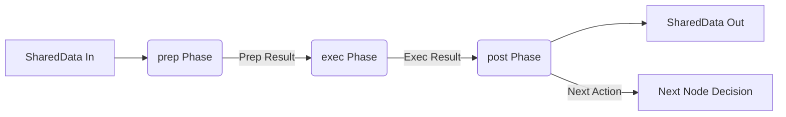
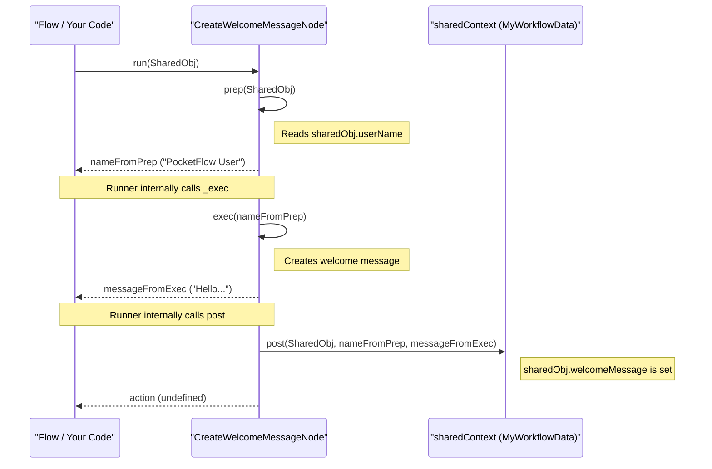

# Chapter 2: Node - The Worker Bee of PocketFlow

In [Chapter 1: SharedData (Concept)](01_shareddata__concept_.md), we learned about `SharedData`, the common workspace where different parts of our workflow can read from and write to. It's like the shared blueprint or the central table where everyone on a project team works.

But who are these "workers" that actually do things with the `SharedData`? That's where **Nodes** come in!

## What's a Node, and Why Do We Need It?

Imagine a car factory. It's not just one giant machine that builds a car from scratch. Instead, it's an assembly line with many specialized stations: one station attaches the wheels, another installs the engine, another paints the car, and so on. Each station has one specific job.

In PocketFlow, a **`Node`** is like one of those specialized stations on an assembly line. It's the fundamental worker in your workflow.

**The Problem:** If you have a complex task, like "process a customer order," doing everything in one giant block of code becomes messy, hard to understand, and difficult to change.
**The Solution:** Break down the complex task into smaller, manageable steps. Each step becomes a `Node`.
*   Node 1: Validate customer details.
*   Node 2: Check product inventory.
*   Node 3: Process payment.
*   Node 4: Send confirmation email.

Each `Node` performs a single, well-defined task. This makes your workflow:
*   **Modular:** Easy to swap out or update a specific part (Node).
*   **Readable:** Easier to understand the overall process by looking at the sequence of Nodes.
*   **Reusable:** A "Send Email Node" could be used in many different workflows.

## The Three Phases of a Node: Prep, Exec, Post

Every `Node` in PocketFlow operates in a cycle of three distinct phases. Think of it as a mini-workflow within the Node itself:

1.  **`prep` (Prepare):**
    *   **What it does:** Gathers and prepares all the necessary ingredients (data) the Node needs for its main job.
    *   **Analogy:** A chef gathering ingredients from the pantry and chopping vegetables before starting to cook.
    *   **In PocketFlow:** This phase often involves reading data from [SharedData](01_shareddata__concept_.md). It might also use parameters that were configured when the Node was set up. The output of `prep` is directly passed to the `exec` phase.

2.  **`exec` (Execute):**
    *   **What it does:** Performs the core task of the Node. This is where the actual "work" happens.
    *   **Analogy:** The chef actually cooking the dish using the prepared ingredients.
    *   **In PocketFlow:** This phase takes the output from `prep` as its input and performs the main logic (e.g., transforming data, calling an external service, performing a calculation). The output of `exec` is then passed to the `post` phase.

3.  **`post` (Post-Process):**
    *   **What it does:** Handles the result of the `exec` phase. This often involves updating [SharedData](01_shareddata__concept_.md) with the results of the Node's work. It can also decide what should happen next in the overall workflow.
    *   **Analogy:** The chef plating the dish and then telling the waiter which table it's for.
    *   **In PocketFlow:** This phase receives the outputs from both `prep` and `exec`. It can write results to [SharedData](01_shareddata__concept_.md). Crucially, it can return an "action string" (like "success" or "error_occurred") that a [Flow](03_flow.md) (which we'll cover next) can use to decide which [Node](02_node.md) to run next.

Let's visualize this:



## Building Our First Real Node: `CreateWelcomeMessageNode`

Let's create a Node that generates a personalized welcome message.
It will:
1.  Read a user's name from [SharedData](01_shareddata__concept_.md) (if it exists).
2.  Create a welcome message.
3.  Store this message back into [SharedData](01_shareddata__concept_.md).

First, let's define the structure of our `SharedData` for this example:

```typescript
// Define the shape of our SharedData
type MyWorkflowData = {
  userName?: string;         // Input: The user's name
  welcomeMessage?: string;   // Output: The generated message
};
```
This `MyWorkflowData` type says our shared space might contain a `userName` and a `welcomeMessage`.

Now, let's build the `CreateWelcomeMessageNode`:

```typescript
import { Node } from 'pocketflow'; // Import Node from PocketFlow

// Our Node will use MyWorkflowData as its SharedData type
class CreateWelcomeMessageNode extends Node<MyWorkflowData> {
  // Phase 1: prep - Get the user's name
  async prep(shared: MyWorkflowData): Promise<string> {
    const name = shared.userName || "Guest"; // Use 'Guest' if no name
    console.log(`[WelcomeNode-prep] Using name: ${name}`);
    return name; // Pass the name to the 'exec' phase
  }

  // Phase 2: exec - Create the welcome message
  async exec(nameFromPrep: string): Promise<string> {
    const message = `Hello, ${nameFromPrep}! Welcome to PocketFlow.`;
    console.log(`[WelcomeNode-exec] Created message: "${message}"`);
    return message; // Pass the message to the 'post' phase
  }

  // Phase 3: post - Store the message in SharedData
  async post(
    shared: MyWorkflowData,
    _nameFromPrep: string, // We don't need nameFromPrep here again
    messageFromExec: string
  ): Promise<string | undefined> { // Returns an optional 'action'
    shared.welcomeMessage = messageFromExec;
    console.log(`[WelcomeNode-post] Stored message in SharedData.`);
    // 'undefined' means proceed to the 'default' next node in a Flow
    return undefined; 
  }
}
```

Let's break this down:
*   `class CreateWelcomeMessageNode extends Node<MyWorkflowData>`: We declare a new class that inherits from PocketFlow's `Node` class. The `<MyWorkflowData>` part tells this Node it will be working with `SharedData` that has the shape we defined.
*   `async prep(shared: MyWorkflowData): Promise<string>`:
    *   It receives the `shared` object (our `MyWorkflowData`).
    *   It tries to get `shared.userName`. If not found, it defaults to "Guest".
    *   It `return`s the `name`, which will be the input for the `exec` phase.
*   `async exec(nameFromPrep: string): Promise<string>`:
    *   It receives `nameFromPrep` (the result from the `prep` phase).
    *   It constructs the `message`.
    *   It `return`s the `message`, which will be passed to the `post` phase.
*   `async post(shared: MyWorkflowData, _nameFromPrep: string, messageFromExec: string): Promise<string | undefined>`:
    *   It receives the `shared` object again, the result from `prep` (which we prefix with `_` as we don't use it here), and `messageFromExec` (the result from `exec`).
    *   It updates `shared.welcomeMessage` with the `messageFromExec`.
    *   It `return`s `undefined`. In a [Flow](03_flow.md), this tells the flow to proceed to the next default linked Node. It *could* return a string like `"user_is_admin"` to signal a specific path to take next.

## Using Our Node (A Sneak Peek)

To actually run this Node, we'd typically use it within a [Flow](03_flow.md) (which we'll learn about in the next chapter). But for now, let's see how to call it directly and observe its behavior. We'll also create a simple `DisplayMessageNode` to print the result.

```typescript
// A simple Node to display the welcome message
class DisplayMessageNode extends Node<MyWorkflowData> {
  async exec(shared: MyWorkflowData): Promise<void> { // Simplified: using exec directly
    // For this simple node, we combine prep-like logic directly in exec
    const message = shared.welcomeMessage || "No message to display.";
    console.log("\n--- Message Display ---");
    console.log(message);
    console.log("-----------------------");
  }
}

// Let's simulate running these Nodes
async function main() {
  // 1. Initialize our SharedData
  const sharedContext: MyWorkflowData = { userName: "PocketFlow User" };
  console.log("Initial SharedData:", sharedContext);

  // 2. Create instances of our Nodes
  const welcomeNode = new CreateWelcomeMessageNode();
  const displayNode = new DisplayMessageNode();

  // 3. Run the welcomeNode
  // The .run() method on a Node executes its prep, exec, and post phases.
  console.log("\n--- Running CreateWelcomeMessageNode ---");
  await welcomeNode.run(sharedContext); 
  console.log("SharedData after welcomeNode:", sharedContext);

  // 4. Run the displayNode
  console.log("\n--- Running DisplayMessageNode ---");
  // Note: DisplayMessageNode's exec takes SharedData directly for simplicity here.
  // In a full Flow, `prep` would usually pass specific data to `exec`.
  await displayNode.exec(sharedContext); // Calling exec directly for simplicity
                                         // Normally, displayNode.run(sharedContext)
  
  console.log("\nFinal SharedData:", sharedContext);
}

main();
```

**Expected Output:**

```
Initial SharedData: { userName: 'PocketFlow User' }

--- Running CreateWelcomeMessageNode ---
[WelcomeNode-prep] Using name: PocketFlow User
[WelcomeNode-exec] Created message: "Hello, PocketFlow User! Welcome to PocketFlow."
[WelcomeNode-post] Stored message in SharedData.
SharedData after welcomeNode: {
  userName: 'PocketFlow User',
  welcomeMessage: 'Hello, PocketFlow User! Welcome to PocketFlow.'
}

--- Running DisplayMessageNode ---

--- Message Display ---
Hello, PocketFlow User! Welcome to PocketFlow.
-----------------------

Final SharedData: {
  userName: 'PocketFlow User',
  welcomeMessage: 'Hello, PocketFlow User! Welcome to PocketFlow.'
}
```
You can see the logs from each phase of `CreateWelcomeMessageNode`, how it modified `sharedContext`, and how `DisplayMessageNode` then used that modified data!

## Under the Hood: The Node Lifecycle

When a `Node` is run (either directly via its `run()` method, or more commonly, by a [Flow](03_flow.md)), PocketFlow ensures the `prep`, `exec`, and `post` methods are called in order.

Here's a simplified sequence:



The `BaseNode` class (which `Node` extends) in PocketFlow has an internal `_run` method that orchestrates this:

```typescript
// Simplified from src/index.ts - BaseNode
abstract class BaseNode<S = unknown, ...> {
  // ... other methods ...

  async _run(shared: S): Promise<Action | undefined> {
    // 1. Call prep and wait for its result
    const prepResult = await this.prep(shared);
    
    // 2. Call _exec (which internally calls your exec) with prep's result
    const execResult = await this._exec(prepResult); 
    
    // 3. Call post with shared data, prep result, and exec result
    return await this.post(shared, prepResult, execResult);
  }
  
  // Your custom Node methods that you override:
  async prep(shared: S): Promise<unknown> { /* Your logic */ return undefined; }
  async exec(prepRes: unknown): Promise<unknown> { /* Your logic */ return undefined; }
  async post(shared: S, prepRes: unknown, execRes: unknown): Promise<Action | undefined> { /* Your logic */ return undefined; }

  // The _exec method in BaseNode simply calls exec.
  // The Node class (which you usually extend) overrides _exec to add features
  // like retries.
  protected async _exec(prepRes: unknown): Promise<unknown> {
    return await this.exec(prepRes);
  }

  // ... other methods ...
}
```
When you create `class MyNode extends Node<S>`:
*   You provide implementations for `prep`, `exec`, and `post`.
*   The `Node` class itself (from `pocketflow`) extends `BaseNode`. It overrides the `_exec` method (shown above in `BaseNode` for clarity) to add useful features like automatic retries if `exec` fails. For now, just know that your `exec` method is the one that gets called for the core logic.

This structured lifecycle ensures that each Node does its job in a predictable and organized way.

## Why Are These Phases Important?

*   **Separation of Concerns:**
    *   `prep` is for getting ready (data fetching, validation).
    *   `exec` is for the main job (core logic, transformation).
    *   `post` is for cleanup and decision-making (saving results, determining next steps).
    This makes your Node code cleaner and easier to reason about.
*   **Flexibility for PocketFlow:**
    *   PocketFlow can optimize or add features around these phases. For example, the data from `prep` can be cached, or different types of Nodes (like [BatchNode](04_batchnode.md)) can implement `exec` differently to process multiple items.
*   **Clear Data Flow:** You always know that `exec` gets its input from `prep`, and `post` gets results from `exec`.

## Conclusion

You've now met the **`Node`**, the diligent worker of PocketFlow!
*   Nodes break down complex tasks into **simple, single-responsibility units**.
*   Each Node follows a **`prep -> exec -> post` lifecycle** to perform its task.
*   `prep` prepares data (often from [SharedData](01_shareddata__concept_.md)).
*   `exec` does the main work.
*   `post` handles results (often updating [SharedData](01_shareddata__concept_.md)) and can decide what happens next.

Nodes are the building blocks. But how do you connect them together to create a complete assembly line or workflow? That's where our next concept comes in!

Get ready to orchestrate your Nodes in [Chapter 3: Flow](03_flow.md).

---

Generated by [AI Codebase Knowledge Builder](https://github.com/The-Pocket/Tutorial-Codebase-Knowledge)