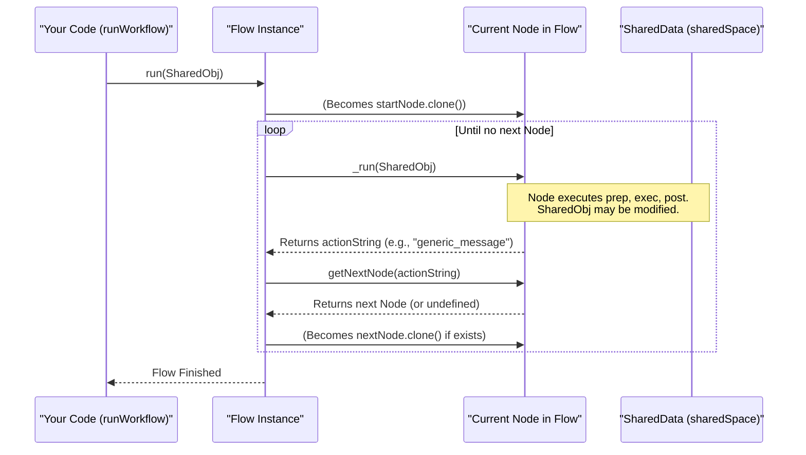

# Chapter 3: Flow - The Conductor of Your Workflow

In [Chapter 2: Node - The Worker Bee of PocketFlow](02_node.md), we learned about `Node`s, the individual workers that perform specific tasks. Each `Node` is like a specialized station on an assembly line, doing one part of a bigger job.

But how do you connect these stations? How do you ensure that `Node` A runs, then `Node` B, and perhaps `Node` C if a certain condition is met? This is where the **`Flow`** comes in.

## What is a Flow? The Orchestra Conductor

Imagine an orchestra. You have many musicians (the `Node`s), each playing their instrument and their part. But who tells them when to start, when to play louder, and which section should play next? That's the conductor!

In PocketFlow, a **`Flow`** acts like that conductor.
*   You define the **starting `Node`** (the first musician to play).
*   The `Flow` manages the **execution sequence**, passing control from one `Node` to the next.
*   This transition is often based on the **outcomes of a `Node`'s `post` method** (like one section of the orchestra finishing their part and cueing the next).

A `Flow` is essentially a blueprint for a multi-step process. It ensures tasks are performed in the intended order to achieve a larger objective, such as generating a report, processing a user request, or, as we'll see, creating and displaying a personalized message.

**Problem:** You have several `Node`s: one to get data, one to process it, and one to display it. How do you make them run one after another, passing information seamlessly?
**Solution:** You define a `Flow` that orchestrates these `Node`s.

## Our First Multi-Step Workflow: A Greeting Service

Let's build a simple workflow:
1.  **Store a message**: A `Node` will prepare an initial message.
2.  **Print and analyze the message**: Another `Node` will print this message and decide if it's a special kind of message.
3.  **Special follow-up**: If it's a special message, an additional `Node` will run.
4.  **Generic follow-up**: Otherwise, a different `Node` will run.

All these `Node`s will use the same [SharedData (Concept)](01_shareddata__concept_.md) to communicate.

**1. Define our SharedData structure:**
This is the common information pool for our `Node`s.

```typescript
// SharedData for our greeting workflow
type GreetingData = {
  message?: string;      // The message being processed
  status?: string;       // A status set by a final node
};
```
Our `GreetingData` can hold a `message` and a `status`.

**2. Create the Nodes:**
We'll need a few simple [Nodes](02_node.md).

*   **`SetMessageNode`**: Sets an initial message in `SharedData`.

```typescript
import { Node } from 'pocketflow'; // Assuming pocketflow is installed

class SetMessageNode extends Node<GreetingData> {
  constructor(private initialMsg: string) { super(); }

  async prep(shared: GreetingData): Promise<void> {
    shared.message = this.initialMsg;
    console.log(`[SetMessageNode] Message set to: "${shared.message}"`);
  }
}
```
This `Node` takes an initial message in its constructor and stores it in `shared.message` during its `prep` phase.

*   **`PrintAndAnalyzeNode`**: Prints the message and returns an "action" based on its content.

```typescript
class PrintAndAnalyzeNode extends Node<GreetingData> {
  async prep(shared: GreetingData): Promise<void> {
    console.log(`[PrintNode] Received: "${shared.message || 'No message!'}"`);
  }

  async post(shared: GreetingData): Promise<string> { // Returns an action string
    if (shared.message && shared.message.includes("World")) {
      console.log(`[PrintNode-post] "World" found! Action: "world_detected"`);
      return "world_detected";
    }
    console.log(`[PrintNode-post] "World" not found. Action: "generic_message"`);
    return "generic_message";
  }
}
```
-   Its `prep` phase just logs the message.
-   Its `post` phase is key: it checks if "World" is in the message.
    -   If yes, it returns the action string `"world_detected"`.
    -   If no, it returns `"generic_message"`. This action string will tell the `Flow` which `Node` to run next.

*   **`WorldActionNode`**: Runs if "World" was detected.

```typescript
class WorldActionNode extends Node<GreetingData> {
  async prep(shared: GreetingData): Promise<void> {
    shared.status = "Handled World Greeting";
    console.log(`[WorldActionNode] Special action for "World" message.`);
  }
}
```

*   **`GenericActionNode`**: Runs for other messages.

```typescript
class GenericActionNode extends Node<GreetingData> {
  async prep(shared: GreetingData): Promise<void> {
    shared.status = "Handled Generic Greeting";
    console.log(`[GenericActionNode] Generic action taken.`);
  }
}
```

**3. Instantiate and Link the Nodes:**
Now we create instances of our `Node`s and define the paths between them.

```typescript
const setMessage = new SetMessageNode("Hello PocketFlow User!");
const printAndAnalyze = new PrintAndAnalyzeNode();
const worldAction = new WorldActionNode();
const genericAction = new GenericActionNode();

// Define the sequence: setMessage is followed by printAndAnalyze by default
setMessage.next(printAndAnalyze);

// Define conditional paths from printAndAnalyze:
printAndAnalyze.on("world_detected", worldAction);
printAndAnalyze.on("generic_message", genericAction);
```
*   `setMessage.next(printAndAnalyze);`
    *   The `.next()` method is a shortcut to define the *default* next `Node`. If `setMessage`'s `post` method returned `undefined` (or any action not specifically handled by `.on()`), `printAndAnalyze` would run.
*   `printAndAnalyze.on("world_detected", worldAction);`
    *   This tells the `Flow`: if `printAndAnalyze`'s `post` method returns the action string `"world_detected"`, then `worldAction` should be the next `Node` to run.
*   `printAndAnalyze.on("generic_message", genericAction);`
    *   Similarly, if the action is `"generic_message"`, then `genericAction` runs.

**4. Create and Run the Flow:**
With our `Node`s defined and linked, we create a `Flow` instance, telling it which `Node` to start with.

```typescript
import { Flow } from 'pocketflow'; // Import Flow

// Create a Flow, starting with setMessageNode
const myGreetingFlow = new Flow<GreetingData>(setMessage);

// Prepare our initial SharedData object
const sharedSpace: GreetingData = {};

// Run the flow!
async function runWorkflow() {
  console.log("--- Running Workflow with 'Hello PocketFlow User!' ---");
  await myGreetingFlow.run(sharedSpace);
  console.log("Final SharedData:", sharedSpace, "\n");

  // Let's try with a different message
  const setMessageForWorld = new SetMessageNode("Hello World!");
  // Re-link for this new starting node instance if you are changing the start node
  // or ensure flow clones nodes correctly. For simplicity, we'll create a new flow.
  setMessageForWorld.next(printAndAnalyze); // links still apply to printAndAnalyze
  
  const anotherFlow = new Flow<GreetingData>(setMessageForWorld);
  const sharedSpace2: GreetingData = {};
  console.log("--- Running Workflow with 'Hello World!' ---");
  await anotherFlow.run(sharedSpace2);
  console.log("Final SharedData:", sharedSpace2);
}

runWorkflow();
```

**Expected Output:**

```
--- Running Workflow with 'Hello PocketFlow User!' ---
[SetMessageNode] Message set to: "Hello PocketFlow User!"
[PrintNode] Received: "Hello PocketFlow User!"
[PrintNode-post] "World" not found. Action: "generic_message"
[GenericActionNode] Generic action taken.
Final SharedData: {
  message: 'Hello PocketFlow User!',
  status: 'Handled Generic Greeting'
} 

--- Running Workflow with 'Hello World!' ---
[SetMessageNode] Message set to: "Hello World!"
[PrintNode] Received: "Hello World!"
[PrintNode-post] "World" found! Action: "world_detected"
[WorldActionNode] Special action for "World" message.
Final SharedData: { message: 'Hello World!', status: 'Handled World Greeting' }
```

Notice how the `Flow` automatically navigated the correct path based on the action string returned by `PrintAndAnalyzeNode`'s `post` method! The `sharedSpace` object was passed along and modified by each `Node` in the sequence.

## How the Flow Conducts (Under the Hood)

When you call `myGreetingFlow.run(sharedSpace)`, the `Flow` takes over as the conductor. Here's a simplified idea of what happens internally:

1.  **Start**: The `Flow` knows its `start` Node (which was `setMessage` in our example). It usually clones this node to ensure a fresh state for each run if the flow itself is reused.
2.  **Loop**: The `Flow` enters a loop that continues as long as there's a "current" `Node` to execute.
    a.  **Run Node**: It tells the `current Node` to execute by calling its internal `_run` method. This method, as we learned in [Chapter 2: Node](02_node.md), executes the `Node`'s `prep`, `exec`, and `post` phases in sequence.
    b.  **Get Action**: The `post` phase of the `Node` returns an action string (e.g., `"world_detected"`, `"generic_message"`, or `undefined` for the default path).
    c.  **Find Next Node**: The `Flow` asks the `current Node`: "Given this action string, who is next?" The `Node` looks at its links (those set by `.next()` or `.on()`) and tells the `Flow` which `Node` should run next.
    d.  **Update Current Node**: If a next `Node` is found, it becomes the `current Node` (and is typically cloned). The loop continues.
    e.  **End**: If no next `Node` is found for the given action (or the action leads nowhere), the loop ends, and the `Flow` finishes.

Here's a visual:



Let's peek at a simplified version of how `Flow` and `BaseNode` (which `Node` extends) manage this internally, based on `src/index.ts`:

The `Flow` class has an `_orchestrate` method that manages this loop:
```typescript
// Simplified concept from PocketFlow's Flow class
class Flow<S = unknown, ...> extends BaseNode<S> {
  start: BaseNode; // The first node to run
  // ... constructor ...

  protected async _orchestrate(shared: S, /*...params...*/): Promise<void> {
    let current: BaseNode | undefined = this.start.clone(); // Start with a clone

    while (current) {
      // current.setParams(params); // Flows can also pass parameters
      const action = await current._run(shared); // 1. Run the current node
                                                 // This calls its prep, exec, post
      
      current = current.getNextNode(action);     // 2. Get next node based on action
      current = current?.clone();                // 3. Prepare for next iteration
                                                 //    (clone if it exists)
    }
  }

  // The main run method of a Flow eventually calls _orchestrate
  async _run(shared: S): Promise<Action | undefined> {
    // ... flow's own prep ...
    await this._orchestrate(shared);
    // ... flow's own post ...
    return undefined; // Flows can also have prep/post and return actions
  }
}
```
-   `this.start.clone()`: It starts by cloning the initial node. Cloning helps ensure that if the flow is run multiple times, or if nodes have internal state, each run is isolated.
-   `await current._run(shared)`: This executes the current node's full `prep -> exec -> post` lifecycle.
-   `current.getNextNode(action)`: This is crucial. The `Flow` asks the `Node` itself what the next `Node` should be, based on the `action` string returned by the `Node`'s `post` method.

The `getNextNode` method (defined in `BaseNode`, which your `Node`s extend) looks something like this:

```typescript
// Simplified concept from PocketFlow's BaseNode class
class BaseNode<S = unknown, ...> {
  protected _successors: Map<string, BaseNode> = new Map(); // Stores links

  // .next(node) is a shortcut for .on("default", node)
  next<T extends BaseNode>(node: T): T { this.on("default", node); return node; }

  // .on("action", node) stores the link
  on(action: string, node: BaseNode): this {
    this._successors.set(action, node);
    return this;
  }

  getNextNode(action?: string): BaseNode | undefined {
    const actualAction = action || "default"; // If post returns undefined, use "default"
    const nextNode = this._successors.get(actualAction);

    if (!nextNode && this._successors.size > 0 && action) {
      // Warn if a specific action was returned but no path defined for it
      console.warn(`Flow might end: Action '${action}' not handled.`);
    }
    return nextNode;
  }
  // ... other methods like _run, prep, exec, post, clone ...
}
```
-   `_successors`: This `Map` stores the connections you define with `.next()` or `.on()`. The keys are action strings (like `"default"`, `"world_detected"`), and values are the `Node` instances to go to.
-   If `post` returns `undefined`, `actualAction` becomes `"default"`, so it tries to find the `Node` linked via `.next()`.

This orchestration allows your `Node`s to be independent workers, with the `Flow` expertly guiding the overall process from start to finish, making decisions along the way based on each `Node`'s output.

## Conclusion

You've now learned about the **`Flow`**, the conductor of your PocketFlow orchestra!
*   A `Flow` **orchestrates a sequence of [Nodes](02_node.md)**, starting from an initial `Node`.
*   It uses the **action string returned by a `Node`'s `post` method** to determine the next `Node` in the sequence, allowing for **conditional paths**.
*   You link `Node`s using `someNode.next(anotherNode)` for default paths and `someNode.on("customAction", specificNode)` for conditional paths.
*   It manages passing the [SharedData (Concept)](01_shareddata__concept_.md) object from one `Node` to the next, allowing them to collaborate.

`Flow`s bring order and logic to collections of `Node`s, enabling you to build complex, multi-step processes.

So far, our `Node`s have processed one piece of information at a time. What if you need to process many items, like a list of users or a batch of records? That's where our next concept comes in!

Next up: [Chapter 4: BatchNode](04_batchnode.md).

---

Generated by [AI Codebase Knowledge Builder](https://github.com/The-Pocket/Tutorial-Codebase-Knowledge)