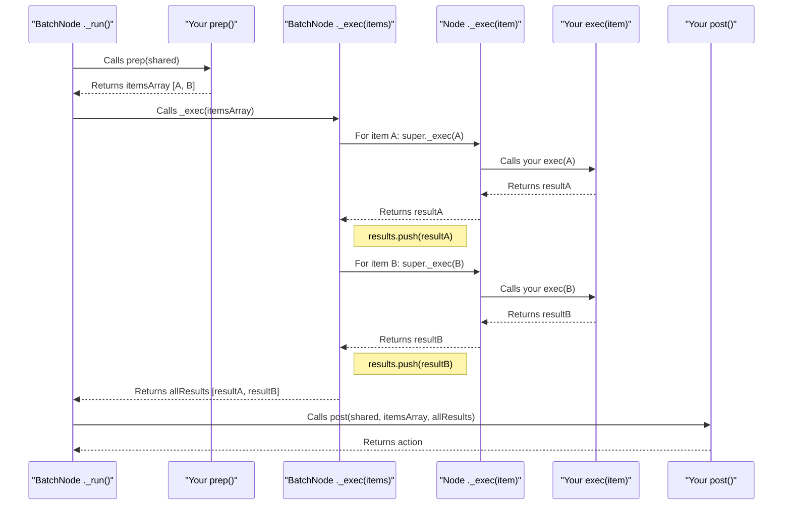

# Chapter 4: BatchNode - Processing Items in Groups

In [Chapter 3: Flow - The Conductor of Your Workflow](03_flow.md), we saw how a [Flow](03_flow.md) orchestrates a sequence of [Nodes](02_node.md) to perform a multi-step task. Each [Node](02_node.md) typically focused on one piece of work at a time.

But what if a single step in your workflow needs to handle *many* similar items? Imagine you have a list of 100 new users, and you want to generate a personalized welcome banner for each. Or perhaps you have a batch of 50 photos that all need to be resized. Doing this one by one with separate [Node](02_node.md) executions could be cumbersome to set up.

This is where **`BatchNode`** shines!

## What Problem Does `BatchNode` Solve?

A `BatchNode` is a specialized type of [Node](02_node.md) designed for processing a collection of items (a "batch") within a single operational step.

Think of a mail sorter at a post office:
1.  **Gathering (like `prep`):** The sorter first gathers all letters addressed to a specific neighborhood. This collection of letters is like your batch of items.
2.  **Processing Each Item (like `exec`):** The sorter then takes *each letter*, one by one, reads the exact street address, and puts it into the correct mail carrier's slot. This individual processing of each letter is what your `exec` method will do.
3.  **Finishing Up (like `post`):** Once all letters for that neighborhood are sorted, the sorter might bundle them up for the mail carrier and note that this neighborhood's mail is ready.

A `BatchNode` allows you to:
*   **Prepare a list of items:** Its `prep` method usually returns an array of these items.
*   **Process each item individually:** Its `exec` method is called *sequentially* for each item in that array.
*   **Aggregate results:** Its `post` method receives all the individual results and can combine or finalize them.

This is very useful for tasks that involve handling multiple sub-tasks or data entries within a single logical step of your workflow.

## The `BatchNode` Lifecycle: Prep, Exec (for each), Post

A `BatchNode` follows the same `prep -> exec -> post` lifecycle as a regular [Node](02_node.md), but with a key difference in how `exec` is handled:

1.  **`prep(sharedData)`:**
    *   **Your Job:** Prepare and return an **array of items** to be processed. These could be filenames, user IDs, data records, etc.
    *   **Example:** Read a list of product IDs from [SharedData (Concept)](01_shareddata__concept_.md) and return `["prod1", "prod2", "prod3"]`.

2.  **`exec(singleItem)`:**
    *   **PocketFlow's Job:** The `BatchNode` itself will iterate through the array returned by `prep`.
    *   **Your Job:** For *each individual item* from that array, PocketFlow calls your `exec` method. Your `exec` method should perform the processing for that *one item* and return its result.
    *   **Example:** If `prep` returned `["prod1", "prod2"]`, your `exec` will be called first with `"prod1"`, then with `"prod2"`. If `exec("prod1")` returns `"Price for prod1 is $10"`, that's the result for the first item.

3.  **`post(sharedData, itemsFromPrep, arrayOfResultsFromExec)`:**
    *   **PocketFlow's Job:** After your `exec` has been called for every item, PocketFlow calls your `post` method.
    *   **Your Job:** The `post` method receives:
        *   The `sharedData` object.
        *   The original array of items that `prep` returned.
        *   An **array containing all the results** from each individual call to `exec`.
    *   You can then use these collective results to update `sharedData`, summarize, or decide the next step in the [Flow](03_flow.md).
    *   **Example:** If `exec` returned `["Price for prod1 is $10", "Price for prod2 is $20"]`, `post` gets this array.

Let's visualize this:

```mermaid
graph LR
    A[SharedData In] --> B(prep Phase);
    B -- Returns Array [item1, item2, item3] --> C{BatchNode Core Logic};
    C -- item1 --> D1(exec(item1));
    D1 -- result1 --> C;
    C -- item2 --> D2(exec(item2));
    D2 -- result2 --> C;
    C -- item3 --> D3(exec(item3));
    D3 -- result3 --> C;
    C -- Array of All Results [res1, res2, res3] & Original Items --> E(post Phase);
    E --> F[SharedData Out];
    E -- Next Action --> G[Next Node Decision];
```

## Building a `BatchNode`: The `SimpleTaskProcessorNode`

Let's create a `BatchNode` that processes a list of simple string tasks.
1.  `prep`: Will provide a list of task descriptions (strings).
2.  `exec`: Will "process" each task string by appending "-Processed" to it.
3.  `post`: Will collect all processed task strings and store them in [SharedData (Concept)](01_shareddata__concept_.md).

First, our `SharedData` structure:

```typescript
// Define the shape of our SharedData
type MyBatchWorkflowData = {
  taskList?: string[];       // Input: A list of tasks
  processedTasks?: string[]; // Output: Results of processing
};
```

Now, let's build the `SimpleTaskProcessorNode`:

```typescript
import { BatchNode } from 'pocketflow'; // Import BatchNode

class SimpleTaskProcessorNode extends BatchNode<MyBatchWorkflowData> {
  // Phase 1: prep - Provide the list of tasks
  async prep(shared: MyBatchWorkflowData): Promise<string[]> {
    const tasks = shared.taskList || ["Task Alpha", "Task Beta", "Task Gamma"];
    console.log(`[TaskProcessor-prep] Tasks to process:`, tasks);
    return tasks; // This array will be iterated over
  }

  // Phase 2: exec - Process ONE task from the list
  async exec(singleTask: string): Promise<string> {
    const processedResult = `${singleTask}-Processed`;
    console.log(`[TaskProcessor-exec] Processing '${singleTask}' -> '${processedResult}'`);
    return processedResult; // Result for this single task
  }

  // Phase 3: post - Collect all results
  async post(
    shared: MyBatchWorkflowData,
    _originalTasks: string[], // The array from prep
    allProcessedResults: string[] // Array of results from each exec call
  ): Promise<string | undefined> {
    shared.processedTasks = allProcessedResults;
    console.log(`[TaskProcessor-post] All tasks processed. Results:`, allProcessedResults);
    return "tasks_completed"; // Action for the Flow
  }
}
```

Let's break this down:
*   `extends BatchNode<MyBatchWorkflowData>`: We're creating a `BatchNode` that works with our `MyBatchWorkflowData`.
*   `async prep(...): Promise<string[]>`:
    *   It prepares a list of tasks. If `shared.taskList` isn't provided, it uses a default list.
    *   Crucially, it **returns an array of strings**.
*   `async exec(singleTask: string): Promise<string>`:
    *   This method will be called by PocketFlow for *each string* in the array returned by `prep`.
    *   `singleTask` will be "Task Alpha", then "Task Beta", then "Task Gamma" in subsequent calls.
    *   It processes the `singleTask` and **returns the result for that one task**.
*   `async post(..., allProcessedResults: string[]): ...`:
    *   `allProcessedResults` will be an array like `["Task Alpha-Processed", "Task Beta-Processed", "Task Gamma-Processed"]`.
    *   It stores these collective results in `shared.processedTasks`.
    *   It returns an action string `"tasks_completed"`.

## Using Our `BatchNode` in a Simple Flow

Let's see how this `BatchNode` would run. We'll simulate a simple [Flow](03_flow.md) setup.

```typescript
import { Flow, Node } from 'pocketflow'; // Assuming pocketflow is installed

// (SimpleTaskProcessorNode definition from above)

// A simple Node to display results (optional)
class DisplayResultsNode extends Node<MyBatchWorkflowData> {
  async prep(shared: MyBatchWorkflowData) {
    console.log("\n--- Final Results ---");
    console.log("Processed tasks in SharedData:", shared.processedTasks);
    if (!shared.processedTasks || shared.processedTasks.length === 0) {
      console.log("No tasks were processed or results not stored.");
    }
    console.log("---------------------");
  }
}

// Main function to run the workflow
async function main() {
  const sharedContext: MyBatchWorkflowData = {
    // We can optionally pre-populate the task list
    // taskList: ["Custom Task 1", "Custom Task 2"] 
  };

  const taskProcessor = new SimpleTaskProcessorNode();
  const displayResults = new DisplayResultsNode();

  // Link nodes: processor -> display (if "tasks_completed")
  taskProcessor.on("tasks_completed", displayResults);
  // Or use .next() for the default path if post returns undefined
  // taskProcessor.next(displayResults); 

  const workflow = new Flow<MyBatchWorkflowData>(taskProcessor);

  console.log("--- Starting Batch Workflow ---");
  await workflow.run(sharedContext);
  console.log("\n--- Workflow Complete ---");
  console.log("Final SharedData:", sharedContext);
}

main();
```

**Expected Output:**

```
--- Starting Batch Workflow ---
[TaskProcessor-prep] Tasks to process: [ 'Task Alpha', 'Task Beta', 'Task Gamma' ]
[TaskProcessor-exec] Processing 'Task Alpha' -> 'Task Alpha-Processed'
[TaskProcessor-exec] Processing 'Task Beta' -> 'Task Beta-Processed'
[TaskProcessor-exec] Processing 'Task Gamma' -> 'Task Gamma-Processed'
[TaskProcessor-post] All tasks processed. Results: [
  'Task Alpha-Processed',
  'Task Beta-Processed',
  'Task Gamma-Processed'
]

--- Final Results ---
Processed tasks in SharedData: [
  'Task Alpha-Processed',
  'Task Beta-Processed',
  'Task Gamma-Processed'
]
---------------------

--- Workflow Complete ---
Final SharedData: {
  processedTasks: [
    'Task Alpha-Processed',
    'Task Beta-Processed',
    'Task Gamma-Processed'
  ],
  taskList: [ 'Task Alpha', 'Task Beta', 'Task Gamma' ] // if prep sets it
}
```
Look at the logs!
1.  `prep` created the list `["Task Alpha", "Task Beta", "Task Gamma"]`.
2.  `exec` was called three times, once for each task.
3.  `post` received all three processed results and stored them.
4.  The `DisplayResultsNode` then showed these results from `SharedData`.

## Under the Hood: How `BatchNode` Manages `exec`

The magic of `BatchNode` iterating through items and calling your `exec` for each one happens in its internal `_exec` method. When you extend `BatchNode`, you're getting this specialized behavior.

Here's a simplified step-by-step:
1.  Your [Flow](03_flow.md) (or your direct call) runs the `BatchNode` instance.
2.  The `BatchNode`'s `_run` method (inherited from `BaseNode`) is called.
3.  `_run` first calls `await this.prep(sharedData)`. Let's say `prep` returns `itemsArray = [itemA, itemB]`.
4.  `_run` then calls `await this._exec(itemsArray)`. This is the `_exec` method *specific to `BatchNode`*.
5.  Inside `BatchNode._exec(itemsArray)`:
    a.  It creates an empty array, say `resultsList = []`.
    b.  It starts a loop: `for (const currentItem of itemsArray)`.
        i.  In the first iteration, `currentItem` is `itemA`.
        ii. It calls `await super._exec(currentItem)`. `super._exec` here refers to the `_exec` method of the parent class, `Node`.
        iii. The `Node._exec(currentItem)` method (among other things like handling retries) will eventually call `await this.exec(currentItem)` – which is *your* `exec` method that you defined in `SimpleTaskProcessorNode`!
        iv. Your `exec(itemA)` runs and returns, say, `resultA`.
        v.  This `resultA` is then pushed into `resultsList`.
    c.  The loop continues for `itemB`, calling your `exec(itemB)` and collecting `resultB`.
    d.  After the loop, `BatchNode._exec` returns `resultsList` (which is now `[resultA, resultB]`).
6.  Back in `_run`, this `resultsList` becomes the `execResult`.
7.  Finally, `_run` calls `await this.post(sharedData, itemsArray, resultsList)`.

Let's visualize the core `BatchNode` interaction:



Here's a look at the `BatchNode`'s `_exec` method from `src/index.ts` (simplified for clarity):
```typescript
// From src/index.ts (PocketFlow core)
class BatchNode<S, P> extends Node<S, P> { // Extends the regular Node
  async _exec(items: unknown[]): Promise<unknown[]> {
    // 'items' is the array returned by your prep() method

    if (!items || !Array.isArray(items)) {
      return []; // Handle cases where prep doesn't return an array
    }

    const results = []; // To store results from each exec call
    for (const item of items) {
      // For each 'item' in the array from prep:
      // It calls 'super._exec(item)'. 'super' here refers to the
      // '_exec' method of the 'Node' class.
      // The 'Node._exec' method is responsible for calling your
      // actual 'this.exec(item)' method (and handling retries).
      results.push(await super._exec(item));
    }
    return results; // This array of results is passed to your post()
  }
}
```
The key line is `results.push(await super._exec(item));`. This means for every item your `prep` method provides, the `BatchNode` ensures that the standard `Node` execution logic (including your custom `exec` part and any retry mechanisms defined in `Node`) is run for that single item. Then, it collects all these individual results.

## Conclusion

The `BatchNode` is a powerful tool for processing collections of items efficiently within a single workflow step!
*   **Simplifies Batch Processing:** You define how to get the list (`prep`), how to process one item (`exec`), and how to handle all results (`post`).
*   **Sequential by Default:** The `exec` method is called one by one for each item in the batch.
*   **Clear Structure:** It keeps the logic for handling multiple items organized and clean.

You've learned how `BatchNode` helps process items sequentially. But what if each item's processing is independent and could be done at the same time to speed things up?

Get ready to explore how to do that in the next chapter: [ParallelBatchNode](05_parallelbatchnode.md).

---

Generated by [AI Codebase Knowledge Builder](https://github.com/The-Pocket/Tutorial-Codebase-Knowledge)