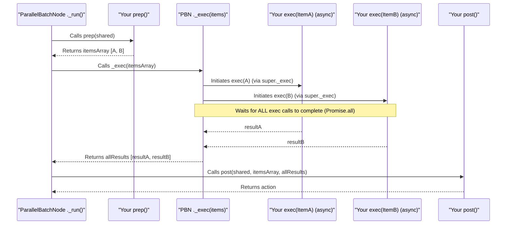

# Chapter 5: ParallelBatchNode - Supercharging Your Batch Work

In [Chapter 4: BatchNode - Processing Items in Groups](04_batchnode.md), we learned how `BatchNode` helps us process a list of items one by one, like a diligent mail sorter handling each letter sequentially. This is great for many tasks!

But what if you have a team of sorters? What if each item in your batch can be processed independently, without waiting for the others? Imagine applying a filter to 100 different images. If each filtering operation takes 1 second, doing them one by one with a `BatchNode` would take 100 seconds. If you could do them all *at the same time*, it might still take roughly 1 second (plus a little overhead)!

This is where **`ParallelBatchNode`** comes to the rescue. It's like having a team of chefs, all working at the same time, each preparing a different dish from a menu (the batch of tasks).

## What Problem Does `ParallelBatchNode` Solve?

The `ParallelBatchNode` is a special kind of [Node](02_node.md) designed to process a collection of items *concurrently*.
*   Its `prep` method gathers all the individual tasks (e.g., a list of images to process).
*   Then, its underlying logic processes these tasks by invoking your `exec` method for *each task in parallel*.

This dramatically speeds up operations where many small, independent pieces of work can be done simultaneously. Think of:
*   Applying filters to multiple images.
*   Fetching data from several different web URLs.
*   Performing calculations on different sets of data.

If one task doesn't depend on the outcome of another in the batch, why wait? `ParallelBatchNode` lets you unleash the power of concurrent processing.

## The `ParallelBatchNode` Lifecycle: Prep, Exec (Concurrently for Each), Post

Just like its cousin, `BatchNode`, the `ParallelBatchNode` follows the `prep -> exec -> post` lifecycle:

1.  **`prep(sharedData)`:**
    *   **Your Job:** Prepare and return an **array of items** to be processed.
    *   **Example:** `prep` could return `[{ image: 'cat.jpg', filter: 'blur' }, { image: 'dog.jpg', filter: 'sepia' }]`.

2.  **`exec(singleItem)`:**
    *   **PocketFlow's Job:** The `ParallelBatchNode` takes the array from `prep`. Instead of iterating one by one, it initiates the `exec` process for *all items concurrently*.
    *   **Your Job:** Your `exec` method processes *one item* from the list. It should be designed to run independently.
    *   **Example:** If `prep` returned two items, `exec` would be effectively "started" for both `{ image: 'cat.jpg', filter: 'blur' }` and `{ image: 'dog.jpg', filter: 'sepia' }` around the same time.

3.  **`post(sharedData, itemsFromPrep, arrayOfResultsFromExec)`:**
    *   **PocketFlow's Job:** After *all* the concurrent `exec` operations have completed, PocketFlow calls your `post` method.
    *   **Your Job:** The `post` method receives:
        *   The `sharedData` object.
        *   The original array of items that `prep` returned.
        *   An **array containing all the results** from each `exec` call. The order of results in this array matches the order of items in the array from `prep`.
    *   **Example:** If the `exec` calls eventually produced results `resultA` and `resultB`, `post` gets `[resultA, resultB]`.

The key difference from [BatchNode](04_batchnode.md) is that the `exec` calls for each item are not necessarily completed one after the other; they run in parallel.

```mermaid
graph LR
    A[SharedData In] --> B(prep Phase);
    B -- Returns Array [item1, item2, item3] --> C{ParallelBatchNode Core Logic};
    subgraph Parallel Execution
        C -- item1 --> D1(exec(item1) starts);
        C -- item2 --> D2(exec(item2) starts);
        C -- item3 --> D3(exec(item3) starts);
    end
    D1 -- result1 (async) --> C;
    D2 -- result2 (async) --> C;
    D3 -- result3 (async) --> C;
    C -- Waits for ALL results --> E(post Phase);
    E -- Receives [res1, res2, res3] & Original Items --> F[SharedData Out];
    E -- Next Action --> G[Next Node Decision];
```

## Building a `ParallelImageProcessorNode`

Let's create a `ParallelBatchNode` that "applies filters" to a list of "images". We'll simulate the work with a delay to observe the parallelism.

First, our [SharedData (Concept)](01_shareddata__concept_.md) structure:

```typescript
// Define the shape of our SharedData
type ImageProcessingData = {
  tasksToProcess?: { imagePath: string; filterType: string }[];
  processedResults?: {
    image: string;
    filter: string;
    status: string;
    durationMs: number;
  }[];
};

// Define the structure of a single task item
type ImageTask = { imagePath: string; filterType: string };
```
Our `ImageProcessingData` will hold the list of tasks and the results. `ImageTask` defines what each item in our batch looks like.

Now, the `ParallelImageProcessorNode`:

```typescript
import { ParallelBatchNode } from 'pocketflow'; // Import ParallelBatchNode

// Define the result structure for a single processed task
type ProcessedImageInfo = {
  image: string;
  filter: string;
  status: string;
  durationMs: number;
};

class ParallelImageProcessorNode extends ParallelBatchNode<ImageProcessingData> {
  // Phase 1: prep - Provide the list of image tasks
  async prep(shared: ImageProcessingData): Promise<ImageTask[]> {
    const tasks: ImageTask[] = shared.tasksToProcess || [
      { imagePath: 'cat.jpg', filterType: 'blur (fast)' },
      { imagePath: 'dog.jpg', filterType: 'sepia (medium)' },
      { imagePath: 'bird.jpg', filterType: 'grayscale (slow)' },
    ];
    console.log(`[Processor-prep] Tasks to process: ${tasks.length}`);
    return tasks;
  }

  // Phase 2: exec - "Process" ONE image task. This runs in parallel for each task.
  async exec(task: ImageTask): Promise<ProcessedImageInfo> {
    const startTime = Date.now();
    // Determine delay based on filter type for demonstration
    let delay = 1000; // Default 1s
    if (task.filterType.includes('medium')) delay = 2000; // 2s
    if (task.filterType.includes('slow')) delay = 3000; // 3s

    console.log(`  [exec] START: Applying ${task.filterType} to ${task.imagePath}`);
    
    // Simulate asynchronous work (e.g., file I/O, network request)
    await new Promise(resolve => setTimeout(resolve, delay));
    
    const durationMs = Date.now() - startTime;
    console.log(`  [exec] END: ${task.imagePath} with ${task.filterType} (${durationMs}ms)`);
    return {
      image: task.imagePath,
      filter: task.filterType,
      status: 'Processed',
      durationMs,
    };
  }

  // Phase 3: post - Collect all results
  async post(
    shared: ImageProcessingData,
    _originalTasks: ImageTask[],
    allResults: ProcessedImageInfo[]
  ): Promise<string | undefined> {
    shared.processedResults = allResults;
    console.log('[Processor-post] All image tasks processed. Results:');
    allResults.forEach(r => 
      console.log(`  - ${r.image} (${r.filter}): ${r.status} in ${r.durationMs}ms`)
    );
    return 'processing_complete';
  }
}
```
Let's break this down:
*   `extends ParallelBatchNode<ImageProcessingData>`: We're using `ParallelBatchNode`.
*   `async prep(...): Promise<ImageTask[]>`: Returns an array of `ImageTask` objects.
*   `async exec(task: ImageTask): Promise<ProcessedImageInfo>`:
    *   This method will be called by PocketFlow for *each task* from `prep`.
    *   Crucially, these calls will be initiated concurrently.
    *   `await new Promise(resolve => setTimeout(resolve, delay))`: This simulates work that takes time, like actual image filtering. Notice the different delays.
    *   The `console.log` for `START` and `END` will help us see the parallelism.
*   `async post(..., allResults: ProcessedImageInfo[]): ...`:
    *   `allResults` will be an array of `ProcessedImageInfo` objects, one for each task.
    *   It stores these collective results in `shared.processedResults`.

## Using Our `ParallelImageProcessorNode`

Let's run this in a simple [Flow](03_flow.md):

```typescript
import { Flow, Node } from 'pocketflow'; // Assuming pocketflow is installed

// (ParallelImageProcessorNode and type definitions from above)

async function main() {
  const sharedContext: ImageProcessingData = {};

  const imageProcessor = new ParallelImageProcessorNode();
  // Dummy next node to illustrate flow continuation
  const reportNode = new Node<ImageProcessingData>(); 
  reportNode.prep = async (s) => console.log("[ReportNode] Generating report...");

  imageProcessor.on("processing_complete", reportNode);

  const workflow = new Flow<ImageProcessingData>(imageProcessor);

  console.log("--- Starting Parallel Batch Workflow ---");
  const startTime = Date.now();
  await workflow.run(sharedContext);
  const totalDuration = Date.now() - startTime;
  console.log(`--- Workflow Complete --- (Total time: ${totalDuration}ms)`);
  // console.log("Final SharedData:", sharedContext.processedResults);
}

main();
```

**Expected Output (order of "START" and "END" logs may vary slightly):**

```
--- Starting Parallel Batch Workflow ---
[Processor-prep] Tasks to process: 3
  [exec] START: Applying blur (fast) to cat.jpg
  [exec] START: Applying sepia (medium) to dog.jpg
  [exec] START: Applying grayscale (slow) to bird.jpg
  [exec] END: cat.jpg with blur (fast) (approx 1000ms)
  [exec] END: dog.jpg with sepia (medium) (approx 2000ms)
  [exec] END: bird.jpg with grayscale (slow) (approx 3000ms)
[Processor-post] All image tasks processed. Results:
  - cat.jpg (blur (fast)): Processed in approx 1000ms
  - dog.jpg (sepia (medium)): Processed in approx 2000ms
  - bird.jpg (grayscale (slow)): Processed in approx 3000ms
[ReportNode] Generating report...
--- Workflow Complete --- (Total time: approx 3000ms)
```

**Key Observations:**
1.  **Interleaved Logs:** Notice how all "START" logs from `exec` appear close together, *before* all the "END" logs. This shows they were all initiated around the same time.
2.  **Total Time:** The total workflow time will be close to the duration of the *longest single task* (the "slow" filter, approx 3000ms), not the sum of all task durations (1000 + 2000 + 3000 = 6000ms). This is the power of parallelism! If this were a regular `BatchNode`, the total time would be around 6000ms.

## Under the Hood: `Promise.all()` is the Star

The magic of `ParallelBatchNode` lies in how its internal `_exec` method handles the items from `prep`.
While `BatchNode` loops through items and `await`s each `exec` call sequentially:
```typescript
// BatchNode's _exec (simplified, sequential)
// for (const item of items) results.push(await super._exec(item));
```

`ParallelBatchNode` uses `Promise.all()`:
```typescript
// ParallelBatchNode's _exec from src/index.ts (simplified)
async _exec(items: unknown[]): Promise<unknown[]> {
  if (!items || !Array.isArray(items)) return [];
  // Map each item to a promise that resolves with the result of super._exec(item)
  // super._exec(item) eventually calls YOUR exec(item)
  const promises = items.map(item => super._exec(item));
  // Promise.all waits for ALL these promises to resolve
  return Promise.all(promises);
}
```
1.  `items.map(item => super._exec(item))`: This line creates an array of Promises. For each `item`, it *starts* the execution (via `super._exec`, which eventually calls your `exec` method) but doesn't wait for it to finish before moving to the next item. So, all your `exec` calls are initiated nearly simultaneously.
2.  `Promise.all(promises)`: This is the key. `Promise.all` takes an array of promises and returns a new promise that resolves only when *all* promises in the input array have resolved. The resolved value is an array of the results from each promise, in the original order.

Let's visualize the core interaction:


This concurrent execution is what gives `ParallelBatchNode` its speed advantage for independent tasks.

## When to Use `ParallelBatchNode`

`ParallelBatchNode` is ideal when:
*   You have a list of items to process.
*   The processing of one item does **not** depend on the result of another item in the same batch.
*   The tasks are I/O-bound (e.g., reading/writing files, making network requests) because JavaScript can efficiently juggle many I/O operations concurrently.
*   Even for CPU-bound tasks, if the operations can be made asynchronous, `ParallelBatchNode` can help utilize system resources more effectively by keeping the event loop busy.

If order matters or tasks are strictly dependent, the sequential [BatchNode](04_batchnode.md) is usually more appropriate.

## Conclusion

The `ParallelBatchNode` is a fantastic tool for speeding up workflows that involve processing many independent items.
*   It processes items from a batch **concurrently** using your `exec` method.
*   Its `prep` method provides the items, and `post` collects all the results after parallel execution.
*   It leverages `Promise.all()` internally to achieve parallelism.
*   This can lead to significant performance gains, especially for I/O-bound tasks.

So far, we've focused on how individual `Node`s (like `BatchNode` and `ParallelBatchNode`) handle batches of data *within* themselves. What if you want to run an entire [Flow](03_flow.md) multiple times, perhaps with slightly different parameters for each run?

That's where our next topic comes in. Get ready to explore [Chapter 6: BatchFlow](06_batchflow.md), which takes batch processing to the level of entire workflows!

---

Generated by [AI Codebase Knowledge Builder](https://github.com/The-Pocket/Tutorial-Codebase-Knowledge)