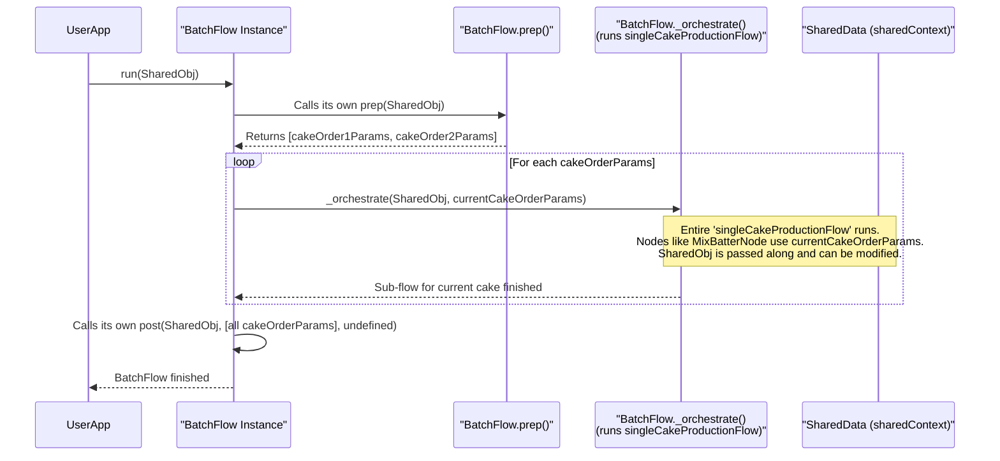

# Chapter 6: BatchFlow - Running Your Entire Workflow Multiple Times

In [Chapter 5: ParallelBatchNode - Supercharging Your Batch Work](05_parallelbatchnode.md), we saw how `ParallelBatchNode` can process many individual items concurrently *within a single Node*. This is great for tasks like filtering a batch of images simultaneously.

But what if you need to run an *entire assembly line* (a complete [Flow](03_flow.md)) multiple times, perhaps with different settings or inputs for each run? For example, imagine you have a standard process (a [Flow](03_flow.md)) for baking and decorating a cake. Now, you receive a list of ten different cake orders, each with unique specifications for flavor and decoration. You want to process each cake order completely, one after the other, using your standard cake-making [Flow](03_flow.md).

This is precisely what **`BatchFlow`** helps you achieve!

## What is a `BatchFlow`? The Sequential Multi-Run Manager

A `BatchFlow` is like a meticulous factory manager overseeing a single assembly line. The manager has a list of product orders (parameter sets).
1.  For the first order, the manager configures the assembly line with the specific parameters for that order and lets the entire product be built.
2.  Once the first product is complete, the manager takes the second order, reconfigures the line with the new parameters, and lets the second product be built.
3.  This continues sequentially until all orders in the list are processed.

In PocketFlow terms:
*   You have a "base" [Flow](03_flow.md) that defines a complete process (e.g., making one cake).
*   The `BatchFlow` takes this base [Flow](03_flow.md) and a list of parameter sets.
*   It then runs the entire base [Flow](03_flow.md) sequentially, once for each parameter set in the list.
*   The `BatchFlow`'s own **`prep` method** is where you provide this list of distinct parameter sets.

This is incredibly useful when you want to apply a complex, multi-step workflow to a series of different inputs or configurations, one at a time.

## Our Cake Factory: Using `BatchFlow`

Let's build a simple cake factory example. We'll have a base [Flow](03_flow.md) for making a single cake, and then we'll use `BatchFlow` to process a list of different cake orders.

**1. Define our `SharedData` and Parameters:**
This is the information our cake-making [Nodes](02_node.md) will share and the parameters for each cake order.

```typescript
// SharedData for our cake workflow
type CakeFactoryData = {
  currentFlavor?: string;
  currentDecoration?: string;
  status?: string;
  // We could add a list here to store results from each BatchFlow run
  // For simplicity, BatchFlow's post method would handle this.
  // For now, SharedData will reflect the *last* cake processed.
  lastCakeDetails?: string; 
};

// Parameters for a single cake order
type CakeOrderParams = {
  flavor: string;
  decoration: string;
};
```
*   `CakeFactoryData`: Holds information about the cake currently being processed.
*   `CakeOrderParams`: Defines the structure for each cake order (flavor and decoration).

**2. Create `Node`s for the Single Cake Flow:**
These are the stations on our single-cake assembly line.

*   **`MixBatterNode`**: Sets the flavor based on parameters.

```typescript
import { Node } from 'pocketflow';

// Node to mix batter based on order parameters
class MixBatterNode extends Node<CakeFactoryData, CakeOrderParams> {
  async prep(shared: CakeFactoryData) {
    shared.currentFlavor = this._params.flavor; // Use flavor from params
    console.log(`  [MixBatter] Mixing ${shared.currentFlavor} batter.`);
  }
}
```
Notice `extends Node<CakeFactoryData, CakeOrderParams>`. This Node expects `CakeOrderParams` to be passed to it (which `BatchFlow` will handle). `this._params` holds these parameters.

*   **`BakeCakeNode`**: Simulates baking.

```typescript
// Node to bake the cake
class BakeCakeNode extends Node<CakeFactoryData> {
  async prep(shared: CakeFactoryData) {
    console.log(`  [BakeCake] Baking the ${shared.currentFlavor} cake.`);
    // Simulate baking time
    await new Promise(resolve => setTimeout(resolve, 50)); 
  }
}
```

*   **`DecorateCakeNode`**: Sets decoration and final status.

```typescript
// Node to decorate the cake based on order parameters
class DecorateCakeNode extends Node<CakeFactoryData, CakeOrderParams> {
  async prep(shared: CakeFactoryData) {
    shared.currentDecoration = this._params.decoration; // Use decor from params
    shared.status = `${shared.currentFlavor} cake with ${shared.currentDecoration} ready!`;
    shared.lastCakeDetails = shared.status;
    console.log(`  [DecorateCake] Decorating with ${shared.currentDecoration}.`);
    console.log(`  [CakeReady!] ${shared.status}`);
  }
}
```

**3. Create the "Single Cake" Base [Flow](03_flow.md):**
This is our standard assembly line for one cake.

```typescript
import { Flow } from 'pocketflow';

const mixBatter = new MixBatterNode();
const bakeCake = new BakeCakeNode();
const decorateCake = new DecorateCakeNode();

// Define the sequence for making one cake
mixBatter.next(bakeCake);
bakeCake.next(decorateCake);

// This is the Flow for making a single cake
const singleCakeProductionFlow = new Flow<CakeFactoryData>(mixBatter);
```
`singleCakeProductionFlow` now represents the complete process for one cake, starting with `mixBatter`.

**4. Create and Configure the `BatchFlow`:**
This `BatchFlow` will run our `singleCakeProductionFlow` for multiple orders.

```typescript
import { BatchFlow } from 'pocketflow';

// Create a BatchFlow. It will use the 'singleCakeProductionFlow'
// by starting with its first node, 'mixBatter'.
const multiCakeOrderBatchFlow = new BatchFlow<CakeFactoryData, {}, CakeOrderParams[]>(mixBatter);
//                                          ^ SharedData type
//                                               ^ BatchFlow's own P type (not used here)
//                                                    ^ Type of array from prep

// Define the list of cake orders. This is what BatchFlow's prep will return.
const cakeOrders: CakeOrderParams[] = [
  { flavor: 'Chocolate', decoration: 'Sprinkles' },
  { flavor: 'Vanilla', decoration: 'Roses' },
  { flavor: 'Red Velvet', decoration: 'Cream Cheese Frosting' },
];

// Override the BatchFlow's prep method to provide our cakeOrders.
// This prep method is part of the BatchFlow itself.
multiCakeOrderBatchFlow.prep = async (shared: CakeFactoryData) => {
  console.log(`[BatchFlow-prep] Received ${cakeOrders.length} cake orders.`);
  return cakeOrders; // This list of parameters drives the BatchFlow
};
```
*   `new BatchFlow<...>(mixBatter)`: We create a `BatchFlow`. The `mixBatter` node is the starting point of the sub-flow that `BatchFlow` will run repeatedly.
*   `CakeOrderParams[]`: We explicitly state that the `prep` method of this `BatchFlow` will return an array of `CakeOrderParams`.
*   `multiCakeOrderBatchFlow.prep = ...`: We assign a function to the `prep` property of our `BatchFlow` instance. This function returns our `cakeOrders` list. Each item in this list will be passed as parameters to one full run of the `singleCakeProductionFlow`.

**5. Run the `BatchFlow`:**

```typescript
async function main() {
  const sharedContext: CakeFactoryData = {}; // Our shared workspace

  console.log("--- Starting Cake Factory BatchFlow ---");
  await multiCakeOrderBatchFlow.run(sharedContext);
  console.log("--- All Cake Orders Processed ---");
  console.log("Last cake processed details:", sharedContext.lastCakeDetails);
}

main();
```

**Expected Output:**

```
--- Starting Cake Factory BatchFlow ---
[BatchFlow-prep] Received 3 cake orders.
Processing order for: Chocolate cake with Sprinkles
  [MixBatter] Mixing Chocolate batter.
  [BakeCake] Baking the Chocolate cake.
  [DecorateCake] Decorating with Sprinkles.
  [CakeReady!] Chocolate cake with Sprinkles ready!
Processing order for: Vanilla cake with Roses
  [MixBatter] Mixing Vanilla batter.
  [BakeCake] Baking the Vanilla cake.
  [DecorateCake] Decorating with Roses.
  [CakeReady!] Vanilla cake with Roses ready!
Processing order for: Red Velvet cake with Cream Cheese Frosting
  [MixBatter] Mixing Red Velvet batter.
  [BakeCake] Baking the Red Velvet cake.
  [DecorateCake] Decorating with Cream Cheese Frosting.
  [CakeReady!] Red Velvet cake with Cream Cheese Frosting ready!
--- All Cake Orders Processed ---
Last cake processed details: Red Velvet cake with Cream Cheese Frosting ready!
```
Observe how each cake order (Chocolate, Vanilla, Red Velvet) goes through the *entire* `MixBatter -> BakeCake -> DecorateCake` sequence before the next order starts. The `SharedData`'s `lastCakeDetails` reflects the very last cake made.

## How `BatchFlow` Works Under the Hood

When you call `run()` on a `BatchFlow` instance:

1.  **`BatchFlow.prep()` is Called:** The `BatchFlow` first executes its own `prep` method. In our example, this `prep` method (the one we defined) returns the `cakeOrders` array: `[{flavor: 'Chocolate', ...}, {flavor: 'Vanilla', ...}, ...]`. This array is the list of parameter sets.

2.  **Iterate Through Parameter Sets:** The `BatchFlow` then loops through this array of parameter sets, one by one.

3.  **For Each Parameter Set:**
    *   **Parameter Merging:** It takes the current parameter set (e.g., `{flavor: 'Chocolate', decoration: 'Sprinkles'}`).
    *   **Orchestrate Sub-Flow:** It then calls its internal `_orchestrate(sharedData, currentParams)` method. This `_orchestrate` method (which `BatchFlow` inherits from the base [Flow](03_flow.md) class) is responsible for running the *entire sub-flow* (our `singleCakeProductionFlow`, starting from `mixBatter`) from beginning to end.
    *   The `currentParams` are made available to each [Node](02_node.md) within that sub-flow run (via `this._params` inside the nodes like `MixBatterNode`).
    *   The *same* `sharedData` object is passed into each run of the sub-flow. This means if the first cake's processing modifies `sharedData`, the second cake's processing will see those modifications.

4.  **`BatchFlow.post()` is Called:** After the loop finishes (all parameter sets have been processed), the `BatchFlow` executes its own `post` method. It receives the `sharedData`, the original list of parameter sets from `prep`, and (typically) `undefined` for the execution result since the results are per sub-flow run. You could customize this `post` method to aggregate results if needed.

Here's a visual:



Let's look at the `BatchFlow`'s `_run` method from `src/index.ts` (simplified):
```typescript
// Simplified from PocketFlow's src/index.ts
class BatchFlow<S, P, NP extends NonIterableObject[] > extends Flow<S, P> {
  // The 'prep' method you override returns NP (e.g., CakeOrderParams[])
  async prep(shared: S): Promise<NP> { /* ... your logic ... */ }

  async _run(shared: S): Promise<Action | undefined> {
    // 1. Call BatchFlow's own prep to get the list of parameter sets
    const batchParams: NP = await this.prep(shared); 

    // 2. Loop through each parameter set
    for (const bp of batchParams) { // 'bp' is one set of params, e.g., one cakeOrder
      // Merge BatchFlow's own _params (if any) with current item's params
      const mergedParams = { ...this._params, ...bp };
      
      // 3. Run the ENTIRE sub-flow using these mergedParams
      // 'this._orchestrate' is inherited from Flow and runs the sub-flow
      // starting from 'this.start' (which was 'mixBatter' in our example).
      // The SAME 'shared' object is used for each sub-flow run.
      await this._orchestrate(shared, mergedParams); 
    }

    // 4. Call BatchFlow's own post after all iterations
    return await this.post(shared, batchParams, undefined);
  }
}
```
-   `const batchParams = await this.prep(shared);`: This gets the list of orders (like our `cakeOrders`).
-   `for (const bp of batchParams)`: It loops through each order.
-   `await this._orchestrate(shared, mergedParams);`: This is the magic line. `_orchestrate` (from the [Flow](03_flow.md) class) executes the *entire sub-flow* (the one that starts with `this.start`, which was `mixBatter` for our `BatchFlow`). The `mergedParams` are made available to the nodes of that sub-flow.

## `BatchFlow` vs. `BatchNode`

It's important to distinguish `BatchFlow` from [BatchNode](04_batchnode.md):

*   **[BatchNode](04_batchnode.md):**
    *   Is a single [Node](02_node.md).
    *   Its `prep` method provides a list of *data items*.
    *   Its `exec` method is called *for each data item*.
    *   It's about processing a batch of items *within one step* of a larger [Flow](03_flow.md).
    *   Example: A `ResizeImagesBatchNode` where `prep` gives a list of image paths, and `exec` resizes one image.

*   **`BatchFlow`:**
    *   Is a type of [Flow](03_flow.md).
    *   Its `prep` method provides a list of *parameter sets*.
    *   It runs an *entire sub-flow* (which can contain many [Nodes](02_node.md)) *once for each parameter set*.
    *   It's about running a whole workflow multiple times, sequentially, with different configurations.
    *   Example: Our cake factory, running the whole cake-making [Flow](03_flow.md) for each different cake order.

## Conclusion

`BatchFlow` is your go-to tool when you need to execute an entire workflow sequentially for a list of different inputs or configurations.
*   You define a **base [Flow](03_flow.md)** for a single operation.
*   The `BatchFlow`'s **`prep` method provides a list of parameter sets**.
*   `BatchFlow` then runs the base [Flow](03_flow.md) **once for each parameter set**, passing the respective parameters to the [Nodes](02_node.md) within the sub-flow.
*   Each run of the sub-flow happens **sequentially**.

This sequential processing is powerful. But what if each of those full workflow runs could happen independently and at the same time, just like `ParallelBatchNode` processes its items?

Get ready to combine the ideas of `BatchFlow` and parallel execution in the next chapter: [ParallelBatchFlow](07_parallelbatchflow.md)!

---

Generated by [AI Codebase Knowledge Builder](https://github.com/The-Pocket/Tutorial-Codebase-Knowledge)