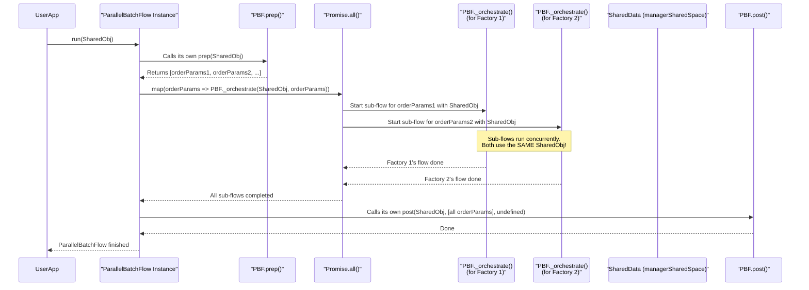

# Chapter 7: ParallelBatchFlow - Powering Up Multiple Workflows at Once

Welcome to the final chapter of our PocketFlow-Typescript basic tutorial! In [Chapter 6: BatchFlow - Running Your Entire Workflow Multiple Times](06_batchflow.md), we saw how `BatchFlow` could run an entire assembly line (a [Flow](03_flow.md)) multiple times, one after another, for a list of different cake orders. This was great for ensuring each cake was made correctly before starting the next.

But what if you have a *huge* number of cake orders, and each cake-making process is completely independent of the others? And what if you had multiple identical cake factories (or at least, multiple teams in a very large factory) that could all work at the same time? Doing orders one by one would be slow. You'd want to make many cakes *simultaneously*!

This is exactly what **`ParallelBatchFlow`** is designed for! It takes the concept of running multiple full [Flows](03_flow.md) and supercharges it with parallelism.

## What Problem Does `ParallelBatchFlow` Solve?

Imagine you have several independent, complex tasks. Each task is a full workflow (an entire [Flow](03_flow.md) execution). For example:
*   Generating detailed financial reports for 10 different departments. Each report generation is a multi-step [Flow](03_flow.md).
*   Processing 5 large, independent video files, where each file needs to go through an encoding, watermarking, and uploading [Flow](03_flow.md).
*   Running a complete simulation model with 20 different starting parameter sets.

If these full workflow runs are independent of each other (one department's report doesn't rely on another's during generation), running them one after another (like with [BatchFlow](06_batchflow.md)) can be time-consuming.

`ParallelBatchFlow` allows you to run multiple complete assembly lines ([Flows](03_flow.md)) concurrently.
1.  You define a "base" [Flow](03_flow.md) (your standard assembly line blueprint).
2.  The `ParallelBatchFlow`'s `prep` method provides a list of parameter sets (e.g., a list of department names, video file paths, or simulation settings).
3.  `ParallelBatchFlow` then kicks off the *entire base [Flow](03_flow.md) execution for several parameter sets at the same time*.

This offers significant speedups when each whole workflow run, defined by its parameter set, is independent and can run in parallel with others.

## Our Multi-Factory Cake Operation: Parallel Production!

Let's revisit our cake factory from [Chapter 6: BatchFlow](06_batchflow.md). We'll adapt it to use `ParallelBatchFlow` to make multiple different cakes simultaneously.

**1. Define `SharedData` and Parameters (with a twist for parallelism):**
The main [SharedData (Concept)](01_shareddata__concept_.md) for `ParallelBatchFlow` itself will be simple. The parameters for each cake order will now include a unique identifier for logging, since many cakes will be made at once.

```typescript
// SharedData for the ParallelBatchFlow itself (can be minimal)
type MultiFactoryManagerData = {
  totalOrdersProcessed?: number;
  // We'll keep this simple; sub-flows will mostly rely on parameters.
};

// Parameters for a single cake order, including a factory/line ID
type CakeOrderParamsWithId = {
  flavor: string;
  decoration: string;
  factoryId: number; // To distinguish logs from parallel runs
};
```
*   `MultiFactoryManagerData`: This `SharedData` is for the `ParallelBatchFlow` orchestrator.
*   `CakeOrderParamsWithId`: Each concurrent cake-making [Flow](03_flow.md) will get one of these objects as its parameters.

**2. Modify `Node`s for the Single Cake Flow (to be parameter-driven and log-friendly):**
Our [Nodes](02_node.md) will now primarily use `this._params` (which will be of type `CakeOrderParamsWithId`) to guide their actions and logging. They will operate on the `MultiFactoryManagerData` as their shared space, but for this example, they won't modify it much to keep things simple and avoid race condition complexities.

*   **`MixBatterNodeP`** (P for Parallel):

```typescript
import { Node } from 'pocketflow'; // Assuming pocketflow is installed

// Node to mix batter based on order parameters
class MixBatterNodeP extends Node<MultiFactoryManagerData, CakeOrderParamsWithId> {
  async prep(shared: MultiFactoryManagerData) {
    const order = this._params; // order is CakeOrderParamsWithId
    console.log(`  [Factory-${order.factoryId} Mix] Mixing ${order.flavor} batter.`);
    // Simulate work
    await new Promise(resolve => setTimeout(resolve, order.flavor === 'Chocolate' ? 70 : 40));
  }
}
```
This [Node](02_node.md) uses `this._params.factoryId` and `this._params.flavor` for its logging and logic. It gets the `shared` object of type `MultiFactoryManagerData`.

*   **`BakeCakeNodeP`**:

```typescript
// Node to bake the cake
class BakeCakeNodeP extends Node<MultiFactoryManagerData, CakeOrderParamsWithId> {
  async prep(shared: MultiFactoryManagerData) {
    const order = this._params;
    console.log(`  [Factory-${order.factoryId} Bake] Baking ${order.flavor} cake.`);
    await new Promise(resolve => setTimeout(resolve, 100)); // Simulate baking
  }
}
```

*   **`DecorateCakeNodeP`**:

```typescript
// Node to decorate the cake
class DecorateCakeNodeP extends Node<MultiFactoryManagerData, CakeOrderParamsWithId> {
  async prep(shared: MultiFactoryManagerData) {
    const order = this._params;
    const status = `${order.flavor} cake with ${order.decoration} ready!`;
    console.log(`  [Factory-${order.factoryId} Decorate] Using ${order.decoration}.`);
    console.log(`  [Factory-${order.factoryId} Ready!] ${status}`);
    await new Promise(resolve => setTimeout(resolve, order.decoration === 'Sprinkles' ? 60 : 30));
  }
}
```

**3. Create the "Single Cake" Base [Flow](03_flow.md) (using our new P-Nodes):**
This is our standard assembly line blueprint.

```typescript
import { Flow } from 'pocketflow';

const mixBatterP = new MixBatterNodeP();
const bakeCakeP = new BakeCakeNodeP();
const decorateCakeP = new DecorateCakeNodeP();

mixBatterP.next(bakeCakeP);
bakeCakeP.next(decorateCakeP);

// This Flow blueprint is for making ONE cake.
// ParallelBatchFlow will run multiple instances of this concurrently.
const singleCakeProductionFlowP = new Flow<MultiFactoryManagerData>(mixBatterP);
```

**4. Create and Configure the `ParallelBatchFlow`:**

```typescript
import { ParallelBatchFlow } from 'pocketflow';

const cakeOrders: CakeOrderParamsWithId[] = [
  { factoryId: 1, flavor: 'Chocolate', decoration: 'Sprinkles' },
  { factoryId: 2, flavor: 'Vanilla', decoration: 'Roses' },
  { factoryId: 3, flavor: 'Red Velvet', decoration: 'Cream Cheese' },
  { factoryId: 4, flavor: 'Strawberry', decoration: 'Hearts' },
];

// Create a ParallelBatchFlow. It uses the 'singleCakeProductionFlowP'
// by starting with its first node, 'mixBatterP'.
const parallelFactoriesManager = new ParallelBatchFlow<
  MultiFactoryManagerData,       // Type of SharedData for ParallelBatchFlow itself
  {},                            // Type of P for ParallelBatchFlow itself (not used)
  CakeOrderParamsWithId[]        // Type of array from prep (list of orders)
>(mixBatterP); // Start node of the sub-flow to run in parallel

// Override the ParallelBatchFlow's prep method
parallelFactoriesManager.prep = async (shared: MultiFactoryManagerData) => {
  console.log(`[PBF-Manager Prep] Starting production for ${cakeOrders.length} cake orders simultaneously.`);
  shared.totalOrdersProcessed = 0; // Initialize in manager's shared data
  return cakeOrders; // This list of parameters drives ParallelBatchFlow
};

// Override the ParallelBatchFlow's post method (optional, for cleanup/summary)
parallelFactoriesManager.post = async (shared: MultiFactoryManagerData, paramsFromPrep, execResult) => {
  // Note: execResult for BatchFlow/ParallelBatchFlow is usually undefined
  // because results are from sub-flow runs.
  shared.totalOrdersProcessed = paramsFromPrep.length;
  console.log(`[PBF-Manager Post] All ${shared.totalOrdersProcessed} parallel cake productions concluded.`);
  return "all_factories_done";
};
```
*   `new ParallelBatchFlow<...>(mixBatterP)`: We tell it the sub-flow starts with `mixBatterP`.
*   `parallelFactoriesManager.prep`: Provides the list of `CakeOrderParamsWithId`. Each object in this array will be fed as parameters to one complete, concurrent run of `singleCakeProductionFlowP`.

**5. Run the `ParallelBatchFlow`:**

```typescript
async function main() {
  const managerSharedSpace: MultiFactoryManagerData = {};

  console.log("--- Starting Parallel Cake Factories ---");
  const startTime = Date.now();
  await parallelFactoriesManager.run(managerSharedSpace);
  const totalDuration = Date.now() - startTime;
  console.log("--- All Parallel Cake Productions Finished ---");
  console.log("Manager Data:", managerSharedSpace);
  console.log(`Total time taken: ${totalDuration}ms`);
}

main();
```

**Expected Output (order of logs from different factories will be interleaved):**
```
--- Starting Parallel Cake Factories ---
[PBF-Manager Prep] Starting production for 4 cake orders simultaneously.
  [Factory-1 Mix] Mixing Chocolate batter.
  [Factory-2 Mix] Mixing Vanilla batter.
  [Factory-3 Mix] Mixing Red Velvet batter.
  [Factory-4 Mix] Mixing Strawberry batter.
  (More logs from different factories, e.g., Bake, Decorate, Ready, potentially interleaved)
  For example, Factory-2 might finish mixing and start baking before Factory-1 finishes mixing if delays differ.
  [Factory-2 Bake] Baking Vanilla cake.
  [Factory-1 Bake] Baking Chocolate cake.
  ... many more interleaved logs ...
  [Factory-2 Ready!] Vanilla cake with Roses ready!
  [Factory-4 Ready!] Strawberry cake with Hearts ready!
  [Factory-3 Ready!] Red Velvet cake with Cream Cheese ready!
  [Factory-1 Ready!] Chocolate cake with Sprinkles ready!
[PBF-Manager Post] All 4 parallel cake productions concluded.
--- All Parallel Cake Productions Finished ---
Manager Data: { totalOrdersProcessed: 4 }
Total time taken: (e.g., around 230ms, close to the longest single cake, not 4x a single cake)
```
The key things to notice:
1.  **Interleaved Logs:** Logs from `Factory-1`, `Factory-2`, `Factory-3`, and `Factory-4` will be mixed, showing they are running at the same time.
2.  **Total Time:** The total time will be much less than if we made all 4 cakes sequentially. It will be closer to the time taken by the longest single cake production path due to the parallel execution.

## How `ParallelBatchFlow` Works Under the Hood

When you call `run()` on a `ParallelBatchFlow` instance:

1.  **`ParallelBatchFlow.prep()` is Called:** It executes its own `prep` method to get an array of parameter sets (our `cakeOrders`).
2.  **Concurrent Orchestration with `Promise.all()`:**
    *   `ParallelBatchFlow` takes this array of parameter sets.
    *   It then uses `Promise.all()` to iterate over these parameter sets.
    *   For *each* parameter set, it calls its internal `_orchestrate(sharedData, currentParams)` method. This method (inherited from the base [Flow](03_flow.md) class) is responsible for running the *entire sub-flow* (our `singleCakeProductionFlowP`) from start to finish, using the `currentParams`.
    *   Because these `_orchestrate` calls are wrapped in `Promise.all()`, they all start executing *concurrently*.
3.  **The `SharedData` Consideration (Important!):**
    *   By default, the **same `sharedData` object** (e.g., `managerSharedSpace` from our `main` function) that was passed to `ParallelBatchFlow.run()` is also passed into *each concurrently running sub-flow execution* via `_orchestrate(sharedData, ...)`.
    *   This means all your parallel "factories" are working with the same central data store!
    *   **Implications:** If multiple concurrent sub-flows try to write to the *same property* in `SharedData` (e.g., `shared.latestStatus = "done by factory X"`), they can overwrite each other (a "race condition"). The last one to write "wins."
    *   **Best Practice:** Design your sub-flows to be as independent as possible.
        *   They should primarily rely on the `_params` they receive for their logic.
        *   If they need to write to `SharedData`, they should do so carefully, perhaps by writing to unique keys or by having the main `ParallelBatchFlow`'s `post` method aggregate results based on the initial parameters.
        *   In our example, the P-Nodes mostly log and don't modify `managerSharedSpace` heavily to avoid this complexity for beginners.
4.  **Waiting for All to Finish:** `Promise.all()` ensures that the `ParallelBatchFlow` waits until *all* the concurrent sub-flow executions have completed.
5.  **`ParallelBatchFlow.post()` is Called:** After all parallel sub-flows are done, the `ParallelBatchFlow` executes its own `post` method for any final summary or cleanup.

Here's a simplified visualization:



Let's look at the `ParallelBatchFlow`'s `_run` method from `src/index.ts` (PocketFlow's core code), simplified:
```typescript
// Simplified from PocketFlow's src/index.ts
class ParallelBatchFlow<S, P, NP extends NonIterableObject[]> extends BatchFlow<S, P, NP> {
  async _run(shared: S): Promise<Action | undefined> {
    // 1. Call ParallelBatchFlow's own prep to get parameter sets
    const batchParams: NP = await this.prep(shared); 

    // 2. Use Promise.all to run orchestrate for each parameter set concurrently
    await Promise.all(batchParams.map(bp => { // 'bp' is one set of params
      const mergedParams = { ...this._params, ...bp };
      // 'this._orchestrate' runs the ENTIRE sub-flow.
      // Crucially, the SAME 'shared' object is passed to each.
      return this._orchestrate(shared, mergedParams); 
    }));

    // 3. Call ParallelBatchFlow's own post after ALL parallel flows complete
    return await this.post(shared, batchParams, undefined);
  }
}
```
-   `const batchParams = await this.prep(shared);`: Gets the list of orders.
-   `await Promise.all(batchParams.map(...))`: This is where the parallel magic happens. It maps each parameter set (`bp`) to a promise that represents the full execution of the sub-flow (`this._orchestrate(...)`). `Promise.all` starts them all and waits for all to finish.
-   `return this._orchestrate(shared, mergedParams);`: Notice `shared` is passed in. This is the same `shared` object for all concurrent sub-flow executions.

## `ParallelBatchFlow` vs. Other Batch Processors

Let's clarify how `ParallelBatchFlow` compares:

*   **[ParallelBatchNode](05_parallelbatchnode.md):**
    *   A single [Node](02_node.md) that processes a list of *data items* concurrently via its `exec` method.
    *   All `exec` calls (for different data items) share the same `SharedData` instance of that [Node's](02_node.md) [Flow](03_flow.md).
    *   Good for: Applying a single operation (like image filtering) to many items in parallel *within one step* of a workflow.

*   **[BatchFlow](06_batchflow.md):**
    *   A type of [Flow](03_flow.md) that runs an entire sub-flow *sequentially* for each parameter set from its `prep`.
    *   Each sequential sub-flow run reuses the same `SharedData` instance.
    *   Good for: Repeating a whole workflow for different inputs, one after another.

*   **`ParallelBatchFlow`:**
    *   A type of [Flow](03_flow.md) that runs an entire sub-flow *concurrently* for each parameter set from its `prep`.
    *   **Crucially, all these concurrent sub-flow executions also share the same main `SharedData` instance by default.**
    *   Good for: Executing multiple, independent, complete workflows simultaneously for maximum speed, provided the sub-flows are designed to handle or avoid conflicts in the shared `SharedData`.

## Conclusion

`ParallelBatchFlow` is your ultimate tool for maximizing throughput when you have multiple independent, complete workflows to run.
*   You define a **base [Flow](03_flow.md)** (an assembly line blueprint).
*   `ParallelBatchFlow`'s `prep` method provides a **list of parameter sets** (the different orders).
*   It then launches and runs the base [Flow](03_flow.md) **concurrently for many of these parameter sets**.
*   This offers massive speedups but requires careful consideration of how concurrent sub-flows interact with the **shared `SharedData` object**. Sub-flows should ideally be parameter-driven and minimize conflicting writes to shared state.

You've now journeyed through the core concepts of PocketFlow-Typescript, from the basic `SharedData` and `Node` to powerful orchestrators like `ParallelBatchFlow`. With these tools, you're equipped to build complex, efficient, and flexible workflows! Happy flowing!

---

Generated by [AI Codebase Knowledge Builder](https://github.com/The-Pocket/Tutorial-Codebase-Knowledge)