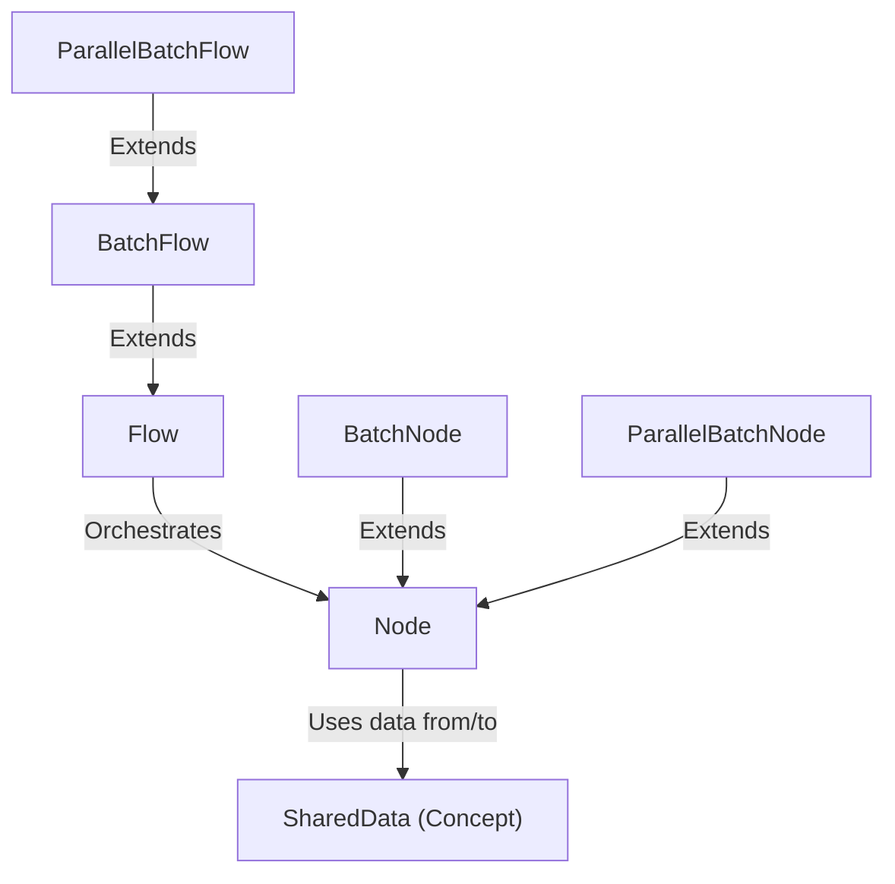

# Tutorial: PocketFlow-Typescript

PocketFlow-Typescript is a framework for building *data processing workflows*.
It allows you to define individual task units called **Nodes**, which perform specific operations.
These Nodes are organized and executed in sequence by a **Flow**.
Data and context are passed between Nodes within a Flow using **SharedData**.
The framework provides specialized types:
- **BatchNode** and **ParallelBatchNode** are Nodes designed to process collections of items, either *sequentially* or in *parallel*.
- **BatchFlow** and **ParallelBatchFlow** are Flows that execute an entire sub-flow multiple times for different sets of parameters, either *sequentially* or in *parallel*.

**Source Repository:** [https://github.com/The-Pocket/PocketFlow-Typescript](https://github.com/The-Pocket/PocketFlow-Typescript)

## Chapters

1. [SharedData (Concept)](01_shareddata__concept_.md)
2. [Node](02_node.md)
3. [Flow](03_flow.md)
4. [BatchNode](04_batchnode.md)
5. [ParallelBatchNode](05_parallelbatchnode.md)
6. [BatchFlow](06_batchflow.md)
7. [ParallelBatchFlow](07_parallelbatchflow.md)

---

Generated by [AI Codebase Knowledge Builder](https://github.com/The-Pocket/Tutorial-Codebase-Knowledge)