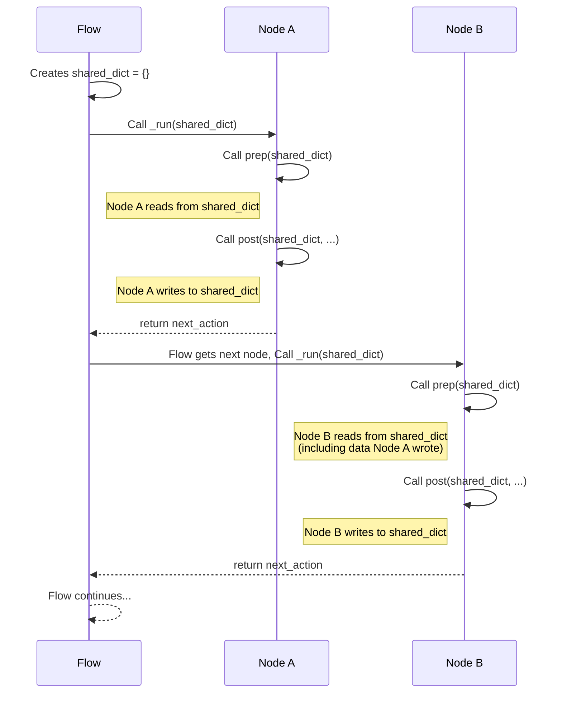

# Chapter 1: Shared Store

Welcome to the PocketFlow tutorial! In this first chapter, we'll explore the fundamental concept of the "Shared Store". Imagine PocketFlow as a factory assembly line, where different stations (called **Nodes**) perform specific tasks. For these stations to work together and pass parts along, they need a common place to interact. That's where the Shared Store comes in!

## What is the Shared Store?

Think of the Shared Store as a central workbench or a shared whiteboard that every station on our assembly line can see and interact with. In PocketFlow, this "workbench" is simply a standard Python dictionary.

```python
# This is what the Shared Store looks like internally
shared_store = {} # It's just a dictionary!
```

This dictionary is given to every [Node](02_node_.md) when it runs. It exists for the entire duration of your PocketFlow execution, allowing nodes to write information for later nodes to read.

## Why Do We Need It?

PocketFlow is designed so that each [Node](02_node_.md) focuses on one specific task, like reading input, processing data, or displaying results. Often, the result of one node is needed as input for another. The Shared Store provides a standardized and easy way for nodes to exchange this information without needing direct, complicated connections between every possible pair of nodes.

Consider our simple word counter example. We need:
1.  A node to get text input.
2.  A node to count words in that text.
3.  A node to display the cumulative statistics.

The node that gets the input needs to pass the text to the node that counts words. The node that counts words needs to update a running total that the display node will read. The Shared Store is the perfect place for all this data to live: the input text, the counted words, and the running totals (total texts processed, total words).

## How Nodes Use the Shared Store

Nodes in PocketFlow interact with the Shared Store primarily in their `prep` and `post` methods. (Don't worry too much about what these methods *do* just yet; we'll cover them in the [Node](02_node_.md) chapter. For now, just know they are where nodes get ready and wrap up.)

*   **`prep(shared)`:** In the `prep` phase, a node typically *reads* data it needs from the `shared` dictionary.
    ```python
    # Example from our WordCounter node (simplified)
    # nodes.py
    class WordCounter:
        def prep(self, shared):
            """Get text from shared store before counting."""
            # We expect 'text' to be in the shared dictionary
            text_to_process = shared["text"]
            # Return the text, which will be passed to 'exec'
            return text_to_process
    ```
    Here, the `WordCounter` node looks in the `shared` dictionary for an item with the key `"text"`. This text was put there by a previous node (the `TextInput` node).
*   **`post(shared, prep_res, exec_res)`:** In the `post` phase, a node typically *writes* its results or updates state back into the `shared` dictionary.
    ```python
    # Example from our WordCounter node (simplified)
    # nodes.py
    class WordCounter:
        # ... (prep and exec methods)
        def post(self, shared, prep_res, exec_res):
            """Update statistics in shared store after counting."""
            # 'exec_res' is the result from the 'exec' method (the word count)
            # We access the 'stats' dictionary within the shared dictionary
            shared["stats"]["total_words"] += exec_res
            # We don't need to return anything for Shared Store interaction here
            # return "show" # This is for flow control, covered later
    ```
    In this `post` method, the `WordCounter` takes the word count it calculated (`exec_res`) and adds it to a value stored in the `shared` dictionary under the path `shared["stats"]["total_words"]`. A different node (like `TextInput` in our example) would have created `shared["stats"]` initially.

Notice that the `shared` dictionary is passed into *both* `prep` and `post` methods, allowing the node to access the shared data regardless of its current phase.

## Putting Data into the Shared Store

The *first* node that needs to use a piece of shared data is responsible for putting it there or ensuring it exists. In our word counter, the `TextInput` node does this.

```python
# Example from our TextInput node (simplified)
# nodes.py
class TextInput:
    # ... (prep method reads input)
    def post(self, shared, prep_res, exec_res):
        """Store text and initialize/update statistics."""
        # 'prep_res' holds the text input from the user
        shared["text"] = prep_res # Put the text into shared

        # Initialize statistics if needed, then update
        if "stats" not in shared:
            shared["stats"] = { # Create the 'stats' dictionary if it's not there
                "total_texts": 0,
                "total_words": 0
            }
        shared["stats"]["total_texts"] += 1 # Update a value within 'stats'

        # return "count" # For flow control
    ```
This code snippet shows how `TextInput` first stores the user's input string under the key `"text"`. Then, it checks if a key `"stats"` exists. If not, it creates it, initializing it as a dictionary with starting values. Finally, it increments the `total_texts` count inside the `"stats"` dictionary.

Subsequent nodes (like `WordCounter` and `ShowStats`) can now reliably find `"text"` and `"stats"` in the `shared` dictionary.

## How it Works Internally (Simplified)

The "brain" of PocketFlow that runs the nodes is the [Flow](04_flow_.md). When you start a [Flow](04_flow_.md), it creates *one single instance* of the `shared` dictionary. As the [Flow](04_flow_.md) goes from one [Node](02_node_.md) to the next, it passes this *exact same* dictionary object to each node's `prep` and `post` methods.



Let's look at the core parts in the `PocketFlow/__init__.py` file (don't worry about *all* the code, just how `shared` is handled):

First, the `Flow`'s internal orchestration method `_orch` (simplified) loops through the nodes:

```python
# PocketFlow/__init__.py (Simplified Flow)
class Flow:
    # ... other methods ...
    def _orch(self, shared, params=None):
        # Get the starting node
        curr = self.start_node
        # Loop as long as there's a node to run
        while curr:
            # Call the node's internal run method, passing the shared dictionary
            last_action = curr._run(shared)
            # Determine the next node based on the result (action)
            curr = self.get_next_node(curr, last_action)
        # return last_action # Simplified return
```
See how `_orch` consistently passes the `shared` object to `curr._run(shared)`.

Next, look at the base `Node`'s internal `_run` method (simplified), which orchestrates the node's own steps:

```python
# PocketFlow/__init__.py (Simplified BaseNode)
class BaseNode:
    # ... other methods ...
    def _run(self, shared):
        # Call prep BEFORE exec, passing the shared dictionary
        p = self.prep(shared)
        # Execute the main logic (doesn't see shared directly here)
        e = self._exec(p)
        # Call post AFTER exec, passing the same shared dictionary
        result = self.post(shared, p, e)
        return result
```
This shows explicitly that `prep` and `post` receive the `shared` dictionary as an argument. The `_exec` method only receives the result from `prep`.

This consistent passing of the single `shared` dictionary is the magic behind how nodes can share information.

## Analogy Refined

Imagine the `shared` dictionary is like a large whiteboard in a meeting room. Each [Node](02_node_.md) entering the room can read anything already written on the whiteboard (`prep`), perform its calculation based on what it read (and perhaps its own specific configuration or outside input), and then write its results or updates back onto the whiteboard (`post`) for the next person (node) entering the room.

## Conclusion

The Shared Store is the central hub for data exchange between nodes in PocketFlow. It's a simple dictionary that allows nodes to easily read information they need in their `prep` phase and write their results or updated state in their `post` phase. This pattern keeps nodes focused on their specific tasks while providing a flexible way for data to flow through your workflow.

Now that you understand how nodes communicate using the Shared Store, let's take a closer look at the "stations" themselves: the [Node](02_node_.md)s.

[Node](02_node_.md)

---

Generated by [AI Codebase Knowledge Builder](https://github.com/The-Pocket/Tutorial-Codebase-Knowledge)