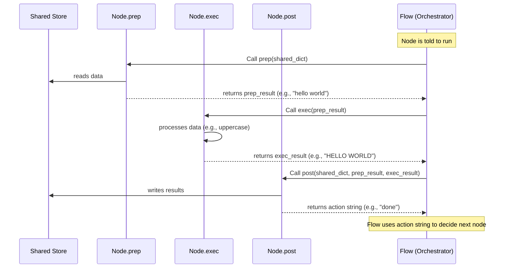

# Chapter 2: Node

Welcome back to the PocketFlow tutorial! In Chapter 1, we learned about the [Shared Store](01_shared_store_.md) – the central place where all the data for our PocketFlow assembly line lives. Now, let's move on to the "workers" or "stations" on that line: the **Nodes**. Nodes are the active components that actually *do* the work, taking data from the [Shared Store](01_shared_store_.md), processing it, and potentially putting results back.

## What is a Node?

At its heart, a **Node** in PocketFlow is your fundamental building block for performing a single, distinct task within a workflow. Think of it as a dedicated machine or station on our factory assembly line. One node might take a raw material, the next might shape it, and another might paint it. Each is specialized, self-contained, and has a clear input and output (via the [Shared Store](01_shared_store_.md)).

Why use Nodes? Because they encourage you to break down complex processes into smaller, manageable steps. This makes your workflows easier to build, understand, test, and maintain.

Let's imagine a simple task: converting a piece of text to uppercase. This is a perfect job for a single Node.

## The Three Phases of a Node

Every basic `Node` in PocketFlow follows a predictable three-phase life cycle when it runs:

1.  **`prep(shared)`**: **Preparation.** This is where the node gets ready. It typically *reads* any data it needs from the [Shared Store](01_shared_store_.md) (`shared` dictionary). It might also gather necessary configuration (`self.params`). The *result* of the `prep` method is passed directly as input to the next phase, `exec`.
2.  **`exec(prep_res)`**: **Execution.** This is the core logic phase. The node performs its main task using the data provided by `prep` (`prep_res`). **Important:** The `exec` method *does not* directly access the [Shared Store](01_shared_store_.md). It focuses purely on processing the input it received from `prep`. Its *result* is passed to the final phase, `post`.
3.  **`post(shared, prep_res, exec_res)`**: **Post-Execution/Cleanup/Decision.** This is where the node finishes up. It typically takes the result from `exec` (`exec_res`) and *writes* it back into the [Shared Store](01_shared_store_.md) (`shared`). It can also access the `prep` results (`prep_res`) and the [Shared Store](01_shared_store_.md) directly. Crucially, the value returned by `post` is an **action signal** that tells the overall [Flow](04_flow_.md) what node to run next.

Let's illustrate with our uppercase text example. We want a Node that:
*   Reads text from `shared["input_text"]` (in `prep`).
*   Converts that text to uppercase (in `exec`).
*   Writes the result to `shared["output_text"]` and signals it's done (in `post`).

Here's how you'd define such a Node:

```python
# Define our custom Node
from pocketflow import Node # We import the base Node class

class UppercaseNode(Node):
    def prep(self, shared):
        """Read input text from the Shared Store."""
        # Get the text we expect another node has placed here
        input_text = shared.get("input_text", "") # Use .get for safety
        print(f"Prep: Reading '{input_text}' from shared.")
        # Return the text; exec will receive this
        return input_text

    def exec(self, text_to_process):
        """Convert the text to uppercase."""
        print(f"Exec: Uppercasing '{text_to_process}'...")
        # This method ONLY works on the input it receives (text_to_process)
        uppercase_text = text_to_process.upper()
        # Return the result; post will receive this
        return uppercase_text

    def post(self, shared, prep_res, exec_res):
        """Store the result back in the Shared Store and signal completion."""
        # exec_res contains the uppercase text from the exec method
        processed_text = exec_res
        print(f"Post: Writing '{processed_text}' to shared.")
        # Write the result back into the shared dictionary
        shared["output_text"] = processed_text
        print("Post: Signaling 'done'.")
        # Return an action string - this tells the Flow what to do next
        return "done"
```

This code defines a class `UppercaseNode` that inherits from `pocketflow.Node`. We've implemented the `prep`, `exec`, and `post` methods following the pattern.

*   `prep` reads from `shared`.
*   `exec` performs the uppercase conversion using its input (`text_to_process`).
*   `post` writes to `shared` and returns `"done"`.

## How Data Flows Through a Node

Here's a simple visual of how data moves when a Node runs:



As you can see, `prep` and `post` are the only methods that interact with the [Shared Store](01_shared_store_.md), acting like gates or access points. `exec` is isolated, focusing on the pure computation. This separation of concerns is a core principle of PocketFlow.

## Running a Single Node (for Testing)

While nodes are typically used within a [Flow](04_flow_.md) (which we'll cover in Chapter 4), you can run a single node directly for testing:

```python
from pocketflow import Node # ... (and the UppercaseNode class from above)

# Create the shared dictionary
shared_data = {"input_text": "hello pocketflow"}

# Create an instance of our Node
uppercase_processor = UppercaseNode()

print("--- Running Node ---")
# Run the node, passing the shared data
action_returned = uppercase_processor.run(shared_data)
print("--- Node Finished ---")

print("\nShared data after run:", shared_data)
print("Action returned by post:", action_returned)
```

**Expected Output (simplified):**

```
--- Running Node ---
Prep: Reading 'hello pocketflow' from shared.
Exec: Uppercasing 'hello pocketflow'...
Post: Writing 'HELLO POCKETFLOW' to shared.
Post: Signaling 'done'.
--- Node Finished ---

Shared data after run: {'input_text': 'hello pocketflow', 'output_text': 'HELLO POCKETFLOW'} # Note the new key!
Action returned by post: done
```

Running the node updates the `shared_data` dictionary with the result, demonstrating how a single Node performs its task and interacts with the [Shared Store](01_shared_store_.md). The `action_returned` is what the [Flow](04_flow_.md) would use to decide the next step.

## How it Works Internally (Simplified `_run`)

The inner workings of a `Node` revolve around its internal `_run` method (which is called by `.run()` and by the [Flow](04_flow_.md)). This method orchestrates the calls to `prep`, `_exec`, and `post`.

Looking at the base `BaseNode` class in `pocketflow/__init__.py`:

```python
# pocketflow/__init__.py (Simplified BaseNode)
class BaseNode:
    # ... other methods like __init__, set_params, next ...

    def _exec(self,prep_res): # Internal exec handler
        # The base _exec just calls the user-defined exec
        return self.exec(prep_res)

    def _run(self,shared):
        # 1. Call prep, passing the shared dictionary
        p = self.prep(shared)
        # 2. Call _exec (which calls exec), passing the result from prep
        e = self._exec(p)
        # 3. Call post, passing shared, prep result, and exec result
        result = self.post(shared, p, e)
        # Return the action string from post
        return result

    # ... run method (calls _run), __rshift__, __sub__ ...
```

This snippet shows the core logic: `_run` drives the sequence, ensuring the right arguments (`shared`, `p`, `e`) are passed to `prep`, `_exec`, and `post` in the correct order. This simple pattern provides the structure for all nodes.

Why the `_exec` internal method? The base `BaseNode`'s `_exec` just calls `self.exec(prep_res)`. However, subclasses like `Node` (which adds retries/fallback) and `BatchNode` override `_exec` to add extra logic around the basic `exec` call, without requiring you to change your core `exec` implementation.

## Variations on the Node Theme

PocketFlow provides a few specialized types of Nodes for common patterns:

*   **`Node`**: The standard node, as discussed. Includes built-in support for retries and fallback logic around the `exec` method.
*   **`BatchNode`**: Designed to handle lists of items. Its `_exec` method iterates through a list provided by `prep` and calls the user's `exec` method for each item. The result of `_exec` is a list of the results from processing each item. Great for processing multiple inputs at once. (We'll cover this in [Batch Processing](05_batch_processing_.md)).
*   **`AsyncNode`**: For tasks that are asynchronous (like waiting for an API call while doing other things). Uses `async def` methods (`prep_async`, `exec_async`, `post_async`) and is run by an [AsyncFlow](06_asynchronous_processing_.md). (Covered in [Asynchronous Processing](06_asynchronous_processing_.md)).
*   **`AsyncBatchNode`** / **`AsyncParallelBatchNode`**: Combine batch processing and asynchronous execution. ([Asynchronous Processing](06_asynchronous_processing_.md), [Parallel Processing](07_parallel_processing_.md)).

For now, focus on the basic `Node` and its `prep`/`exec`/`post` pattern. The other node types build upon this fundamental structure.

## Analogy Recap

Let's refine our assembly line analogy:
*   The **[Shared Store](01_shared_store_.md)** is the central storage area holding all parts and notes (status, configuration, results).
*   A **Node** is a specific workstation.
*   The `prep` phase is when the worker at the station checks the central storage area, gathers the specific parts/notes they need for their task, and organizes them locally on their workbench (`prep_res`).
*   The `exec` phase is the actual work on the workbench using the gathered items (`prep_res`). The worker doesn't go back to the central storage during this intense phase.
*   The `post` phase is when the worker finishes, takes their result (`exec_res`), updates the status on the notes (`prep_res`), puts the processed item/result back into the central storage (`shared`), and signals to the supervisor (the [Flow](04_flow_.md)) what kind of item they finished and what needs to happen next (`return action`).

## Conclusion

Nodes are the core units of work in PocketFlow. By implementing the `prep`, `exec`, and `post` methods, you define a self-contained task that interacts predictably with the [Shared Store](01_shared_store_.md). This structure promotes clean, modular code.

The `post` method's return value – the **action signal** – is incredibly important, as it's how one Node communicates to the orchestrator ([Flow](04_flow_.md)) which Node should run next.

In the next chapter, we'll dive deeper into these **Actions** and see how they are the key to building sequences and branches in your PocketFlow workflows.

[Actions](03_actions_.md)

---

Generated by [AI Codebase Knowledge Builder](https://github.com/The-Pocket/Tutorial-Codebase-Knowledge)