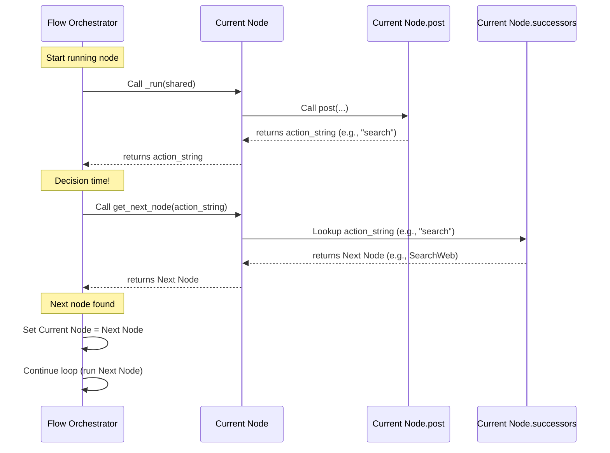

# Chapter 3: Actions

Welcome back to the PocketFlow tutorial! In Chapter 1, we learned about the [Shared Store](01_shared_store_.md), the central data hub. In Chapter 2, we explored [Node](02_node_.md)s, the work units that perform tasks and interact with the [Shared Store](01_shared_store_.md) through their `prep`, `exec`, and `post` methods.

Now, we come to a crucial question: If a [Flow](04_flow_.md) is a sequence of [Node](02_node_.md)s, how does the [Flow](04_flow_.md) know which [Node](02_node_.md) to run *after* the current one finishes? What if, based on the work done by a [Node](02_node_.md), you need to go to *different* next steps?

This is where **Actions** come in. Actions are PocketFlow's way of adding decision-making and branching logic to your workflows, allowing your [Flow](04_flow_.md) to dynamically determine the path it takes.

## What are Actions?

Think of **Actions** as signals or instructions that a [Node](02_node_.md) sends back to the main [Flow](04_flow_.md) after it has completed its task.

Specifically, an Action is the `string` value that your [Node](02_node_.md)'s `post` method returns. This string acts like a switch that tells the [Flow](04_flow_.md) which path to follow to the next [Node](02_node_.md).

Let's revisit our factory assembly line analogy. A [Node](02_node_.md) is a workstation. After the worker at the station finishes their job, they need to put the item on the right conveyor belt to send it to the *next* appropriate station. An Action is like a label they attach to the item, or a button they press, that automatically routes the item to the correct belt (and thus, the next station).

## Why Do We Need Actions?

Without Actions, a [Flow](04_flow_.md) could only be a straight line: Node A always goes to Node B, Node B always goes to Node C, and so on. This is useful for simple linear tasks, but most real-world processes involve decisions.

*   If data is good, proceed to processing. If data is bad, go to error handling.
*   If the user wants option A, go to Node X. If they want option B, go to Node Y.
*   After searching for information, check if we have enough info to answer, or if we need another search.

Actions returned by the `post` method allow the [Node](02_node_.md) itself, based on its processing (perhaps the result of `exec_res` or data in `shared`), to dictate the *next* step in the workflow.

## How Nodes Return Actions

As mentioned, Actions are the return value of the `post` method.

In Chapter 2, our `UppercaseNode` example had a `post` method that looked like this:

```python
# Simplified UppercaseNode's post method
class UppercaseNode(Node):
    # ... prep and exec methods ...
    def post(self, shared, prep_res, exec_res):
        """Store the result and signal completion."""
        # ... write to shared ...
        print("Post: Signaling 'done'.")
        # >>> This is the ACTION! <<<
        return "done"
```

When this `UppercaseNode` finishes running, its `post` method returns the string `"done"`. The [Flow](04_flow_.md) that ran this node receives this `"done"` action and uses it to figure out what to do next.

## How the Flow Uses Actions: Defining Transitions

The [Flow](04_flow_.md) needs to know what each possible Action string means for a given [Node](02_node_.md). You define these connections when you build your [Flow](04_flow_.md).

PocketFlow provides a clean, readable syntax for defining these transitions using Python's `>>` and `-` operators overloaded by the `BaseNode` class:

```python
node_a - "action_string" >> node_b
```

This line tells the [Flow](04_flow_.md): "If `node_a` returns the action string `"action_string"` from its `post` method, the very next node to execute should be `node_b`."

You can define multiple potential transitions for a single node based on different action strings:

```python
node_that_decides = MyDecisionNode()
path_if_yes = YesHandlerNode()
path_if_no = NoHandlerNode()

# If MyDecisionNode returns "yes", go to YesHandlerNode
node_that_decides - "yes" >> path_if_yes

# If MyDecisionNode returns "no", go to NoHandlerNode
node_that_decides - "no" >> path_if_no
```

This creates branching logic in your workflow!

## The "Default" Action

What happens if a [Node](02_node_.md)'s `post` method returns `None`, or if it returns an action string for which you *haven't* specifically defined a transition using the `- "action" >>` syntax?

PocketFlow looks for a **"default"** transition. You can define this using just the `>>` operator:

```python
node_a >> node_b
node_a - "special_case" >> node_c # This connection takes precedence if "special_case" is returned
```

In this example, if `node_a` returns `"special_case"`, the [Flow](04_flow_.md) goes to `node_c`. If it returns anything *else* (like `None`, `"done"`, or a string like `"continue"` for which no specific transition is defined), the [Flow](04_flow_.md) follows the default `node_a >> node_b` path and goes to `node_b`.

If a node only has one outgoing arrow defined using `>>` (and no `- "action" >>` transitions), that single connection automatically becomes the default transition path. Returning `None` or any action string will follow that single `>>` path unless an explicit `- "action" >>` is also defined and matches the returned action.

## The Flow Stops

What happens if a [Node](02_node_.md) returns an action string from its `post` method, and there is *no* corresponding transition defined for that specific action *and* no default transition defined for that node?

In this case, the [Flow](04_flow_.md) simply stops execution. The workflow has reached an endpoint from the perspective of that branch. This is often how you signal the successful completion of a specific path in your flow (e.g., the `AnswerQuestion` node in the agent example returning `"done"`).

## Example: Simple Branching Flow

Let's create a minimal flow with branching using Actions. We'll have three simple nodes:

1.  `StartNode`: Returns either `"continue_a"` or `"continue_b"` based on some logic (here, hardcoded for simplicity).
2.  `NodeA`: Prints "Executing Node A".
3.  `NodeB`: Prints "Executing Node B".

```python
from pocketflow import Node, Flow

# --- Define our simple nodes ---
class StartNode(Node):
    def prep(self, shared):
        print("StartNode: Deciding next step...")
        # In a real case, this decision might be based on shared data or params
        next_action = shared.get("path_choice", "continue_a") # Get choice from shared
        return next_action # exec doesn't need anything here

    def exec(self, next_action):
        # Our exec doesn't do computation, just passes the action
        return next_action

    def post(self, shared, prep_res, exec_res):
        # We return the action value decided in prep/exec
        print(f"StartNode: Returning action '{exec_res}'")
        return exec_res # Return the action string

class NodeA(Node):
    def exec(self, prep_res): # prep_res is None as prep does nothing here
        print("--- Executing Node A ---")

class NodeB(Node):
    def exec(self, prep_res): # prep_res is None
        print("--- Executing Node B ---")

# --- Build the flow ---
# Create node instances
start = StartNode()
node_a = NodeA()
node_b = NodeB()

# Define transitions using actions
start - "continue_a" >> node_a # If start returns "continue_a", go to node_a
start - "continue_b" >> node_b # If start returns "continue_b", go to node_b

# Create the flow, starting with StartNode
simple_flow = Flow(start=start)

print("--- Running Flow (path_choice = 'continue_a') ---")
# Run the flow. We can pass initial data to the shared store.
initial_shared_a = {"path_choice": "continue_a"}
simple_flow.run(initial_shared_a)

print("\n--- Running Flow (path_choice = 'continue_b') ---")
initial_shared_b = {"path_choice": "continue_b"}
simple_flow.run(initial_shared_b)
```

**Expected Output:**

```
--- Running Flow (path_choice = 'continue_a') ---
StartNode: Deciding next step...
StartNode: Returning action 'continue_a'
--- Executing Node A ---

--- Running Flow (path_choice = 'continue_b') ---
StartNode: Deciding next step...
StartNode: Returning action 'continue_b'
--- Executing Node B ---
```

This example clearly shows how the string returned by `StartNode`'s `post` method (`exec_res` in this case) is used by the [Flow](04_flow_.md) to decide whether to go to `node_a` or `node_b`, based on the connections we defined.

Let's look at the Agent Flow example provided in the context.

```python
# cookbook/pocketflow-agent/flow.py (Snippet)
from pocketflow import Flow
from nodes import DecideAction, SearchWeb, AnswerQuestion # Assuming these nodes are defined

def create_agent_flow():
    decide = DecideAction() # Our starting node that makes decisions
    search = SearchWeb()     # Node for searching
    answer = AnswerQuestion() # Node for answering

    # Define transitions
    decide - "search" >> search  # If DecideAction returns "search", go to SearchWeb
    decide - "answer" >> answer  # If DecideAction returns "answer", go to AnswerQuestion

    search - "decide" >> decide  # After SearchWeb, go back to DecideAction

    # A transition is missing for the "done" action returned by AnswerQuestion.
    # This means the flow will stop when AnswerQuestion returns "done".

    return Flow(start=decide)
```

Here, the `DecideAction` node's `post` method returns either `"search"` or `"answer"` (as seen in `cookbook/pocketflow-agent/nodes.py`). The connections defined in the `create_agent_flow` function tell the [Flow](04_flow_.md) where to go next for each of those actions. The `SearchWeb` node always returns `"decide"`, looping the flow back to the `DecideAction` node until it decides to finally return `"answer"`. When `AnswerQuestion` returns `"done"`, the flow stops because no further transition is defined for that action from that node.

## How it Works Internally (Simplified)

Let's peek under the hood to see how PocketFlow uses the Action string internally.

The core logic is handled by the `Flow` and `BaseNode` classes in `pocketflow/__init__.py`.

First, defining a transition like `node_a - "action" >> node_b` is just syntactic sugar. The `- "action" >> node_b` part calls methods on `node_a`.

```python
# PocketFlow/__init__.py (Simplified BaseNode)
class BaseNode:
    def __init__(self):
        # ... other setup ...
        self.successors={} # This dictionary stores the next nodes per action

    # This method is called by the >> operator
    def next(self,node,action="default"):
        if action in self.successors:
             # Warning if you accidentally overwrite a connection
             warnings.warn(f"Overwriting successor for action '{action}'")
        # Store the 'node' as the successor for this specific 'action' string
        self.successors[action]=node
        return node # Allow chaining connections: node_a >> node_b >> node_c

    # This method is called by the - operator
    # It returns a temporary object that waits for the >>
    def __sub__(self,action):
        if isinstance(action,str):
            # Create a helper object that knows the source node and the action
            return _ConditionalTransition(self,action)
        raise TypeError("Action must be a string")

class _ConditionalTransition:
    def __init__(self,src,action):
        self.src,self.action=src,action

    # This method is called on the temporary object by the >> operator
    # It finally calls the source node's 'next' method with the action
    def __rshift__(self,tgt):
        return self.src.next(tgt,self.action) # Calls BaseNode.next!
```

So, `node_a - "action" >> node_b` effectively becomes a call to `node_a.next(node_b, "action")`, storing `node_b` in `node_a.successors["action"]`. `node_a >> node_b` calls `node_a.next(node_b, "default")`, storing `node_b` in `node_a.successors["default"]`.

Next, the [Flow](04_flow_.md)'s orchestration method (`_orch`) runs nodes in a loop. After a node finishes, it needs to find the *next* node using the action it received from the `post` method.

```python
# PocketFlow/__init__.py (Simplified Flow)
class Flow:
    # ... other methods ...

    # Gets the next node based on the current node and the action returned
    def get_next_node(self,curr,action):
        # Look up the action in the current node's successors dictionary
        # Use the action if it exists, otherwise try 'default'
        nxt = curr.successors.get(action) or curr.successors.get("default")

        if not nxt and curr.successors:
            # If no successor for the action or default is found, and there
            # were *any* successors defined, warn the user that flow stops.
            warnings.warn(f"Flow ends: '{action}' not found in {list(curr.successors.keys())} for node {type(curr).__name__}")
        # Return the found node (or None if not found, telling _orch to stop)
        return nxt

    def _orch(self,shared,params=None):
        # Start with the first node
        curr = self.start_node
        # Loop while there's a current node to execute
        while curr:
            # 1. Set node parameters (covered later)
            curr.set_params(...)
            # 2. Run the current node (calls prep, exec, post)
            # This call returns the action string from post()
            last_action = curr._run(shared)
            # 3. Determine the next node using the action
            curr = self.get_next_node(curr, last_action)
        # Loop ends when get_next_node returns None
        return last_action # The final action returned before stopping
```

Here's the simple flow diagram showing how the action guides the process:



This internal view clarifies that the action returned by `post` is simply a lookup key used by the [Flow](04_flow_.md) to find the predefined next step in the `self.successors` dictionary.

## Analogy Refined One Last Time

Our factory assembly line analogy with Actions:
*   The **[Shared Store](01_shared_store_.md)** is the central storage.
*   A **[Node](02_node_.md)** is a workstation.
*   `prep`, `exec`, `post` is the work cycle at the station (gather materials, do the work, pack up results).
*   The **Action** returned by `post` is like a final Quality Control check's outcome *and* destination tag (e.g., "Passed QA - Send to Painting", "Failed QA - Send to Rework", "Done - Send to Shipping").
*   The connections like `station_a - "rework" >> rework_station` are the pre-configured conveyor belts or automated routing system.
*   The **[Flow](04_flow_.md)** is the overall supervisor, watching which route the item (and its attached action signal) takes to know which station will receive it next. If an item gets a tag ("defective product") for which there's no corresponding conveyor belt defined from this station, it just sits there, and the flow for that item stops.

## Conclusion

Actions are simple strings returned by a [Node](02_node_.md)'s `post` method, but they are fundamental to controlling the flow of execution in PocketFlow. By defining connections between [Node](02_node_.md)s using the `node - "action" >> next_node` syntax, you create dynamic paths that the [Flow](04_flow_.md) navigates based on the outcome of each [Node](02_node_.md). This allows you to build complex, branching workflows.

Now that you understand the building blocks – the [Shared Store](01_shared_store_.md) for data, the [Node](02_node_.md)s for work, and Actions for transitions – you're ready to learn about the orchestrator that brings it all together: the [Flow](04_flow_.md).

[Flow](04_flow_.md)

---

Generated by [AI Codebase Knowledge Builder](https://github.com/The-Pocket/Tutorial-Codebase-Knowledge)