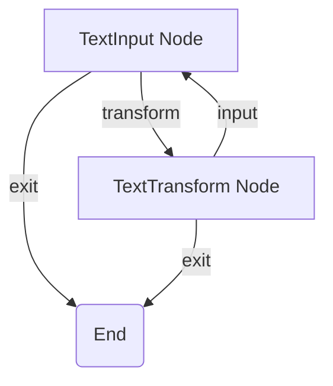
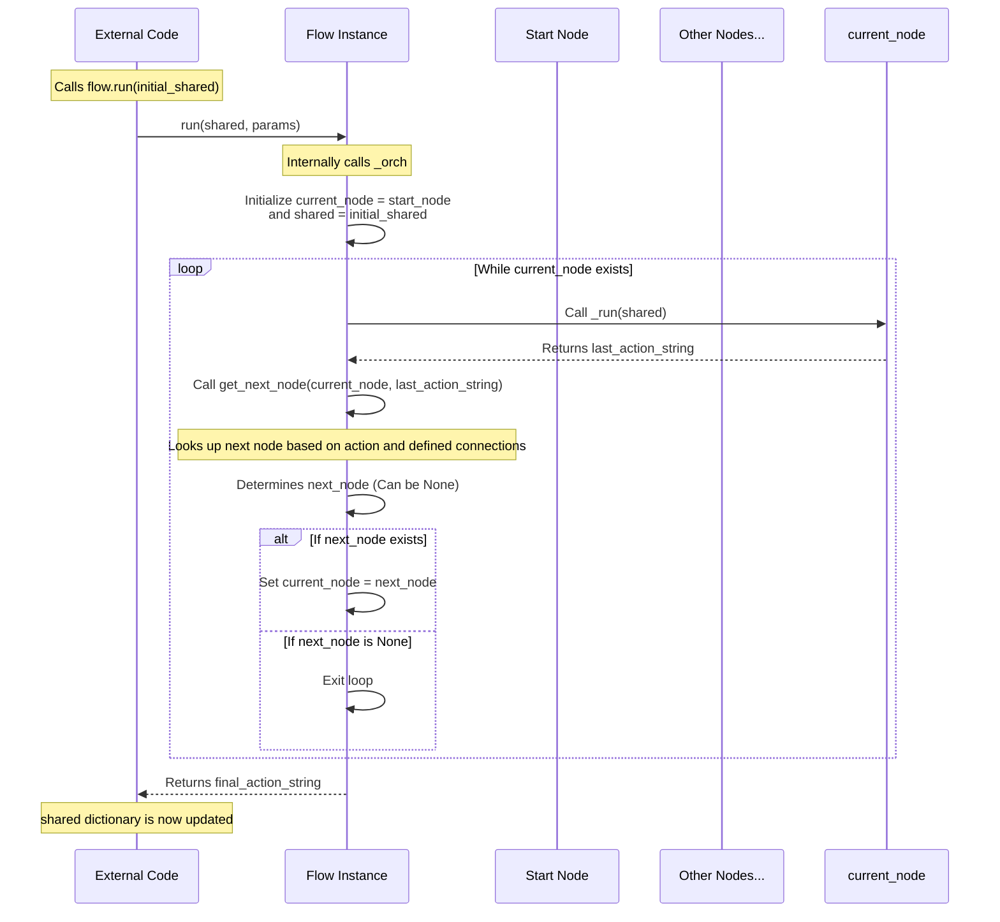

# Chapter 4: Flow

Welcome back to the PocketFlow tutorial! In our journey so far, we've discovered the fundamental building blocks of PocketFlow:
*   The [Shared Store](01_shared_store_.md): The central hub for data exchange.
*   The [Node](02_node_.md): The individual workstation that performs a specific task and interacts with the [Shared Store](01_shared_store_.md).
*   [Actions](03_actions_.md): The signals returned by a [Node](02_node_.md)'s `post` method that tell us what *could* happen next.

But even with these pieces, we still need something to bring it all together. How do you define the *entire sequence* of operations? How does the overall process *start*? And how does it move from one [Node](02_node_.md) to the next, using those [Actions](03_actions_.md) to navigate?

This is the job of the **Flow**.

## What is a Flow?

The **Flow** is the orchestrator, the conductor, the supervisor of your PocketFlow workflow. It defines the entire path or network of [Node](02_node_.md)s from start to finish (or until a specific condition is met).

Imagine our assembly line again. The [Shared Store](01_shared_store_.md) is the warehouse/whiteboard, [Node](02_node_.md)s are the workstations, and [Actions](03_actions_.md) are the labels on items indicating their next destination. The **Flow** is the physical layout of the factory, including where the line starts, how the conveyor belts are connected between stations based on those destination labels, and the system that keeps everything moving.

The main responsibilities of a `Flow` are:

1.  **Defining the Start:** You tell the Flow which [Node](02_node_.md) should be the very first one to execute.
2.  **Storing Connections:** It holds the map of how [Nodes](02_node_.md) are linked together using the [Actions](03_actions_.md) returned by their `post` methods (like `node_a - "action" >> node_b`).
3.  **Orchestrating Execution:** When you *run* the Flow, it creates a single [Shared Store](01_shared_store_.md) and steps through the [Nodes](02_node_.md) sequentially (or branching as defined), passing the same [Shared Store](01_shared_store_.md) to each one, until it reaches an endpoint.

Without a Flow, you would just have a collection of disconnected [Nodes](02_node_.md). The Flow gives structure and execution order to your process.

## Building a Flow

Building a Flow involves creating instances of your [Node](02_node_.md)s and then defining the connections between them.

Let's look at the simple text converter example from the project's `cookbook/pocketflow-flow/flow.py`:

```python
# cookbook/pocketflow-flow/flow.py (Simplified)
from pocketflow import Flow # Import Flow
# Assuming TextInputNode and TextTransformNode are defined elsewhere
# from nodes import TextInputNode, TextTransformNode

# --- Create node instances ---
text_input_node = TextInputNode()
text_transform_node = TextTransformNode()

# --- Define node connections using Actions ---
# If text_input_node returns "transform", go to text_transform_node
text_input_node - "transform" >> text_transform_node

# If text_transform_node returns "input", go back to text_input_node
text_transform_node - "input" >> text_input_node

# If either node returns "exit", the flow ends (no connection defined)

# --- Create the Flow, specifying the starting node ---
text_converter_flow = Flow(start=text_input_node)

# The flow variable now represents the complete workflow graph
```

**Explanation:**

1.  We import the necessary `Flow` class and our custom [Node](02_node_.md) classes.
2.  We create individual instances of each [Node](02_node_.md) we want to use in our workflow (`text_input_node`, `text_transform_node`).
3.  We use the `node - "action" >> next_node` and `node >> next_node` syntax we learned in Chapter 3 to define how the Flow should transition from one node to the next based on the action returned by the current node's `post` method.
    *   `text_input_node - "transform" >> text_transform_node` means if `text_input_node` returns `"transform"`, the Flow's next node is `text_transform_node`.
    *   `text_transform_node - "input" >> text_input_node` creates a loop! If `text_transform_node` returns `"input"`, the Flow goes back to `text_input_node`.
4.  Finally, we create the `Flow` object, importantly specifying which node (`text_input_node`) is the starting point (`start=...`).

This `text_converter_flow` variable now contains the entire structure of our workflow, including the starting point and all possible paths defined by the connections.

Here's a diagram representing this flow structure:



Notice how the arrows are labeled with the specific actions (`transform`, `input`, `exit`). The Flow itself is the overall diagram and the logic to follow the arrows based on the labels returned by the nodes. Returning "exit" stops the flow because no further connection is defined for that action from A or B.

## Running a Flow

Once you have built a Flow, you execute it by calling its `run` method.

```python
# In your main script, e.g., main.py
from flow import create_text_converter_flow # Assuming the flow is created in a function

# Create the flow instance
my_workflow = create_text_converter_flow() # Example using a function

# --- Run the flow ---
print("Starting Text Converter Flow...")
# We pass the initial shared data (an empty dictionary is fine to start)
final_action = my_workflow.run(shared={})
print(f"Flow finished. Final action returned: {final_action}")

# The 'shared' dictionary now contains all data modified by the nodes
# You could inspect it here if needed: print(shared)
```

**Explanation:**

*   You get your Flow instance ready.
*   You call `flow.run(shared_data)`.
    *   PocketFlow takes the dictionary you pass to `shared` and uses it as the *single* [Shared Store](01_shared_store_.md) instance for this entire run of the flow.
    *   The Flow starts executing from the `start_node` you defined.
    *   It continues running nodes and following the connections based on returned [Actions](03_actions_.md) until no further node can be found for the action returned by the last completed node.
*   The `run` method returns the action string that was returned by the very last node executed before the flow stopped.

The `shared` dictionary you passed into `run` will be the same dictionary that is passed to every node's `prep` and `post` methods throughout the flow's execution. This is how data persists and is shared across the different steps of the workflow.

Let's revisit the Agent Flow example from the context as well:

```python
# cookbook/pocketflow-agent/main.py (Snippet)
from flow import create_agent_flow

# Create the agent workflow
agent_workflow = create_agent_flow()

# Define initial data for the shared store
# This might include the user's query
initial_data = {"query": "What is the capital of PocketFlow?"}

# Run the workflow. The process will start, run the nodes,
# and update the 'initial_data' dictionary.
print("Starting Agent Flow...")
final_state = agent_workflow.run(shared=initial_data)
print(f"\nFlow Finished. Final state result: {final_state}")
# The initial_data dictionary will now contain results from the nodes,
# e.g., initial_data["answer"]
```

This shows the same pattern: define the Flow structure, prepare initial data in a dictionary, and call `flow.run()` with that dictionary.

## How it Works Internally (Simplified)

The `Flow` class inherits from `BaseNode`, but its core logic for orchestration is found in its `_orch` method (orchestrate). This method is called internally by `flow.run()`.

Here's a simplified look at the key steps within `_orch`:



This diagram illustrates that the `Flow` object drives the process. It calls `_run` on the current [Node](02_node_.md), waits for the action, uses its internal connection map to find the next node, and repeats until no next node is found.

Let's look at the simplified code from `pocketflow/__init__.py`:

```python
# pocketflow/__init__.py (Simplified Flow)
class Flow(BaseNode):
    def __init__(self,start=None):
        super().__init__() # Initialize like a node (gets successors dict)
        self.start_node=start # Store the designated start node

    def get_next_node(self,curr,action):
        # Look up the action returned by 'curr' in its successors map
        # If not found, look for the 'default' successor
        nxt = curr.successors.get(action or "default")

        # Add a warning if flow explicitly stops due to no defined path
        if not nxt and curr.successors:
             warnings.warn(f"Flow ends: '{action}' not found in {list(curr.successors.keys())} for node {type(curr).__name__}")
        return nxt # Returns the found node or None

    def _orch(self,shared,params=None):
        # Start with the initial start node for THIS orchestration run
        curr = self.start_node
        last_action = None # Keep track of the last action returned

        # The main loop: continue as long as there's a node to run
        while curr:
            # Set parameters on the current node (we'll see this later)
            curr.set_params(params)
            # Run the node! This calls prep, exec, post and returns the action
            last_action = curr._run(shared)
            # Find the NEXT node using the current node and the action returned
            curr = self.get_next_node(curr, last_action)

        # Loop ends when get_next_node returns None. Return the last action.
        return last_action

    # The public run method just calls _orch internally
    # (Simplified - actual run has more, including potential prep/post for Flow itself)
    # def run(self,shared): return self._orch(shared, self.params)

    # Flows can also have prep/post, but often they just pass data to the orchestrator
    # def prep(self,shared): pass # Often overridden in subclasses like BatchFlow
    # def post(self,shared,prep_res,exec_res): return exec_res # Often returns the final orchestrator action
```

This snippet reveals the core loop in `_orch`: it runs a node (`_run`), gets the resulting action, and uses `get_next_node` to determine what `curr` should be in the next iteration. The loop naturally terminates when `get_next_node` returns `None`.

The structure defined using `>>` and `-` is processed *before* the flow is run, populating the `successors` dictionaries on each [Node](02_node_.md) instance. The `Flow` object then simply reads from these dictionaries during `get_next_node` to navigate the workflow graph it contains.

## Flows within Flows (Nested Flows)

A powerful feature of PocketFlow inherited from `BaseNode` is that a `Flow` *is* also a `BaseNode`. This means you can embed one `Flow` inside another `Flow`, treating the inner Flow like a single step in the outer Flow.

```python
from pocketflow import Flow, Node

# Assume we have a simple sub-flow defined
# It has a start node and some connections...
class SubFlow(Flow):
    def __init__(self):
        super().__init__(start=SubFlowNode1()) # Define its own start node
        node1 = SubFlowNode1()
        node2 = SubFlowNode2()
        node1 >> node2 # Define connections within the sub-flow
        node2 >> None # SubFlow ends after node2, returning whatever node2's post returned

# Assume we have nodes for the main flow
class MainFlowStart(Node): ...
class MainFlowEnd(Node): ...

# Build the main flow
start_node = MainFlowStart()
sub_flow_instance = SubFlow() # Create an instance of the SubFlow
end_node = MainFlowEnd()

# Integrate the SubFlow instance into the main flow
start_node >> sub_flow_instance # After start, run the SubFlow
sub_flow_instance >> end_node # After SubFlow finishes, run end_node

# Create and run the main flow
main_workflow = Flow(start=start_node)
# main_workflow.run(shared_data)
```

When the `start_node` finishes and returns the action that points to `sub_flow_instance`, the main `Flow` pauses its own orchestration and delegates execution to the `sub_flow_instance.run()` method. The sub-flow then runs its internal sequence of nodes. When the `sub_flow_instance` finishes (i.e., its internal `_orch` loop ends, perhaps after `SubFlowNode2` returns an action with no defined successor), the main `Flow` resumes, taking the action returned by the `sub_flow_instance`'s `post` method (which by default returns the last action from its internal `_orch`) to find the *next* node in the *main* flow's sequence (which is `end_node` in this case).

This allows you to modularize complex workflows into smaller, reusable sub-workflows.

## Analogy Refined

Revisiting the assembly line:
*   The **[Shared Store](01_shared_store_.md)** is the shared materials depot and status board.
*   **[Node](02_node_.md)s** are the individual workstations.
*   **[Actions](03_actions_.md)** are the output labels/routing instructions on finished items from a workstation.
*   The **Flow** is the entire automated conveyor system: it picks up an item at the start, moves it to the first station, reads the label it gets back, moves it along the correct belt to the next station corresponding to that label, and continues until an item gets a label that doesn't match any outgoing belt from that station.
*   **Nested Flows** are like a specialized sub-assembly zone within the factory. An item is routed *into* the sub-assembly zone (the sub-flow begins), goes through several steps *within* that zone, and when it's complete, it's put back onto the main factory floor's conveyor system with a new label indicating its next step in the primary process (the sub-flow finishes and its returned action determines the next step in the main flow).

## Conclusion

The Flow is the backbone of a PocketFlow application, orchestrating the execution of [Nodes](02_node_.md) and navigating through the workflow based on the [Actions](03_actions_.md) they return. By defining a start node and connecting nodes using the `>>` and `-` syntax, you build the complete workflow graph that the Flow executes, all while maintaining a single, shared [Shared Store](01_shared_store_.md). The ability to nest Flows allows for powerful modularity.

Now that you understand how to build and run a single sequence or branching workflow with Flow, we can explore specialized Flow types designed for common patterns, starting with processing lists of data using [Batch Processing](05_batch_processing_.md).

[Batch Processing](05_batch_processing_.md)

---

Generated by [AI Codebase Knowledge Builder](https://github.com/The-Pocket/Tutorial-Codebase-Knowledge)