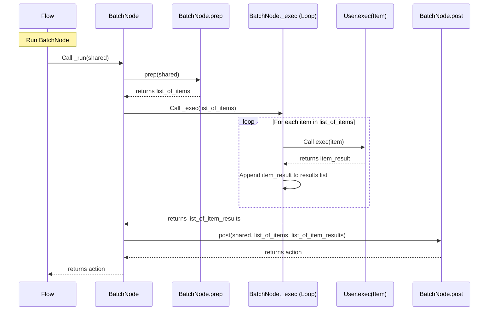
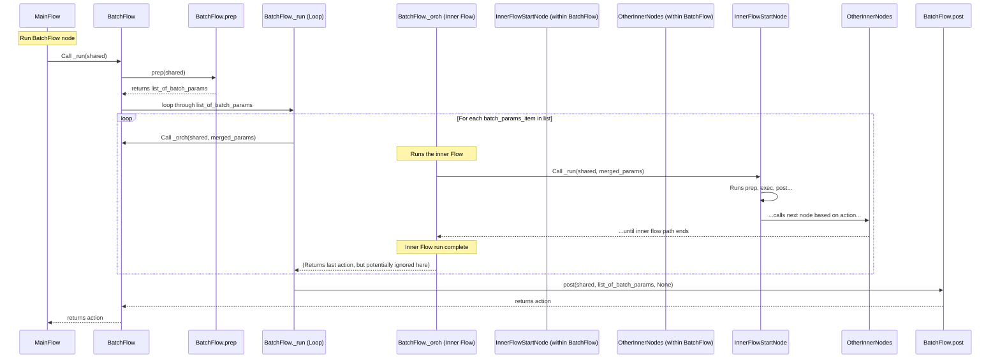

# Chapter 5: Batch Processing

Welcome back to the PocketFlow tutorial! In the previous chapters, we learned about the fundamental building blocks: the [Shared Store](01_shared_store_.md) ([Chapter 1](01_shared_store_.md)) for data, [Node](02_node_.md)s ([Chapter 2](02_node_.md)) for performing single tasks, [Actions](03_actions_.md) ([Chapter 3](03_actions_.md)) for controlling flow paths, and the [Flow](04_flow_.md) ([Chapter 4](04_flow_.md)) for orchestrating sequences and branches of nodes.

So far, our workflows have generally processed one main piece of "stuff" at a time – one text input, one decision, etc. But what if you have a *list* of things you need to process? Imagine you have a folder full of image files to resize, a list of database records to clean, or a batch of text documents to analyze. Running a separate, full workflow for each item could be inefficient or cumbersome to set up.

This is where **Batch Processing** comes in. PocketFlow provides special tools designed specifically for efficiently handling lists of data: the `BatchNode` and the `BatchFlow`.

## What is Batch Processing in PocketFlow?

Batch processing in PocketFlow is about applying the same logic (defined by a node or an entire flow) to a collection of items. Instead of your node's `exec` method handling a single item from `prep`, or your flow running once for everything, PocketFlow makes it easy to:

1.  **`BatchNode`**: Take a list of items provided by `prep` and automatically apply the node's core `exec` logic to *each item* individually, then gather all the results together for `post`.
2.  **`BatchFlow`**: Take a list of "batch parameters" (often representing items or groups of items) provided by its own `prep`, and and run its *entire inner Flow* once for *each* set of batch parameters.

This allows you to process many similar items efficiently and structure your workflow around collections of data.

## BatchNode: Processing a List Item-by-Item

The most common scenario is having a task (like resizing an image, parsing a single line of a log file, or summing a single number) that you need to apply to many inputs within a single overall workflow step. This is a perfect fit for a `BatchNode`.

A `BatchNode` works much like a regular `Node`, inheriting the `prep`/`exec`/`post` structure, but with a key difference in how its internal `_exec` method operates:

*   **`prep(shared)`**: As before, this method reads data from the [Shared Store](01_shared_store_.md). The crucial difference is that for a `BatchNode`, `prep` should return a **list** or other iterable collection of items that need processing.
*   **`exec(item)`**: This is where `BatchNode` works differently than you might expect based on a standard `Node`. When `BatchNode` internally runs, it will call *your* `exec` method *once for each individual item* in the list that your `prep` returned. So, your `exec` method should be designed to handle a *single* item, not the whole list.
*   **`post(shared, prep_res, exec_res)`**: This method again receives the `shared` store, the result from `prep` (`prep_res` - which is the original list of items), and the result from `_exec`. The `exec_res` for a `BatchNode` will be a **list** containing the result of running your `exec` method on *each* item from the input list. Your `post` method is responsible for handling this list of results – perhaps aggregating them, saving them, or putting them back into the `shared` store.

Let's illustrate with a simple example: we want a `BatchNode` that reads a list of numbers from the [Shared Store](01_shared_store_.md), squares each number, and puts the list of squared numbers back into the [Shared Store](01_shared_store_.md).

```python
# Simple BatchNode Example
from pocketflow import BatchNode, Flow

class SquareNumbersNode(BatchNode):
    def prep(self, shared):
        """Read the list of numbers from shared."""
        numbers_list = shared.get("numbers_to_square", [])
        print(f"Prep: Read list of {len(numbers_list)} numbers for batch processing.")
        # Return the list of items to be processed individually by exec
        return numbers_list

    def exec(self, number):
        """Square a single number."""
        # IMPORTANT: This exec is called for *each* item 'number' from the list
        print(f"  Exec: Squaring {number}...")
        return number * number

    def post(self, shared, prep_res, exec_res):
        """Store the list of squared results back in shared."""
        # exec_res is now a list of all the results from exec(number) calls
        squared_numbers = exec_res
        print(f"Post: Finished squaring batch. Processed {len(prep_res)} items.")
        # Put the list of results into the shared store
        shared["squared_numbers"] = squared_numbers
        # Signal completion (e.g., go to the next node or stop)
        return "done"

# --- How to use it in a Flow ---
square_node = SquareNumbersNode()

# This is a simple flow just running the one batch node
batch_square_flow = Flow(start=square_node)
# The node only has one path, which implicitly becomes the default 'done' path
square_node >> None # Explicitly stating no successors for 'done' action

# --- Run the flow ---
initial_shared_data = {"numbers_to_square": [1, 2, 3, 4, 5]}

print("--- Running BatchNode Flow ---")
final_action = batch_square_flow.run(shared=initial_shared_data)
print("--- BatchNode Flow Finished ---")

# Check the shared data after the flow runs
print("\nShared data after run:", initial_shared_data)
print("Final action:", final_action)
```

**Expected Output (simplified):**

```
--- Running BatchNode Flow ---
Prep: Read list of 5 numbers for batch processing.
  Exec: Squaring 1...
  Exec: Squaring 2...
  Exec: Squaring 3...
  Exec: Squaring 4...
  Exec: Squaring 5...
Post: Finished squaring batch. Processed 5 items.
--- BatchNode Flow Finished ---

Shared data after run: {'numbers_to_square': [1, 2, 3, 4, 5], 'squared_numbers': [1, 4, 9, 16, 25]}
Final action: done
```

Notice how the `exec` method (`exec(self, number):`) only takes a single `number` as input, even though the `prep` method returned a list of numbers. PocketFlow's `BatchNode` handles the looping and applying your single-item `exec` logic to each item internally. The `post` method then conveniently receives a list (`exec_res`) containing all the individual results.

This pattern is extremely useful for tasks that involve applying the same function to many distinct pieces of data fetched or generated in the `prep` stage. The `cookbook/pocketflow-batch-node` example uses a `BatchNode` to process a large CSV file in chunks, where `prep` reads and splits the file into chunked lists of rows, `exec` processes the rows in a single chunk, and `post` aggregates results from all chunks.

## BatchFlow: Running an Entire Workflow for Each Item/Batch

Sometimes, processing a batch of items isn't just a single step, but requires an *entire mini-workflow* to be run for each item or group of items. For example, processing a list of user requests, where each request needs several steps: validation, data lookup, processing, and logging. Doing this with a single `BatchNode` would be difficult because its `exec` method is designed for a single function call per item, not an entire sequence of nodes.

This is where `BatchFlow` comes in. A `BatchFlow` inherits from `Flow` but is designed to execute its *internal workflow* repeatedly – once for each "batch parameter" prepared by its own `prep` method.

*   **`prep(shared)`**: Like `BatchNode`, `BatchFlow.prep` reads from `shared`. It should return an iterable (like a list) where each element represents the data or configuration needed for one execution of the inner flow. Often, this list contains dictionaries, where each dictionary holds parameters or initial data for a single batch run.
*   **`_run(shared)` (internal override)**: The `BatchFlow` overrides the `Flow`'s `_run` method. After calling its own `prep`, it loops through the list returned by `prep`. For *each* item (`bp`) in that list, it runs its internal orchestration (`self._orch`). It often merges the batch item (`bp`) with the flow's other `params` to configure the nodes inside the inner flow for that specific batch.
*   **Inner Flow:** The `BatchFlow` contains a standard `Flow` defined by its `start_node` and connections (`>>`, `-`). This inner flow should be designed to process a *single* batch item/group. Nodes within this inner flow will be configured by the parameters passed during that specific batch run.
*   **`post(shared, prep_res, exec_res)`**: `BatchFlow.post` receives the `shared` store (which has been updated by *all* the inner flow runs), the result from its `prep` (`prep_res`), and `None` for `exec_res` (the results aren't automatically collected like in `BatchNode`). You're responsible here for aggregating results that nodes *within* the inner flow have placed in the `shared` store.

Let's use a simplified example: we have a list of tasks, each with a name and maybe some settings. We want to run a simple node ("ProcessTaskNode") for each task in the list.

```python
# Simple BatchFlow Example
from pocketflow import BatchFlow, Node, Flow # Need Flow for the inner flow definition

# Define a simple node that represents one step inside the batch flow
class ProcessTaskNode(Node):
    def prep(self, shared):
        """Read task name from shared (or params)."""
        # Flow often passes params, or nodes read from shared
        task_name = shared.get("current_task_name", "Unknown Task")
        print(f"  Prep(ProcessTaskNode): Preparing for task '{task_name}'")
        # Can return data needed by exec
        return {"name": task_name}

    def exec(self, prep_res):
        """Simulate processing based on input."""
        task_info = prep_res
        print(f"    Exec(ProcessTaskNode): Processing task file for '{task_info['name']}'...")
        # Simulate some result
        result = f"Processed {task_info['name']} successfully."
        return result

    def post(self, shared, prep_res, exec_res):
        """Store result back in shared."""
        task_name = prep_res.get("name", "Unknown Task")
        processed_result = exec_res
        # In a real BatchFlow, nodes often append to a list in shared
        if "task_results" not in shared:
            shared["task_results"] = []
        shared["task_results"].append(processed_result)
        print(f"  Post(ProcessTaskNode): Stored result for '{task_name}'")
        # Return action for the inner flow (this inner flow has no other nodes)
        return "done_task" # This action stops the inner flow run for this task


# Define the BatchFlow
class MyBatchProcessFlow(BatchFlow):
    def __init__(self):
        # Initialize as a BatchFlow (inherits from Flow)
        super().__init__()

        # Create nodes for the *inner* flow
        task_processor = ProcessTaskNode()

        # Define the *inner* flow structure
        # The inner flow starts with task_processor and stops after it's done.
        self.start(task_processor) # Define the start node of the INNER flow
        task_processor - "done_task" >> None # Define how the inner flow ends


    def prep(self, shared):
        """Read the list of batch items (tasks) from shared."""
        # Each item in this list is processed by one run of the inner flow
        tasks_list = shared.get("list_of_tasks", [])
        batch_params = []
        for task in tasks_list:
            # Prepare parameters for each batch run.
            # These parameters can be merged into the shared state for that run.
            batch_params.append({"current_task_name": task["name"], **task}) # Merge task details
        print(f"BatchFlow Prep: Prepared {len(batch_params)} batch executions.")
        # This list of batch parameters is what BatchFlow iterates over
        return batch_params

    # We don't need exec or post on MyBatchProcessFlow itself
    # Data is managed by the nodes *inside* the inner flow, typically via shared.
    # If you needed to do something *after* all batches finish, you'd put that in post.
    # def post(self, shared, prep_res, exec_res):
    #     print("BatchFlow Post: All batches finished. Check shared['task_results'].")
    #     return "batch_done" # Action returned by the BatchFlow itself

# --- How to run the BatchFlow ---
batch_flow_instance = MyBatchProcessFlow()

initial_shared_data = {
    "list_of_tasks": [
        {"name": "Clean Data", "file": "data.csv"},
        {"name": "Analyze Report", "file": "report.docx"},
        {"name": "Generate Summary", "file": "summary.txt"},
    ]
}

print("--- Running BatchFlow ---")
# Calling run on the BatchFlow starts the process
# final_action = batch_flow_instance.run(shared=initial_shared_data)
# print("--- BatchFlow Finished ---")

# print("\nGenerated results:", initial_shared_data.get("task_results"))
# print("Final action:", final_action)
```

**Explanation:**

1.  `MyBatchProcessFlow` is a `BatchFlow`.
2.  Its `__init__` defines the *structure* of the inner flow, which in this case is just one node (`ProcessTaskNode`) that starts and ends the inner flow. We use `self.start()` to define the start of this *inner* process.
3.  `MyBatchProcessFlow.prep` reads the high-level list of tasks and prepares a list where each item is a dictionary containing the configuration needed for *one run* of the inner flow.
4.  When `my_batch_process_flow.run()` is called, the `BatchFlow` internally iterates through this list of batch parameters. For each set of parameters, it effectively runs its inner flow (starting with `ProcessTaskNode`), often merging the batch parameters into the shared state or the node parameters (`params`) for that specific run.
5.  The `ProcessTaskNode` inside this inner flow reads the config relevant to *its* task (e.g., `"current_task_name"`) from the shared state, does its simulated processing, and appends its individual result to a list in the main `shared` store (which persists across all inner flow runs).

The `cookbook/pocketflow-batch` example demonstrates a `BatchFlow` where the inner process is to translate a document (a sequence of steps involving calling an external model) for *each* target language specified in the batch parameters.

## How it Works Internally (Simplified)

Let's briefly peek at how `BatchNode` and `BatchFlow` manage this list processing behind the scenes.

### BatchNode Internal Orchestration

Remember that a standard `Node`'s `_run` method calls `p = self.prep(shared)`, then `e = self._exec(p)`, then `result = self.post(shared, p, e)`.

The `BatchNode` overrides the `_exec` method. Its `_exec` receives the *list* of items (`items`) that `prep` returned. It then loops through this `items` list and, for each item `i`, it calls the `_exec` method of its *parent class* (`Node`). Since `Node`'s `_exec` just calls *your* `self.exec()`, your `exec` method effectively receives one item at a time.

```python
# pocketflow/__init__.py (Simplified BatchNode._exec)
class BatchNode(Node):
    def _exec(self, items): # 'items' is the list from prep
        # Create an empty list to store results from each item's execution
        results_list = []
        # Loop through each individual item in the list provided by prep
        for i in (items or []): # Handle case where items is None or empty
            # Call the parent Node's _exec method for this single item 'i'.
            # Node._exec calls the user's exec(i).
            item_result = super(BatchNode, self)._exec(i)
            # Collect the result of processing this single item
            results_list.append(item_result)
        # Return the list of all collected results. This list goes to post().
        return results_list
```

This simple override changes the core behavior of `_exec` from processing a single input to looping and processing a list of inputs, making your user-defined `exec` method much simpler.

Here's a simple diagram for `BatchNode`:



### BatchFlow Internal Orchestration

A standard `Flow`'s `_run` method (or `_orch` which it calls) has a `while curr:` loop that moves from one node to the next based on actions returned by `_run` on the current node.

The `BatchFlow` overrides its `_run` method to execute this entire inner `_orch` loop multiple times.

```python
# pocketflow/__init__.py (Simplified BatchFlow._run)
class BatchFlow(Flow):
    # BatchFlow inherits from Flow, so it has _orch and get_next_node etc.

    def _run(self, shared): # BatchFlow overrides Node's _run method
        # 1. Call the BatchFlow's own prep method
        # This should return a list of "batch parameters" (e.g., list of dicts)
        batch_params_list = self.prep(shared) or []

        # 2. Loop through each set of batch parameters
        for single_batch_params in batch_params_list:
            # For *each* set of parameters, run the *inner* Flow's orchestration (_orch).
            # We pass the main shared dictionary (which is updated by the inner flow)
            # and update the overall flow params with the specific batch params.
            # This effectively launches one full run of the inner flow using these params.
            # We don't capture the action from the inner _orch here in this standard BatchFlow.
            self._orch(shared, {**self.params, **single_batch_params})

        # 3. Call the BatchFlow's own post method after all inner flows are done
        # Note: exec_res is None in standard BatchFlow post
        return self.post(shared, batch_params_list, None)
```

This shows that the BatchFlow's `_run` orchestrates the *looping*. Inside the loop, `self._orch(shared, {**self.params, **single_batch_params})` is what actually starts and runs the *inner* flow sequence (`self.start_node` and its successors) for one set of batch parameters.

Here's a simple diagram for `BatchFlow`:


This illustrates that the BatchFlow's primary job is to repeatedly call the standard flow orchestration (`_orch`) for each item in its batch list. The inner flow is what defines the steps for processing a *single* item or group.

Both `BatchNode` and `BatchFlow` provide powerful abstractions for handling collections of data, allowing you to write cleaner, more focused code.

## Analogy Refined

*   The **[Shared Store](01_shared_store_.md)** is the central depot.
*   A standard **[Node](02_node_.md)** is a workstation processing one item at a time.
*   A **`BatchNode`** is like a workstation specifically designed to process a *basket* of items. It receives the whole basket (`prep` returns the list), then has a robotic arm that picks up *each item* one by one and performs the core operation (`exec`) on it. Once all items are processed, it gathers all the results back into a new basket (`_exec` returns the results list) before sending it along (`post`).
*   A **`BatchFlow`** is like a dedicated production line built to produce *many identical products* using the same sequence of steps (its inner flow). It receives a list of production orders (`prep`), and for *each* order, it runs a full product down its dedicated line (`_orch`). Once all orders are processed, results (which were accumulated in the main shared depot by stations on the dedicated line) are reviewed (`post`).

## Conclusion

Batch processing is essential for handling collections of data efficiently in workflows. PocketFlow provides two key abstractions: `BatchNode` for applying a single processing step to each item in a list and `BatchFlow` for running an entire sequence of nodes (an inner flow) for each item or configuration in a batch. By using the appropriate batch component, you can build powerful pipelines that scale to process many items.

Often, processing items in a batch can be done independently and potentially simultaneously. This leads us to the next powerful concept in PocketFlow: handling tasks that might take time or could run concurrently using **Asynchronous Processing**.

[Asynchronous Processing](06_asynchronous_processing_.md)

---

Generated by [AI Codebase Knowledge Builder](https://github.com/The-Pocket/Tutorial-Codebase-Knowledge)