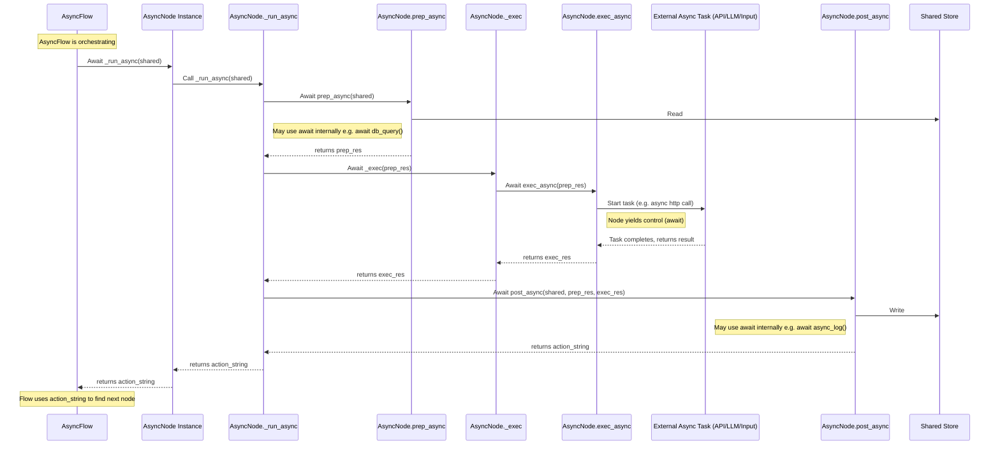

# Chapter 6: Asynchronous Processing

Welcome back to the PocketFlow tutorial! In the last chapter, [Batch Processing](05_batch_processing_.md), we learned how to efficiently handle collections of data by applying node logic or entire workflows to lists of items using `BatchNode` and `BatchFlow`. This is great for processing many things, but what if one of those things *itself* takes a long time, not because of complex calculation, but because it's *waiting* for something else?

Think about tasks like:
*   Making a request to an external API (you send the request, but then your program just waits for the response to come back over the internet).
*   Calling a large language model (LLM) API (similar to API calls, often involves waiting for computation on a server).
*   Waiting for a user to type something into the console.
*   Reading a large file from disk (can involve waiting for the disk to spin).

In traditional synchronous programming, when your program hits one of these "waiting" tasks, the entire program *stops* and waits right there. It's like standing by the mailbox after sending a letter, refusing to do anything else until the reply arrives. This is **blocking** behavior.

For workflows that involve these types of operations, blocking behavior can make your application slow and unresponsive. You might have a process waiting idly when it could be doing other useful work.

This is where **Asynchronous Processing** comes in. It allows your program to *start* a task that involves waiting (like sending the API request) and then immediately go do other things (like preparing the next step, processing other data, or even waiting for something else), only coming back to the first task when it signals that its wait is over and it has a result. It's like sending the letter and then going to do chores, occasionally checking the mailbox. This is **non-blocking** behavior.

PocketFlow leverages Python's built-in `asyncio` library to enable asynchronous workflows. It provides special **AsyncNodes** and **AsyncFlows** specifically designed for this.

## What is Asynchronous Processing in PocketFlow?

Asynchronous processing in PocketFlow focuses on building workflows where some steps can yield control back to a central event loop while they are waiting, allowing other tasks to run.

The key components are:

1.  **`AsyncNode`**: A special type of [Node](02_node_.md) designed to perform individual asynchronous tasks. Its core methods are `async def` functions, allowing them to use the `await` keyword.
2.  **`AsyncFlow`**: A special type of [Flow](04_flow_.md) capable of running `AsyncNode`s. It runs within an `asyncio` event loop.

These components work together to allow you to integrate typical async operations (like network I/O, database calls, etc.) seamlessly into your PocketFlow workflows without blocking the entire execution.

Let's think about the **Recipe Finder** example from the cookbook (`cookbook/pocketflow-async-basic`). It involves:
*   Getting user input (waiting for the user).
*   Fetching recipes from an API (waiting for network response).
*   Calling an LLM to suggest a recipe (waiting for network/computation).

All of these are perfect candidates for asynchronous operations.

## AsyncNode: Performing an Asynchronous Task Step

An `AsyncNode` is the async equivalent of a regular `Node`. Like a `Node`, it follows the `prep`/`exec`/`post` structure, but its methods are defined using `async def` and can use `await`.

The lifecycle methods for an `AsyncNode` are:

1.  **`prep_async(shared)`**: The async preparation phase. Reads from `shared`, can perform async setup operations (e.g., connecting to an async client). Must be an `async def` method. It should return the input for `exec_async`.
2.  **`exec_async(prep_res)`**: The core async execution phase. Receives input from `prep_async`. This method *must* be an `async def` method. It performs the main task, and crucially, you'll use `await` here whenever calling another async function (like an API call or an LLM call). It should return the result for `post_async`.
3.  **`post_async(shared, prep_res, exec_res)`**: The async post-execution phase. Writes results to `shared`, handles async cleanup, and makes the decision about the next action. Must be an `async def` method. Receives results from `prep_async` and `exec_async`. It returns the action string to guide the `AsyncFlow`.

Notice the `_async` suffix on the method names and the `async def` keyword. Anytime you need to use `await` within a node method, that method must be `async def`, and the node must be an `AsyncNode`.

Let's look at simplified examples from the Recipe Finder's `nodes.py`:

### `FetchRecipes` AsyncNode

This node gets user input and then calls an async function `fetch_recipes`.

```python
# cookbook/pocketflow-async-basic/nodes.py (Simplified)
from pocketflow import AsyncNode
from utils import get_user_input, fetch_recipes # Assume these are async functions

class FetchRecipes(AsyncNode):

    async def prep_async(self, shared):
        """Get ingredient from user asynchronously."""
        # 'get_user_input' is an async function that waits for user input
        ingredient = await get_user_input("Enter ingredient: ")
        return ingredient # Returns result to exec_async

    async def exec_async(self, ingredient):
        """Fetch recipes asynchronously."""
        print("Fetching recipes...")
        # 'fetch_recipes' is an async function for the API call
        recipes = await fetch_recipes(ingredient)
        print(f"Found {len(recipes)} recipes.")
        return recipes # Returns result to post_async

    async def post_async(self, shared, prep_res, recipes):
        """Store recipes and signal next step."""
        shared["recipes"] = recipes # Store the list of recipes
        shared["ingredient"] = prep_res # Store the original ingredient
        return "suggest" # Action to go to the next node
```

**Explanation:**
*   `FetchRecipes` inherits from `AsyncNode`.
*   `prep_async` is `async def` because it uses `await get_user_input`, which simulates waiting for the user.
*   `exec_async` is `async def` because it uses `await fetch_recipes`, which simulates waiting for a network response.
*   `post_async` is `async def` (even if it doesn't use `await` here, it can if needed) and stores the results before returning the action `"suggest"`.

Each `await` keyword is a point where the `AsyncNode` yields control back to the `asyncio` event loop. While `get_user_input` or `fetch_recipes` are waiting, the event loop can potentially run other ready tasks (though in this simple example, it might just idle until the awaited task finishes).

### `SuggestRecipe` AsyncNode

This node takes the recipes and calls an async LLM function.

```python
# cookbook/pocketflow-async-basic/nodes.py (Simplified)
from pocketflow import AsyncNode
from utils import call_llm_async # Assume this is an async function

class SuggestRecipe(AsyncNode):

    async def prep_async(self, shared):
        """Get recipes from shared store."""
        # Reads the recipes list stored by FetchRecipes
        return shared["recipes"] # Returns list to exec_async

    async def exec_async(self, recipes):
        """Get suggestion from LLM asynchronously."""
        print("\nSuggesting best recipe...")
        prompt = f"Choose best recipe from: {', '.join(recipes[:5])}" # Use first 5
        # 'call_llm_async' is an async function for the LLM call
        suggestion = await call_llm_async(prompt)
        print(f"How about: {suggestion}")
        return suggestion # Returns result to post_async

    async def post_async(self, shared, prep_res, suggestion):
        """Store suggestion and signal next step."""
        shared["suggestion"] = suggestion # Store the LLM's suggestion
        return "approve" # Action to go to the next node
```

**Explanation:**
*   `prep_async` reads the recipes list from `shared`.
*   `exec_async` uses `await call_llm_async`, simulating the waiting time for the LLM response.
*   `post_async` stores the suggestion and returns the action `"approve"`.

### `GetApproval` AsyncNode

This node waits for the user to approve or reject the suggestion.

```python
# cookbook/pocketflow-async-basic/nodes.py (Simplified)
from pocketflow import AsyncNode
from utils import get_user_input # An async function

class GetApproval(AsyncNode):

    async def prep_async(self, shared):
        """Get current suggestion."""
        return shared["suggestion"] # Returns suggestion to exec_async

    async def exec_async(self, suggestion):
        """Ask for user approval, await their input."""
        # Uses the same async input function again
        answer = await get_user_input(f"\nAccept this recipe? (y/n): ")
        return answer # Returns user's answer to post_async

    async def post_async(self, shared, prep_res, answer):
        """Handle user's decision and return action."""
        if answer.lower() == "y":
            print("\nGreat choice! Here's your recipe...")
            print(f"Recipe: {shared['suggestion']}")
            return "accept" # Action to signify acceptance (ends flow)
        else:
            print("\nLet's try another recipe...")
            return "retry" # Action to retry (loops back to SuggestRecipe)
```

**Explanation:**
*   `exec_async` again uses `await get_user_input` to wait for the user's response.
*   `post_async` checks the user's answer and returns either `"accept"` or `"retry"` actions.

## AsyncFlow: Orchestrating AsyncNodes

Just like a regular `Flow` orchestrates `Node`s, an `AsyncFlow` orchestrates `AsyncNode`s (and can include regular `Node`s too). The main difference is that an `AsyncFlow` runs within Python's `asyncio` event loop, which is necessary to execute the `await` calls within the `AsyncNode`s.

You define an `AsyncFlow` and connect its nodes using the same `>>` and `- "action" >>` syntax as with regular Flows.

```python
# cookbook/pocketflow-async-basic/flow.py (Simplified)
from pocketflow import AsyncFlow # Import AsyncFlow
from nodes import FetchRecipes, SuggestRecipe, GetApproval # Our AsyncNodes

def create_recipe_flow():
    # Create instances of our AsyncNodes
    fetch = FetchRecipes()
    suggest = SuggestRecipe()
    approval = GetApproval()

    # Define transitions using Actions (same syntax as regular Flow)
    fetch - "suggest" >> suggest  # After fetching, suggest a recipe
    suggest - "approve" >> approval # After suggesting, get approval
    approval - "retry" >> suggest # If rejected, go back to suggest again

    # If GetApproval returns "accept", there is no connection defined,
    # so the flow will stop here.

    # Create the AsyncFlow, specifying the start node
    # Note: The start node can be an AsyncNode or a regular Node
    recipe_workflow = AsyncFlow(start=fetch)

    return recipe_workflow
```

**Explanation:**
*   We import `AsyncFlow`.
*   We create instances of our `AsyncNode` classes.
*   Connections are defined using the familiar `>>` and `- "action" >>` syntax. The `AsyncFlow` uses these action strings just like a regular `Flow` to find the next node.
*   We create an `AsyncFlow` instance, pointing its start to the `fetch` node.

## Running an AsyncFlow

Because an `AsyncFlow` operates within the `asyncio` event loop, you cannot simply call `.run()` on it like a regular `Flow`. You need to use `await .run_async()` within an async context, typically provided by `asyncio.run()`.

```python
# cookbook/pocketflow-async-basic/main.py (Simplified)
import asyncio # Import asyncio
from flow import create_recipe_flow # Our function to build the flow

# Function to run the async process
async def main():
    # Create the async workflow
    recipe_workflow = create_recipe_flow()

    # Define initial data for the shared store (can be empty)
    initial_data = {}

    # Run the async workflow. Await the result.
    print("Starting Recipe Finder Flow...")
    final_action = await recipe_workflow.run_async(shared=initial_data)
    print(f"\nFlow Finished. Final action: {final_action}")

    # The initial_data dictionary now contains data added by the nodes
    print("Shared data after run:", initial_data)

# Entry point to run the async main function
if __name__ == "__main__":
    asyncio.run(main())
```

**Explanation:**
*   We define an `async def main()` function. This is a standard practice for `asyncio` applications.
*   Inside `main`, we get our `AsyncFlow` instance.
*   We call `await recipe_workflow.run_async(shared=initial_data)`. This is the key difference – you `await` the `run_async` method. The `asyncio.run(main())` call is what starts the `asyncio` event loop and runs our `main` function.

When `run_async` is called on the `AsyncFlow`, it starts orchestrating the execution. When it encounters an `AsyncNode`, it calls its `async` methods using `await`. When it encounters a regular `Node`, it calls its regular, synchronous `_run` method.

## How it Works Internally (Simplified)

Let's take a peek at how `AsyncNode` and `AsyncFlow` manage the asynchronous execution.

### AsyncNode Internal Orchestration (`_run_async`)

An `AsyncNode` overrides the standard `Node._run` method with an `async def _run_async` method. This method is responsible for calling the async `prep`, `exec`, and `post` methods. It must use `await` for these calls.

```python
# pocketflow/__init__.py (Simplified AsyncNode)
class AsyncNode(Node): # Inherits from Node for structure

    # ... async def prep_async, exec_async, post_async methods ...
    # ... async def exec_fallback_async ...

    # Overrides Node's _exec to handle async execution and retries
    async def _exec(self,prep_res):
        for i in range(self.max_retries):
            try:
                # >>> Await the user's async exec method <<<
                return await self.exec_async(prep_res)
            except Exception as e:
                if self.cur_retry==self.max_retries-1:
                    # >>> Await the user's async fallback method <<<
                    return await self.exec_fallback_async(prep_res,e)
                if self.wait>0:
                    # >>> Asynchronous sleep instead of blocking time.sleep <<<
                    await asyncio.sleep(self.wait)

    # The main asynchronous entry point for the node's run cycle
    async def _run_async(self,shared):
        # 1. Call async prep, awaiting its result
        p = await self.prep_async(shared)
        # 2. Call async _exec (which calls exec_async), awaiting its result
        e = await self._exec(p)
        # 3. Call async post, awaiting its result
        result = await self.post_async(shared, p, e)
        # Return the action string from post_async
        return result

    # We disable the synchronous _run inherited from Node
    def _run(self,shared): raise RuntimeError("Use run_async.")
```
This simplified view shows how `_run_async` awaits the results of `prep_async`, `_exec` (which itself awaits `exec_async`), and `post_async`, ensuring that the event loop can process other tasks while these methods are waiting for I/O or other async operations. The `_exec` method within `AsyncNode` is also async and uses `await asyncio.sleep` for retries instead of blocking `time.sleep`.

Sequence diagram for `AsyncNode`'s `_run_async`:


This diagram highlights the `await` points where the `AsyncNode` pauses its execution to allow other things to happen, resuming when the awaited task is complete.

### AsyncFlow Internal Orchestration (`_orch_async`)

The `AsyncFlow` overrides the standard `Flow._orch` with an `async def _orch_async`. This is the main asynchronous loop that runs the workflow. It differentiates between `AsyncNode`s and regular `Node`s when running them.

```python
# pocketflow/__init__.py (Simplified AsyncFlow)
class AsyncFlow(Flow,AsyncNode): # Inherits from Flow for orchestration, AsyncNode for async run method

    # ... __init__, start, get_next_node methods (same as Flow) ...

    # The main asynchronous orchestration loop
    async def _orch_async(self,shared,params=None):
        # Initialize current node, params, and last_action
        curr = copy.copy(self.start_node) # Start with the flow's designated start node
        p = (params or {**self.params}) # Use provided params or flow's default
        last_action = None

        # Main loop: continue as long as there's a node to run
        while curr:
            # Set parameters on the current node
            curr.set_params(p)

            # >>> Run the current node <<<
            # If it's an AsyncNode, call its async run method and AWAIT
            if isinstance(curr,AsyncNode):
                last_action = await curr._run_async(shared)
            # If it's a regular Node, call its synchronous run method
            else:
                last_action = curr._run(shared)

            # Determine the NEXT node using the action returned (same as sync flow)
            curr = copy.copy(self.get_next_node(curr,last_action))

        # Loop ends when get_next_node returns None. Return the last action.
        return last_action

    # The async public run method just calls _orch_async internally
    async def _run_async(self,shared):
        p=await self.prep_async(shared) # Call the Flow's own async prep
        o=await self._orch_async(shared, self.params) # Await the main orchestration
        return await self.post_async(shared,p,o) # Call the Flow's own async post

    # Disable the synchronous _run inherited from Flow/Node
    def _run(self,shared): raise RuntimeError("Use run_async.")
```
This shows that the `AsyncFlow._orch_async` looks at the type of the current node (`isinstance(curr, AsyncNode)`) and calls either `await curr._run_async(shared)` for async nodes or `curr._run(shared)` for regular nodes. This allows an `AsyncFlow` to manage a mix of synchronous and asynchronous tasks within the same workflow. The overall `run_async` method of the `AsyncFlow` also has `async` `prep_async` and `post_async` phases.

## Combining with Batch Processing

You can combine asynchronous processing with batch processing using `AsyncBatchNode` and `AsyncBatchFlow` (and `AsyncParallelBatchNode` / `AsyncParallelBatchFlow`).

*   `AsyncBatchNode`: Similar to `BatchNode`, but its `exec_async` method (which you implement) is called for each item. Its internal `_exec` will use `await` when calling *your* `exec_async`.
*   `AsyncFlow` can also orchestrate an `AsyncBatchNode`.
*   `AsyncBatchFlow`: Similar to `BatchFlow`, but its own `prep_async` and `post_async` methods are async, and it iterates and runs its *inner flow* asynchronously using `await self._orch_async`.
*   `AsyncParallelBatchNode` / `AsyncParallelBatchFlow`: These special types (discussed in the next chapter) allow you to run the batch *items* or batch *flows* *concurrently* using `asyncio.gather`, enabling parallel execution of multiple async tasks.

## Analogy Refined

Back to the factory:
*   The **[Shared Store](01_shared_store_.md)** is the central depot.
*   **[Node](02_node_.md)s** are sync workstations (always busy when working).
*   **`AsyncNode`s** are async workstations. When they need to wait for an external supplier delivery (API call) or a customer response (user input), they don't just stop. They signal the supervisor (the `AsyncFlow`) that they are waiting and available for a quick interruption. While they wait, the supervisor can allocate resources (Python's CPU time) to *other* stations or tasks that *are* ready to run.
*   **Flow** is a sync supervisor, only manages sync tasks in a fixed sequence.
*   **`AsyncFlow`** is an async supervisor. When an `AsyncNode` worker says "I need to wait for a delivery", the `AsyncFlow` notes that, tells the worker to rest until the delivery arrives, and immediately checks if any *other* worker (sync or async) is ready for work. It manages the pool of waiting async tasks and workers ready to do sync work, jumping between them efficiently. When the delivery arrives for the waiting `AsyncNode`, the `AsyncFlow` lets that worker resume.
*   `await` is the instruction the `AsyncNode` worker gives to the `AsyncFlow` supervisor meaning "I'm starting a task I'll have to wait for; you can go do other stuff until it's done."

## Conclusion

Asynchronous processing in PocketFlow, using `AsyncNode` and `AsyncFlow`, is essential for building responsive and efficient workflows that interact with slow or I/O-bound external services or user input. By using `async def` methods and the `await` keyword in your `AsyncNode`s, and orchestrating them with an `AsyncFlow` run via `asyncio.run()`, you can avoid blocking your program and allow it to handle multiple waiting tasks gracefully.

Handling batches asynchronously opens up the possibility of running multiple batch items *at the same time*. This concept of concurrency is the core idea behind the next chapter: [Parallel Processing](07_parallel_processing_.md).

[Parallel Processing](07_parallel_processing_.md)

---

Generated by [AI Codebase Knowledge Builder](https://github.com/The-Pocket/Tutorial-Codebase-Knowledge)