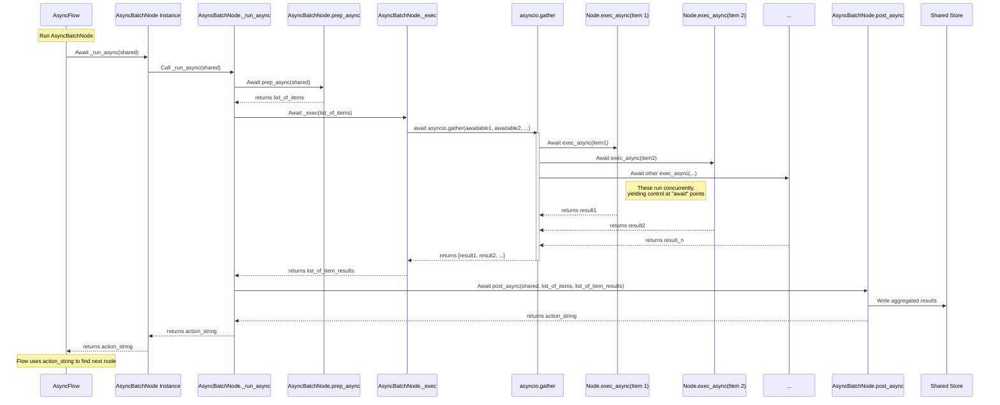
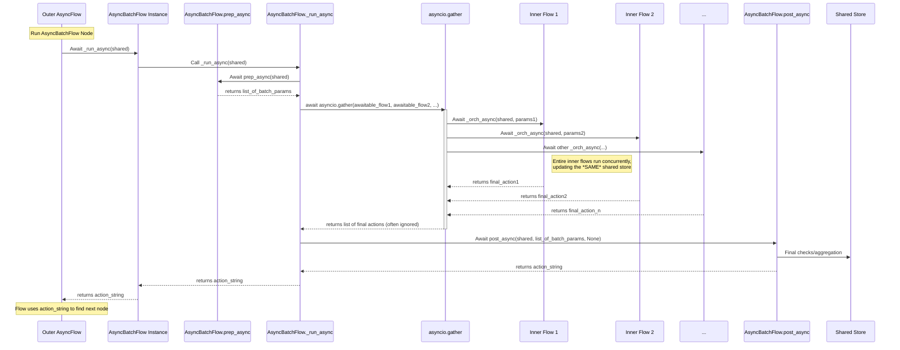

# Chapter 7: Parallel Processing

Welcome back to the PocketFlow tutorial! In the last chapter, [Asynchronous Processing](06_asynchronous_processing_.md), we explored how to build responsive workflows by allowing tasks to yield control while they wait for things like API calls or user input. This is great! Instead of Node A completely freezing your program for 10 seconds while it waits for an API, it can *start* waiting and let the [Flow](04_flow_.md) check if Node B is ready to do something else in the meantime.

However, consider a scenario where you have not just one, but *ten* independent API calls to make. Even with asynchronous processing, an `AsyncBatchNode` handling these calls sequentially would still make the first call, wait for its response, process it, then make the second call, wait, process, and so on. You'd still spend roughly the sum of all the waiting times.

What if you could start *all ten* API calls almost simultaneously and let them run side-by-side? This is the power of **Parallel Processing** in PocketFlow, specifically when combined with asynchronous operations. It allows genuinely concurrent execution of independent tasks, drastically reducing the total time for "batch-of-async" work.

## What is Parallel Processing in PocketFlow?

In PocketFlow's context, Parallel Processing refers to a type of **asynchronous processing** where multiple batch items (or even multiple whole batch flows) are executed **concurrently**. This means they can effectively run at the *same time*, overlapping their execution, especially their waiting periods.

PocketFlow achieves this by leveraging Python's `asyncio.gather`. This `asyncio` function is designed to take a list of "awaitables" (things you can `await`, like async function calls or async node runs) and run them *concurrently*. It then waits for *all* of them to complete and returns their results as a list.

PocketFlow provides specialized components for this:

1.  **`AsyncParallelBatchNode`**: Processes items batch-by-batch like `BatchNode`, but executes the `exec_async` for *all items in the batch concurrently* using `asyncio.gather`.
2.  **`AsyncParallelBatchFlow`**: Processes batch items/configurations using an inner flow like `BatchFlow`, but executes the *inner flow for all batch items concurrently* using `asyncio.gather`.

This is ideal for speeding up tasks in bulk that are independent of each other and involve significant waiting, like:

*   Translating multiple documents or large text chunks using an external API.
*   Applying computationally cheap filters or transformations to different images.
*   Fetching data for multiple items from a database or external service.

Instead of waiting for one item to finish before starting the next, the program initiates processing for all items in the batch and waits for the fastest ones to finish, and then eventually for the slowest one. The total time is closer to the time taken by the *slowest* item in the batch, rather than the sum of times for all items.

## AsyncParallelBatchNode: Concurrent Item Processing

Just like its predecessors `Node`, `BatchNode`, and `AsyncNode`, the `AsyncParallelBatchNode` follows the `prep`/`exec`/`post` pattern, but tailored for concurrent async execution of batch items.

*   **`prep_async(shared)`**: Should return a **list** or other iterable of items, just like `BatchNode.prep`. For `AsyncParallelBatchNode`, your `prep_async` must be an `async def` method and *can* use `await`. This list contains the items that will be processed in parallel.
*   **`exec_async(item)`**: This method is the core logic for processing a *single* item from the list returned by `prep_async`. Like `AsyncNode.exec_async`, it *must* be an `async def` method and likely contains `await` calls (to APIs, I/O, etc.). The `AsyncParallelBatchNode` will call this method for every item in the batch *concurrently*.
*   **`post_async(shared, prep_res, exec_res)`**: This method receives the `shared` store, the original list from `prep_async` (`prep_res`), and a **list** (`exec_res`) where each element is the result returned by `exec_async(item)` for the corresponding item in `prep_res`. Your `post_async` must be an `async def` method and is responsible for handling these collected results.

The key difference from `AsyncBatchNode` is *how* the node's internal `_exec` method calls *your* `exec_async`. While `AsyncBatchNode` loops and `await`s `self.exec_async(item)` sequentially, `AsyncParallelBatchNode` collects all the calls to `self.exec_async(item)` (which return awaitables) and passes them to `asyncio.gather`.

Let's adapt our squaring numbers example, adding an artificial async delay to simulate a slow operation.

```python
# Simple AsyncParallelBatchNode Example
import asyncio
from pocketflow import AsyncParallelBatchNode, AsyncFlow

class ParallelSquareNumbersNode(AsyncParallelBatchNode):
    async def prep_async(self, shared):
        """Read list of numbers from shared (async setup possible here)."""
        numbers_list = shared.get("numbers_to_square", [])
        print(f"Prep Async: Read list of {len(numbers_list)} numbers for parallel batch processing.")
        # Return the list of items
        return numbers_list

    async def exec_async(self, number):
        """Square a single number with an artificial async delay."""
        # Simulate a variable-length async task per item
        delay = number * 0.1
        print(f"  Exec Async: Starting squaring {number} with {delay:.1f}s delay...")
        await asyncio.sleep(delay) # Simulate waiting (e.g., API call)
        result = number * number
        print(f"  Exec Async: Finished squaring {number}. Result: {result}")
        # This result is collected by asyncio.gather
        return result

    async def post_async(self, shared, prep_res, exec_res):
        """Store list of squared results back in shared."""
        # exec_res is a list of results from all concurrent exec_async calls
        squared_numbers = exec_res
        print(f"Post Async: Finished squaring batch. Processed {len(prep_res)} items.")
        # Store results in shared
        shared["squared_numbers"] = squared_numbers
        # Signal completion
        return "done"

# --- How to use it in an AsyncFlow ---
parallel_square_node = ParallelSquareNumbersNode()

# Need an AsyncFlow to run AsyncNodes
async_batch_square_flow = AsyncFlow(start=parallel_square_node)
parallel_square_node >> None # Simple ending

# --- Run the flow using asyncio ---
async def main():
    initial_shared_data = {"numbers_to_square": [1, 2, 3, 4, 5]}

    print("--- Running AsyncParallelBatchNode Flow ---")
    final_action = await async_batch_square_flow.run_async(shared=initial_shared_data)
    print("--- AsyncParallelBatchNode Flow Finished ---")

    # Check the shared data
    print("\nShared data after run:", initial_shared_data)
    print("Final action:", final_action)

if __name__ == "__main__":
    asyncio.run(main())
```

**Expected Output (Simplified, execution messages might be interleaved):**

```
--- Running AsyncParallelBatchNode Flow ---
Prep Async: Read list of 5 numbers for parallel batch processing.
  Exec Async: Starting squaring 1 with 0.1s delay...
  Exec Async: Starting squaring 2 with 0.2s delay...
  Exec Async: Starting squaring 3 with 0.3s delay...
  Exec Async: Starting squaring 4 with 0.4s delay...
  Exec Async: Starting squaring 5 with 0.5s delay...
  Exec Async: Finished squaring 1. Result: 1
  Exec Async: Finished squaring 2. Result: 4
  Exec Async: Finished squaring 3. Result: 9
  Exec Async: Finished squaring 4. Result: 16
  Exec Async: Finished squaring 5. Result: 25
Post Async: Finished squaring batch. Processed 5 items.
--- AsyncParallelBatchNode Flow Finished ---

Shared data after run: {'numbers_to_square': [1, 2, 3, 4, 5], 'squared_numbers': [1, 4, 9, 16, 25]}
Final action: done
```

Notice the print statements from `exec_async` appearing out of order or overlapping. This indicates they are running concurrently. The total execution time will be slightly more than the *longest* simulated delay (around 0.5s plus overhead), not the sum of all delays (0.1 + 0.2 + 0.3 + 0.4 + 0.5 = 1.5s plus overhead) which would happen in a sequential `AsyncBatchNode`.

The `cookbook/pocketflow-parallel-batch` example uses an `AsyncParallelBatchNode` (`TranslateTextNodeParallel`) to translate text into multiple languages concurrently using an async LLM API call, demonstrating significant speedup compared to the sequential version.

## AsyncParallelBatchFlow: Concurrent Inner Flow Processing

Similar to `BatchFlow` running an inner flow per item, `AsyncParallelBatchFlow` runs its inner flow for each batch item, but it does so **concurrently** using `asyncio.gather`.

*   **`prep_async(shared)`**: Should return a list of "batch parameters" (e.g., dictionaries), same as `BatchFlow.prep`, but must be `async def`. Each item in this list represents data used to configure one run of the inner flow.
*   **Inner Flow:** The `AsyncParallelBatchFlow` contains a standard [AsyncFlow](06_asynchronous_processing_.md) (or Flow containing AsyncNodes) defined by its `start_node` and connections. This inner flow should handle the processing for a *single* batch item.
*   **`_run_async(shared)` (internal override)**: The `AsyncParallelBatchFlow` overrides the `AsyncFlow`'s `_run_async`. After calling its own `prep_async`, it takes the list of batch parameters. For *each* set of parameters, it prepares an awaitable call to its inner flow orchestration method (`self._orch_async`) using the specific batch parameters, and then passes *all* these awaitables to `asyncio.gather` to run them concurrently.
*   **`post_async(shared, prep_res, exec_res)`**: Must be an `async def` method. Receives the `shared` store (updated concurrently by all inner flow runs), the original list from `prep_async` (`prep_res`), and `None` for `exec_res`. Handle aggregation or final steps here after all concurrent inner flows are complete.

This abstraction is powerful when the "processing for one item" itself involves multiple [AsyncNode](06_asynchronous_processing_.md)s or even a sub-[AsyncFlow](06_asynchronous_processing_.md).

The `cookbook/pocketflow-parallel-batch-flow` example demonstrates an `AsyncParallelBatchFlow` that processes multiple images with multiple filters. The inner "Per Image-Filter" flow consists of three nodes: Load, Apply, Save. Since image loading, applying filters, and saving can involve I/O (reading/writing files) which can be async, and processing different images/filters are independent tasks, this is a perfect use case for concurrent execution of these inner flows.

Here's the structure from the README:

```mermaid
graph TD
    subgraph AsyncParallelBatchFlow[Image Processing Flow (Outer)]
        subgraph AsyncFlow[Per Image-Filter Flow (Inner)]
            A[Load Image<br>(AsyncNode)] --> B[Apply Filter<br>(AsyncNode)]
            B --> C[Save Image<br>(AsyncNode)]
        end
    end
```

The outer `AsyncParallelBatchFlow` takes a list of batch parameters, where each item represents one combination of (Image, Filter). For each item, it spins up a concurrent execution of the inner `AsyncFlow`. The inner flow loads the specific image, applies the specific filter, and saves the result. Because `asyncio.gather` starts all these inner flow runs side-by-side, the total time is dominated by the longest running image-filter combination, not the sum of all of them. The README shows an impressive 8x speedup!

## How it Works Internally (Simplified)

The magic of concurrent execution in `AsyncParallelBatchNode` and `AsyncParallelBatchFlow` lies in how they override the `_exec` or `_run_async` methods to use `asyncio.gather`.

### AsyncParallelBatchNode Internal Orchestration (`_exec`)

Recall `AsyncNode._exec` loops and `await`s `super()._exec(i)` for each item sequentially. `AsyncParallelBatchNode` changes this loop to build a list of awaitables.

```python
# pocketflow/__init__.py (Simplified AsyncParallelBatchNode)
class AsyncParallelBatchNode(AsyncNode,BatchNode):
    # Inherits from AsyncNode (for async methods) and BatchNode (for batch structure)

    async def _exec(self,items): # 'items' is the list from prep_async
        # 1. Create a generator expression that yields an awaitable for each item
        # super(AsyncParallelBatchNode,self)._exec(i) calls AsyncNode._exec(i),
        # which in turn calls await self.exec_async(i) (including retries/wait)
        # Each call to AsyncNode._exec(i) returns an awaitable (a coroutine)
        item_awaitables = (super(AsyncParallelBatchNode,self)._exec(i) for i in (items or []))

        # 2. Use asyncio.gather to run all these awaitables concurrently
        # asyncio.gather takes awaitables, runs them until they're done,
        # and returns their results as a list in the same order as the input awaitables.
        results_list = await asyncio.gather(*item_awaitables)

        # 3. Return the list of results to post_async
        return results_list
```
This is the core change: `await asyncio.gather(*item_awaitables)` starts all the `AsyncNode._exec(i)` calls for the batch items and waits for them all to finish concurrently.

Sequence diagram for `AsyncParallelBatchNode`'s `_exec`:


This highlights how `asyncio.gather` allows the `exec_async` calls for different items to run on top of each other, assuming they are truly independent and spend time blocked on `await`able operations.

### AsyncParallelBatchFlow Internal Orchestration (`_run_async`)

The `AsyncParallelBatchFlow` overhauls its `_run_async` method compared to `AsyncBatchFlow`. Instead of looping and awaiting `self._orch_async` one by one, it prepares all the `self._orch_async` calls *with their respective batch parameters* and passes them to `asyncio.gather`.

```python
# pocketflow/__init__.py (Simplified AsyncParallelBatchFlow)
class AsyncParallelBatchFlow(AsyncFlow,BatchFlow):
    # Inherits from AsyncFlow (for async orchestration methods like _orch_async)
    # and BatchFlow (for batch structure like prep method logic)

    async def _run_async(self, shared):
        # 1. Call the BatchFlow's own async prep method
        batch_params_list = await self.prep_async(shared) or []

        # 2. Create a generator expression that yields an awaitable for each batch item
        # self._orch_async(shared, {**self.params, **bp}) calls the inner flow orchestrator
        # with the shared state and merged parameters for THIS batch item.
        # This call returns an awaitable (a coroutine) representing one full inner flow run.
        batch_orchestrations = (self._orch_async(shared, {**self.params, **bp}) for bp in batch_params_list)

        # 3. Use asyncio.gather to run all these inner flow orchestrations concurrently
        # await asyncio.gather will start all the inner flows.
        # The results of individual inner flow runs (the final action returned by their _orch_async)
        # are collected into a list, but this list is often discarded in BatchFlows
        # as results are typically put directly into the shared state by inner nodes.
        await asyncio.gather(*batch_orchestrations)

        # 4. Call the BatchFlow's own async post method after all inner flows are done
        return await self.post_async(shared, batch_params_list, None)
```
The critical part is `await asyncio.gather(*batch_orchestrations)`. This takes the awaitable representing the execution of the *entire inner flow* for each batch item and runs them all at once. The `shared` dictionary needs to be handled carefully in concurrent flows; nodes within different concurrent inner flows write to the *same* shared dictionary. For simple writes (like appending to a list), this is usually fine, but for complex state updates, you might need explicit locks if not using structures designed for concurrency.

Sequence diagram for `AsyncParallelBatchFlow`'s `_run_async`:

This demonstrates that the `asyncio.gather` in `AsyncParallelBatchFlow` orchestrates the *parallel execution of entire inner flows*.

## Analogy Refined

Our factory assembly line, adding parallelism:
*   The **[Shared Store](01_shared_store_.md)** is still the central depot.
*   **[Node](02_node_.md)s** are synchronous workstations.
*   **`AsyncNode`s** are asynchronous workstations that can pause and let the async supervisor (`AsyncFlow`) manage other tasks while they wait for deliveries/input.
*   **Flow** is a synchronous supervisor.
*   **`AsyncFlow`** is an asynchronous supervisor managing workers who can pause and resume.
*   **`BatchNode`** is one worker processing a basket of items sequentially.
*   **`AsyncBatchNode`** is one async worker processing a basket of async items sequentially (starting one, waiting, finishing, starting the next...).
*   **`AsyncParallelBatchNode`** is like having *multiple* async workers, one assigned to each item in the basket. They all start their tasks (e.g., requesting their material delivery) almost at the same time. The `AsyncFlow`/`asyncio.gather` acts like a dispatch manager, keeping track of all running tasks and dealing with whichever one finishes its awaits first, allowing other workers to continue when they are ready. They all work on the *same* basket's items concurrently.
*   **`BatchFlow`** is a production line manager who gets a list of orders and runs the *entire production line* ([Flow](04_flow_.md)) once for each order, one after the other.
*   **`AsyncBatchFlow`** is an async production line manager handling orders sequentially on an async-capable line.
*   **`AsyncParallelBatchFlow`** is like a production manager who gets a big list of orders and says, "Okay, we'll set up *several* parallel production lines staffed by async workers, one for each order, and run them **all concurrently**!" The manager uses `asyncio.gather` to oversee all these separate, concurrently running mini-production lines (inner flows), waiting until the *last* one finishes.

## Conclusion

Parallel processing in PacketFlow, powered by `asyncio.gather` within `AsyncParallelBatchNode` and `AsyncParallelBatchFlow`, is a powerful technique for dramatically speeding up workflows that involve processing multiple independent items or batches concurrently, especially when those tasks involve waiting (I/O-bound operations like network calls or file access). By understanding how these components delegate concurrent execution to `asyncio.gather` for the `exec_async` calls or entire inner flow runs, you can design highly efficient and scalable asynchronous batch pipelines.

This concludes our core chapters on PocketFlow fundamentals! You now have a solid understanding of the key concepts: [Shared Store](01_shared_store_.md), [Node](02_node_.md)s, [Actions](03_actions_.md), [Flow](04_flow_.md)s, [Batch Processing](05_batch_processing_.md), [Asynchronous Processing](06_asynchronous_processing_.md), and [Parallel Processing](07_parallel_processing_.md). You are equipped to build complex, efficient, and responsive workflows with PocketFlow.

---

Generated by [AI Codebase Knowledge Builder](https://github.com/The-Pocket/Tutorial-Codebase-Knowledge)