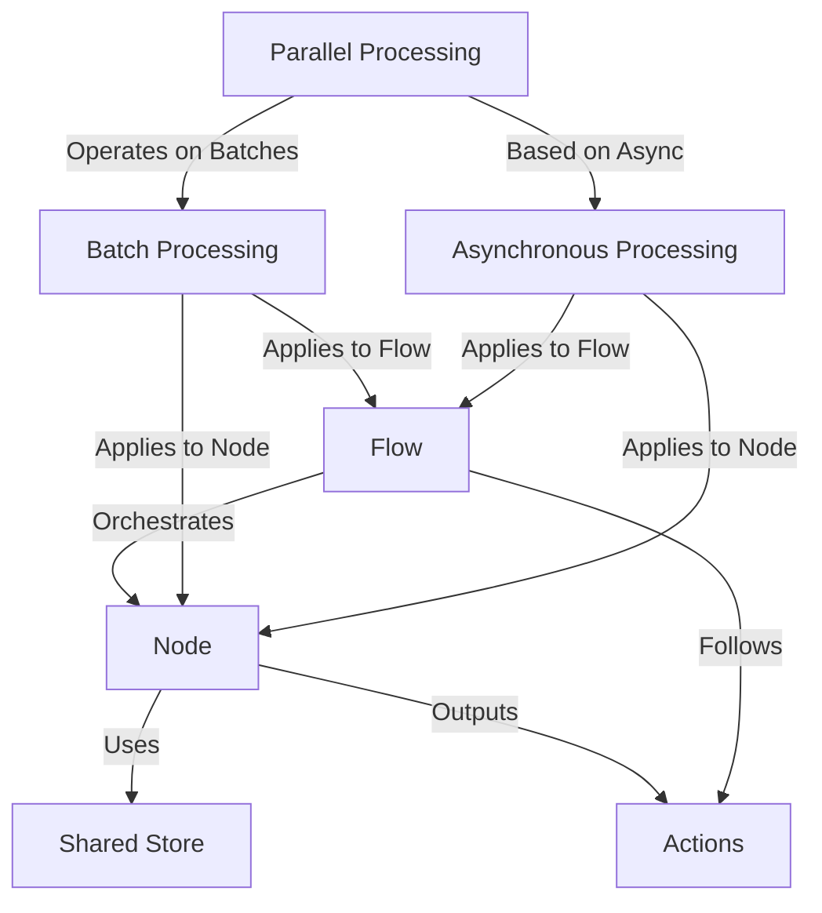

# Tutorial: PocketFlow

PocketFlow is a framework for building **multi-step workflows**. It uses self-contained *Nodes* to perform individual tasks, which are connected together into sequences or networks by a *Flow*. Data is passed and shared between Nodes using a central *Shared Store*. The path the Flow takes is determined by *Actions* returned by Nodes. PocketFlow provides specific ways to handle collections of items efficiently through *Batch Processing*, manage tasks that wait via *Asynchronous Processing* using async/await, and speed up batch tasks by running items concurrently with *Parallel Processing*.

**Source Repository:** [https://github.com/The-Pocket/PocketFlow.git](https://github.com/The-Pocket/PocketFlow.git)

## Chapters

1. [Shared Store
](01_shared_store_.md)
2. [Node
](02_node_.md)
3. [Actions
](03_actions_.md)
4. [Flow
](04_flow_.md)
5. [Batch Processing
](05_batch_processing_.md)
6. [Asynchronous Processing
](06_asynchronous_processing_.md)
7. [Parallel Processing
](07_parallel_processing_.md)

---

Generated by [AI Codebase Knowledge Builder](https://github.com/The-Pocket/Tutorial-Codebase-Knowledge)