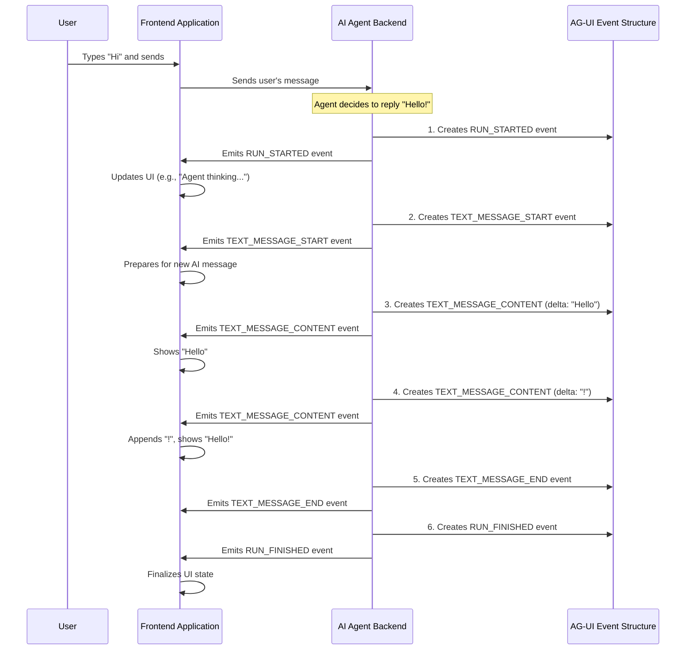

# Chapter 1: AG-UI Events

Welcome to the AG-UI tutorial! We're excited to help you understand how to build amazing applications where AI agents and user interfaces can communicate seamlessly. In this first chapter, we'll dive into the most fundamental concept: **AG-UI Events**.

## The Communication Challenge: AI and UI Talking to Each Other

Imagine you're building a web application with a helpful AI chatbot. A user types a question, like "What's the weather like today?" and hits send.

*   How does your web page (the **frontend** or **UI**) know that the AI (the **backend agent**) has received the question and started working on an answer?
*   How does the UI display the AI's answer as it's being typed out, word by word, for a nice real-time effect?
*   What if the AI needs to ask the UI to perform an action, like displaying a map?
*   How does the UI know when the AI is completely finished, or if an error occurred?

This is where AG-UI Events come in. They solve this communication challenge!

## What are AG-UI Events? The Digital Messengers

**AG-UI Events are the fundamental "messages" or "signals" that an AI agent backend sends to a frontend application.**

Think of them like status updates or commands in a real-time conversation. They are the language that both the AI agent and the UI agree to use so they can understand each other.

Let's use an analogy: Imagine you're on a phone call with a friend who is looking up information for you.
*   Your friend might say, "Okay, I'm starting to look it up now." (This is like an event telling the UI the AI has started).
*   Then, they might say, "I found the first part, it's..." (This is like an event sending a piece of the answer).
*   And finally, "Alright, that's all the info I have!" (This is like an event signaling the AI is done).

AG-UI Events work similarly. An agent might send an event to say "I'm starting to type a message," then "here's a piece of the message," and finally "I'm done with this message."

There are specific types of events for:
*   **Text messages**: For chat-like interactions.
*   **Tool calls**: When the agent wants the frontend to perform an action (e.g., display a calendar, fetch user location).
*   **State changes**: To update the UI about the agent's internal status (e.g., "thinking", "fetching data").
*   **Overall run lifecycle**: To signal the beginning of an interaction, its successful completion, or if an error happened.

This standardized set of events ensures that different AI agents (even if built with different technologies) and different UIs can understand each other. It forms the core language of AG-UI.

## A Closer Look at an Event's Journey: AI Saying "Hello"

Let's go back to our chatbot. The user has just sent a message. Now, the AI agent wants to respond with "Hello there!". Here's how it might use AG-UI Events to communicate this to your application's frontend:

1.  **`RUN_STARTED`**: The AI agent first sends an event like this:
    *   **Meaning**: "I've started processing the user's request and will begin my work now."
    *   **UI Action**: The UI might show a small loading spinner or a message like "Agent is thinking..."

2.  **`TEXT_MESSAGE_START`**: Next, an event indicating a new message from the assistant is beginning:
    *   **Meaning**: "I'm about to send a text message. Get ready to display it!"
    *   **UI Action**: The UI prepares a new message bubble for the assistant's response.

3.  **`TEXT_MESSAGE_CONTENT`** (with "Hello "):
    *   **Meaning**: "Here's the first part of my message: 'Hello '"
    *   **UI Action**: The UI displays "Hello " in the assistant's message bubble.

4.  **`TEXT_MESSAGE_CONTENT`** (with "there!"):
    *   **Meaning**: "Here's the next part of my message: 'there!'"
    *   **UI Action**: The UI appends "there!" to the existing "Hello ", so it now shows "Hello there!". This creates that cool, real-time typing effect.

5.  **`TEXT_MESSAGE_END`**:
    *   **Meaning**: "I'm done with this particular text message."
    *   **UI Action**: The UI can finalize the message display (e.g., remove the typing indicator if it had one).

6.  **`RUN_FINISHED`**: Finally, if the agent has completed all its tasks for this interaction:
    *   **Meaning**: "I've finished everything for this turn."
    *   **UI Action**: The UI can remove the loading spinner and indicate that the agent is ready for the next input.

This sequence allows your UI to be very responsive and keep the user informed about what the AI is doing.

## Key Types of AG-UI Events

As you saw in the example, AG-UI defines several types of events. Here are the main categories:

*   **Text Message Events**:
    *   `TEXT_MESSAGE_START`: Signals the beginning of a new text message from the agent.
    *   `TEXT_MESSAGE_CONTENT`: Delivers a piece (a "delta") of the text content.
    *   `TEXT_MESSAGE_END`: Signals the end of the current text message.
    *   `TEXT_MESSAGE_CHUNK`: A more compact way to send parts of a message, sometimes including the start or role.
*   **Tool Call Events**:
    *   `TOOL_CALL_START`: The agent wants the frontend to execute a "tool" (a function or capability the UI provides) and is providing its name.
    *   `TOOL_CALL_ARGS`: Delivers a piece of the arguments (input) for the tool.
    *   `TOOL_CALL_END`: Signals the end of the arguments for that tool call.
    *   `TOOL_CALL_CHUNK`: Similar to `TEXT_MESSAGE_CHUNK`, but for tool calls.
*   **State Management Events**:
    *   `STATE_SNAPSHOT`: Provides a complete picture of some shared data or state.
    *   `STATE_DELTA`: Provides only the changes to the shared state (more efficient for updates).
    *   `MESSAGES_SNAPSHOT`: Provides a complete list of all messages in the conversation so far.
*   **Run Lifecycle Events**:
    *   `RUN_STARTED`: The agent has started a new execution run.
    *   `RUN_FINISHED`: The agent has successfully finished the run.
    *   `RUN_ERROR`: An error occurred during the run.
*   **Step Lifecycle Events** (for more granular tracking within a run):
    *   `STEP_STARTED`: A specific step within the agent's process has started.
    *   `STEP_FINISHED`: That specific step has finished.
*   **Other Events**:
    *   `RAW`: For sending events from an underlying system without direct AG-UI mapping.
    *   `CUSTOM`: For application-specific events you might want to define.

Don't worry if this list seems long! You'll typically only use a few of these at a time, depending on what your AI and UI need to do. We'll explore some of these, particularly messages and state, in more detail in [Chapter 3: Message and State Types](03_message_and_state_types_.md).

## What Does an Event Look Like? (A Peek Under the Hood)

AG-UI events are structured data, often represented in a format like JSON. Here’s a simplified example of what a `TEXT_MESSAGE_CONTENT` event might look like:

```json
{
  "type": "TEXT_MESSAGE_CONTENT",
  "message_id": "msg_assistant_123",
  "delta": "Hello "
}
```

Let's break this down:

*   `"type": "TEXT_MESSAGE_CONTENT"`: This is crucial! It tells the receiving application exactly what kind of event this is. The UI will use this to decide how to handle the event.
*   `"message_id": "msg_assistant_123"`: This helps group parts of the same message. All `TEXT_MESSAGE_CONTENT` events for the "Hello there!" message would share this ID.
*   `"delta": "Hello "`: This is the actual piece of content for this specific event. "Delta" means "change" or "increment."

Every AG-UI event will have a `type` field. The other fields will vary depending on the event type.

## How Events Flow: From Agent to UI

Let's visualize the journey of these events from the AI agent (backend) to your user interface (frontend).



Here's what's happening:

1.  The **AI Agent Backend** (which we'll learn more about in [Chapter 2: Agent (Abstract Representation)](02_agent__abstract_representation__.md)) decides it needs to communicate something.
2.  It constructs an **AG-UI Event** object, filling in the `type` and other necessary data (like `delta` for content).
3.  This event is then sent over a communication channel (like WebSockets or Server-Sent Events). The details of how events are packaged and sent are covered in [Chapter 5: Event Encoding and Transport](05_event_encoding_and_transport_.md).
4.  Your **Frontend Application** receives this event.
5.  The frontend then looks at the event's `type` and uses its content to update the display or take other actions. How the client-side handles this stream of events is the topic of [Chapter 4: Event Stream Processing Pipeline (Client-side)](04_event_stream_processing_pipeline__client_side__.md).

## A Glimpse into the Code: Defining Events

To ensure consistency, AG-UI provides definitions for these events, for example, in Python and TypeScript. You don't usually need to write these definitions yourself, but it's good to see how they're structured.

First, there's a list of all possible event types. Here's a small part of how it looks in Python (from `ag_ui.core.events`):

```python
# From ag_ui.core.events
from enum import Enum

class EventType(str, Enum):
    TEXT_MESSAGE_START = "TEXT_MESSAGE_START"
    TEXT_MESSAGE_CONTENT = "TEXT_MESSAGE_CONTENT"
    TEXT_MESSAGE_END = "TEXT_MESSAGE_END"
    # ... many other event types
```
This `EventType` enum simply defines the allowed string values for the `type` field in an event.

All events share some common properties. A `BaseEvent` might be defined like this (simplified Python version):

```python
# Simplified from ag_ui.core.events
class BaseEvent:
    type: EventType         # What kind of event is this?
    timestamp: Optional[int] # When did it happen? (Optional)
    # ... other common fields
```
This means every AG-UI event will at least have a `type` and potentially a `timestamp`.

Then, each specific event type builds on this. For example, `TextMessageContentEvent`:

```python
# Simplified from ag_ui.core.events
# (Assuming Literal and Optional are imported)
class TextMessageContentEvent(BaseEvent):
    type: Literal[EventType.TEXT_MESSAGE_CONTENT] # Confirms it's this specific type
    message_id: str      # ID of the message this content belongs to
    delta: str           # The actual piece of text
```
Here, `type` is specifically `EventType.TEXT_MESSAGE_CONTENT`, and it adds fields like `message_id` and `delta` that are relevant only to this kind of event. Similar structures exist in the TypeScript SDK (`typescript-sdk/packages/core/src/events.ts`).

These definitions ensure that when an agent sends an event, and a UI receives it, they both agree on its structure and meaning.

## Conclusion: Events are Key!

You've now learned the foundational concept of AG-UI: **Events**. These are the messages that flow between your AI agent and your UI, enabling them to have rich, real-time interactions. They tell the UI when the agent starts working, what it's saying, if it needs the UI to do something, and when it's finished.

By standardizing these events, AG-UI makes it much easier to connect various AI backends to various frontends.

In the next chapter, we'll take a closer look at the sender of these events: the [Chapter 2: Agent (Abstract Representation)](02_agent__abstract_representation__.md).

---

Generated by [AI Codebase Knowledge Builder](https://github.com/The-Pocket/Tutorial-Codebase-Knowledge)