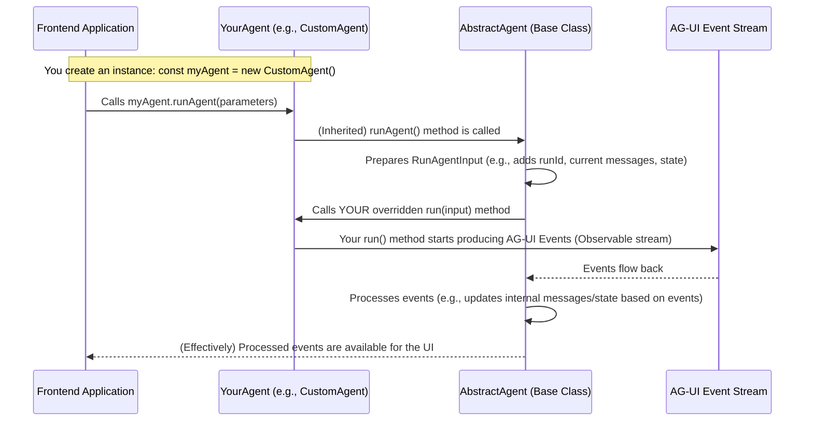

# Chapter 2: Agent (Abstract Representation)

In [Chapter 1: AG-UI Events](01_ag_ui_events_.md), we learned about the "digital messengers" – AG-UI Events – that enable communication between an AI backend and a frontend application. Now, let's meet the sender of these messages: the **Agent**.

## What's an Agent? The Blueprint for Your AI

Imagine you want to build different types of AI helpers for your application:
*   A simple chatbot that greets users.
*   A more complex AI that can access a database to answer questions.
*   An AI that uses external tools, like a weather API.

How do we make sure all these different AIs can talk to your frontend using the AG-UI Events we just learned about? We need a common structure, a standard way for these AIs to operate.

This is where the **Agent (Abstract Representation)** comes in. Think of it as a **blueprint or a recipe** for creating AI agents within the AG-UI framework, especially when you're using the TypeScript SDK.

This blueprint defines:
1.  **The main task**: A core method called `run`. This is like the main cooking process in a recipe. It's where the agent does its thinking and generates the AG-UI Events.
2.  **The necessary ingredients**: What information the `run` method needs to do its job. This includes things like a `threadId` (to keep track of the conversation), the `messages` exchanged so far, and any `state` (memory) the agent has.
3.  **How to manage its operation**: Special methods for handling things like errors (`onError`) or cleaning up when the agent is done (`onFinalize`). These are like instructions for what to do if your cooking goes wrong or how to clean the kitchen afterwards.

Any specific AI agent you build, like an `HttpAgent` that communicates with a server over HTTP, or a simple `CustomAgent` for demonstration purposes, must follow this blueprint. By doing so, they automatically know how to "speak" the AG-UI protocol by emitting the standard [AG-UI Events](01_ag_ui_events_.md), allowing them to connect and communicate correctly with your frontend.

## The `AbstractAgent`: Our Blueprint in Code

In the AG-UI TypeScript SDK, this blueprint is primarily defined by a class called `AbstractAgent`. When you create your own agent, you'll typically *extend* this `AbstractAgent` class.

```typescript
// Simplified from typescript-sdk/packages/client/src/agent/agent.ts
export abstract class AbstractAgent {
  // ... some properties like threadId, messages, state ...

  // This is the method YOU MUST implement in your own agent
  protected abstract run(input: RunAgentInput): Observable<BaseEvent>;

  // Lifecycle methods (you can override these if needed)
  protected onError(error: Error) { /* ... default error handling ... */ }
  protected onFinalize() { /* ... default finalization ... */ }

  // ... other helpful methods ...
}
```
Let's break this down:
*   `abstract class AbstractAgent`: The keyword `abstract` means you can't create an `AbstractAgent` directly. It's a template meant to be built upon.
*   `protected abstract run(...)`: This is the most important part.
    *   `protected`: Means it's mainly for internal use within the agent and its subclasses.
    *   `abstract`: Means that any class that extends `AbstractAgent` *must* provide its own version of the `run` method. This is where your agent's unique logic will go.
    *   `input: RunAgentInput`: These are the "ingredients" for your agent. We'll see what's inside `RunAgentInput` shortly.
    *   `Observable<BaseEvent>`: The `run` method is expected to return an "Observable" stream of `BaseEvent` objects. An Observable is like a conveyor belt that delivers events one by one over time. `BaseEvent` is the basic type for all [AG-UI Events](01_ag_ui_events_.md) we saw in Chapter 1.
*   `onError(error: Error)` and `onFinalize()`: These are "lifecycle" methods. `AbstractAgent` provides default behavior, but you can customize them in your agent if you need to do something special when an error occurs or when the agent finishes its entire operation.

## Building a Simple Agent: "Hello World" CustomAgent

Let's make this concrete. Imagine we want to build a very simple agent that, when run, just says "Hello world!". We'll call it `CustomAgent`.

Here's how `CustomAgent` would look, following the `AbstractAgent` blueprint (you've seen this in `dojo/src/custom-agent.ts`):

```typescript
// From: dojo/src/custom-agent.ts
import {
  AbstractAgent,
  RunAgentInput,
  EventType,
  BaseEvent,
} from "@ag-ui/client";
import { Observable } from "rxjs"; // For creating the event stream

export class CustomAgent extends AbstractAgent {
  protected run(input: RunAgentInput): Observable<BaseEvent> {
    const messageId = "msg-" + Date.now(); // A unique ID for our message

    // We return an Observable: a stream of events
    return new Observable<BaseEvent>((observer) => {
      // 1. Tell the UI we've started
      observer.next({
        type: EventType.RUN_STARTED,
        runId: input.runId, // Use the runId from the input
      } as BaseEvent); // We cast to BaseEvent for simplicity here

      // 2. Start a new text message
      observer.next({ type: EventType.TEXT_MESSAGE_START, messageId } as BaseEvent);

      // 3. Send the content of the message
      observer.next({
        type: EventType.TEXT_MESSAGE_CONTENT, messageId, delta: "Hello world!"
      } as BaseEvent);

      // 4. End the text message
      observer.next({ type: EventType.TEXT_MESSAGE_END, messageId } as BaseEvent);

      // 5. Tell the UI we've finished
      observer.next({ type: EventType.RUN_FINISHED, runId: input.runId } as BaseEvent);

      // 6. Signal that there are no more events in this stream
      observer.complete();
    });
  }
}
```

Let's dissect this `CustomAgent`:
1.  `export class CustomAgent extends AbstractAgent`: Our `CustomAgent` *extends* (inherits from) `AbstractAgent`. This means it promises to follow the blueprint.
2.  `protected run(input: RunAgentInput): Observable<BaseEvent>`: We implement the required `run` method.
    *   `input: RunAgentInput`: This object contains useful information. For now, we're just using `input.runId` which is a unique identifier for this specific execution of the agent.
3.  `new Observable<BaseEvent>((observer) => { ... })`: This creates the "conveyor belt" for our events. The `observer` object has methods like `next()` (to send an event) and `complete()` (to say the stream is finished).
4.  `observer.next({...})`: Each `observer.next()` call sends an AG-UI Event. Notice the `type` field, like `EventType.RUN_STARTED`, `EventType.TEXT_MESSAGE_CONTENT`, etc. These are the exact event types we discussed in [Chapter 1: AG-UI Events](01_ag_ui_events_.md)!
5.  The sequence of events (`RUN_STARTED`, `TEXT_MESSAGE_START`, etc.) is exactly what the UI expects for an agent that says "Hello world!".

This `CustomAgent` is a perfect example of an agent implementation. It adheres to the `AbstractAgent` contract by providing a `run` method that emits a stream of standard AG-UI Events.

### What's in `RunAgentInput`? The Agent's "Ingredients"

The `run` method receives an `input` parameter of type `RunAgentInput`. This object bundles all the necessary information for the agent to do its job. Here are some key "ingredients" it contains:

```typescript
// A simplified view of RunAgentInput
interface RunAgentInput {
  threadId: string;        // ID for the entire conversation
  runId: string;           // ID for this specific agent execution
  messages: Message[];     // History of messages in the conversation
  state: State;            // Current state/memory of the agent
  tools?: Tool[];          // Optional tools the agent can use
  // ... and a few other properties
}
```
*   `threadId`: An identifier for the ongoing conversation or session.
*   `runId`: A unique identifier for this particular run of the agent.
*   `messages`: An array containing the history of messages. This is crucial for context. We'll explore `Message` types in detail in [Chapter 3: Message and State Types](03_message_and_state_types_.md).
*   `state`: An object representing the agent's current internal state or memory. Also covered in [Chapter 3: Message and State Types](03_message_and_state_types_.md).
*   `tools`: A list of "tools" (functions or capabilities) the agent can request the frontend to execute.

When you call your agent, the `AbstractAgent` class helps prepare this `RunAgentInput` object for you.

## How an Agent is Run: Under the Hood

When you want your agent to start working (e.g., after a user sends a message), you typically call a method like `agent.runAgent()`. What happens then?

Let's trace the flow:



1.  **Frontend Initiates**: Your frontend code decides it's time for the agent to act and calls `yourAgentInstance.runAgent()`.
2.  **`AbstractAgent` Takes Over**: The `runAgent()` method (defined in `AbstractAgent` and inherited by `YourAgent`) kicks in.
3.  **Input Preparation**: `AbstractAgent` first prepares the `RunAgentInput` object. It gathers the current `threadId`, `messages`, `state`, generates a new `runId`, and packages any parameters you passed.
    ```typescript
    // Simplified from typescript-sdk/packages/client/src/agent/agent.ts
    // Inside AbstractAgent:
    protected prepareRunAgentInput(parameters?: RunAgentParameters): RunAgentInput {
      return {
        threadId: this.threadId,
        runId: parameters?.runId || uuidv4(), // Generate a runId if not provided
        messages: structuredClone_(this.messages), // Current messages
        state: structuredClone_(this.state),       // Current state
        // ... other inputs like tools, context
      };
    }
    ```
4.  **Calling Your `run` Method**: The `AbstractAgent` then calls the `run` method that *you* defined in `YourAgent` (like our `CustomAgent`), passing the prepared `RunAgentInput`.
    ```typescript
    // Simplified from typescript-sdk/packages/client/src/agent/agent.ts
    // Inside AbstractAgent's runAgent logic:
    // const input = this.prepareRunAgentInput(parameters);
    // const eventStream$ = this.run(input); // Calls YOUR agent's run method!
    // ...
    ```
5.  **Your Agent Generates Events**: Your `run` method executes and starts producing a stream (an `Observable`) of AG-UI Events.
6.  **Event Processing Pipeline**: The `AbstractAgent` doesn't just pass these events straight through. It has a pipeline to:
    *   `transformChunks`: Handle special "chunk" events for efficiency.
    *   `verifyEvents`: Check if the events are valid AG-UI events (useful for debugging).
    *   `applyEvents`: Update the agent's internal `messages` and `state` based on the events received. This keeps the agent's own understanding of the conversation and state in sync.
    *   Handle errors (`onError`) and cleanup (`onFinalize`).

This structure ensures that all agents behave consistently and that their internal state (like the message list) is correctly updated as they emit events.

## Different Chefs, Same Recipe: Other Agent Implementations

The beauty of the `AbstractAgent` blueprint is that many different kinds of agents can follow it.

### `HttpAgent`: Talking to a Remote Server

Another common type of agent is one that communicates with an AI model hosted on a remote server. The `HttpAgent` (from `typescript-sdk/packages/client/src/agent/http.ts`) is an example of this.

Its `run` method looks different from our `CustomAgent`:

```typescript
// Simplified from typescript-sdk/packages/client/src/agent/http.ts
export class HttpAgent extends AbstractAgent {
  // ... constructor and config for URL, headers ...

  protected run(input: RunAgentInput): Observable<BaseEvent> {
    // 1. Make an HTTP request to the configured URL with the input
    const httpEvents = runHttpRequest(this.url, this.requestInit(input));

    // 2. Transform the server's response (which might be raw events)
    //    into standard AG-UI BaseEvents
    return transformHttpEventStream(httpEvents);
  }

  // Helper to prepare the HTTP request details
  protected requestInit(input: RunAgentInput): RequestInit { /* ... */ }
}
```
Here, the `run` method doesn't create events directly. Instead:
1.  It makes an HTTP POST request to a server URL (configured when the `HttpAgent` is created). The `RunAgentInput` is typically sent as the body of this request.
2.  It expects the server to respond with a stream of events.
3.  The `transformHttpEventStream` function then converts these server events into the standard `BaseEvent` objects that the AG-UI frontend understands.

Even though its internal logic is very different (network communication vs. direct event creation), `HttpAgent` still fulfills the `AbstractAgent` contract by providing a `run` method that returns an `Observable<BaseEvent>`. This allows the frontend to interact with an `HttpAgent` in the exact same way it would interact with a `CustomAgent`.

## Conclusion: The Agent as Your AI's Core

You've now seen that the **Agent (Abstract Representation)**, embodied by the `AbstractAgent` class in the TypeScript SDK, provides a crucial blueprint. It ensures that any AI backend you create or use can:
*   Receive necessary context (like message history and state).
*   Execute its core logic within a `run` method.
*   Communicate its actions and results back to the frontend using the standard [AG-UI Events](01_ag_ui_events_.md).

This abstraction is key to building modular and interoperable AI-powered applications with AG-UI. It allows you to swap out different agent implementations (simple custom ones, complex HTTP-based ones) without needing to change how your frontend expects to interact with them.

In the next chapter, we'll delve deeper into the "ingredients" that agents often work with: [Chapter 3: Message and State Types](03_message_and_state_types_.md).

---

Generated by [AI Codebase Knowledge Builder](https://github.com/The-Pocket/Tutorial-Codebase-Knowledge)