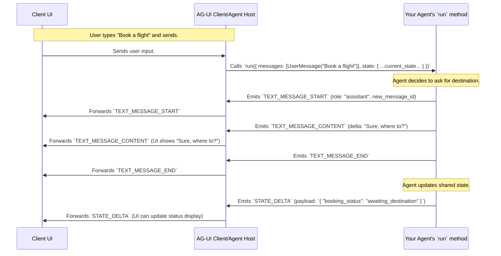

# Chapter 3: Message and State Types

In [Chapter 2: Agent (Abstract Representation)](02_agent__abstract_representation__.md), we learned about the `AbstractAgent` blueprint and how an agent's `run` method is the heart of its operation, receiving inputs and producing a stream of [AG-UI Events](01_ag_ui_events_.md).

But what about the *actual data* that makes up a conversation? When a user types "Hello," or the AI responds "How can I help?", how is that structured? And what if the agent and UI need to share some background information that isn't a direct chat message, like the status of a long-running task?

This is where **Message and State Types** come in. They define the structure of this core data, going beyond the event wrappers themselves.

## The Need for Structure: More Than Just Event Signals

Imagine you're building a chat application.
*   You need to distinguish between what the **user** says and what the **AI assistant** says.
*   Sometimes, the AI might need to perform an action using a "tool," and you'll want to record the result of that tool use.
*   There might be "system" level instructions or context given to the AI that aren't shown to the user directly but are still part of the conversation's history.

Simply sending raw text through events isn't enough. We need a way to categorize these different kinds of information. Similarly, if an AI is working on a multi-step recipe for the user, both the AI and the UI might need to know "we are on step 3 of 5." This shared understanding is what `State` provides.

## Message Types: The Different "Speech Bubbles"

Think of `Message` types as the different kinds of speech bubbles you see in a chat app. Each message has a specific **role**, a unique **ID** (so we can track it), and **content**.

AG-UI defines several common message roles:

*   👤 **User Message**: Represents what the human user types or inputs.
    *   *Example*: "What's the weather like in London?"
*   🤖 **Assistant Message**: Represents what the AI agent says in response. This can be plain text or can include requests for the UI to execute "tools" (like fetching data or displaying a map).
    *   *Example*: "The weather in London is partly cloudy with a chance of rain."
    *   *Example with tool call*: "Okay, I need to use the `get_weather` tool for London. [tool_call_details]"
*   ⚙️ **System Message**: Often used to provide initial instructions, context, or guidelines to the AI. These are usually not directly displayed to the end-user but help shape the AI's behavior.
    *   *Example*: "You are a helpful assistant. Be polite and concise."
*   🛠️ **Tool Message** (or Tool Result Message): Contains the output or result from a "tool" that the Assistant requested to be run.
    *   *Example*: (After `get_weather` tool runs) "Temperature: 15°C, Condition: Partly Cloudy."

Each of these message types will have a common structure, typically including:
*   `id`: A unique identifier for this specific message.
*   `role`: A string like `"user"`, `"assistant"`, `"system"`, or `"tool"`. This tells us who "said" it.
*   `content`: The actual text of the message.
*   Other fields specific to the role (e.g., `tool_calls` for an `AssistantMessage` or `tool_call_id` for a `ToolMessage`).

When an agent runs (as discussed in [Chapter 2: Agent (Abstract Representation)](02_agent__abstract_representation__.md)), it receives the history of these messages in the `RunAgentInput.messages` array. This history provides the context for the agent to generate its next response.

## State: The Shared Notepad

Beyond direct conversation messages, the agent and the UI might need to share other kinds of information. This is what `State` is for.

**`State` represents any arbitrary shared information between the agent and the UI that isn't a direct message.**

Think of `State` as a shared digital notepad or a whiteboard that both the agent and the user interface can see and (potentially) modify. It's a flexible place to store data that helps coordinate their activities or maintain context.

Here are some examples of what `State` could hold:
*   The current status of a multi-step task: `{"current_step": "analyzing_data", "total_steps": 5}`
*   Information about a document being collaboratively edited: `{"document_id": "doc123", "last_edited_by": "user"}`
*   User preferences that affect the agent's behavior: `{"preferred_language": "fr", "detail_level": "high"}`
*   A simple counter: `{"api_calls_made": 10}`

The `State` is also passed to the agent in the `RunAgentInput.state` object. The agent can then read this state to inform its decisions, and it can also request changes to the state, which are then communicated back to the UI.

## How These Types are Defined: The Blueprints for Data

To ensure the agent and the UI understand each other, these `Message` and `State` types are formally defined. In the AG-UI SDKs (Python and TypeScript), these definitions often use libraries like Pydantic (for Python) or Zod (for TypeScript) to describe the expected shape of the data.

Let's look at a simplified example of how message types might be defined in TypeScript:

```typescript
// Simplified structure for any message
interface BaseMessage {
  id: string;        // Unique ID for the message
  role: string;      // "user", "assistant", "system", "tool"
  content?: string;  // The text content (optional for some roles initially)
}

// A UserMessage must have the role "user" and content
interface UserMessage extends BaseMessage {
  role: "user";
  content: string;
}

// An AssistantMessage must have the role "assistant"
// Its content might be built up piece by piece
interface AssistantMessage extends BaseMessage {
  role: "assistant";
  // It might also have 'toolCalls' if it's asking the UI to do something
}
```
*   `BaseMessage`: Shows the common fields like `id` and `role`.
*   `UserMessage`: Extends `BaseMessage` and specifies that `role` must be `"user"` and `content` is required.
*   `AssistantMessage`: Similarly specifies `role` as `"assistant"`.

These definitions (found in `python-sdk/ag_ui/core/types.py` and `typescript-sdk/packages/core/src/types.ts`) act as a contract. When the agent sends data structured as an `AssistantMessage`, the UI knows what fields to expect and how to interpret them.

For `State`, it's often defined as `Any` or `z.any()` (in Zod), meaning it can be any valid JSON structure. This gives you maximum flexibility.

```typescript
// In TypeScript, State can often be any type
type State = any;
```

## Messages and State in Action: The Flow of Information

Now, let's see how these types are used during an interaction. Remember from [Chapter 2: Agent (Abstract Representation)](02_agent__abstract_representation__.md) that the agent's `run` method receives `RunAgentInput`, which contains the current `messages` history and the current `state`.



Here's what's happening:

1.  **Input to Agent**:
    *   The `AgentRuntime` (part of the AG-UI client library) prepares the `RunAgentInput`. This includes the list of past `Message` objects (like the `UserMessage` "Book a flight") and the current `State` object.
    *   It then calls your agent's `run` method with this input.

2.  **Agent Processing & Sending New Messages**:
    *   Your agent's logic processes the input messages and state.
    *   When it wants to send a new `AssistantMessage` (e.g., "Sure, where to?"), it doesn't just send a complete `AssistantMessage` object in one go. Instead, it uses a sequence of [AG-UI Events](01_ag_ui_events_.md) we learned about in Chapter 1:
        *   `TEXT_MESSAGE_START`: Signals the beginning of a new message, its `id`, and its `role` (e.g., `"assistant"`).
        *   `TEXT_MESSAGE_CONTENT`: Sends a piece (a "delta") of the message's text. This can be sent multiple times for a streaming effect.
        *   `TEXT_MESSAGE_END`: Signals that this particular message is complete.
    *   The Client UI receives these events and reconstructs the assistant's message to display it.

3.  **Agent Updating State**:
    *   If the agent wants to change the shared `State` (e.g., to update `booking_status`), it emits specific state events:
        *   `STATE_DELTA`: Sends only the *changes* to the state. This is efficient if only a small part of the state updated.
        *   `STATE_SNAPSHOT`: Sends a complete new version of the entire state object.
    *   The Client UI receives these state events and updates its local copy of the state. This might trigger UI changes, like updating a status indicator.

Sometimes, an agent might also send a `MESSAGES_SNAPSHOT` event, which contains a full list of all `Message` objects in the conversation so far. This is useful for syncing the UI if it joins a conversation late or needs to refresh its entire view.

## Conclusion: Well-Defined Data for Clear Communication

You've now learned about `Message` and `State` types – the structured data that forms the core of the interaction between your AI agent and the user interface.
*   **`Message` types** (User, Assistant, System, Tool) clearly define the roles and content of conversational exchanges, much like different speech bubbles.
*   **`State`** provides a flexible "shared notepad" for any other information that needs to be synchronized between the agent and the UI.

By having well-defined structures for this data, AG-UI ensures that both the agent and the UI have a common understanding, leading to more robust and predictable applications. These types are the "what" that is being communicated, while the [AG-UI Events](01_ag_ui_events_.md) are the "how" they are transmitted.

In the next chapter, we'll explore how the client-side (your frontend application) takes the stream of AG-UI events (carrying information about these messages and state changes) and processes them to update the user interface: [Chapter 4: Event Stream Processing Pipeline (Client-side)](04_event_stream_processing_pipeline__client_side__.md).

---

Generated by [AI Codebase Knowledge Builder](https://github.com/The-Pocket/Tutorial-Codebase-Knowledge)