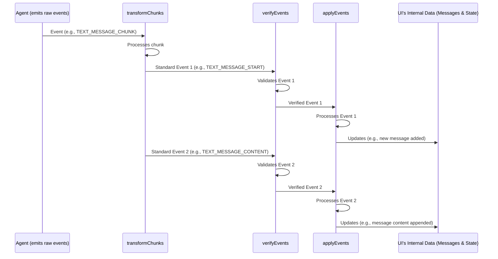

# Chapter 4: Event Stream Processing Pipeline (Client-side)

Welcome to Chapter 4! In [Chapter 3: Message and State Types](03_message_and_state_types_.md), we explored the structure of the data that flows between the AI agent and your UI, like `Message` objects (who said what) and `State` objects (shared context). Now, we're going to see how your frontend application (the client-side) actually handles the incoming stream of [AG-UI Events](01_ag_ui_events_.md) that carry this information.

## What's the Big Deal with Processing Events?

Imagine your AI agent is like a chef in a busy kitchen, sending out dishes (data) as they're ready. The events are like the waiters bringing these dishes to the customer (your UI). But it's not always as simple as just placing the dish on the table.

*   Sometimes, a dish (a message) comes in several parts (e.g., "Hello..." then "...there!"). The waiter needs to assemble it.
*   The waiter needs to make sure the chef isn't sending a dessert before the main course (events in the wrong order).
*   Finally, the customer's table (the UI's internal data) needs to be updated to reflect the new dishes.

This is what the **Event Stream Processing Pipeline (Client-side)** does. It's a sequence of steps your AG-UI client application (usually in TypeScript) performs to make sense of the stream of events coming from the agent. It ensures data is handled correctly and your UI stays perfectly in sync with what the agent is doing.

Think of it as an assembly line for AG-UI events on the frontend.

## The Three Main Stages of the Pipeline

Our event processing pipeline in the AG-UI client has three main stages. Each event that arrives from the agent goes through these stages:

1.  **`transformChunks`**: *Assembling الكامل Messages from Pieces*
    Sometimes, for efficiency, an agent might send parts of a message or tool call in compact "chunk" events (like `TEXT_MESSAGE_CHUNK`). This first stage takes these chunks and converts them into the standard sequence of events (e.g., `TEXT_MESSAGE_START`, `TEXT_MESSAGE_CONTENT`, `TEXT_MESSAGE_END`) that are easier to work with.
    *   **Analogy**: An assembly worker who receives a kit of small parts and assembles them into a larger, recognizable component.

2.  **`verifyEvents`**: *Quality Control for Events*
    This stage acts like a protocol inspector. It checks if the agent is sending events in the correct order and format. For example, it ensures a `TEXT_MESSAGE_CONTENT` event (part of a message) isn't sent before a `TEXT_MESSAGE_START` event (which signals a new message).
    *   **Analogy**: A quality control inspector on the assembly line who checks if each component is built correctly and in the right sequence before it moves on.

3.  **`applyEvents`**: *Updating the UI's Brain*
    Once an event has been transformed (if needed) and verified, this final stage takes the event and uses it to update the UI's internal knowledge. This means updating the list of [Messages](03_message_and_state_types_.md) (the conversation history) and the shared [State](03_message_and_state_types_.md).
    *   **Analogy**: The final station on the assembly line where the correct, assembled components are used to update the main product (the UI's data and display).

Let's see how this pipeline helps with a simple example. Suppose the agent wants to send "Hi!" and it uses a `TEXT_MESSAGE_CHUNK` event:

*   **Agent sends**: `TEXT_MESSAGE_CHUNK { messageId: "m1", delta: "Hi" }`
    (This is a compact way to send the first part of a new message)

Now, let's see it go through the client-side pipeline:

1.  **`transformChunks` receives the `TEXT_MESSAGE_CHUNK`**:
    *   It sees this is the start of a new message "m1".
    *   It outputs two standard events:
        1.  `TEXT_MESSAGE_START { messageId: "m1", role: "assistant" }`
        2.  `TEXT_MESSAGE_CONTENT { messageId: "m1", delta: "Hi" }`

2.  **`verifyEvents` receives these events one by one**:
    *   Receives `TEXT_MESSAGE_START`: "Okay, a new assistant message is starting. This is valid."
    *   Receives `TEXT_MESSAGE_CONTENT`: "Okay, content for message 'm1'. This is valid because 'm1' just started."
    *   If the agent later sent another `TEXT_MESSAGE_CONTENT` for a *different* `messageId` before `m1` ended, `verifyEvents` would flag an error!

3.  **`applyEvents` receives the verified events**:
    *   Receives `TEXT_MESSAGE_START`:
        *   It adds a new, empty assistant message object with `id: "m1"` to the UI's internal list of messages.
        *   So, `messages` might now look like: `[{ id: "m1", role: "assistant", content: "" }]`
    *   Receives `TEXT_MESSAGE_CONTENT { delta: "Hi" }`:
        *   It finds the message with `id: "m1"` and appends "Hi" to its content.
        *   `messages` becomes: `[{ id: "m1", role: "assistant", content: "Hi" }]`
    *   The UI can then re-render to show the "Hi!" message.

If the agent then sends `TEXT_MESSAGE_CHUNK { messageId: "m1", delta: "!" }` and then a final chunk indicating the end, the pipeline would ensure "!" is appended and the message is marked as complete.

## Under the Hood: How the Pipeline is Set Up

This pipeline is orchestrated within the `AbstractAgent` class we learned about in [Chapter 2: Agent (Abstract Representation)](02_agent__abstract_representation__.md). When you call `agent.runAgent()`, it sets up this stream processing.

Here's a simplified look at how these stages are chained together using RxJS (a library for handling streams of data) in `typescript-sdk/packages/client/src/agent/agent.ts`:

```typescript
// Simplified from typescript-sdk/packages/client/src/agent/agent.ts
// Inside AbstractAgent.runAgent():

const pipeline = pipe( // pipe connects operations
  () => this.run(input),         // 0. Agent's run() method produces raw events
  transformChunks(this.debug),   // 1. Transform Chunks
  verifyEvents(this.debug),      // 2. Verify Events
  (source$) => this.apply(input, source$), // 3. Apply Events to update state
  // ... other operations for logging, error handling ...
);

// Then, this pipeline is executed.
```
This `pipe` function is like connecting different sections of our assembly line. Each event flows from one stage to the next.

Let's visualize this flow:



Now, let's peek into each stage a bit more.

### Stage 1: `transformChunks` - Assembling Components

File: `typescript-sdk/packages/client/src/chunks/transform.ts`

This stage is responsible for converting compact "chunk" events like `TEXT_MESSAGE_CHUNK` or `TOOL_CALL_CHUNK` into a series of standard AG-UI events. For example, a single `TEXT_MESSAGE_CHUNK` that contains the start of a message and some content will be expanded.

```typescript
// Simplified from typescript-sdk/packages/client/src/chunks/transform.ts
// Inside transformChunks logic:
// If a TEXT_MESSAGE_CHUNK event arrives...
if (event.type === EventType.TEXT_MESSAGE_CHUNK) {
  const chunk = event as TextMessageChunkEvent;
  
  // Is this the first chunk for this messageId?
  if (/* it's a new messageId or no message is active */) {
    // Emit TEXT_MESSAGE_START
    outputStream.next({ 
      type: EventType.TEXT_MESSAGE_START, 
      messageId: chunk.messageId, 
      role: "assistant" // Chunks are usually from assistant
    });
  }

  // Emit TEXT_MESSAGE_CONTENT with the chunk's delta
  outputStream.next({ 
    type: EventType.TEXT_MESSAGE_CONTENT, 
    messageId: chunk.messageId, 
    delta: chunk.delta 
  });

  // If chunk also signals end, emit TEXT_MESSAGE_END (not shown for brevity)
}
```
This ensures that the rest of the pipeline (`verifyEvents` and `applyEvents`) can work with a consistent set of more granular events like `TEXT_MESSAGE_START`, `TEXT_MESSAGE_CONTENT`, and `TEXT_MESSAGE_END`.

### Stage 2: `verifyEvents` - The Quality Inspector

File: `typescript-sdk/packages/client/src/verify/verify.ts`

This function acts as a strict bouncer, ensuring events follow the rules of the AG-UI protocol. It maintains some state about the ongoing interaction (e.g., "is a message currently being streamed?").

For example, it checks that a `TEXT_MESSAGE_CONTENT` event only arrives when a text message has already been started with `TEXT_MESSAGE_START` and has the correct `messageId`.

```typescript
// Simplified from typescript-sdk/packages/client/src/verify/verify.ts
// Inside verifyEvents logic:
let activeMessageId: string | undefined; // Tracks current open message

// ...
if (event.type === EventType.TEXT_MESSAGE_START) {
  activeMessageId = (event as TextMessageStartEvent).messageId;
} else if (event.type === EventType.TEXT_MESSAGE_CONTENT) {
  if (!activeMessageId) {
    // ERROR! Content without a start.
    return throwError(() => new AGUIError("Content without start!"));
  }
  if ((event as TextMessageContentEvent).messageId !== activeMessageId) {
    // ERROR! Content for the wrong message.
    return throwError(() => new AGUIError("Content ID mismatch!"));
  }
} else if (event.type === EventType.TEXT_MESSAGE_END) {
  activeMessageId = undefined; // Message is now closed
}
// ... many more checks for other event types and sequences ...
```
If an event breaks the rules, `verifyEvents` will usually stop the stream and report an error. This is incredibly helpful for debugging agent behavior.

### Stage 3: `applyEvents` - Updating the UI's Knowledge

File: `typescript-sdk/packages/client/src/apply/default.ts`

This is where the validated events finally cause changes to the client's internal representation of the conversation (`messages`) and any shared `state`.

Let's see how it handles `TEXT_MESSAGE_START` and `TEXT_MESSAGE_CONTENT`:

```typescript
// Simplified from typescript-sdk/packages/client/src/apply/default.ts
// messages and state are kept in closure and updated
// let messages = initialMessages;
// let state = initialState;

// ...
if (event.type === EventType.TEXT_MESSAGE_START) {
  const startEvent = event as TextMessageStartEvent;
  const newMessage: Message = {
    id: startEvent.messageId,
    role: startEvent.role,
    content: "", // Start with empty content
  };
  messages.push(newMessage); // Add to our list of messages
  return emitUpdate({ messages }); // Signal that messages updated
}

if (event.type === EventType.TEXT_MESSAGE_CONTENT) {
  const contentEvent = event as TextMessageContentEvent;
  // Find the last message (assuming it's the active one)
  const lastMessage = messages[messages.length - 1];
  if (lastMessage && lastMessage.id === contentEvent.messageId) {
    lastMessage.content += contentEvent.delta; // Append the new text
  }
  return emitUpdate({ messages }); // Signal that messages updated
}
// ... handles other events like STATE_DELTA, TOOL_CALL_START etc. ...
```
When `applyEvents` processes an event that modifies `messages` or `state`, it emits an update. Your UI framework (like React, Vue, Angular, or Svelte) can then listen for these updates and re-render the necessary parts of the screen. For example, if `messages` is updated, your chat log component would refresh to show the new or changed message.

## Why This Pipeline Matters

This client-side processing pipeline is crucial for a few reasons:
*   **Consistency**: It ensures all events are handled in a standardized way.
*   **Resilience**: `verifyEvents` helps protect your UI from malformed or out-of-sequence data from the agent.
*   **Developer Experience**: By separating concerns (`transform`, `verify`, `apply`), it makes the AG-UI client library easier to understand, maintain, and extend.
*   **Flexibility**: It allows agents to send events in more efficient "chunked" formats, while the client takes care of normalizing them.
*   **Synchronization**: It's the mechanism that keeps your UI's view of the world (its `messages` and `state`) in lockstep with the agent's activity.

## Conclusion: Order from Chaos

You've now seen how the AG-UI client takes the potentially complex stream of events from an AI agent and processes it through a well-defined pipeline: `transformChunks` (assemble), `verifyEvents` (inspect), and `applyEvents` (update). This "assembly line" ensures that your UI can reliably interpret the agent's communications and keep the user experience smooth and synchronized.

This pipeline primarily deals with the *content* and *sequence* of events. But how do these events physically travel from the agent (potentially on a server) to your client application (in the browser)? That's the topic of our next chapter: [Chapter 5: Event Encoding and Transport](05_event_encoding_and_transport_.md).

---

Generated by [AI Codebase Knowledge Builder](https://github.com/The-Pocket/Tutorial-Codebase-Knowledge)