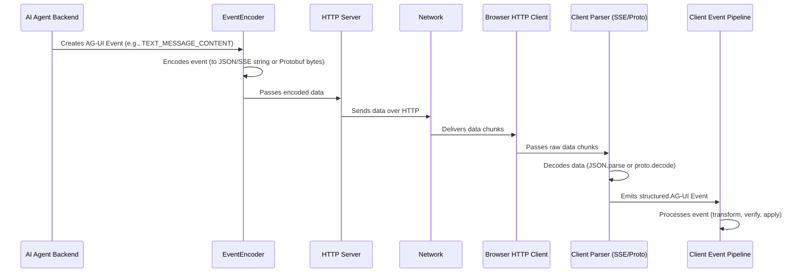

# Chapter 5: Event Encoding and Transport

Welcome to Chapter 5! In [Chapter 4: Event Stream Processing Pipeline (Client-side)](04_event_stream_processing_pipeline__client_side__.md), we saw how your frontend application takes the stream of AG-UI events and processes them to update your UI. But how do these events actually travel from the AI agent (which might be on a server far away) to your user's browser? And how are they "packaged" for this journey?

That's what this chapter is all about: **Event Encoding and Transport**.

## The Journey of an Event: Like Sending a Letter

Imagine your AI agent wants to send an [AG-UI Event](01_ag_ui_events_.md), like `TEXT_MESSAGE_CONTENT`, to your UI.
*   The event itself is the **content of the letter** (e.g., "Hello there!").
*   Before you can send a letter, you need to put it in an **envelope**. This is **Encoding**. It's about preparing the event data in a format suitable for sending over a network.
*   Then, you need to choose a **shipping method** (like regular mail, express courier). This is **Transport**. It's about the actual mechanism used to send the encoded event.
*   Finally, when the letter arrives, the recipient needs to **open the envelope** to read the content. This is **Decoding** on the receiving end.

AG-UI needs a reliable way to package (encode) events and send them (transport) so they arrive intact and can be understood (decoded) by the client.

## The "Envelope": Encoding Your Events

Encoding means converting the structured AG-UI event object (which might exist in your agent's Python or TypeScript code) into a sequence of bytes or a string that can be sent over a network. AG-UI primarily supports two "envelope" types:

### 1. JSON over Server-Sent Events (SSE): The Readable Postcard

*   **What it is**: Your event data is formatted as JSON (JavaScript Object Notation), which is human-readable text. This JSON string is then typically sent using a technology called Server-Sent Events (SSE).
*   **Analogy**: Think of it like writing your message clearly on a postcard. Anyone who intercepts it can read it easily.
*   **Pros**:
    *   **Human-readable**: Great for debugging! You can often see the JSON data directly in your browser's developer tools.
    *   **Simple to implement**: SSE is a straightforward standard for servers to stream data to clients.
*   **Cons**:
    *   **Larger size**: Text-based JSON is usually more verbose than binary formats, meaning it takes up more bandwidth.

A JSON-encoded event sent via SSE might look something like this over the network:
```
data: {"type":"TEXT_MESSAGE_CONTENT","message_id":"msg123","delta":"Hello"}

data: {"type":"TEXT_MESSAGE_CONTENT","message_id":"msg123","delta":" world"}

```
Each `data:` line followed by a JSON object is a separate event or part of an event message. The double newline `\n\n` signals the end of an SSE message.

### 2. Protocol Buffers (Protobuf): The Compact, Secure Package

*   **What it is**: Protocol Buffers (Protobuf) is a binary format developed by Google. It's designed to be very efficient. Your event data is converted into a compact sequence of bytes.
*   **Analogy**: This is like putting your message in a special, small, efficiently packed box. It's not easily readable by just looking at it, but it's very quick to ship and unpack if you have the key (the Protobuf definition).
*   **Pros**:
    *   **Smaller size**: Binary formats are typically much smaller than text, saving bandwidth.
    *   **Faster parsing**: Decoding binary data can be quicker than parsing JSON strings.
    *   **Strongly typed**: Protobuf definitions enforce a schema, which can help prevent errors.
*   **Cons**:
    *   **Not human-readable**: You can't easily inspect the raw data without tools.
    *   **More setup**: Requires defining your event structures in a `.proto` file and generating code.

AG-UI provides these Protobuf definitions for you, so you don't have to create them from scratch.

## The "Shipping Method": Transporting Events

Once an event is encoded (put in an "envelope"), it needs to be transported. The most common transport mechanism for web applications is **HTTP (Hypertext Transfer Protocol)**.

*   **Server-Sent Events (SSE)**: This is a specific way of using HTTP that allows a server to continuously send data (stream) to a client once an initial connection is established. It's a perfect fit for JSON-encoded AG-UI events because it's designed for text-based event streams.
*   **HTTP for Protobuf**: Protobuf-encoded events are also sent over HTTP. Often, when streaming binary data like Protobuf, each message is prefixed with its length (e.g., a 4-byte number saying "the next message is X bytes long"). This helps the receiver know when one message ends and the next begins.

## The Senders and Receivers: `EventEncoder` and Parsers

AG-UI provides tools to handle this encoding and decoding:

### `EventEncoder` (Server-Side): Packaging the Events

On the server side (where your AI agent often lives), `EventEncoder` classes are responsible for taking an [AG-UI Event](01_ag_ui_events_.md) object and converting it into the chosen format (JSON for SSE, or Protobuf).

*   In Python (`python-sdk/ag_ui/encoder/encoder.py`), the `EventEncoder` can format events as SSE strings.
    ```python
    # Simplified from ag_ui.encoder.encoder.py
    # event is an AG-UI BaseEvent object
    def _encode_sse(self, event: BaseEvent) -> str:
        # Convert event object to JSON string
        json_data = event.model_dump_json(by_alias=True, exclude_none=True)
        return f"data: {json_data}\n\n" # SSE format
    ```
    This Python code takes an event object, turns it into a JSON string, and then formats it as an SSE `data:` line.

*   In TypeScript (`typescript-sdk/packages/encoder/src/encoder.ts`), the `EventEncoder` can choose between SSE (JSON) or Protobuf based on what the client says it can accept (using HTTP `Accept` headers).
    ```typescript
    // Simplified from typescript-sdk/packages/encoder/src/encoder.ts
    // event is an AG-UI BaseEvent object
    
    // For SSE (JSON)
    encodeSSE(event: BaseEvent): string {
      return `data: ${JSON.stringify(event)}\n\n`;
    }

    // For Protobuf
    encodeProtobuf(event: BaseEvent): Uint8Array {
      const messageBytes = proto.encode(event); // proto.encode is from @ag-ui/proto
      // ... (code to add 4-byte length prefix to messageBytes) ...
      return prefixedBytes; // This is a Uint8Array (binary data)
    }
    ```
    This TypeScript `EventEncoder` has methods for both SSE and Protobuf. The `encodeProtobuf` method uses `proto.encode` (from `@ag-ui/proto`) to serialize the event into binary and then adds a length prefix.

The server uses the `EventEncoder` to prepare events and then writes the output (string for SSE, bytes for Protobuf) to the HTTP response.

### Client-Side Parsers: Unpacking the Events

When the client (your frontend application in the browser) receives this data stream over HTTP, it needs to decode it. AG-UI provides parser functions for this:

*   **`parseSSEStream`**: If you're using JSON over SSE. This function takes the incoming stream of text, splits it into individual SSE messages, extracts the JSON data, and parses it back into JavaScript objects.
    Located in: `typescript-sdk/packages/client/src/transform/sse.ts`

    ```typescript
    // Conceptual flow of parseSSEStream
    // httpResponseStream: a stream of text chunks from the server
    // output: a stream of parsed AG-UI event objects

    // 1. Accumulate text chunks.
    // 2. When a double newline ("\n\n") is found, an SSE message is complete.
    // 3. For each line starting with "data: ", extract the content.
    // 4. Join multi-line data if any.
    // 5. JSON.parse() the resulting string.
    // 6. Emit the parsed event object.
    ```
    This parser diligently processes the text stream to reconstruct the original JSON events.

*   **`parseProtoStream`**: If you're using Protobuf. This function takes the incoming stream of binary data. It reads the 4-byte length prefix to know how many bytes the actual Protobuf message is, then reads those bytes, and then uses `proto.decode` (from `@ag-ui/proto`) to convert them back into AG-UI event objects.
    Located in: `typescript-sdk/packages/client/src/transform/proto.ts`

    ```typescript
    // Conceptual flow of parseProtoStream
    // httpResponseStream: a stream of binary chunks (Uint8Array)
    // output: a stream of parsed AG-UI event objects

    // 1. Accumulate binary chunks in a buffer.
    // 2. If buffer has >= 4 bytes, read the 4-byte length prefix (N).
    // 3. If buffer has >= (4 + N) bytes, extract the N message bytes.
    // 4. Use proto.decode(messageBytes) to parse into an AG-UI event object.
    // 5. Emit the parsed event object.
    // 6. Remove processed bytes from buffer and repeat.
    ```
    This parser carefully handles the binary stream to correctly extract and deserialize each Protobuf message.

These parsers are crucial because they turn the raw network data back into the structured [AG-UI Events](01_ag_ui_events_.md) that the [Event Stream Processing Pipeline (Client-side)](04_event_stream_processing_pipeline__client_side__.md) can then work with.

## End-to-End Flow: From Agent to UI

Let's visualize the journey for an event:


This shows how the event is created, packaged, shipped, received, unpackaged, and finally processed by the client.

## Why Two Methods? Flexibility and Choice

AG-UI supports both JSON/SSE and Protobuf to give you flexibility:
*   **During development and debugging**: JSON over SSE is often easier because you can directly inspect the event data.
*   **For production and performance-critical applications**: Protobuf can offer significant advantages in terms of speed and bandwidth usage.

Typically, the client can tell the server what formats it prefers using the HTTP `Accept` header. For example, it might say "I prefer `application/vnd.ag-ui.event+proto`, but I also accept `text/event-stream` (SSE)". The server can then choose the best common format. The `EventEncoder` in the TypeScript SDK (`typescript-sdk/packages/encoder/src/encoder.ts`) has logic to check this `Accept` header:

```typescript
// From typescript-sdk/packages/encoder/src/encoder.ts
// Simplified check
private isProtobufAccepted(acceptHeader: string): boolean {
  // Checks if AGUI_MEDIA_TYPE for Protobuf is in the acceptHeader
  return acceptHeader.includes(proto.AGUI_MEDIA_TYPE); 
}

getContentType(): string {
  if (this.acceptsProtobuf) { // true if isProtobufAccepted was true
    return proto.AGUI_MEDIA_TYPE; // "application/vnd.ag-ui.event+proto"
  } else {
    return "text/event-stream"; // For JSON/SSE
  }
}
```
The `getContentType` method helps the server set the correct `Content-Type` header in its HTTP response, telling the client what kind of "envelope" it's sending.

## A Deeper Look at the Code Components

Let's briefly revisit the key files involved:

*   **`python-sdk/ag_ui/encoder/encoder.py` (Python `EventEncoder`)**:
    *   Provides `_encode_sse` to format an event as a JSON string within an SSE `data:` line.
    *   `get_content_type` returns `"text/event-stream"` as it primarily focuses on SSE.

*   **`typescript-sdk/packages/encoder/src/encoder.ts` (TypeScript `EventEncoder`)**:
    *   `constructor` can take an `accept` header string.
    *   `isProtobufAccepted` checks if the client supports AG-UI's Protobuf media type.
    *   `getContentType` returns the appropriate media type (`application/vnd.ag-ui.event+proto` or `text/event-stream`) based on client preference.
    *   `encodeSSE` serializes an event to a JSON string for SSE.
    *   `encodeBinary` (which can call `encodeProtobuf`) serializes an event to `Uint8Array` (binary data). `encodeProtobuf` uses `proto.encode` and adds a 4-byte length prefix.

*   **`typescript-sdk/packages/proto/src/proto.ts` (Protobuf Encoding/Decoding Logic)**:
    *   `encode(event: BaseEvent): Uint8Array`: Takes an AG-UI event object and converts it into raw Protobuf binary data (`Uint8Array`). It handles mapping event fields to the Protobuf message structure.
    *   `decode(data: Uint8Array): BaseEvent`: Takes raw Protobuf binary data and converts it back into a structured AG-UI event object. It also handles mapping Protobuf fields back to the event object structure. This is used by `parseProtoStream`.

*   **`typescript-sdk/packages/client/src/transform/sse.ts` (`parseSSEStream`)**:
    *   Takes an `Observable<HttpEvent>` (raw data chunks from an HTTP request).
    *   Uses `TextDecoder` to convert binary chunks (UTF-8 encoded text) into strings.
    *   Buffers these strings and splits them by `\n\n` (SSE message delimiter).
    *   For each SSE message, it extracts lines starting with `data:`, joins them if necessary, and then uses `JSON.parse()` to get the event object.
    *   Emits the parsed event objects as an `Observable`.

*   **`typescript-sdk/packages/client/src/transform/proto.ts` (`parseProtoStream`)**:
    *   Takes an `Observable<HttpEvent>` (raw data chunks).
    *   Buffers incoming `Uint8Array` data.
    *   Continuously tries to read a 4-byte length prefix (big-endian `uint32`) from the buffer.
    *   If the full message (length prefix + message body) is available in the buffer, it extracts the message bytes.
    *   Uses `proto.decode()` (from `@ag-ui/proto`) to deserialize these bytes into an AG-UI `BaseEvent`.
    *   Emits the parsed event object and removes the processed data from the buffer.

These components work together to ensure events can be reliably packaged, sent, received, and unpackaged.

## Conclusion: Bridging the Gap Between Agent and UI

You've now learned about **Event Encoding and Transport** in AG-UI. This is the critical mechanism that allows [AG-UI Events](01_ag_ui_events_.md) to travel from the AI agent to your user interface.
*   **Encoding** is like choosing an envelope: human-readable JSON (often with SSE) or efficient Protocol Buffers. `EventEncoder` classes handle this.
*   **Transport** is the shipping method, typically HTTP, with Server-Sent Events being a common technique for streaming.
*   **Decoding** is opening the envelope: `parseSSEStream` and `parseProtoStream` on the client-side convert the raw network data back into usable event objects.

This system provides flexibility, allowing you to choose between readability for debugging and efficiency for production. Understanding how events are packaged and shipped helps you build more robust and performant AI applications.

In the next chapter, we'll explore the [Chapter 6: Dojo Demo Environment](06_dojo_demo_environment_.md), a place where you can see many of these concepts in action and experiment with AG-UI!

---

Generated by [AI Codebase Knowledge Builder](https://github.com/The-Pocket/Tutorial-Codebase-Knowledge)