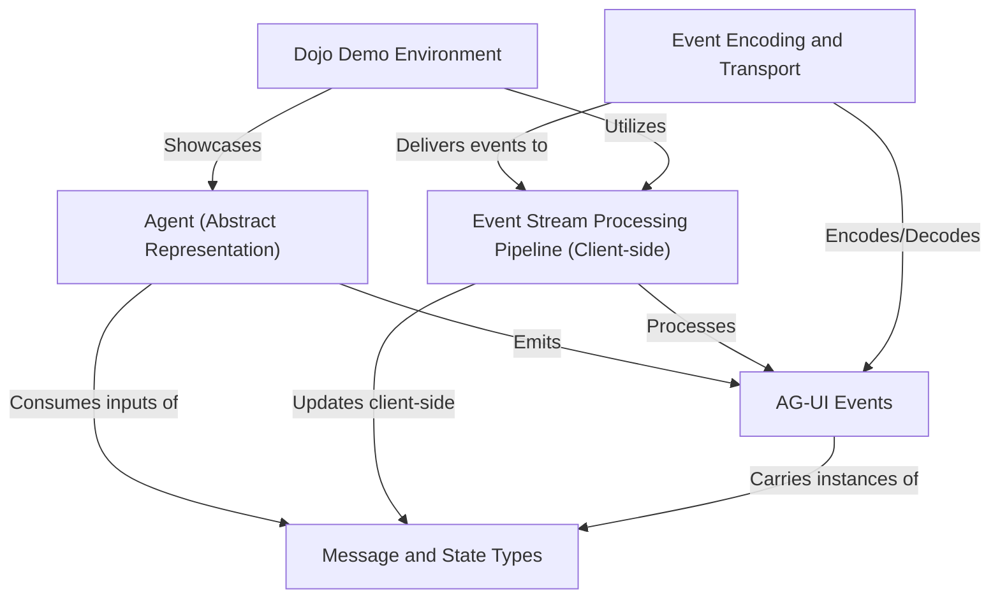

# Tutorial: ag-ui

AG-UI is a project that *standardizes* how **AI agents** communicate with **frontend applications**. It provides an open, lightweight, *event-based protocol*. This means AI agents send out a series of defined **AG-UI Events** (like "I'm starting to type" or "perform this tool call") to the app. The frontend then processes these events using a defined *pipeline* to enable real-time interactions such as agentic chat, frontend tool execution, and synchronization of shared *messages and state*. The project also includes a *Dojo demo environment* to showcase these capabilities.

**Source Repository:** [https://github.com/ag-ui-protocol/ag-ui.git](https://github.com/ag-ui-protocol/ag-ui.git)

## Chapters

1. [AG-UI Events
](01_ag_ui_events_.md)
2. [Agent (Abstract Representation)
](02_agent__abstract_representation__.md)
3. [Message and State Types
](03_message_and_state_types_.md)
4. [Event Stream Processing Pipeline (Client-side)
](04_event_stream_processing_pipeline__client_side__.md)
5. [Event Encoding and Transport
](05_event_encoding_and_transport_.md)
6. [Dojo Demo Environment
](06_dojo_demo_environment_.md)

---

Generated by [AI Codebase Knowledge Builder](https://github.com/The-Pocket/Tutorial-Codebase-Knowledge)