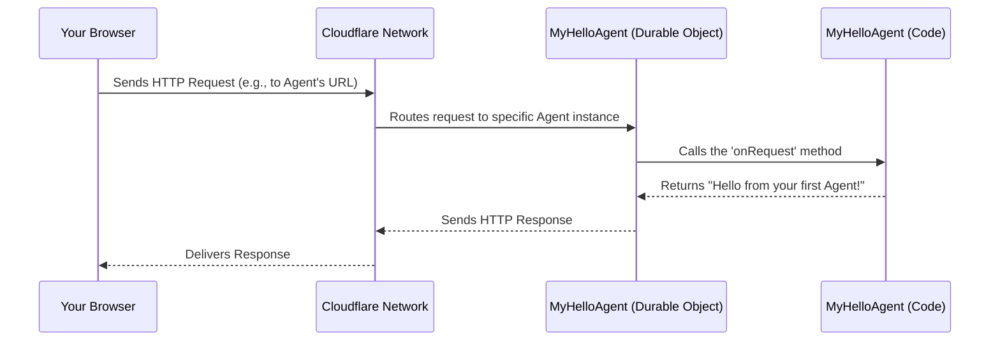
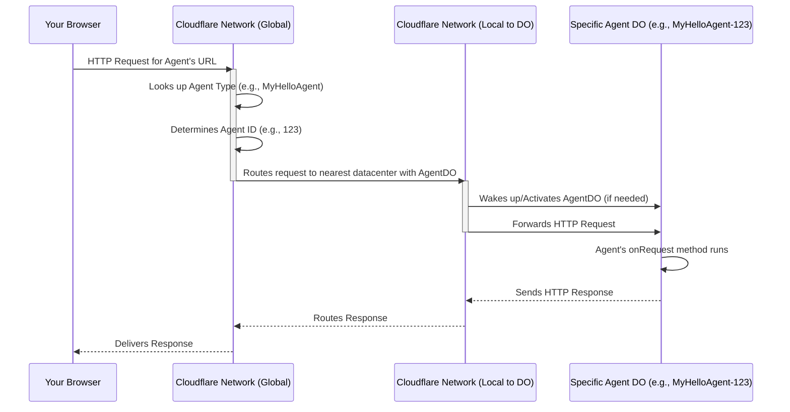
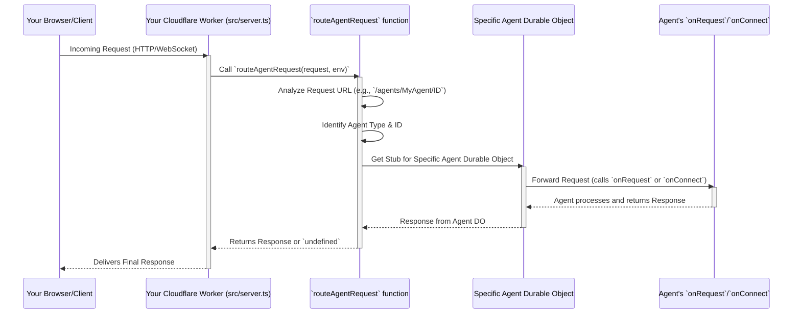
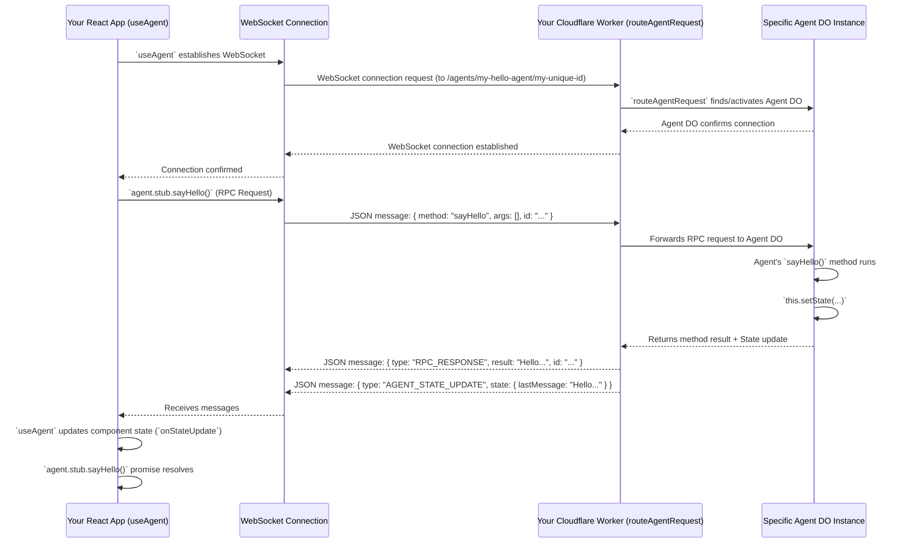
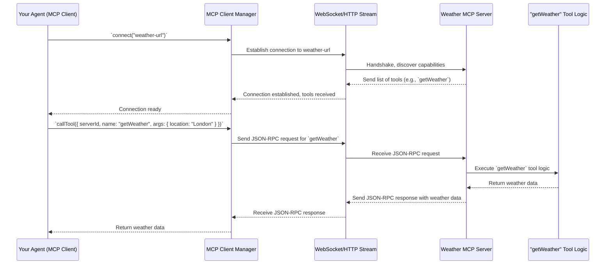
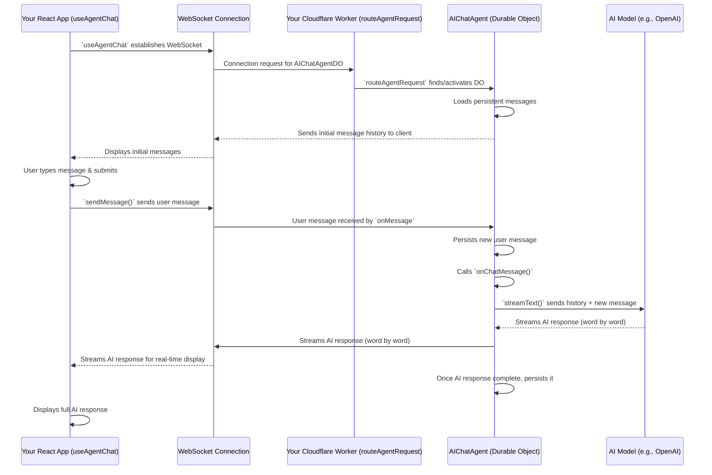

# Tutorial: agents

Cloudflare Agents is a **framework** for building *intelligent, stateful AI agents* that run at the edge of the network. It allows developers to create persistent digital assistants (`Agent`s) that can maintain memory, communicate in real-time, and interact with *AI models* and other services. The framework provides tools for both backend agent logic (running on `Durable Objects`) and frontend integration (`useAgent` React hook) to build dynamic and responsive AI applications.


**Source Repository:** [https://github.com/cloudflare/agents.git](https://github.com/cloudflare/agents.git)

```mermaid
flowchart TD
    A0["Agent
"]
    A1["Durable Objects (DO)
"]
    A2["`routeAgentRequest`
"]
    A3["`useAgent` Hook (React Client)
"]
    A4["`AIChatAgent` and `useAgentChat`
"]
    A5["MCP (Model Context Protocol)
"]
    A0 -- "Runs within" --> A1
    A2 -- "Routes requests to" --> A0
    A3 -- "Connects to" --> A0
    A4 -- "Extends" --> A0
    A5 -- "Enables AI interaction for" --> A0
    A1 -- "Accessed via" --> A2
    A0 -- "Utilizes" --> A5
    A3 -- "Powers chat UI with" --> A4
    A4 -- "Leverages for AI" --> A5
```

## Table of Contents

1. [Chapter 1: Agent](#chapter-1-agent)
2. [Chapter 2: Durable Objects (DO)](#chapter-2-durable-objects-do)
3. [Chapter 3: `routeAgentRequest`](#chapter-3-routeagentrequest)
4. [Chapter 4: `useAgent` Hook (React Client)](#chapter-4-useagent-hook-react-client)
5. [Chapter 5: MCP (Model Context Protocol)](#chapter-5-mcp-model-context-protocol)
6. [Chapter 6: `AIChatAgent` and `useAgentChat`](#chapter-6-aichatagent-and-useagentchat)

---

# Chapter 1: Agent

Welcome to the exciting world of "agents"! In this chapter, we'll introduce you to the fundamental building block of this framework: the **Agent**. Think of an Agent as a smart, digital helper that lives on the internet and can do many cool things for you.

## What Problem Does an Agent Solve?

Imagine you want to build a smart assistant that can answer questions about the weather. A traditional program might just give you the weather right now. But what if you want your assistant to:

1.  **Remember** that you asked about San Francisco's weather yesterday?
2.  Be able to **talk back and forth** with you, like a conversation?
3.  **Keep running** even when you're not actively using it, ready to help anytime?

This is where an **Agent** comes in! An Agent is like a specialized program that can remember things, keep a conversation going, and even "sleep" when not needed but wake up instantly when you interact with it. It's truly a "smart object" that lives on the edge of the network, always ready to assist.

## What is an Agent?

At its heart, an **Agent** is a persistent "smart object" or a "digital assistant" that can:

*   **Maintain its own memory and state over time:** This means it remembers past conversations or information, just like a person does.
*   **Respond to various requests:** It can listen for messages from you (like asking a question) or even from other programs.
*   **Perform tasks:** It can do things, like looking up the weather or calculating something.
*   **Interact with other agents or AI models:** Agents don't have to work alone! They can talk to other smart helpers or powerful AI brains.

Think of it like a personalized robot that lives in the cloud, always ready to help you with its specific job.

## Building Your First Simple Agent

Let's create a very basic Agent that simply says "Hello!" when you ask it something. This will show you how easy it is to get started.

First, you need to set up your project. If you haven't already, run this command in your terminal:

```bash
npm create cloudflare@latest -- --template cloudflare/agents-starter
```

This command creates a new project with all the necessary files.

Now, let's look at the core code for our simple "Hello" agent. Inside your project, you'll find a `src` folder. Let's create a file like `src/my-hello-agent.ts` and put this code inside:

```typescript
// src/my-hello-agent.ts
import { Agent } from "agents"; // We import the Agent building block

// We create a new class called MyHelloAgent, which IS an Agent!
export class MyHelloAgent extends Agent {
  // This method runs when our Agent receives any request (like from a web browser)
  async onRequest(request: Request): Promise<Response> {
    // We simply return a web response that says "Hello, Agent!"
    return new Response("Hello from your first Agent!");
  }
}
```

This code snippet defines a new `Agent` called `MyHelloAgent`. The `onRequest` method is like the Agent's "ears" – whenever someone sends a message or request to this Agent, this method will hear it and decide how to respond. In this case, it just says "Hello!".

### Making Your Agent Live

For your Agent to actually run, you need to tell your Cloudflare project about it. This is done in a file called `wrangler.jsonc` (or `wrangler.toml` in older setups). Open this file at the root of your project and add an entry for your new Agent.

```jsonc
// wrangler.jsonc (simplified)
{
  // ... other settings ...
  "durable_objects": {
    "bindings": [
      { "name": "MyHelloAgent", "class_name": "MyHelloAgent" }
    ]
  },
  "migrations": [
    {
      "tag": "v1",
      // This is important! It tells the system to store your Agent's state.
      "new_sqlite_classes": ["MyHelloAgent"]
    }
  ]
}
```

This `wrangler.jsonc` snippet tells Cloudflare that you have a "Durable Object" (which is what Agents are built upon – more on this in [Chapter 2: Durable Objects (DO)](02_durable_objects__do__.md)) named `MyHelloAgent` and that its code is in the `MyHelloAgent` class. The `new_sqlite_classes` part ensures your Agent can store its memory.

Now, if you deploy this (e.g., using `npm run deploy`), your Agent will be live on the internet! When you visit its special web address, it will respond with "Hello from your first Agent!".

## How Does an Agent Work Internally?

Let's peek under the hood to understand how an Agent comes to life and handles requests.

Here's a simplified sequence of events:



1.  **User Request:** You (or another program) send a request (like visiting a web page) to your Agent's unique address.
2.  **Cloudflare Routing:** Cloudflare's network receives this request. It's super smart and knows exactly which [Durable Objects (DO)](02_durable_objects__do__.md) (your Agents!) are responsible for that address.
3.  **Agent Instantiation/Activation:** If your Agent isn't currently active, Cloudflare "wakes it up" or creates a new instance of it. If it's already active, the request goes directly to it.
4.  **`onRequest` Call:** The Agent's `onRequest` method (the one we wrote!) is called with the incoming request. This is where your Agent's logic runs.
5.  **Agent Response:** Your `onRequest` method processes the request and sends back a response (in our case, "Hello!").
6.  **Return Path:** The response travels back through Cloudflare's network to your browser.

This entire process happens incredibly fast, making your Agent feel alive and responsive!

### Code Walkthrough (Internal)

Let's look at relevant snippets from the `agents` framework that make this possible.

First, the core `Agent` class that your `MyHelloAgent` extends:

```typescript
// packages/agents/src/index.ts (simplified)
export class Agent<Env = unknown, State = unknown> {
  // ... many internal details ...

  // This is the method that gets called when an HTTP request comes in.
  // Your MyHelloAgent overrides this.
  async onRequest(request: Request, env: Env, ctx: ExecutionContext): Promise<Response> {
    // By default, if you don't override it, it just says "Not Found".
    return new Response("Not Found", { status: 404 });
  }

  // ... other methods like onConnect, onMessage, setState ...
}
```

This snippet from `packages/agents/src/index.ts` shows the basic structure of an `Agent`. Your `MyHelloAgent` extends this `Agent` class, meaning it inherits all its capabilities and can also customize (or "override") methods like `onRequest`.

The routing of requests to your Agent is handled by the `routeAgentRequest` function. This function acts as a dispatcher, looking at the incoming request and figuring out which Agent should handle it.

```typescript
// packages/agents/src/index.ts (simplified, relevant part for routing)
export async function routeAgentRequest<Env>(
  request: Request,
  env: Env,
  // ... options ...
): Promise<Response | undefined> {
  const url = new URL(request.url);
  // Example: /agents/my-hello-agent/some-id/
  const match = url.pathname.match(/^\/agents\/([a-zA-Z0-9_-]+)\/([a-zA-Z0-9_-]+)(.*)$/);

  if (match) {
    const agentName = match[1]; // "my-hello-agent"
    const agentId = match[2];   // "some-id"

    // Get the Durable Object stub for this specific Agent
    const agentNamespace = (env as Record<string, DurableObjectNamespace>)[agentName];
    const agentStub = agentNamespace.get(agentNamespace.idFromString(agentId));

    // Forward the request to the Agent's Durable Object
    return agentStub.fetch(request);
  }
  return undefined; // No agent route matched
}
```

This `routeAgentRequest` function (found in `packages/agents/src/index.ts`) is super important. It parses the URL (like `/agents/MyHelloAgent/some-unique-id`) to figure out which specific Agent instance (`MyHelloAgent` with a certain ID) the request is for. Then, it uses Cloudflare's infrastructure to "fetch" that Agent, effectively sending the request to its `onRequest` method.

## Conclusion

You've just taken your first step into the world of `agents`! You learned that an **Agent** is a persistent, smart digital assistant that can maintain memory, respond to requests, and perform tasks. You saw how to create a simple "Hello" Agent and how it fits into the larger Cloudflare Workers ecosystem.

In the next chapter, we'll dive deeper into the technology that powers this persistence: [Chapter 2: Durable Objects (DO)](02_durable_objects__do__.md). You'll learn how these special objects provide the long-lasting memory and unique identity for your Agents.

---

# Chapter 2: Durable Objects (DO)

Welcome back, Agent builders! In [Chapter 1: Agent](01_agent_.md), we learned that an Agent is a smart, persistent digital helper. But how does it *stay* persistent? How does it remember things even when you close your browser? That's where **Durable Objects (DO)** come in!

## What Problem Does a Durable Object Solve?

Imagine you're chatting with your Agent, asking it questions about the weather. You close your laptop, grab a coffee, and come back an hour later. If your Agent was just a regular program, it would have "forgotten" your conversation and its state would be gone. It would be like talking to someone with amnesia every time you open your chat!

This is a big problem for conversational AI, where remembering context is key. We need a way for our Agents to:

1.  **Maintain their unique identity:** So your specific Agent instance is always *your* Agent, not a new one.
2.  **Keep their memory (state) alive:** Even if no one is currently talking to them.
3.  **Be accessible globally:** So you can interact with your Agent from anywhere in the world, and it responds quickly.

Durable Objects are Cloudflare's special solution to these problems. For `agents`, a Durable Object acts as the always-on "brain" or "home" for an Agent. It's like having a dedicated, tiny server for each of your intelligent agents that never forgets!

## What is a Durable Object?

Think of a Durable Object as a **single, unique instance of code that lives on Cloudflare's network**. It's "durable" because its state (its memory) persists over time, even when it's not actively being used.

Here are the key ideas about Durable Objects:

*   **Single Instance:** For any given ID, there's only *one* Durable Object instance running globally at any time. This means if you have "MyWeatherAgent-123", there's only one "MyWeatherAgent-123" in the entire world, and all requests to it go to that exact same instance. This is crucial for consistency.
*   **Globally Consistent State:** Because there's only one instance, its memory (state) is always consistent. You don't have to worry about different copies of your Agent having different memories.
*   **Always On (Conceptually):** While a DO might "hibernate" when not in use to save resources, it wakes up instantly when a request comes in. From your perspective, it's always ready and remembers everything.
*   **Built-in Storage:** Durable Objects come with their own persistent storage, allowing them to save data (like conversation history or user preferences) directly.

## How Durable Objects Power Agents

In the `agents` framework, every [Agent](01_agent_.md) you create is actually a Durable Object! When you define `MyHelloAgent` in [Chapter 1: Agent](01_agent_.md), you're essentially defining a Durable Object.

Let's revisit the `wrangler.jsonc` file from [Chapter 1: Agent](01_agent_.md):

```jsonc
// wrangler.jsonc (simplified)
{
  // ... other settings ...
  "durable_objects": {
    "bindings": [
      { "name": "MyHelloAgent", "class_name": "MyHelloAgent" }
    ]
  },
  "migrations": [
    {
      "tag": "v1",
      // This is important! It tells the system to store your Agent's state.
      "new_sqlite_classes": ["MyHelloAgent"]
    }
  ]
}
```

*   `"name": "MyHelloAgent"`: This tells Cloudflare that you have a type of Durable Object called `MyHelloAgent`. This is the *namespace* for your Agent type.
*   `"class_name": "MyHelloAgent"`: This maps the Cloudflare name to the actual TypeScript class you wrote (`export class MyHelloAgent extends Agent { ... }`).
*   `"new_sqlite_classes": ["MyHelloAgent"]`: This is super important! It tells Cloudflare to set up persistent storage for your `MyHelloAgent` Durable Objects. This is how your Agent remembers things like its `serialisedRunState` (as seen in the `openai-sdk/human-in-the-loop/src/server.ts` example).

So, when a request comes in for `MyHelloAgent` with a specific ID (e.g., `MyHelloAgent-abc-123`), Cloudflare knows to find or create *that exact* Durable Object instance and send the request to it.

## Internal Mechanics: How a Request Finds its Durable Object

Let's look at the journey an HTTP request takes to reach your specific Agent (which is a Durable Object).



1.  **User Request:** Your browser sends a request to a URL like `your-worker.yourname.workers.dev/agents/MyHelloAgent/agent-id-123`.
2.  **Cloudflare Global Network:** Cloudflare's massive global network receives the request. It's smart enough to parse the URL and understand that this request is for a Durable Object of type `MyHelloAgent` with the ID `agent-id-123`.
3.  **Locating the Durable Object:** Cloudflare then figures out which of its data centers globally is currently "hosting" or can most efficiently activate `agent-id-123`. It might be in a datacenter close to you, or where your Agent was last active.
4.  **Waking Up/Activating:** If `agent-id-123` isn't currently active, Cloudflare "wakes it up" from its hibernated state, loading its code and its saved memory. If it's already active, the request goes straight to it.
5.  **Request Handled:** The request is then passed to the `onRequest` method of your `MyHelloAgent` Durable Object.
6.  **Response:** Your Agent processes the request and sends back a response, which travels back through Cloudflare's network to your browser.

This entire process is managed by Cloudflare, giving your Agents incredible resilience and global reach without you having to worry about servers, databases, or complex networking.

## Code Deep Dive: Routing to a Durable Object

The magical part that connects an incoming HTTP request to the correct Durable Object is handled by the `routeAgentRequest` function in the `agents` framework.

Let's look at a simplified version of how `routeAgentRequest` works:

```typescript
// packages/agents/src/index.ts (simplified for Durable Object routing)
export async function routeAgentRequest<Env>(
  request: Request,
  env: Env, // This 'env' contains your DO bindings!
  // ... other options ...
): Promise<Response | undefined> {
  const url = new URL(request.url);
  // Example path: /agents/MyHelloAgent/my-unique-agent-id
  const match = url.pathname.match(/^\/agents\/([a-zA-Z0-9_-]+)\/([a-zA-Z0-9_-]+)(.*)$/);

  if (match) {
    const agentName = match[1]; // e.g., "MyHelloAgent"
    const agentId = match[2];   // e.g., "my-unique-agent-id"

    // IMPORTANT: Get the Durable Object namespace from the 'env' object.
    // Cloudflare injects these based on your wrangler.jsonc bindings.
    const agentNamespace = (env as Record<string, DurableObjectNamespace>)[agentName];

    // Get a "stub" (a proxy) for the specific Durable Object instance
    // using its ID. If it doesn't exist, Cloudflare creates it.
    const agentStub = agentNamespace.get(agentNamespace.idFromString(agentId));

    // Forward the original request to the Durable Object stub.
    // This is where the actual communication with the DO happens.
    return agentStub.fetch(request);
  }
  return undefined; // No agent route matched
}
```

### Explanation:

1.  **`env` Object:** The `env` object passed to your Worker's `fetch` function (and then to `routeAgentRequest`) is where Cloudflare puts all your configured bindings, including your Durable Object namespaces.
2.  **`agentNamespace`:** Based on the `agentName` extracted from the URL (e.g., `"MyHelloAgent"`), `routeAgentRequest` finds the corresponding Durable Object namespace (e.g., `env.MyHelloAgent`).
3.  **`agentNamespace.get(...)`:** This is the core Cloudflare Durable Object API call. It takes an ID (`agentId`) and returns a "stub" for that specific Durable Object instance. A "stub" is like a remote control; it allows you to interact with the Durable Object without knowing where it actually lives.
4.  **`agentStub.fetch(request)`:** Finally, the `fetch` method is called on the Durable Object stub, effectively forwarding the original HTTP `request` to the `onRequest` method inside your `MyHelloAgent` Durable Object.

This elegant mechanism allows you to treat your Agents as simple objects, while Cloudflare handles all the complex distributed systems magic under the hood.

## Conclusion

You've now uncovered the secret behind your Agents' memory and persistence: **Durable Objects**. You learned that they provide a single, globally consistent instance for each of your Agents, keeping their state alive and accessible. You also saw how Cloudflare routes requests directly to these specific "brains" using the `routeAgentRequest` function.

This foundational understanding of Durable Objects is key to building complex, stateful AI applications with `agents`.

Next, we'll dive deeper into how `routeAgentRequest` works and how it seamlessly connects incoming requests to your Agent's logic in [Chapter 3: `routeAgentRequest`](03__routeagentrequest__.md).

---

# Chapter 3: `routeAgentRequest`

Welcome back, future Agent masters! In [Chapter 1: Agent](01_agent_.md), we learned about Agents as smart digital helpers. Then, in [Chapter 2: Durable Objects (DO)](02_durable_objects__do__.md), we discovered that Durable Objects are the "brains" that give our Agents their memory and unique identity.

Now, how do requests from the outside world (like your web browser) actually *find* the right Agent and tell it what to do? That's where `routeAgentRequest` comes in!

## What Problem Does `routeAgentRequest` Solve?

Imagine you have many different Agents running:
*   A `WeatherAgent` to tell you the weather.
*   A `RecipeAgent` to suggest dinner ideas.
*   Your `MyHelloAgent` from Chapter 1!

When someone sends a request to your application, how does your system know if it's for the `WeatherAgent` or the `RecipeAgent` or your `MyHelloAgent`? And even if it knows *which type* of Agent, how does it know which *specific instance* (e.g., "my personal recipe agent" vs. "your friend's recipe agent")?

`routeAgentRequest` is like the **traffic controller** or the **post office** for your Agents. It looks at every incoming message (whether it's from a web browser, a WebSocket connection, or something else) and figures out:

1.  **Which Agent class** (like `MyHelloAgent` or `WeatherAgent`) the request is for.
2.  **Which specific Agent instance** (like *your* `MyHelloAgent` with a unique ID) it should go to.
3.  Then, it **sends the request directly to that Agent's door** (its `onRequest` or `onConnect` method).

This function ensures that messages and commands always reach their intended intelligent destination. Without it, your Agents would be lost in space!

## How to Use `routeAgentRequest`

You'll typically use `routeAgentRequest` in your main Cloudflare Worker file, usually named `src/index.ts` or `src/server.ts`. This is the file that receives all incoming network traffic for your application.

Let's look at a common setup:

```typescript
// src/server.ts or src/index.ts
import { routeAgentRequest } from "agents"; // Import our traffic controller

// This is your Cloudflare Worker's main entry point
export default {
  async fetch(request: Request, env: Env, ctx: ExecutionContext) {
    console.log(`Incoming request: ${request.method} ${request.url}`);

    // Call routeAgentRequest to see if it can handle this request
    const response = await routeAgentRequest(request, env);

    // If routeAgentRequest found an Agent and handled the request,
    // it will return a Response object.
    if (response) {
      console.log("Request routed to an Agent!");
      return response;
    }

    // If no Agent route matched, we return a default "Not Found" response.
    console.log("No Agent route matched. Returning 404.");
    return new Response("Not found", { status: 404 });
  }
};
```

**Explanation:**

*   **`fetch(request, env, ctx)`:** This is the standard function for any Cloudflare Worker. It gets called every time your Worker receives an incoming HTTP request.
*   **`routeAgentRequest(request, env)`:** This is the magic line! You pass the incoming `request` and your `env` (which contains information about your Durable Objects, as discussed in [Chapter 2: Durable Objects (DO)](02_durable_objects__do__.md)).
*   **`if (response)`:** `routeAgentRequest` will return a `Response` object if it successfully found an Agent and forwarded the request to it. If it couldn't find a matching Agent, it returns `undefined`.
*   **Default Response:** If `routeAgentRequest` returns `undefined`, it means the request wasn't meant for an Agent (or at least, not one it recognized). In this case, you can return a standard `404 Not Found` response or handle it in another way.

This simple setup ensures that any request formatted correctly for an Agent will automatically be sent to the right place.

### Example: Visiting Your `MyHelloAgent`

Let's say you deployed your worker with the `routeAgentRequest` setup above, and your `MyHelloAgent` is configured.

If you visit a URL like:
`https://your-worker-name.workers.dev/agents/MyHelloAgent/a-unique-id-for-my-agent`

**What happens:**

1.  Your browser sends a `GET` request to that URL.
2.  Your `fetch` function in `src/server.ts` receives it.
3.  `routeAgentRequest` is called:
    *   It looks at the URL: `/agents/MyHelloAgent/a-unique-id-for-my-agent`.
    *   It recognizes the pattern: `/agents/<AgentClassName>/<AgentID>`.
    *   It identifies `MyHelloAgent` as the class and `a-unique-id-for-my-agent` as the specific ID.
    *   It then finds or wakes up *that exact* `MyHelloAgent` Durable Object.
    *   It forwards the original `request` to your `MyHelloAgent`'s `onRequest` method.
4.  Your `MyHelloAgent`'s `onRequest` method (from [Chapter 1: Agent](01_agent_.md)) runs and returns `"Hello from your first Agent!"`.
5.  This response travels back through `routeAgentRequest`, then your `fetch` function, and finally to your browser.

Result: Your browser displays "Hello from your first Agent!".

## How `routeAgentRequest` Works Internally

Let's peek under the hood at how this traffic controller does its job.

### The Big Picture (Traffic Flow)



1.  **Request Arrives:** An HTTP request or WebSocket connection attempt hits your Cloudflare Worker.
2.  **Worker Calls `routeAgentRequest`:** Your `fetch` function immediately passes the request to `routeAgentRequest`.
3.  **URL Parsing:** `routeAgentRequest` examines the URL. It looks for specific patterns, especially `/agents/<AgentClassName>/<AgentID>`. This is the standard way the `agents` framework identifies which Agent is being targeted.
4.  **Agent Identification:** Based on the URL, it figures out the `AgentClassName` (e.g., `MyHelloAgent`) and the `AgentID` (e.g., `a-unique-id-for-my-agent`).
5.  **Durable Object Stub:** Using the `env` object (which contains the Durable Object bindings from your `wrangler.jsonc`), `routeAgentRequest` gets a "stub" for that *specific* Durable Object instance. A stub is like a remote control; it allows you to interact with the Durable Object without knowing where it physically resides on Cloudflare's network.
6.  **Request Forwarding:** `routeAgentRequest` then "fetches" the Durable Object stub, which effectively sends the original incoming request directly to the Agent's `onRequest` method (for HTTP) or triggers its `onConnect` method (for WebSockets).
7.  **Agent Processing:** The Agent's code runs, processes the request, and generates a response.
8.  **Response Back:** The response travels back through the stub, then `routeAgentRequest`, then your Worker's `fetch` function, and finally to the client.

If the URL doesn't match the expected Agent pattern, `routeAgentRequest` simply returns `undefined`, indicating it couldn't find an Agent to handle the request.

### Code Walkthrough (Internal)

Let's look at the simplified code for `routeAgentRequest` from `packages/agents/src/index.ts`. We saw a part of this in [Chapter 2: Durable Objects (DO)](02_durable_objects__do__.md), but now we'll focus on the complete picture of its routing logic.

```typescript
// packages/agents/src/index.ts (simplified)
export async function routeAgentRequest<Env>(
  request: Request,
  env: Env,
  options?: AgentOptions<Env> // Additional options, like CORS
): Promise<Response | undefined> {
  const url = new URL(request.url);
  const path = url.pathname;

  // 1. Check for standard HTTP/WebSocket Agent routes
  //    Matches patterns like: /agents/MyAgent/my-id, /agents/MyAgent/my-id/some/path
  const agentMatch = path.match(/^\/agents\/([a-zA-Z0-9_-]+)\/([a-zA-Z0-9_-]+)(.*)$/);

  if (agentMatch) {
    const agentName = agentMatch[1]; // e.g., "MyHelloAgent"
    const agentId = agentMatch[2];   // e.g., "a-unique-id-for-my-agent"

    // Get the Durable Object namespace from the 'env' object
    const agentNamespace = (env as Record<string, DurableObjectNamespace>)[agentName];

    if (!agentNamespace) {
      console.warn(`Agent namespace '${agentName}' not found in environment.`);
      return new Response(`Agent '${agentName}' not configured.`, { status: 500 });
    }

    // Get the specific Durable Object instance (stub)
    const agentStub = agentNamespace.get(agentNamespace.idFromString(agentId));

    // Forward the original request to the Agent's Durable Object
    return agentStub.fetch(request);
  }

  // 2. Check for other specific routes (e.g., for email handling)
  //    (Not shown here for simplicity, but routeAgentRequest handles more)

  // If no known Agent route matched, return undefined
  return undefined;
}
```

**Key Points:**

*   **URL Matching (`path.match`):** The core of the routing is a regular expression that looks for URLs starting with `/agents/`, followed by an Agent name, then an Agent ID, and optionally any further path. This is how it extracts `agentName` and `agentId`.
*   **`env` Access:** It uses the `agentName` to look up the correct Durable Object Namespace in the `env` object. This is why your `wrangler.jsonc` configuration (from [Chapter 1: Agent](01_agent_.md) and [Chapter 2: Durable Objects (DO)](02_durable_objects__do__.md)) is so important – it tells Cloudflare to expose these namespaces via `env`.
*   **`agentNamespace.get(agentNamespace.idFromString(agentId))`:** This is the Cloudflare Durable Object API call that retrieves the "stub" for the *exact* Agent instance identified by `agentId`.
*   **`agentStub.fetch(request)`:** This line is crucial! It takes the original `request` and forwards it directly to the `fetch` method of the Durable Object itself. Inside the Durable Object, if it's an `Agent` class, this `fetch` call will internally trigger your `onRequest` or `onConnect` methods.

`routeAgentRequest` is powerful because it abstracts away all the complexity of identifying, locating, and communicating with specific Durable Object instances, letting you focus on building your Agent's logic.

## Conclusion

You've now mastered `routeAgentRequest`! You understand that it acts as the essential traffic controller, directing incoming requests to the correct [Agent](01_agent_.md) instance, which lives as a [Durable Object (DO)](02_durable_objects__do__.md). This function is the bridge that connects the outside world to the intelligent heart of your `agents` application.

With `routeAgentRequest` handling the routing, you can now focus on building amazing, interactive experiences for your users. But how do you, as a React developer, easily talk to these Agents from your frontend? That's what we'll explore in the next chapter: [Chapter 4: `useAgent` Hook (React Client)](04__useagent__hook__react_client__.md).

---

# Chapter 4: `useAgent` Hook (React Client)

Welcome back, intrepid Agent builders! In our previous chapters, we learned about the intelligent [Agent](01_agent_.md) itself, how [Durable Objects (DO)](02_durable_objects__do__.md) give Agents persistent memory, and how `routeAgentRequest` acts as the traffic controller, sending requests to the right Agent on the server side.

But what about the other side? How do you, as a React developer, easily talk to these powerful Agents from your web browser? How do you send commands to them and receive updates in real-time without getting bogged down in complex network code?

This is where the **`useAgent` Hook** comes in!

## What Problem Does `useAgent` Solve?

Imagine you're building a chat application with a `WeatherAgent` (like the one we hinted at). You want your user to type a question like "What's the weather in Paris?" and have your React app send that question to the `WeatherAgent` running on Cloudflare. Then, you want the Agent's answer to appear instantly in your chat window.

Doing this manually involves:
1.  Setting up WebSocket connections (a special type of persistent network connection).
2.  Sending messages over the WebSocket.
3.  Listening for messages coming back.
4.  Updating your React UI when new data arrives.
5.  Handling disconnections and reconnections.

This is a lot of boilerplate code! The `useAgent` hook solves this by providing a direct, real-time connection from your React frontend to a specific Agent running on Cloudflare. It handles all the tricky network stuff for you, allowing you to "call" methods on your Agent as if they were just regular functions in your React app. It also automatically updates your UI when the Agent's state changes. It's like a remote control for your Agent, keeping your UI in sync with its persistent brain.

## How to Use the `useAgent` Hook

Let's use a simple example. We'll connect to our `MyHelloAgent` from [Chapter 1: Agent](01_agent_.md) and make it say "Hello!" when we click a button.

First, make sure you have the `agents` React library installed. If you created your project with the `agents-starter`, it should already be there.

```bash
npm install agents/react
```

Now, let's create a simple React component that uses `useAgent`:

```typescript
// src/components/HelloAgentButton.tsx
import { useAgent } from "agents/react"; // Import the hook
import { useState } from "react";

// Define the type for our MyHelloAgent's methods
interface MyHelloAgentMethods {
  sayHello(): Promise<string>; // Our Agent will have a 'sayHello' method
}

function HelloAgentButton() {
  const [message, setMessage] = useState("Click the button!");

  // Use the useAgent hook to connect to our Agent
  // 'my-hello-agent' is the name we gave it in wrangler.jsonc
  // 'my-unique-id' is the specific instance ID
  const agent = useAgent<MyHelloAgentMethods>({
    agent: "my-hello-agent",
    name: "my-unique-id",
    // This function runs whenever the Agent's state updates (more on this later)
    onStateUpdate: (newState) => {
      console.log("Agent state updated:", newState);
    }
  });

  const handleClick = async () => {
    try {
      // Call a method on the Agent as if it were a local function!
      // 'agent.stub' is our remote control for the Agent's methods.
      const response = await agent.stub.sayHello();
      setMessage(response);
    } catch (error) {
      setMessage(`Error: ${error}`);
    }
  };

  return (
    <div>
      <p>{message}</p>
      <button onClick={handleClick}>Ask Agent to Say Hello</button>
    </div>
  );
}

export default HelloAgentButton;
```

**Explanation:**

1.  **`import { useAgent } from "agents/react";`**: We import the `useAgent` hook.
2.  **`interface MyHelloAgentMethods { sayHello(): Promise<string>; }`**: We define a TypeScript interface to tell `useAgent` what methods our Agent has. This helps with type-checking and autocompletion.
3.  **`useAgent<MyHelloAgentMethods>({ ... })`**: This is the core.
    *   `agent: "my-hello-agent"`: This is the name of your Agent class, as defined in your `wrangler.jsonc` file (e.g., `"name": "MyHelloAgent"`). Note that `useAgent` expects the kebab-case version of your Agent name (e.g., `MyHelloAgent` becomes `my-hello-agent`).
    *   `name: "my-unique-id"`: This is the specific ID of the Agent instance you want to connect to. Remember, Agents are [Durable Objects (DO)](02_durable_objects__do__.md), and each DO has a unique ID. You'll often generate this dynamically (e.g., based on a user's session ID).
    *   `onStateUpdate: (newState) => { ... }`: This is a powerful callback. Whenever the Agent on the server updates its internal state, this function runs, allowing you to update your UI.
4.  **`agent.stub.sayHello()`**: This is the magic! `agent.stub` is a special object that lets you call methods directly on your remote Agent. When you call `agent.stub.sayHello()`, `useAgent` automatically sends a message over the WebSocket to your `MyHelloAgent` instance, tells it to run its `sayHello` method, and waits for the result.

### Making `MyHelloAgent` have a `sayHello` method

For the above React code to work, our `MyHelloAgent` needs a `sayHello` method. Let's update `src/my-hello-agent.ts`:

```typescript
// src/my-hello-agent.ts
import { Agent } from "agents";

// Define the Agent's state type (optional, but good practice)
interface MyHelloAgentState {
  lastMessage: string;
}

export class MyHelloAgent extends Agent<unknown, MyHelloAgentState> {
  // Constructor to initialize the Agent's state
  constructor(state: DurableObjectState, env: unknown) {
    super(state, env);
    // Initialize the state if it doesn't exist
    this.initialiseState({ lastMessage: "Agent is ready." });
  }

  // This method can be called remotely by useAgent
  async sayHello(): Promise<string> {
    const message = "Hello from your Agent via RPC!";
    // Update the Agent's internal state
    this.setState({ lastMessage: message });
    return message;
  }

  // Keep the onRequest from Chapter 1 for direct HTTP access
  async onRequest(request: Request): Promise<Response> {
    return new Response("Hello from your first Agent via HTTP!");
  }
}
```

**Changes to `MyHelloAgent`:**

*   **`interface MyHelloAgentState { lastMessage: string; }`**: We define a simple state for our Agent.
*   **`extends Agent<unknown, MyHelloAgentState>`**: We tell the Agent what type its state will be.
*   **`constructor(...)` and `this.initialiseState(...)`**: Agents can have initial state.
*   **`async sayHello(): Promise<string>`**: This is the new method. When `agent.stub.sayHello()` is called from React, this method runs on the server.
*   **`this.setState({ lastMessage: message });`**: This is important! When you call `setState` on the Agent, `useAgent` on the frontend automatically receives this update and triggers the `onStateUpdate` callback in your React component. This keeps your UI in sync.

Now, if you embed `HelloAgentButton` in your main React app and run it, clicking the button will connect to your Agent and show "Hello from your Agent via RPC!".

## How `useAgent` Works Internally

The `useAgent` hook builds upon the concepts we've already covered: [Durable Objects (DO)](02_durable_objects__do__.md) for persistence and `routeAgentRequest` for routing. Its main job is to establish and manage a **WebSocket connection** to your specific Agent instance.

### The Big Picture (Client-Server Communication)



1.  **Connection:** When your React component renders and calls `useAgent`, it initiates a WebSocket connection to your Cloudflare Worker. The URL for this WebSocket cleverly includes the Agent name and ID (e.g., `wss://your-worker.workers.dev/agents/my-hello-agent/my-unique-id`).
2.  **Routing on Server:** Your Cloudflare Worker's `fetch` function (where you use `routeAgentRequest`) receives this WebSocket connection request. `routeAgentRequest` recognizes it's for an Agent and forwards it to the specific Agent [Durable Object (DO)](02_durable_objects__do__.md).
3.  **Agent `onConnect`:** Inside the Agent DO, an `onConnect` method is triggered (part of the `Agent` class) to handle the new WebSocket client.
4.  **Method Calls (RPC):** When you call `agent.stub.sayHello()`, `useAgent` automatically creates a JSON message (an "RPC Request" - Remote Procedure Call) containing the method name (`sayHello`) and any arguments. This message is sent over the WebSocket to the Agent.
5.  **Agent Execution:** The Agent receives the RPC request and executes the corresponding method (`sayHello`).
6.  **State Updates:** If the Agent calls `this.setState()`, the Agent automatically sends a message back over the WebSocket to all connected clients (including your React app) with the new state.
7.  **Response & UI Update:** `useAgent` receives the method's return value and any state updates. It then updates your React component's state (via `onStateUpdate`) and resolves the `agent.stub.sayHello()` promise, allowing your UI to react.

### Code Walkthrough (Internal)

The `useAgent` hook internally relies on another library called `partysocket/react` which simplifies WebSocket management.

Let's look at a simplified version of `useAgent` from `packages/agents/src/react.tsx`:

```typescript
// packages/agents/src/react.tsx (simplified)
import { usePartySocket } from "partysocket/react";
import { useCallback, useRef } from "react";
import { MessageType } from "./ai-types"; // Contains message types like RPC, AGENT_STATE_UPDATE

export function useAgent<AgentT, State = unknown>(options: UseAgentOptions<State>) {
  const pendingCallsRef = useRef(new Map()); // To track promises for RPC calls

  // Use PartySocket to manage the WebSocket connection
  // It automatically handles reconnection, etc.
  const agentSocket = usePartySocket({
    party: camelCaseToKebabCase(options.agent), // 'my-hello-agent'
    room: options.name || "default",             // 'my-unique-id'
    // This is called when a message comes from the Agent
    onMessage: (event) => {
      try {
        const parsedMessage = JSON.parse(event.data);
        if (parsedMessage.type === MessageType.CF_AGENT_STATE) {
          options.onStateUpdate?.(parsedMessage.state as State, "server");
          return;
        }
        if (parsedMessage.type === MessageType.RPC) {
          const response = parsedMessage; // This is an RPCResponse
          const pending = pendingCallsRef.current.get(response.id);
          if (pending) {
            if (response.success) {
              pending.resolve(response.result);
            } else {
              pending.reject(new Error(response.error));
            }
            pendingCallsRef.current.delete(response.id);
          }
          return;
        }
      } catch (e) {
        console.error("Failed to parse message:", e);
      }
      options.onMessage?.(event); // Pass through other messages
    },
    ...options // Pass through other PartySocket options
  });

  // This function is what's called when you do `agent.stub.myMethod()`
  const call = useCallback(
    <T = unknown,>(method: string, args: unknown[] = []): Promise<T> => {
      return new Promise((resolve, reject) => {
        const id = Math.random().toString(36).slice(2); // Unique ID for this call
        pendingCallsRef.current.set(id, { resolve, reject });

        const request = { // Create the RPC request message
          args,
          id,
          method,
          type: MessageType.RPC
        };
        agentSocket.send(JSON.stringify(request)); // Send it over the WebSocket
      });
    },
    [agentSocket]
  );

  // The `stub` object allows you to call methods naturally
  // It's a Proxy that turns `agent.stub.methodName()` into `call("methodName")`
  // biome-ignore lint: suppressions/parse
  agentSocket.stub = new Proxy<any>(
    {},
    {
      get: (_target, method) => {
        return (...args: unknown[]) => {
          return call(method as string, args);
        };
      }
    }
  );

  // Add a `setState` method to update the Agent's state from the client
  agentSocket.setState = (state: State) => {
    agentSocket.send(JSON.stringify({ state, type: MessageType.CF_AGENT_STATE }));
    options.onStateUpdate?.(state, "client"); // Optimistically update client UI
  };

  return agentSocket as typeof agentSocket & { stub: any; setState: (state: State) => void };
}
```

**Key Points:**

*   **`usePartySocket`**: This hook (from `partysocket/react`) handles the underlying WebSocket connection. It takes care of connecting, reconnecting, and sending/receiving raw messages.
*   **`onMessage` Callback**: When `useAgent` receives a message from the Agent, it checks the `type` of the message.
    *   If `MessageType.CF_AGENT_STATE`, it calls your `onStateUpdate` callback.
    *   If `MessageType.RPC`, it's a response to a method call. It finds the pending promise (using the `id`) and resolves or rejects it.
*   **`call` Function**: This function is responsible for sending RPC requests. It generates a unique ID for each call, stores its `resolve`/`reject` functions, and sends a JSON message over the WebSocket.
*   **`agentSocket.stub` (Proxy)**: This is a clever JavaScript feature. It creates an object (`stub`) that, when you try to access any property on it (like `stub.sayHello`), intercepts that access and turns it into a call to our `call` function. This makes remote method calls feel just like local ones.
*   **`agentSocket.setState`**: This allows your React client to send a state update to the Agent, which will then broadcast it to all connected clients.

In essence, `useAgent` provides a convenient, reactive bridge between your React components and your Cloudflare Agents, abstracting away the complexities of real-time communication and state synchronization.

## Conclusion

You've now learned how the `useAgent` hook empowers your React applications to seamlessly interact with your Cloudflare Agents. You can call Agent methods as if they were local functions and automatically keep your UI updated with the Agent's persistent state. This hook handles the real-time WebSocket communication, turning complex networking into simple, reactive code.

With the client and server sides now connected, we're ready to explore how Agents can be used for more advanced tasks like managing conversations and leveraging AI models.

Next, we'll dive into how Agents manage complex interactions and maintain context over time with [Chapter 5: MCP (Model Context Protocol)](05_mcp__model_context_protocol__.md).

---

# Chapter 5: MCP (Model Context Protocol)

Welcome back, Agent builders! In our previous chapters, we learned about the intelligent [Agent](01_agent_.md) itself, how [Durable Objects (DO)](02_durable_objects__do__.md) give Agents persistent memory, how `routeAgentRequest` acts as the traffic controller, and how the [`useAgent` Hook (React Client)](04__useagent__hook__react_client__.md) connects your frontend to your Agents.

Now, imagine your Agent needs to do more than just say "Hello!". What if it needs to:
*   Ask a powerful AI model (like GPT-4) to generate text?
*   Look up the current weather using a specialized weather service?
*   Run a complex calculation using a specific tool?

Connecting to all these different services (AI models, weather APIs, calculation tools) can be complicated. Each one might have different ways of being called, different ways of handling authentication (like API keys), and different ways of sending data back. This is where **MCP (Model Context Protocol)** comes in!

## What Problem Does MCP Solve?

Think of MCP as a **universal adapter and directory for AI services and tools**.

Imagine you have a "smart home" assistant. It needs to talk to your smart lights (one brand), your smart thermostat (another brand), and your smart TV (yet another brand). If each brand had a completely different language and way of connecting, it would be a nightmare to set up!

MCP solves this problem for your Agents. It provides a standardized way for your Agents to:

1.  **Discover** what AI services and tools are available.
2.  **Connect** to them, handling things like authentication securely.
3.  **Interact** with them using a common language, regardless of who made the service or how it works internally.

It's like the "Yellow Pages" and "Universal Translator" rolled into one for your Agents, allowing them to seamlessly use a diverse ecosystem of AI capabilities.

## What is MCP?

MCP stands for **Model Context Protocol**. Let's break that down:

*   **Model:** This refers to AI models (like large language models, image generators, etc.) and other specialized "models" or services that perform a specific task.
*   **Context:** It helps manage the "context" or information needed to interact with these models, such as authentication details or session IDs.
*   **Protocol:** It's a set of rules and standards for how Agents and AI services talk to each other.

In simple terms, MCP is an underlying system that allows your Agents to easily find and use various AI services and tools in a standardized way.

Key concepts in MCP:

*   **MCP Server:** This is where the AI services and tools "live." An MCP Server exposes a set of capabilities (like "getWeather" or "generateText"). Your Agents will connect to these servers.
*   **Tools:** These are specific actions or functions that an MCP Server offers. For example, a "Weather Server" might offer a `getWeather` tool.
*   **Prompts:** These are pre-defined instructions or templates for interacting with AI models, making it easier to use them consistently.
*   **Resources:** These are pieces of data or information that an MCP Server can provide or manage (e.g., a list of available cities for weather).

## How to Use MCP in Your Agent

Let's imagine we want our Agent to use a remote weather service that exposes its capabilities via MCP. We want our Agent to be able to ask for the weather and use a `getWeather` tool provided by that service.

### 1. Setting up an MCP Server (Conceptual)

For this tutorial, we'll assume a weather service already exists and exposes an MCP endpoint at `https://weather-api.example.com/mcp`.

A simple MCP server might look like this (simplified from `packages/agents/src/mcp/index.ts`):

```typescript
// src/mcp-weather-server.ts (simplified example of an MCP Server)
import { McpAgent } from "agents/mcp";
import { z } from "zod"; // For defining tool arguments

interface WeatherAgentState {
  // ... any state for this server
}

// Our weather MCP server is also an Agent!
export class WeatherMcpAgent extends McpAgent<WeatherAgentState> {
  constructor(state: DurableObjectState, env: unknown) {
    super(state, env);
    // Define a tool that this MCP server offers
    this.server.tool(
      "getWeather", // Name of the tool
      "Gets the current weather for a location", // Description
      { location: z.string().describe("The city name") }, // Arguments schema
      async ({ location }) => {
        // In a real app, this would call a real weather API
        console.log(`Getting weather for: ${location}`);
        if (location.toLowerCase() === "london") {
          return { content: [{ text: "It's rainy and 10°C in London." }] };
        }
        return { content: [{ text: `Weather for ${location} is sunny.` }] };
      }
    );
  }
}
```

This `WeatherMcpAgent` is a special kind of Agent that *is* an MCP server. It exposes a `getWeather` tool.

Just like any other Agent, you'd bind it in your `wrangler.jsonc`:

```jsonc
// wrangler.jsonc (simplified)
{
  // ...
  "durable_objects": {
    "bindings": [
      { "name": "WeatherMcpAgent", "class_name": "WeatherMcpAgent" }
    ]
  },
  "migrations": [
    {
      "tag": "v1",
      "new_sqlite_classes": ["WeatherMcpAgent"]
    }
  ]
}
```

And your main worker (`src/server.ts`) would serve it:

```typescript
// src/server.ts (simplified)
import { routeAgentRequest } from "agents";
import { WeatherMcpAgent } from "./mcp-weather-server"; // Import your MCP server Agent

export default {
  async fetch(request: Request, env: Env, ctx: ExecutionContext) {
    // Other routes handled by routeAgentRequest
    const agentResponse = await routeAgentRequest(request, env);
    if (agentResponse) return agentResponse;

    // Serve the WeatherMcpAgent as an MCP server
    if (request.url.includes("/mcp-weather-server")) {
      return WeatherMcpAgent.serve("/mcp-weather-server", {
        binding: "WeatherMcpAgent" // Your DO binding name
      }).fetch(request);
    }

    return new Response("Not found", { status: 404 });
  }
};
```

This setup makes your `WeatherMcpAgent` available as an MCP server at `https://your-worker.workers.dev/mcp-weather-server`.

### 2. Connecting Your Agent to an MCP Server

Now, let's make our `MyHelloAgent` (from previous chapters) smart enough to use this weather service. We'll add a new method to `MyHelloAgent` that calls the `getWeather` tool.

```typescript
// src/my-hello-agent.ts
import { Agent } from "agents";
import { MCPClientManager } from "agents/mcp"; // Import the MCP client!

interface MyHelloAgentState {
  lastMessage: string;
}

export class MyHelloAgent extends Agent<unknown, MyHelloAgentState> {
  // We'll store our MCP client manager here
  private mcpClientManager: MCPClientManager;

  constructor(state: DurableObjectState, env: Env) {
    super(state, env);
    this.initialiseState({ lastMessage: "Agent is ready." });

    // Initialize the MCP client manager
    this.mcpClientManager = new MCPClientManager(
      "MyHelloAgentClient", // Name of our client
      "1.0.0" // Version
    );
  }

  // This method will connect to the weather service
  async connectToWeatherService() {
    // The URL where our WeatherMcpAgent is served
    const weatherServiceUrl = `https://${this.env.WORKER_URL}/mcp-weather-server`;
    console.log(`Connecting to weather service at: ${weatherServiceUrl}`);

    // Connect to the MCP server
    const connectionResult = await this.mcpClientManager.connect(
      weatherServiceUrl,
      {
        transport: { type: "streamable-http" } // Recommended transport
      }
    );
    console.log("Connected to weather service!", connectionResult.id);
  }

  // New method to get weather using the MCP tool
  async getWeather(location: string): Promise<string> {
    // Ensure we are connected
    if (Object.keys(this.mcpClientManager.mcpConnections).length === 0) {
      await this.connectToWeatherService();
    }

    // Find the weather tool. We assume we know its serverId.
    const weatherTool = this.mcpClientManager.listTools().find(
      (tool) => tool.name === "getWeather" // And the tool name
    );

    if (!weatherTool) {
      return "Weather service tool not found.";
    }

    // Call the tool!
    // We need to provide the serverId and the arguments
    const result = await this.mcpClientManager.callTool({
      serverId: weatherTool.serverId, // Use the serverId from the tool
      name: weatherTool.name,
      arguments: { location }
    });

    // The result comes back as a content array, we just want the text
    const textContent = result.content?.find((c) => c.type === "text")?.text;
    return textContent || "Could not get weather information.";
  }

  async onRequest(request: Request): Promise<Response> {
    // Keep this for direct HTTP access (e.g., for testing)
    const url = new URL(request.url);
    if (url.pathname.endsWith("/weather")) {
      const location = url.searchParams.get("location") || "London";
      const weather = await this.getWeather(location);
      return new Response(weather);
    }
    return new Response("Hello from your first Agent via HTTP!");
  }
}
```

**Key Changes:**

*   **`MCPClientManager`**: This class (from `agents/mcp`) is how your Agents connect to and manage multiple MCP servers. It acts as a central hub.
*   **`connectToWeatherService()`**: This method uses `mcpClientManager.connect()` to establish a connection to our `WeatherMcpAgent` (which is acting as an MCP server).
*   **`getWeather(location: string)`**: This is the core.
    *   It first ensures a connection exists.
    *   `this.mcpClientManager.listTools()`: This gets a list of *all* tools discovered from *all* connected MCP servers.
    *   `this.mcpClientManager.callTool()`: This is the magic! You pass the `serverId` (which identifies which connected MCP server hosts the tool), the `name` of the tool, and its `arguments`. MCP handles all the underlying communication and protocol details.
*   **`onRequest`**: We added a simple HTTP endpoint to trigger the `getWeather` call easily.

### To make this work:

1.  You'll need a `WORKER_URL` environment variable in your `wrangler.toml` or `wrangler.jsonc` that points to your worker's URL (e.g., `https://your-worker-name.workers.dev`).

Now, if you deploy this and visit `https://your-worker-name.workers.dev/agents/MyHelloAgent/my-id/weather?location=London`, your `MyHelloAgent` will connect to the `WeatherMcpAgent` and ask it for the weather!

## How MCP Works Internally

MCP uses a combination of WebSockets and HTTP streaming (or Server-Sent Events) for communication. When your `MCPClientManager` connects to an MCP Server, it establishes a persistent channel.

### The Big Picture (Client-Server Communication)



1.  **Connection (`connect()`):** When your `MyHelloAgent` calls `mcpClientManager.connect()`, the MCP Client Manager attempts to establish a connection (usually a WebSocket or an HTTP stream) to the specified MCP server URL.
2.  **Capability Discovery:** Once connected, the client asks the MCP server for its `serverCapabilities`, which includes a list of available `tools` and `prompts`. This is how your client knows what the server can do.
3.  **Tool Call (`callTool()`):** When `mcpClientManager.callTool()` is invoked, the client manager constructs a JSON-RPC (Remote Procedure Call) message. This message specifies which tool to call (`getWeather`), which server it's on (`serverId`), and the `arguments` for the tool.
4.  **Message Transport:** This JSON-RPC message is sent over the established WebSocket or HTTP stream to the MCP server.
5.  **Server Execution:** The MCP server receives the JSON-RPC message, identifies the requested tool, and executes its associated logic (e.g., calling a real weather API).
6.  **Response:** The result of the tool execution is wrapped in another JSON-RPC message and sent back to the client.
7.  **Client Processing:** The `MCPClientManager` receives this response, parses it, and returns the data to your `MyHelloAgent`.

All the details of handling JSON-RPC, WebSockets, authentication, and error handling are managed by the MCP SDK, making it much simpler for you to integrate diverse AI services.

### Code Walkthrough (Internal)

The core of MCP is implemented in the `@modelcontextprotocol/sdk` package. The `agents` framework wraps this SDK to make it easy to use within Cloudflare Workers and Durable Objects.

The `MCPClientManager` (from `packages/agents/src/mcp/client.ts`) is your primary interface on the client side:

```typescript
// packages/agents/src/mcp/client.ts (simplified)
import { Client } from "@modelcontextprotocol/sdk/client/index.js";
import { MCPClientConnection } from "./client-connection";

export class MCPClientManager {
  public mcpConnections: Record<string, MCPClientConnection> = {};
  // ... constructor and other methods ...

  async connect(url: string, options: { transport?: MCPTransportOptions }): Promise<{ id: string; authUrl?: string; clientId?: string; }> {
    const id = nanoid(8); // Generate a unique ID for this connection
    // Create a new connection instance
    this.mcpConnections[id] = new MCPClientConnection(
      new URL(url),
      { name: this._name, version: this._version },
      { client: {}, transport: options.transport ?? {} }
    );
    await this.mcpConnections[id].init(); // Initialize and connect
    return { id, authUrl: options.transport?.authProvider?.authUrl, clientId: options.transport?.authProvider?.clientId };
  }

  listTools(): (Tool & { serverId: string })[] {
    // Aggregates tools from all connected MCP servers
    const tools: (Tool & { serverId: string })[] = [];
    for (const [serverId, connection] of Object.entries(this.mcpConnections)) {
      tools.push(...connection.tools.map(tool => ({ ...tool, serverId })));
    }
    return tools;
  }

  callTool(params: CallToolRequest["params"] & { serverId: string }): Promise<CallToolResult> {
    const connection = this.mcpConnections[params.serverId];
    if (!connection) throw new Error(`No connection found for serverId: ${params.serverId}`);
    // Call the actual SDK client's callTool method
    return connection.client.callTool(params);
  }
}
```

*   **`MCPClientConnection`**: This class (within `agents/mcp/client-connection.ts`) is responsible for managing a single connection to an MCP server. It uses the underlying `@modelcontextprotocol/sdk/client/index.js` `Client` class.
*   **`Client` from `@modelcontextprotocol/sdk`**: This is the heart of the MCP client. It handles the actual protocol details (JSON-RPC, WebSockets, HTTP streaming) and provides methods like `callTool`, `listTools`, etc.
*   **`listTools()` & `callTool()`**: The `MCPClientManager` provides convenience methods to list tools from all connected servers and call a specific tool by specifying its `serverId`.

On the server side, the `McpAgent` (from `packages/agents/src/mcp/index.ts`) wraps the `@modelcontextprotocol/sdk/server/index.js` `Server` class:

```typescript
// packages/agents/src/mcp/index.ts (simplified)
import { Server } from "@modelcontextprotocol/sdk/server/index.js";
import { Agent } from "../index";

export class McpAgent<State = unknown> extends Agent<unknown, State> {
  public server: Server; // The underlying MCP server instance

  constructor(state: DurableObjectState, env: unknown) {
    super(state, env);
    this.server = new Server({
      // Initialize the MCP server with handlers for tools, prompts, etc.
      callTool: async (params) => {
        // This is where the McpAgent looks up and executes the tool logic
        const tool = this.tools.get(params.name);
        if (!tool) throw new Error(`Tool "${params.name}" not found`);
        return await tool.handler(params.arguments);
      },
      // ... other handlers for listTools, getPrompt, etc.
    });
  }

  // Method to define a tool that this server provides
  tool<Args extends z.ZodTypeAny, Result extends z.ZodTypeAny>(
    name: string,
    description: string,
    argsSchema: Args,
    handler: (args: z.infer<Args>) => Promise<z.infer<Result>>
  ) {
    this.server.tool(name, description, argsSchema, handler);
  }

  // This static method handles incoming HTTP requests for the MCP server
  static serve(path: string, options: { binding: string }) {
    return {
      fetch: async (request: Request, env: Env, ctx: ExecutionContext) => {
        // Handles CORS, then routes the request to the correct McpAgent DO
        // and passes it to the underlying MCP server's request handler.
        const url = new URL(request.url);
        const agentId = url.pathname.substring(path.length + 1); // Extract DO ID
        const agentNamespace = (env as Record<string, DurableObjectNamespace>)[options.binding];
        const agentStub = agentNamespace.get(agentNamespace.idFromString(agentId || "default"));

        // Forward the request to the Durable Object's fetch method
        return agentStub.fetch(request);
      }
    };
  }

  // The actual McpAgent's fetch method, called by the stub
  async fetch(request: Request) {
    // The underlying SDK server handles the request
    return this.server.fetch(request);
  }
}
```

*   **`McpAgent`**: This class extends `Agent` and wraps the `@modelcontextprotocol/sdk/server/index.js` `Server` class. This allows an Agent to *be* an MCP server.
*   **`this.server.tool(...)`**: This is how you register tools that your MCP server will provide.
*   **`McpAgent.serve(...)`**: This static method helps you set up your `wrangler.jsonc` and `src/server.ts` to expose your `McpAgent` as an MCP server. It handles routing requests to the correct Durable Object instance and then passes them to the underlying MCP SDK server.
*   **`this.server.fetch(request)`**: This is where the actual MCP server logic runs, processing incoming JSON-RPC messages and executing tools.

This layered approach makes MCP incredibly flexible, allowing any Agent to become an MCP client or a server, and enabling them to communicate with a wide range of AI services in a standardized way.

## Conclusion

You've now been introduced to **MCP (Model Context Protocol)**, the underlying system that allows your Agents to discover and interact with various AI services and tools in a standardized way. You learned how MCP acts as a universal adapter, simplifying the complex world of AI integrations. You saw how to set up an Agent as an MCP server and how another Agent can connect to it and call its tools.

This capability is essential for building truly intelligent and versatile Agents that can leverage a rich ecosystem of AI models and specialized services.

Next, we'll bring many of these concepts together as we explore how to build conversational AI agents using `AIChatAgent` and the `useAgentChat` hook, which heavily relies on MCP for interacting with LLMs: [Chapter 6: `AIChatAgent` and `useAgentChat`](06__aichatagent__and__useagentchat__.md).

---

# Chapter 6: `AIChatAgent` and `useAgentChat`

Welcome back, Agent builders! In our previous chapters, we built a solid foundation: we learned about the intelligent [Agent](01_agent_.md), how [Durable Objects (DO)](02_durable_objects__do__.md) give Agents persistent memory, how `routeAgentRequest` acts as the traffic controller, how the [`useAgent` Hook (React Client)](04__useagent__hook__react_client__.md) connects your frontend to your Agents, and how [MCP (Model Context Protocol)](05_mcp__model_context_protocol__.md) helps Agents leverage powerful AI tools.

Now, let's bring it all together to build something truly exciting: a conversational AI chatbot! This is where `AIChatAgent` and `useAgentChat` shine.

## What Problem Do `AIChatAgent` and `useAgentChat` Solve?

Imagine you want to build a chatbot that can answer questions, remember past conversations, and even use tools (like our weather tool from the last chapter). Building such a system from scratch involves many challenges:

1.  **Managing chat history:** How do you store all the messages so the AI remembers what was said before?
2.  **Streaming responses:** AI models often generate text word by word. How do you display this in real-time in your chat interface, like ChatGPT?
3.  **Connecting to AI models:** How do you send the chat history to an AI model (like OpenAI's GPT-4o) and get its response?
4.  **Building the chat UI:** How do you easily create a React component that sends user messages and displays AI responses?

`AIChatAgent` and `useAgentChat` are designed specifically to solve these problems, making it incredibly easy to create interactive, stateful chat experiences. They work together like a perfect team:

*   **`AIChatAgent` (on the server):** This is a specialized [Agent](01_agent_.md) that automatically handles storing your chat messages in its persistent memory (thanks to [Durable Objects (DO)](02_durable_objects__do__.md)!). It also knows how to communicate with AI models and stream their responses.
*   **`useAgentChat` (on the React frontend):** This is a special React hook that works hand-in-hand with `AIChatAgent`. It simplifies sending user messages, displaying AI responses, and handling real-time updates. It's built on top of the [`useAgent` Hook (React Client)](04__useagent__hook__react_client__.md) we learned about.

Together, they provide a complete, end-to-end solution for building powerful chatbots that remember previous interactions.

## How to Use `AIChatAgent` and `useAgentChat`

Let's build a simple chatbot that can chat with a user and remember the conversation. We'll use the `HumanInTheLoop` example from the project, which is a great starting point.

### 1. Defining Your `AIChatAgent` (Server-Side)

First, let's look at the `AIChatAgent` definition. This will live in your `src/server.ts` file (or a similar file where your server-side Agents are defined).

```typescript
// src/server.ts
import { openai } from "@ai-sdk/openai"; // For connecting to OpenAI
import { routeAgentRequest } from "agents"; // Our trusted router
import { AIChatAgent } from "agents/ai-chat-agent"; // The star of the show!
import { streamText } from "ai"; // For streaming AI responses

// Define your environment variables (like API keys)
type Env = {
  OPENAI_API_KEY: string;
};

// Our chat agent extends AIChatAgent
export class HumanInTheLoop extends AIChatAgent<Env> {
  // This method is called whenever a new chat message arrives
  async onChatMessage(onFinish: any) { // Simplified onFinish type for clarity
    // Use the streamText helper to get AI responses
    const result = streamText({
      messages: this.messages, // AIChatAgent automatically manages history!
      model: openai("gpt-4o"), // Connect to your AI model
      onFinish // Handle when the AI response finishes
    });

    // Merge the AI's streamed response into our UI message stream
    return result.toUIMessageStreamResponse();
  }
}

// Your Cloudflare Worker's main fetch function
export default {
  async fetch(request: Request, env: Env, _ctx: ExecutionContext) {
    // Route requests to our AIChatAgent
    return (
      (await routeAgentRequest(request, env)) ||
      new Response("Not found", { status: 404 })
    );
  }
} satisfies ExportedHandler<Env>;
```

**Explanation:**

*   **`extends AIChatAgent<Env>`**: Our `HumanInTheLoop` Agent inherits all the chat-specific features from `AIChatAgent`. This means it automatically handles message history persistence!
*   **`this.messages`**: This is a property provided by `AIChatAgent`. It automatically contains the entire conversation history, making it super easy to pass to your AI model.
*   **`onChatMessage(onFinish)`**: This is the key method you need to implement. `AIChatAgent` calls this method whenever a new message is sent by the user (from the `useAgentChat` hook on the frontend).
*   **`streamText({ messages: this.messages, model: openai("gpt-4o"), ... })`**: This is how you connect to a large language model (LLM) and get its response. `streamText` is a powerful helper that handles sending the `messages` (your chat history) to the `openai` model and streaming its output back.
*   **`result.toUIMessageStreamResponse()`**: This converts the streamed AI response into a format that `useAgentChat` on the frontend can easily understand and display in real-time.
*   **`routeAgentRequest`**: As we learned in [Chapter 3: `routeAgentRequest`](03__routeagentrequest__.md), this function directs incoming requests to the correct Agent, including our `AIChatAgent`.

### 2. Configuring `wrangler.jsonc`

Just like any other [Agent](01_agent_.md), you need to tell Cloudflare about your `AIChatAgent` in your `wrangler.jsonc` file:

```json
// wrangler.jsonc
{
  "durable_objects": {
    "bindings": [
      {
        "name": "HumanInTheLoop",
        "class_name": "HumanInTheLoop"
      }
    ]
  },
  "migrations": [
    {
      "tag": "v1",
      "new_sqlite_classes": ["HumanInTheLoop"]
    }
  ]
}
```

This ensures that your `HumanInTheLoop` Agent gets its own persistent [Durable Object (DO)](02_durable_objects__do__.md) storage for its chat history.

### 3. Using `useAgentChat` (React Frontend)

Now, let's create a simple React component that uses `useAgentChat` to power our chat interface. This will live in your React application (e.g., `src/app.tsx`).

```typescript
// src/app.tsx
import { useAgentChat } from "agents/ai-react"; // The chat hook!
import { useAgent } from "agents/react"; // The base agent hook
import { useState, useRef, useEffect } from "react";

function Chat() {
  const messagesEndRef = useRef<HTMLDivElement>(null); // For auto-scrolling
  const [input, setInput] = useState("");

  // Connect to our HumanInTheLoop Agent using useAgent
  const agent = useAgent({
    agent: "human-in-the-loop", // Name from wrangler.jsonc (kebab-case)
    name: "my-chat-session-id" // A unique ID for this chat session
  });

  // Use the useAgentChat hook to manage the chat UI
  const { messages, sendMessage, clearHistory } = useAgentChat({
    agent // Pass the connected agent
  });

  // Handle sending a message when the form is submitted
  const handleSubmit = (e: React.FormEvent<HTMLFormElement>) => {
    e.preventDefault();
    if (input.trim()) {
      sendMessage({ role: "user", parts: [{ type: "text", text: input }] });
      setInput(""); // Clear the input field
    }
  };

  // Scroll to the bottom of the chat when messages change
  useEffect(() => {
    messagesEndRef.current?.scrollIntoView({ behavior: "smooth" });
  }, [messages]);

  return (
    <div className="chat-container">
      <div className="messages-wrapper">
        {messages?.map((m) => (
          <div key={m.id} className={`message ${m.role}`}>
            {m.parts.map((part, index) =>
              part.type === "text" ? <p key={index}>{part.text}</p> : null
            )}
          </div>
        ))}
        <div ref={messagesEndRef} />
      </div>

      <form onSubmit={handleSubmit}>
        <input
          className="chat-input"
          value={input}
          placeholder="Say something..."
          onChange={(e) => setInput(e.target.value)}
        />
        <button type="submit">Send</button>
      </form>
      <button onClick={clearHistory}>Clear Chat</button>
    </div>
  );
}

export default Chat;
```

**Explanation:**

*   **`useAgent({ agent: "human-in-the-loop", name: "my-chat-session-id" })`**: First, we use the basic [`useAgent` Hook (React Client)](04__useagent__hook__react_client__.md) to establish a connection to our specific `HumanInTheLoop` Agent instance. The `name` (`my-chat-session-id`) is crucial here; it ensures we're connecting to *our* specific chat session and its persistent history.
*   **`useAgentChat({ agent })`**: We pass the `agent` connection object to `useAgentChat`. This hook then provides:
    *   **`messages`**: An array of `UIMessage` objects that represent the current chat history. This array automatically updates as new messages (from the user or the AI) arrive.
    *   **`sendMessage(message)`**: A function to send a new user message to the `AIChatAgent` on the server.
    *   **`clearHistory()`**: A function to clear the chat history on both the client and the server.
*   **Rendering Messages**: The `messages.map` loop iterates through the `messages` array, displaying each chat message. The `UIMessage` type can contain different `parts` (like `text`, `tool-invocation`, etc.), but for a simple chat, we just focus on `text` parts.
*   **Input Form**: A simple input field and a send button allow the user to type and send messages. `sendMessage` is called when the form is submitted.

Now, when you type a message in the input field and press send, `useAgentChat` will send it to your `AIChatAgent`. Your `AIChatAgent` will then pass the message (along with the history) to the `openai` model, stream the response back, and `useAgentChat` will display it in real-time! If you close your browser and come back, your `AIChatAgent` (thanks to [Durable Objects (DO)](02_durable_objects__do__.md)) will remember the conversation!

## How `AIChatAgent` and `useAgentChat` Work Internally

`AIChatAgent` and `useAgentChat` leverage the underlying `agents` framework components we've already learned about to provide a seamless chat experience.

### The Big Picture (Chat Flow)



1.  **Initial Connection:** When your React component mounts, `useAgentChat` (via `useAgent`) establishes a WebSocket connection to your specific `AIChatAgent` [Durable Object (DO)](02_durable_objects__do__.md).
2.  **History Sync:** The `AIChatAgent` loads its stored chat history from its persistent storage and sends it over the WebSocket to `useAgentChat`. `useAgentChat` then displays this history.
3.  **User Sends Message:** When the user sends a message, `useAgentChat` formats it and sends it over the WebSocket to the `AIChatAgent`.
4.  **`AIChatAgent` Receives:** The `AIChatAgent`'s `onMessage` method receives the user's message. It stores this message in its persistent history. Crucially, it then calls your custom `onChatMessage` method.
5.  **AI Interaction:** Inside `onChatMessage`, you use `streamText` to send the *entire conversation history* (from `this.messages`) to your chosen AI model (e.g., OpenAI).
6.  **Streaming Response:** As the AI model generates its response word by word, `streamText` relays these partial responses back to the `AIChatAgent`. The `AIChatAgent` then immediately forwards these partial responses over the WebSocket to `useAgentChat`.
7.  **Real-time UI Update:** `useAgentChat` receives these partial responses and updates your React UI in real-time, making it feel like the AI is typing live.
8.  **Persistence:** Once the AI's response is complete, the `AIChatAgent` stores the full AI message in its persistent history, ensuring it's remembered for future interactions.

### Code Walkthrough (Internal)

Let's look at the key parts of `AIChatAgent` and `useAgentChat` that make this happen.

#### `AIChatAgent` (`packages/agents/src/ai-chat-agent.ts`)

```typescript
// packages/agents/src/ai-chat-agent.ts (simplified)
import { Agent, type Connection, type WSMessage } from "./";
import { MessageType, type IncomingMessage } from "./ai-types";

export class AIChatAgent<Env = unknown, State = unknown> extends Agent<Env, State> {
  messages: any[]; // Stores chat messages

  constructor(ctx: any, env: Env) {
    super(ctx, env);
    // Setup SQLite table for messages (using Durable Object storage)
    this.sql`create table if not exists cf_ai_chat_agent_messages (...)`;

    // Load messages from storage on creation
    this.messages = this.sql`select * from cf_ai_chat_agent_messages`.map(row => JSON.parse(row.message));
  }

  // Override onConnect to send initial message history
  override async onConnect(connection: Connection) {
    await super.onConnect(connection);
    // Send current messages to the new client
    this.broadcast(
      JSON.stringify({
        messages: this.messages,
        type: MessageType.CF_AGENT_CHAT_MESSAGES
      }),
      [] // Send to all connected clients
    );
  }

  // Override onMessage to handle incoming chat messages from the frontend
  override async onMessage(connection: Connection, message: WSMessage) {
    if (typeof message === "string") {
      let data: IncomingMessage;
      try {
        data = JSON.parse(message) as IncomingMessage;
      } catch (_error) { return; } // Ignore invalid messages

      if (data.type === MessageType.CF_AGENT_USE_CHAT_REQUEST) {
        // Parse incoming user messages
        const { messages } = JSON.parse(data.init.body as string);

        // Update local messages array (this.messages)
        this.messages = messages;

        // Persist messages to Durable Object storage
        await this.persistMessages(messages, [connection.id]);

        // Call the user's custom onChatMessage logic
        await this.onChatMessage((chunk: any) => {
          // Broadcast AI response chunks back to clients
          this.broadcast(
            JSON.stringify({
              body: JSON.stringify(chunk),
              type: MessageType.CF_AGENT_USE_CHAT_RESPONSE
            })
          );
        });
      }
      // Handles other message types like clear chat or tool results
      // ... (other message type handling)
    }
  }

  // Helper to persist messages to SQLite
  async persistMessages(newMessages: any[], exclude?: string[]) {
    // ... (logic to save messages to cf_ai_chat_agent_messages table)
    this.messages = newMessages; // Update in-memory state
    // Notify other clients about updated messages
    this.broadcast(
      JSON.stringify({
        messages: this.messages,
        type: MessageType.CF_AGENT_CHAT_MESSAGES
      }),
      exclude
    );
  }

  // This is the method you implement in your AIChatAgent subclass
  async onChatMessage(onFinish: any) {
    // Default implementation does nothing, you override this
  }
}
```

**Key parts of `AIChatAgent`:**

*   **`messages` property**: This array holds the current chat history. It's automatically loaded from and saved to the Durable Object's built-in SQLite storage, providing persistence.
*   **`constructor`**: Sets up the SQLite table for messages and loads existing history.
*   **`onConnect`**: When a new client connects, the full chat history (`this.messages`) is sent to them to sync their UI.
*   **`onMessage`**: This overridden method captures incoming WebSocket messages. When it sees a `CF_AGENT_USE_CHAT_REQUEST` (a user sending a message), it:
    1.  Updates its internal `this.messages` array.
    2.  Calls `persistMessages` to save the updated history to the Durable Object's storage.
    3.  Calls your custom `onChatMessage` method, passing a callback (`onFinish`) that allows you to stream AI responses back to the clients.
*   **`persistMessages`**: A helper that saves the current `this.messages` to the Durable Object's SQLite. It also broadcasts the updated message list to all connected clients.
*   **`onChatMessage`**: This is the method you *override* in your specific `AIChatAgent` (like `HumanInTheLoop`) to define how your agent interacts with the AI model.

#### `useAgentChat` (`packages/agents/src/ai-react.tsx`)

```typescript
// packages/agents/src/ai-react.tsx (simplified)
import { useChat } from "@ai-sdk/react"; // Leverages AI SDK's useChat
import { useEffect, useRef } from "react";
import { MessageType } from "./ai-types";
import type { useAgent } from "./react";

export function useAgentChat(options: any) { // Simplified options type
  const { agent } = options; // The agent connection from useAgent

  // Use AI SDK's useChat hook for core chat logic
  const useChatHelpers = useChat({
    // Custom fetcher that sends messages via WebSocket to AIChatAgent
    fetcher: async (url, body) => {
      // Send the user message to the AIChatAgent via WebSocket
      agent.send(
        JSON.stringify({
          type: MessageType.CF_AGENT_USE_CHAT_REQUEST,
          init: { method: "POST", body: JSON.stringify(body) }
        })
      );

      // Return a ReadableStream that will receive AI responses
      return new Response(
        new ReadableStream({
          start(controller) {
            // Listen for AI response messages from the WebSocket
            const listener = (event: MessageEvent) => {
              if (typeof event.data !== "string") return;
              let data;
              try { data = JSON.parse(event.data); } catch { return; }

              if (data.type === MessageType.CF_AGENT_USE_CHAT_RESPONSE) {
                // Enqueue AI response chunks to the ReadableStream
                controller.enqueue(new TextEncoder().encode(data.body));
                if (JSON.parse(data.body).done) {
                  controller.close(); // Close stream when AI response is done
                  agent.removeEventListener("message", listener);
                }
              }
            };
            agent.addEventListener("message", listener);
          }
        })
      );
    },
    ...options // Pass other useChat options
  });

  // Listen for initial message history from AIChatAgent
  useEffect(() => {
    function onMessages(event: MessageEvent) {
      if (typeof event.data !== "string") return;
      let data;
      try { data = JSON.parse(event.data); } catch { return; }
      if (data.type === MessageType.CF_AGENT_CHAT_MESSAGES) {
        useChatHelpers.setMessages(data.messages); // Update UI with history
      }
    }
    agent.addEventListener("message", onMessages);
    return () => { agent.removeEventListener("message", onMessages); };
  }, [agent, useChatHelpers.setMessages]);

  // Override sendMessage to use our custom fetcher
  const { sendMessage } = useChatHelpers;

  // Add clearHistory functionality
  const clearHistory = () => {
    useChatHelpers.setMessages([]);
    agent.send(
      JSON.stringify({
        type: MessageType.CF_AGENT_CHAT_CLEAR
      })
    );
  };

  return { ...useChatHelpers, sendMessage, clearHistory };
}
```

**Key parts of `useAgentChat`:**

*   **`useChat` from `@ai-sdk/react`**: `useAgentChat` cleverly wraps the `useChat` hook from the AI SDK. This means it gets all the powerful features of AI SDK's chat management (like handling different message types, tool calls, etc.) for free.
*   **Custom `fetcher`**: This is the core of how `useAgentChat` communicates with `AIChatAgent`. Instead of making a traditional HTTP `fetch` call, it uses the WebSocket connection provided by `useAgent` (`agent.send()`) to send user messages.
*   **`ReadableStream`**: When `useAgentChat` sends a message, it immediately returns a `ReadableStream`. It then listens on the WebSocket for incoming AI response *chunks* from the `AIChatAgent` and pushes them into this `ReadableStream`. This is how real-time streaming is achieved.
*   **`useEffect` for initial messages**: This hook listens for the `CF_AGENT_CHAT_MESSAGES` message type sent by `AIChatAgent` on connection, which contains the full chat history.
*   **`sendMessage` and `clearHistory`**: These functions are exposed to your React component, allowing you to easily send messages and manage the chat history. `sendMessage` uses the custom fetcher, and `clearHistory` sends a specific message type to the `AIChatAgent` to clear its stored history.

By combining `AIChatAgent` on the server and `useAgentChat` on the client, the `agents` framework provides a powerful, persistent, and real-time solution for building engaging conversational AI applications.

## Conclusion

You've now explored `AIChatAgent` and `useAgentChat`! You learned how they simplify building interactive chatbots by handling message history persistence, real-time AI response streaming, and seamless integration with your React frontend. This duo forms the backbone for creating intelligent, stateful conversational experiences with the `agents` framework.

With this knowledge, you're well-equipped to build sophisticated AI assistants that remember, learn, and interact dynamically.

---

Generated by [AI Codebase Knowledge Builder](https://github.com/The-Pocket/Tutorial-Codebase-Knowledge)
