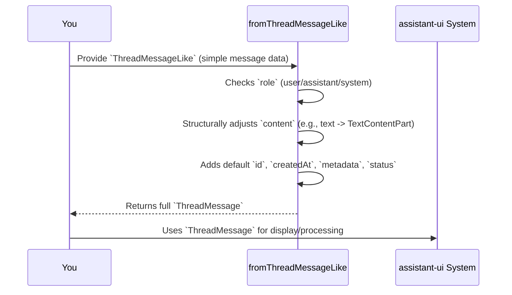

# Chapter 1: ThreadMessage

Welcome to the exciting world of `assistant-ui`! In this first chapter, we're going to dive into the most fundamental building block of any conversation within `assistant-ui`: the **`ThreadMessage`**.

## What Problem Does `ThreadMessage` Solve?

Imagine you're building a super cool AI chat application, just like the ones you use every day. In this app, you (the user) send messages to an AI assistant, and the AI assistant sends replies back to you.

Sounds simple, right? But what if:
*   Your message isn't just text, but also includes an image?
*   The AI's reply isn't just text, but also has a "tool call" (like asking to look up the weather) or a "reasoning" step?
*   You need to know if the AI is still "typing" its response or if it has finished?
*   You want to add some secret, extra data to a message that only your app cares about?

This is where `ThreadMessage` comes in! It's like a special, standardized "container" or "package" for *every single piece of communication* in your chat. Whether it's you talking, the AI talking, or even a hidden system prompt, `ThreadMessage` makes sure all these different types of messages are structured in a consistent way. This consistency is super important because it makes it easy for `assistant-ui` to display these messages, manage their states, and process them behind the scenes.

Think of it like standardized shipping boxes: no matter if you're sending books, clothes, or electronics, they all go into a specific type of box, making it easy for the post office to handle them. `ThreadMessage` is that standardized box for your chat messages!

## Key Concepts of `ThreadMessage`

Let's break down the essential parts of a `ThreadMessage`:

### 1. Who is Talking? (The `role`)

Every message in a conversation needs to know who sent it. In `assistant-ui`, a `ThreadMessage` has a `role` property, which can be one of three types:

*   **`"user"`**: This is for messages you send to the AI.
*   **`"assistant"`**: This is for messages the AI sends back to you.
*   **`"system"`**: These are special messages that aren't usually shown to the user. They often contain instructions or context for the AI that help it understand the conversation better.

### 2. What's in the Message? (The `content`)

The `content` property is where the actual message data lives. This is where `ThreadMessage` gets really powerful because it can hold many different kinds of information, not just plain text! This is why `content` is an array of "content parts".

For example:
*   A user message might have a `text` part (e.g., "What's the weather?") and an `image` part (a picture they uploaded).
*   An assistant message might have a `text` part (e.g., "The weather is sunny!") and a `tool-call` part (e.g., "I used the weather tool to find that out").

Here are some common `content` part types you'll encounter:

*   **`TextContentPart`**: For plain text messages.
*   **`ImageContentPart`**: For images sent by the user.
*   **`ToolCallContentPart`**: For actions the AI wants to perform (like calling a function or an external service).
*   **`ReasoningContentPart`**: For the AI's internal thought process (often hidden or shown in a special debug view).

### 3. What's Happening with the Message? (The `status`)

Especially for AI assistant messages, it's useful to know their current state. The `status` property (primarily for `assistant` messages) tells you if the AI is still generating its response, if it's waiting for a tool to finish, or if it's completely done.

Common statuses include:
*   `"running"`: The AI is still generating its response.
*   `"requires-action"`: The AI needs to perform a tool call before it can continue.
*   `"complete"`: The AI has finished its response.

### 4. Any Extra Info? (The `metadata`)

The `metadata` property is like a special "notes" section for your message. It's a place where you can store any extra information that your application might need, but isn't part of the main `content` or `status`. This could include things like internal IDs, timestamps, or custom data relevant to your specific app.

## Putting It All Together: Creating a `ThreadMessage`

While `ThreadMessage` itself is a complex structure, `assistant-ui` provides a friendly helper called `ThreadMessageLike` and a function `fromThreadMessageLike` to make creating messages much easier. This lets you provide simpler inputs, and `assistant-ui` will convert them into the full `ThreadMessage` structure.

Let's imagine we want to simulate a simple chat conversation.

First, a user sends a message:

```typescript
import { fromThreadMessageLike } from "@assistant-ui/react/runtimes/external-store";

// Create a user message
const userMessage = fromThreadMessageLike(
  {
    role: "user",
    content: "Hi there! How are you?",
  },
  "user-123", // Unique ID for this message
  { type: "complete", reason: "stop" } // Status (not strictly needed for user message, but good practice)
);

console.log(userMessage);
```

This code snippet takes a simple object describing a user message and transforms it into a full `ThreadMessage` object. The `fromThreadMessageLike` function automatically adds properties like `id`, `createdAt`, and ensures the `content` is correctly structured as an array of `TextContentPart`s.

Next, the AI assistant replies:

```typescript
import { fromThreadMessageLike } from "@assistant-ui/react/runtimes/external-store";

// Create an assistant message
const assistantMessage = fromThreadMessageLike(
  {
    role: "assistant",
    content: "I'm doing great, thanks for asking! How can I help you today?",
    status: { type: "complete", reason: "stop" }, // Important for assistant messages
  },
  "assistant-456", // Unique ID for this message
  { type: "running" } // Fallback status if none is provided
);

console.log(assistantMessage);
```

Notice how the `status` is explicitly set for the assistant message. This is crucial for `assistant-ui` to know if the message is still being generated or is ready to be displayed as final.

## How `ThreadMessage` Works Internally (A Peek Behind the Scenes)

You don't need to be an expert in `assistant-ui`'s internal workings to use `ThreadMessage`, but understanding a little bit about what happens under the hood can be really helpful.

Think of it like this: When you use `fromThreadMessageLike` to create a message, it's like handing a flexible instruction sheet to a highly organized robot.

1.  **Your Instruction ( `ThreadMessageLike`):** You give the robot a simple instruction like, "Make a user message with this text."
2.  **The Robot's Job (`fromThreadMessageLike`):** The robot looks at your instruction. It notices the "role" (e.g., "user") and the "content" (e.g., plain text).
3.  **Standardization:** Based on the role, the robot knows exactly what kind of `ThreadMessage` to build. It ensures all the required fields (`id`, `createdAt`, `metadata`, `attachments` for user messages, `status` for assistant messages) are properly set, even if you didn't provide them all. It also converts your simple text string into a structured `TextContentPart`.
4.  **The Result (`ThreadMessage`):** The robot hands you back a perfectly formatted `ThreadMessage` "package," ready for use anywhere in `assistant-ui`.

Here's a simple diagram to visualize this process:



### Diving a Bit Deeper into the Code

The `ThreadMessage` structure and its related types are defined in files like `packages/react/src/types/AssistantTypes.ts`. This file defines the `ThreadMessage` itself as a combination of `ThreadSystemMessage`, `ThreadUserMessage`, and `ThreadAssistantMessage`:

```typescript
// Simplified version from packages/react/src/types/AssistantTypes.ts
export type ThreadMessage = BaseThreadMessage &
  (ThreadSystemMessage | ThreadUserMessage | ThreadAssistantMessage);

export type ThreadUserMessage = MessageCommonProps & {
  readonly role: "user";
  readonly content: readonly ThreadUserContentPart[];
  // ... other properties
};

export type ThreadAssistantMessage = MessageCommonProps & {
  readonly role: "assistant";
  readonly content: readonly ThreadAssistantContentPart[];
  readonly status: MessageStatus;
  // ... other properties
};

// ... and so on for System messages and content parts
```

And the magic of transforming a `ThreadMessageLike` into a `ThreadMessage` happens in `packages/react/src/runtimes/external-store/ThreadMessageLike.tsx`. The `fromThreadMessageLike` function contains a `switch` statement that handles each `role` differently, ensuring the correct structure and defaults are applied:

```typescript
// Simplified version from packages/react/src/runtimes/external-store/ThreadMessageLike.tsx
export const fromThreadMessageLike = (
  like: ThreadMessageLike,
  fallbackId: string,
  fallbackStatus: MessageStatus,
): ThreadMessage => {
  const { role, id, createdAt, attachments, status, metadata } = like;
  const common = {
    id: id ?? fallbackId,
    createdAt: createdAt ?? new Date(),
  };

  // Convert string content to text part if needed
  const content = typeof like.content === "string" ?
    [{ type: "text" as const, text: like.content }] :
    like.content;

  switch (role) {
    case "assistant":
      return {
        ...common,
        role,
        content: content.map((part): ThreadAssistantContentPart | null => {
          // Logic to transform various content parts for assistant messages
          // e.g., handling 'text', 'tool-call', etc.
          if (part.type === "text") return part;
          if (part.type === "tool-call") return { /* convert tool call */ };
          return null; // or throw error for unsupported types
        }).filter(c => !!c),
        status: status ?? fallbackStatus,
        metadata: { /* default metadata */ },
      } satisfies ThreadAssistantMessage;

    case "user":
      return {
        ...common,
        role,
        content: content.map((part): ThreadUserContentPart => {
          // Logic to transform various content parts for user messages
          if (part.type === "text") return part;
          if (part.type === "image") return part;
          // ...
          throw new Error(`Unsupported user content part type: ${part.type}`);
        }),
        attachments: attachments ?? [],
        metadata: { /* default metadata */ },
      } satisfies ThreadUserMessage;

    case "system":
      // ... similar logic for system messages
      if (content.length !== 1 || content[0]!.type !== "text")
        throw new Error("System messages must have exactly one text content part.");
      return {
        ...common,
        role,
        content: content as [TextContentPart],
        metadata: { custom: metadata?.custom ?? {} },
      } satisfies ThreadSystemMessage;

    default:
      throw new Error(`Unknown message role: ${role}`);
  }
};
```

As you can see, `fromThreadMessageLike` acts as a crucial "constructor" for `ThreadMessage` objects, making sure they always conform to the expected structure of `assistant-ui`.

## Conclusion

In this chapter, you've learned that `ThreadMessage` is the standardized container for all conversational data in `assistant-ui`. You now understand its key components: `role` (who's talking), `content` (what's in the message), `status` (what's happening to it), and `metadata` (extra information). You also got a glimpse of how `fromThreadMessageLike` simplifies creating these messages and how they're structured internally.

Now that you know how individual messages are represented, the next logical step is to understand how these messages come together to form a complete conversation. Get ready to explore the concept of a **`Thread`** in the next chapter!

[Chapter 2: Thread](02_thread_.md)

---

Generated by [AI Codebase Knowledge Builder](https://github.com/The-Pocket/Tutorial-Codebase-Knowledge)