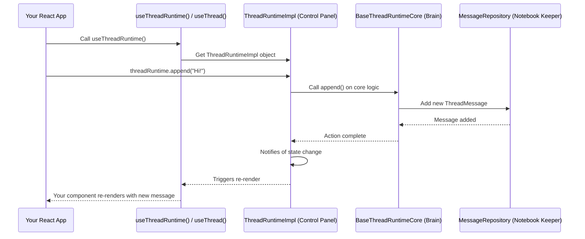

# Chapter 2: Thread

Welcome back! In [Chapter 1: ThreadMessage](01_threadmessage_.md), we explored the fundamental building block of any conversation in `assistant-ui`: the `ThreadMessage`. You learned that `ThreadMessage` is like a standardized package for individual pieces of communication in your chat.

Now, imagine you have many of these `ThreadMessage` packages. How do you organize them to form a complete, coherent conversation? How do you manage the flow, the history, and even alternative responses within that conversation? This is precisely the problem that the **`Thread`** concept solves!

## What Problem Does `Thread` Solve?

Think of a `Thread` as a single, dedicated **notebook for one specific conversation or chat session**. Every page in this notebook is a `ThreadMessage` (which we learned about in the last chapter).

Without a `Thread`, managing a conversation would be like having a pile of loose message notes. You wouldn't easily know which message came after which, or if you tried a different response at some point.

`Thread` provides the structure for your chat. It ensures:
*   All messages from a single chat session are kept together.
*   The order of messages is maintained.
*   You can easily see the history of the conversation.
*   Crucially, it handles more advanced features like **branching**, where you can explore alternative AI responses without losing the original conversation path.
*   It gives you tools to interact with the conversation as a whole, like sending new messages or re-running an AI's response.

So, `Thread` is the central hub that makes your chat application actually *feel* like a conversation, not just a series of disconnected messages.

## Key Concepts of `Thread`

Let's break down what a `Thread` does:

### 1. The Conversation Container

At its core, a `Thread` is simply the container for all the `ThreadMessage` objects that belong to a single conversation. When you start a new chat, you're essentially creating a new `Thread`. As messages are sent by the user or generated by the AI, they are added to this `Thread`.

### 2. Managing Conversation History

The `Thread` keeps track of the entire sequence of messages. This is vital for AI assistants, as they often need to remember past interactions to provide relevant responses.

### 3. Branching: Exploring Alternative Paths

This is one of the most powerful features of `Thread`! Imagine you ask an AI, "What's the weather like?", and it replies, "It's sunny." Then you think, "Hmm, what if I had asked about tomorrow's weather instead?"

With `Thread` and its branching capability, you can often go back to a specific point in the conversation and explore a different path without losing the original. It's like taking a different turn on a road; `Thread` lets you navigate these turns and switch between them. Each "branch" is an alternative sequence of messages.

### 4. Interaction Methods

A `Thread` isn't just a passive storage for messages. It also provides methods (functions you can call) to actively manage the conversation:
*   **Sending new messages:** Add a user's input to the conversation.
*   **Starting an AI response:** Tell the AI to generate a reply.
*   **Editing messages:** Modify a message (often a user message).
*   **Reloading/Re-running:** Ask the AI to try generating a response again.
*   **Switching branches:** Jump between different conversation paths.

## Putting It All Together: Using `Thread` in Your App

In `assistant-ui`, you primarily interact with a `Thread` using a React Hook called `useThreadRuntime`. This hook gives you access to a `ThreadRuntime` object, which is your main control panel for the conversation. You can also use `useThread` to get the current state (like messages) of the active thread.

Let's see how you might use it in a very simplified example.

```typescript
import { useThreadRuntime, useThread } from "@assistant-ui/react";
import { useEffect } from "react";

function MyChatComponent() {
  // Get the ThreadRuntime for actions
  const threadRuntime = useThreadRuntime();
  // Get the current state of the thread for display
  const threadState = useThread();

  // Let's automatically send a message when the component loads
  useEffect(() => {
    // Check if the thread is empty before sending
    if (threadState.messages.length === 0) {
      console.log("Appending initial user message...");
      threadRuntime.append("Hello, assistant-ui!");
    }
  }, [threadRuntime, threadState.messages.length]); // Dependencies for useEffect

  // In a real app, you'd display messages here
  console.log("Current messages in thread:", threadState.messages.map(m => m.content[0]?.text));

  // Example of sending another message after some user action
  const sendAnotherMessage = () => {
    threadRuntime.append("Tell me more about Threads!");
  };

  // Example of starting an AI response (e.g., after user sends a message)
  const startAIResponse = (parentId: string) => {
    threadRuntime.startRun({ parentId });
  };

  return (
    <div>
      <h1>My Simple Chat</h1>
      {/* Imagine messages are rendered here based on threadState.messages */}
      <button onClick={sendAnotherMessage}>Send another message</button>
      {/* If there are messages, we can start a run from the last message */}
      {threadState.messages.length > 0 && (
        <button onClick={() => startAIResponse(threadState.messages.at(-1)!.id)}>
          Get AI Reply
        </button>
      )}
    </div>
  );
}
```

In this simplified example:
*   We use `useThreadRuntime()` to get an object (`threadRuntime`) that allows us to perform actions on the conversation, such as `append()` (to add a new message) or `startRun()` (to tell the AI to generate a response).
*   We use `useThread()` to get `threadState`, which contains the current `messages` in the thread. This is what you would render in your UI to show the conversation history.
*   When the component first appears, we `append` an initial user message.
*   You can imagine buttons that, when clicked, trigger `sendAnotherMessage` or `startAIResponse` to continue the conversation.

This is the basic flow: you use `threadRuntime` to *change* the conversation, and `threadState` to *read* the current state of the conversation and display it.

## How `Thread` Works Internally (A Peek Behind the Scenes)

You don't need to understand every detail of `assistant-ui`'s internals to use `Thread`, but a high-level overview can demystify things.

Imagine `Thread` as having a few key parts working together:

1.  **The "Control Panel" (`ThreadRuntimeImpl`):** This is the object you get from `useThreadRuntime()`. It's the friendly interface that translates your actions (like "append this message" or "start AI reply") into commands the core system understands.

2.  **The "Brain" (`BaseThreadRuntimeCore`):** This is where the actual logic for managing the conversation lives. When the `Control Panel` receives your command, it sends it here. The `Brain` knows how to add messages, handle branching, and tell the AI to generate responses.

3.  **The "Notebook Keeper" (`MessageRepository`):** This is the memory of the `Thread`. It's a specialized data structure that stores all the `ThreadMessage` objects and, crucially, keeps track of the different branches or alternative conversation paths.

Here's a simple flow:



### Diving a Bit Deeper into the Code

The `ThreadRuntime` interface and its implementation `ThreadRuntimeImpl` (found in `packages/react/src/api/ThreadRuntime.ts`) are what `useThreadRuntime` provides to your application. They expose the methods for interacting with the thread.

Here's a simplified look at how `ThreadRuntimeImpl` connects to the `ThreadRuntimeCore`:

```typescript
// Simplified from packages/react/src/api/ThreadRuntime.ts
export class ThreadRuntimeImpl implements ThreadRuntime {
  private readonly _threadBinding: ThreadRuntimeCoreBinding; // This holds the "brain"

  constructor(threadBinding: ThreadRuntimeCoreBinding, /* ... */) {
    this._threadBinding = threadBinding;
    // ...
  }

  // Method to append a message
  public append(message: CreateAppendMessage) {
    // Calls the 'append' method on the underlying ThreadRuntimeCore
    this._threadBinding.getState().append(/* ... converted message ... */);
  }

  // Method to start a run
  public startRun(config: CreateStartRunConfig) {
    // Calls the 'startRun' method on the underlying ThreadRuntimeCore
    this._threadBinding.getState().startRun(/* ... converted config ... */);
  }

  // ... other methods like cancelRun, export, import, etc.
}
```

As you can see, the `ThreadRuntimeImpl` acts as a proxy, forwarding your calls to the actual "brain" of the operation, the `ThreadRuntimeCore`.

The `ThreadRuntimeCore` interface and its base implementation `BaseThreadRuntimeCore` (located in `packages/react/src/runtimes/core/BaseThreadRuntimeCore.tsx`) contain the core logic. This is where the `MessageRepository` is managed:

```typescript
// Simplified from packages/react/src/runtimes/core/BaseThreadRuntimeCore.tsx
import { MessageRepository } from "../utils/MessageRepository";
import { ThreadMessage } from "../../types";

export abstract class BaseThreadRuntimeCore implements ThreadRuntimeCore {
  protected readonly repository = new MessageRepository(); // The "notebook keeper"

  public get messages() {
    return this.repository.getMessages(); // Get all messages from the notebook
  }

  public append(message: AppendMessage): void {
    // Logic to convert AppendMessage into a full ThreadMessage
    // ...
    this.repository.addMessage(message.parentId, newMessage); // Add message to notebook
    this._notifySubscribers(); // Tell everyone the messages have changed
  }

  public startRun(config: StartRunConfig): void {
    // Logic to initiate an AI response
    // ...
    this._notifySubscribers();
  }

  public getBranches(messageId: string): string[] {
    return this.repository.getBranches(messageId); // Ask notebook keeper for branches
  }

  public switchToBranch(branchId: string): void {
    this.repository.switchToBranch(branchId); // Tell notebook keeper to switch branches
    this._notifySubscribers();
  }

  // ... many other methods for managing state, capabilities, speech, etc.
}
```

The `MessageRepository` is a crucial internal utility that handles the actual storage and retrieval of `ThreadMessage` objects, especially when dealing with branches. It ensures that when you switch branches, you get the correct sequence of messages for that particular conversational path.

In essence, `ThreadRuntimeImpl` is your easy-to-use remote control, while `BaseThreadRuntimeCore` is the sophisticated engine that, along with the `MessageRepository`, powers your conversation experience.

## Conclusion

In this chapter, you've learned that `Thread` is the central concept for managing a single conversation in `assistant-ui`. It holds all your `ThreadMessage` objects, manages the conversation history, and, very powerfully, allows for **branching** to explore different AI responses. You also saw how `useThreadRuntime` and `useThread` are your primary tools for interacting with a `Thread` in your React application, and got a glimpse of how the underlying "control panel," "brain," and "notebook keeper" components work together.

Now that you know how conversations are managed, the next step is to understand how users actually type and send new messages into these `Thread`s. Get ready to explore the **`Composer`** in the next chapter!

[Chapter 3: Composer](03_composer_.md)

---

Generated by [AI Codebase Knowledge Builder](https://github.com/The-Pocket/Tutorial-Codebase-Knowledge)