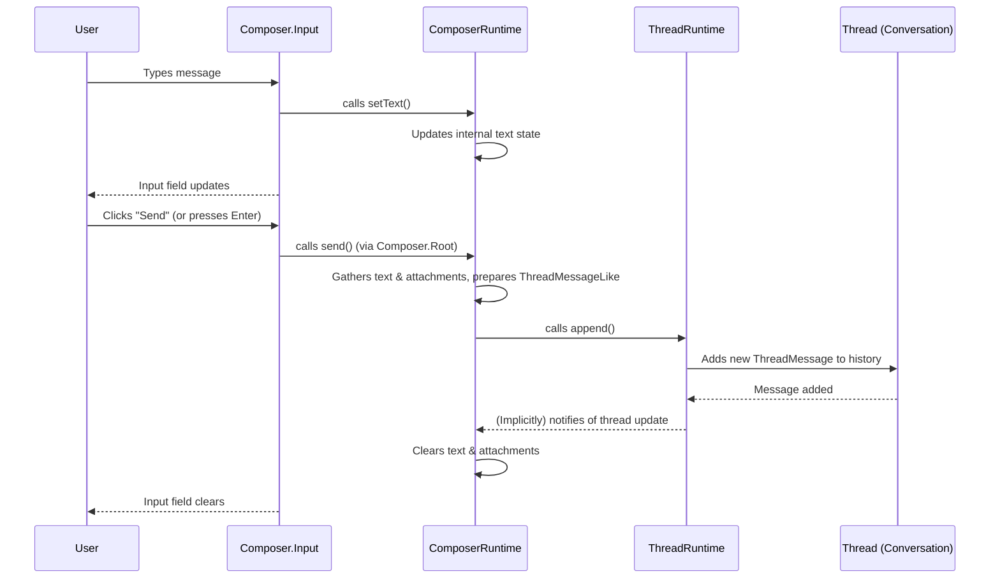

# Chapter 3: Composer

Welcome back! In [Chapter 1: ThreadMessage](01_threadmessage_.md), we learned about `ThreadMessage` as the fundamental building block for individual chat messages. Then, in [Chapter 2: Thread](02_thread_.md), we saw how a `Thread` organizes these messages into a complete conversation history.

But how do you *add* new messages to a `Thread`? How does the user actually type their questions, attach files, and send them to the AI assistant? This is precisely the problem that the **`Composer`** concept solves!

## What Problem Does `Composer` Solve?

Imagine your favorite chat app. At the bottom, there's always a text box where you type your messages. Maybe there's also a button to add an image or a "send" button. This entire interactive area is what `assistant-ui` calls the `Composer`.

The `Composer` is the user's direct **"message writing station"** for interacting with the AI assistant. It's responsible for:
*   Providing the text input field where users type.
*   Handling attachments (like images or documents) that users want to send.
*   Offering actions like sending the message or canceling an ongoing AI operation.

Without a `Composer`, your users wouldn't have a way to initiate or continue conversations with the AI. It ensures that user input is captured, structured correctly, and then sent off to the AI to generate a response.

Our central use case for this chapter is simple: **How does a user type a message, optionally add an attachment, and then send it to the AI using `assistant-ui`?** The `Composer` is key to making this happen.

## Key Concepts of `Composer`

Let's break down the main jobs of the `Composer`:

### 1. The Text Input Field

This is the most obvious part: the area where users type their questions or statements. The `Composer` manages the text that is currently being typed, allowing you to easily read its value or update it.

### 2. Handling Attachments

Modern chat applications often allow sending more than just text. The `Composer` provides ways to accept files (like images, PDFs, etc.) from the user. It keeps track of these pending attachments before the message is sent.

### 3. Actions: Send, Cancel, Reset

Once a user has composed their message (text + attachments), they need to send it. The `Composer` provides a `send` action for this. It also offers `cancel` (to stop an ongoing AI response) and `reset` (to clear everything in the input area).

### 4. Composer's State

Just like a `ThreadMessage` has a `status` and a `Thread` has `messages`, the `Composer` also has a state. This state tells you:
*   What text is currently in the input field.
*   What attachments are ready to be sent.
*   If the input field is currently empty.
*   If there's an ongoing operation that can be `cancel`ed.

## Putting It All Together: Using `Composer` in Your App

In `assistant-ui`, you'll primarily interact with the `Composer` using two React Hooks:
*   **`useComposerRuntime()`**: This hook gives you an object that lets you *perform actions* on the composer (like `setText`, `send`, `addAttachment`). Think of it as your remote control for the composer.
*   **`useComposer()`**: This hook lets you *read the current state* of the composer (like the current `text`, `attachments`, or if it's `isEmpty`). This is what you'd use to display the text or conditionally enable/disable buttons.

`assistant-ui` provides ready-to-use components like `<Composer.Root>` and `<Composer.Input>` that make integrating the `Composer` super easy. These components internally use `useComposerRuntime()` and `useComposer()` so you don't have to wire everything up yourself!

Let's see how you'd set up a simple `Composer` in your React application:

```typescript
import { Composer } from "@assistant-ui/react/primitives"; // Components for the UI
import { useComposer, useComposerRuntime } from "@assistant-ui/react"; // Hooks for logic

function MySimpleComposer() {
  // Use useComposer to read the current state of the composer.
  // For example, we want to know if the input is empty to disable the send button.
  const composerState = useComposer();

  // Use useComposerRuntime to perform actions, like cancelling.
  const composerRuntime = useComposerRuntime();

  return (
    // Composer.Root is a <form> component that handles submitting the message.
    // When you click a <button type="submit"> inside it, it calls composerRuntime.send().
    <Composer.Root>
      {/* Composer.Input is a <textarea> component where users type. */}
      {/* It automatically connects to the composer's text state. */}
      <Composer.Input placeholder="Type your message..." />

      {/* A simple send button. It's disabled if the composer is empty. */}
      <button type="submit" disabled={composerState.isEmpty}>
        Send
      </button>

      {/* A button to cancel an ongoing AI response, only visible if cancellation is possible. */}
      {composerState.canCancel && (
        <button onClick={() => composerRuntime.cancel()}>Cancel</button>
      )}

      {/* You would typically add an attachment button here.
          We'll learn more about Primitives like this in the next chapter! */}
      {/* <Composer.AttachmentButton /> */}
    </Composer.Root>
  );
}
```
In this example:
*   The `<Composer.Root>` component acts as the `form` for your input area. When a submit button inside it is clicked, it automatically calls `composerRuntime.send()`, sending the message you've composed.
*   The `<Composer.Input>` component is your text input field. As the user types, it automatically updates the internal `Composer` state. It also displays the text from the `Composer`'s state.
*   We use `composerState.isEmpty` to decide if the `Send` button should be clickable.
*   We use `composerState.canCancel` and `composerRuntime.cancel()` to provide a way to stop an AI response.

This setup makes it incredibly easy to get a functional composer working in your `assistant-ui` application!

## How `Composer` Works Internally (A Peek Behind the Scenes)

Understanding the internal flow can help you grasp how `Composer` fits into the `assistant-ui` ecosystem.

Think of it like this:

1.  **User Types:** When a user types into the `<Composer.Input>` field, the `ComposerRuntime` is instantly notified. It updates its internal `text` state.
2.  **User Adds Attachment (Optional):** If a user adds a file, the `ComposerRuntime` uses its `addAttachment` method to store the file and manage its upload status.
3.  **User Sends Message:** When the user clicks `Send` (or presses Enter in the `<Composer.Input>`, thanks to `Composer.Root` handling the form submission), the `composerRuntime.send()` method is called.
4.  **Preparing the Message:** `composerRuntime.send()` gathers the current text and any attachments. It then formats this data into a `ThreadMessageLike` object, similar to what we saw in [Chapter 1: ThreadMessage](01_threadmessage_.md).
5.  **Adding to the Thread:** The `ComposerRuntime` then hands this prepared message over to the `ThreadRuntime` (from [Chapter 2: Thread](02_thread_.md)) by calling its `append` method. This adds the user's message to the conversation history.
6.  **Clearing Input:** Finally, the `Composer` clears its own text input and attachments, ready for the next message.

Here's a simple diagram to visualize this process:



### Diving a Bit Deeper into the Code

The core logic of the `Composer` is defined in `packages/react/src/runtimes/core/ComposerRuntimeCore.tsx` (the interface) and `packages/react/src/runtimes/composer/BaseComposerRuntimeCore.tsx` (the base implementation).

Let's look at a simplified version of `BaseComposerRuntimeCore` to see how `setText` and `send` work:

```typescript
// Simplified from packages/react/src/runtimes/composer/BaseComposerRuntimeCore.tsx
import { BaseSubscribable } from "../remote-thread-list/BaseSubscribable";
import { AppendMessage } from "../../types"; // Used for the message structure

export abstract class BaseComposerRuntimeCore
  extends BaseSubscribable // Allows components to "subscribe" to changes
  implements ComposerRuntimeCore
{
  private _text = ""; // Internal storage for the text

  get text() {
    return this._text;
  }

  public setText(value: string) {
    if (this._text === value) return; // Only update if text actually changed

    this._text = value;
    this._notifySubscribers(); // Tell any listening React components to re-render
  }

  // ... (properties for attachments, role, runConfig, etc.)

  public async send() {
    // 1. Logic to gather text and attachments
    const message: Omit<AppendMessage, "parentId" | "sourceId"> = {
      createdAt: new Date(),
      role: this.role,
      content: this.text ? [{ type: "text", text: this.text }] : [],
      attachments: /* ... processed attachments ... */,
      // ... other message properties
    };

    // 2. Clear the composer input area immediately after sending
    this._emptyTextAndAttachments(); // Sets _text = "" and _attachments = []
    
    // 3. Hand the message to the "thread" to be added
    this.handleSend(message); // This is an abstract method, implemented by specific runtimes
    this._notifyEventSubscribers("send"); // Notify internal event listeners
  }

  // This method is abstract because *how* the message is actually sent
  // depends on whether it's a thread composer or an edit composer.
  // For a thread composer, this will call threadRuntime.append().
  protected abstract handleSend(
    message: Omit<AppendMessage, "parentId" | "sourceId">,
  ): void;

  // ... (methods like addAttachment, removeAttachment, reset, cancel)
}
```
The `_notifySubscribers()` call is what triggers your React components (that use `useComposer()`) to re-render and display the updated `text`. The `handleSend` method is the critical "bridge" that connects the `Composer` to the larger `Thread` system.

Now, let's peek at how the `<Composer.Input>` primitive uses these methods:

```typescript
// Simplified from packages/react/src/primitives/composer/ComposerInput.tsx
import TextareaAutosize from "react-textarea-autosize";
import { useComposer, useComposerRuntime } from "../../context/react/ComposerContext";

export const ComposerPrimitiveInput = forwardRef(
  (
    {
      /* ...props like placeholder, autoFocus, etc. ... */
      onChange, // Original onChange prop if user provides one
      /* ... */
    },
    forwardedRef,
  ) => {
    const composerRuntime = useComposerRuntime(); // Get the runtime for actions
    const value = useComposer((c) => c.text); // Get the current text from Composer's state

    return (
      <TextareaAutosize
        value={value} // The displayed text comes from composer's state
        ref={forwardedRef}
        onChange={composeEventHandlers(onChange, (e) => {
          // When the textarea's value changes (user types),
          // update the ComposerRuntime's internal text state.
          composerRuntime.setText(e.target.value);
        })}
        // ... (other event handlers for keyboard, paste, etc.)
      />
    );
  },
);
```
As you can see, `<Composer.Input>` simply reads the `value` from `useComposer()` and updates it using `composerRuntime.setText()` as the user types. This is the pattern `assistant-ui` uses for many of its primitives.

Finally, the `<Composer.Root>` primitive is responsible for connecting a form submission to the `composerRuntime.send()` method:

```typescript
// Simplified from packages/react/src/primitives/composer/ComposerRoot.tsx
import { Primitive } from "@radix-ui/react-primitive";
import { useComposerSend } from "./ComposerSend"; // A helper hook

export const ComposerPrimitiveRoot = forwardRef(
  ({ onSubmit, ...rest }, forwardedRef) => {
    // useComposerSend is a simple helper that internally calls useComposerRuntime().send()
    const send = useComposerSend();

    const handleSubmit = (e: FormEvent) => {
      e.preventDefault(); // Prevent default form submission (page reload)
      if (send) send(); // Call the send function when the form is submitted
    };

    return (
      <Primitive.form
        {...rest}
        ref={forwardedRef}
        onSubmit={composeEventHandlers(onSubmit, handleSubmit)}
      />
    );
  },
);
```
This shows how `<Composer.Root>` uses the `useComposerSend()` hook to trigger the message sending when the form is submitted, providing a seamless experience for the user.

## Conclusion

In this chapter, you've learned that the `Composer` is the interactive input area where users compose and send messages to the AI assistant. It manages the text input, handles attachments, and provides actions like `send` and `cancel`. You saw how `useComposerRuntime` allows you to control the composer's actions and `useComposer` lets you read its state. Finally, you got a glimpse of how `assistant-ui`'s primitives like `<Composer.Root>` and `<Composer.Input>` abstract away the complexity, making it easy to build your chat UI.

Now that you understand how individual messages (`ThreadMessage`) form conversations (`Thread`) and how users input them (`Composer`), it's time to dive deeper into `assistant-ui`'s building blocks. Get ready to explore the flexible and customizable **`Primitives`** in the next chapter!

[Chapter 4: Primitives](04_primitives_.md)

---

Generated by [AI Codebase Knowledge Builder](https://github.com/The-Pocket/Tutorial-Codebase-Knowledge)