# Chapter 4: Primitives

Welcome back! In our journey through `assistant-ui`, we've explored the core concepts that power your chat application:
*   [Chapter 1: ThreadMessage](01_threadmessage_.md) taught us about the standardized "package" for each piece of conversation.
*   [Chapter 2: Thread](02_thread_.md) showed us how these messages are organized into a complete conversation history, even with branching.
*   [Chapter 3: Composer](03_composer_.md) explained how users input messages and send them into the `Thread`.

Now, you might be thinking: "This is great, but how do I actually *display* all of this in my React app? How do I make the chat look exactly how I want, with my own styles and branding?"

This is where the concept of **`Primitives`** comes in!

## What Problem Do `Primitives` Solve?

Imagine you're building a chat application, and you want its user interface (UI) to look unique – maybe it has rounded corners, a specific font, or a custom "send" button icon. If `assistant-ui` only provided one giant, pre-styled "Chat Component," you'd be stuck with its default look. Making changes would be difficult, if not impossible.

The central problem `Primitives` solve is providing the **foundational, unstyled building blocks** for your chat UI. They give you all the core logic and accessibility features you need (like sending messages, handling attachments, or displaying AI responses) without dictating how they *look*.

Think of `Primitives` like high-quality LEGO bricks. Each brick (a `Primitive`) has a specific function and connects perfectly with other bricks, but it's up to *you* to choose the colors, sizes, and how you arrange them to build your unique structure (your chat interface).

Our central use case for this chapter is: **How can I build a chat UI with a custom-designed message input area (composer) and message display, while still leveraging `assistant-ui`'s powerful backend logic (like sending messages and managing history)?** `Primitives` are the answer.

## Key Concepts of `Primitives`

Let's break down what `Primitives` are all about:

### 1. Foundational, Unstyled Components

`Primitives` are React components that provide the "brains" but not the "beauty." They handle the underlying logic and accessibility features for elements like input fields, buttons, and message containers. This means they connect to the `assistant-ui` runtime (like `ComposerRuntime` or `ThreadRuntime`) to perform actions or read state, but they don't apply any visual styles themselves. You are free to style them with CSS frameworks like Tailwind CSS, Emotion, or plain CSS.

### 2. Small, Composable Building Blocks

Instead of a single, monolithic "chat component," `assistant-ui` provides many small, focused `Primitives`. For example, instead of one "Composer" component, you get:
*   `<Composer.Root>` (the form container)
*   `<Composer.Input>` (the text area)
*   `<Composer.SendButton>` (the send button)
*   `<Composer.AttachmentButton>` (the button for adding files)

This allows you to combine them in any layout you desire and only use the parts you need.

### 3. Core Logic & Accessibility Features

This is the magic! Even though they are unstyled, `Primitives` come packed with functionality.
*   `<Composer.Input>` automatically connects to the composer's text state and updates it as the user types.
*   `<Composer.SendButton>` (or a submit button inside `Composer.Root`) triggers the `send` action on the `ComposerRuntime`.
*   `<Message.Root>` automatically handles hover states for its message.

They also ensure essential accessibility features are built-in, like proper ARIA attributes and keyboard navigation, saving you a lot of effort.

### 4. Namespaced Exports

`Primitives` are often grouped logically using JavaScript object namespaces. This makes it easy to find related components. For example, all `Composer` related primitives are exported under the `Composer` object:

```typescript
// From packages/react/src/primitives/index.ts
export * as ComposerPrimitive from "./composer";
export * as MessagePrimitive from "./message";
export * as ThreadPrimitive from "./thread";
// ... and many more
```
When you import them, you'd typically do: `import { Composer } from "@assistant-ui/react/primitives";` and then use them like `<Composer.Root>`, `<Composer.Input>`, etc.

## Putting It All Together: Using `Primitives` in Your App

Let's revisit our `Composer` example from [Chapter 3: Composer](03_composer_.md), but now focusing on how we use `Primitives` to build it:

```tsx
import { Composer, Message } from "@assistant-ui/react/primitives"; // Primitives components
import { useComposer } from "@assistant-ui/react"; // Hook to read Composer state

function MyCustomChatUI() {
  const composerState = useComposer(); // Get current state of the composer

  return (
    <div>
      {/* Imagine messages are rendered here using Message Primitives */}
      {/* For example:
      <Message.Root>
        <Message.Content>
          <Message.Text />
        </Message.Content>
      </Message.Root>
      */}

      {/* This is our custom Composer section using Primitives */}
      <Composer.Root className="flex p-4 border-t border-gray-200">
        <Composer.Input
          className="flex-grow p-2 border rounded-lg focus:outline-none"
          placeholder="Type your message..."
        />
        <button
          type="submit"
          className="ml-2 px-4 py-2 bg-blue-500 text-white rounded-lg disabled:opacity-50"
          disabled={composerState.isEmpty}
        >
          Send Custom
        </button>
      </Composer.Root>
    </div>
  );
}
```

In this example:
*   We import `Composer` and `Message` from `@assistant-ui/react/primitives`. These are our unstyled "LEGO bricks."
*   `Composer.Root` acts as the `form` container. We've added Tailwind CSS classes like `flex`, `p-4`, `border-t` directly to it to control its layout and appearance.
*   `Composer.Input` is our text area. It's styled with `flex-grow`, `p-2`, `border`, `rounded-lg`, etc., to give it a custom look. Even with these custom styles, it still correctly connects to the `ComposerRuntime` to manage the text content.
*   Our `button` uses `type="submit"` which, because it's inside `Composer.Root`, automatically triggers the message sending logic when clicked. We've given it custom styles like `bg-blue-500`, `text-white`, and `rounded-lg`.
*   `composerState.isEmpty` (from `useComposer()` hook) is used to disable the button, ensuring the `Send Custom` button only works when there's text.

This demonstrates how `Primitives` allow you to fully control the visual design while `assistant-ui` handles the underlying chat logic.

## How `Primitives` Work Internally (A Peek Behind the Scenes)

`assistant-ui`'s `Primitives` are heavily inspired by libraries like [Radix UI](https://www.radix-ui.com/). The core idea is to wrap a basic HTML element (like a `div`, `form`, or `textarea`) and inject `assistant-ui`'s logic using React hooks, without adding any default styles.

Imagine a `Primitive` component working like a skilled artisan:

1.  **You Provide a Basic Material:** You give the artisan a plain HTML element (e.g., `<div />` for `Message.Root`, `<textarea />` for `Composer.Input`).
2.  **The Artisan Attaches Tools (`useComposer`, `useComposerRuntime`):** The `Primitive` component internally uses `assistant-ui`'s hooks to connect to the necessary chat logic (e.g., reading composer text, sending messages).
3.  **The Artisan Adds Invisible Features (Accessibility):** It automatically adds important accessibility attributes (like `aria-live` for announcements or `role` attributes) to make the component usable for everyone, including those using screen readers.
4.  **The Artisan Gives it Back for Your Design:** The `Primitive` returns the original HTML element, but now it's "enhanced" with all the necessary logic and accessibility. You can then apply any CSS classes or styles to it to make it look exactly how you want.

Here's a simple diagram for a `Composer.Root` primitive:

```mermaid
sequenceDiagram
    participant YourComponent as Your React Component
    participant ComposerRoot as <Composer.Root>
    participant UseComposerSend as useComposerSend() Hook
    participant ComposerRT as ComposerRuntime

    YourComponent->>ComposerRoot: Renders <Composer.Root className="my-styles">
    ComposerRoot->>UseComposerSend: Internally calls useComposerSend()
    UseComposerSend->>ComposerRT: Gets the send() function
    ComposerRoot->>ComposerRoot: Wraps a <form> element
    ComposerRoot->>YourComponent: Returns the styled <form> element
    YourComponent->>YourComponent: User clicks submit button inside the form
    ComposerRoot->>ComposerRT: Calls the send() function from ComposerRuntime
    ComposerRT->>ComposerRT: Handles message logic (prepares ThreadMessage, appends to Thread)
```



### Diving a Bit Deeper into the Code

Let's look at how a `Primitive` like `Composer.Root` is structured internally. As seen in [Chapter 3: Composer](03_composer_.md), it uses `forwardRef` (to allow you to pass a ref to the underlying HTML element) and wraps a `Primitive.form` from `@radix-ui/react-primitive`.

```typescript
// Simplified from packages/react/src/primitives/composer/ComposerRoot.tsx
import { composeEventHandlers } from "@radix-ui/primitive";
import { Primitive } from "@radix-ui/react-primitive"; // A base component from Radix UI
import {
  type ComponentRef,
  type FormEvent,
  forwardRef,
  ComponentPropsWithoutRef,
} from "react";
import { useComposerSend } from "./ComposerSend"; // A helper hook for sending

export namespace ComposerPrimitiveRoot {
  export type Element = ComponentRef<typeof Primitive.form>;
  export type Props = ComponentPropsWithoutRef<typeof Primitive.form>;
}

export const ComposerPrimitiveRoot = forwardRef<
  ComposerPrimitiveRoot.Element,
  ComposerPrimitiveRoot.Props
>(({ onSubmit, ...rest }, forwardedRef) => {
  // This hook gets the 'send' function from the ComposerRuntime
  const send = useComposerSend();

  const handleSubmit = (e: FormEvent) => {
    e.preventDefault(); // Stop default form submission (page reload)

    if (!send) return; // If no send function, do nothing
    send(); // Call the send function when the form is submitted
  };

  return (
    // Primitive.form is essentially a <form> element with Radix's utility features
    <Primitive.form
      {...rest} // Pass all other props (like your `className`)
      ref={forwardedRef} // Allow ref forwarding
      // Combine your onSubmit handler with the internal handleSubmit
      onSubmit={composeEventHandlers(onSubmit, handleSubmit)}
    />
  );
});

ComposerPrimitiveRoot.displayName = "ComposerPrimitive.Root";
```

Here's a breakdown:
*   `Primitive.form`: This is the base HTML `<form>` element provided by Radix UI. It acts as a blank canvas.
*   `useComposerSend()`: This is a custom hook that internally accesses the `ComposerRuntime` and provides the `send` function. This is how the `Primitive` gets its "brains."
*   `handleSubmit`: This function prevents the browser's default form submission behavior (which would reload the page) and then calls the `send()` function obtained from `useComposerSend()`.
*   `composeEventHandlers`: This utility allows `assistant-ui` to provide its own `onSubmit` logic while still letting you add your custom `onSubmit` handler if needed.

Similarly, other `Primitives` like `Message.Root` wrap a `Primitive.div` and inject logic, such as tracking hover states:

```typescript
// Simplified from packages/react/src/primitives/message/MessageRoot.tsx
import { Primitive } from "@radix-ui/react-primitive";
import {
  type ComponentRef,
  forwardRef,
  ComponentPropsWithoutRef,
  useCallback,
} from "react";
import { useMessageUtilsStore } from "../../context/react/MessageContext";
import { useManagedRef } from "../../utils/hooks/useManagedRef";
import { useComposedRefs } from "@radix-ui/react-compose-refs";

// This hook sets a hover state on the message when the mouse enters/leaves
const useIsHoveringRef = () => {
  const messageUtilsStore = useMessageUtilsStore();
  const callbackRef = useCallback(
    (el: HTMLElement) => {
      const setIsHovering = messageUtilsStore.getState().setIsHovering;

      const handleMouseEnter = () => { setIsHovering(true); };
      const handleMouseLeave = () => { setIsHovering(false); };

      el.addEventListener("mouseenter", handleMouseEnter);
      el.addEventListener("mouseleave", handleMouseLeave);

      return () => { // Cleanup function when component unmounts
        el.removeEventListener("mouseenter", handleMouseEnter);
        el.removeEventListener("mouseleave", handleMouseLeave);
        setIsHovering(false);
      };
    },
    [messageUtilsStore],
  );

  return useManagedRef(callbackRef);
};

export namespace MessagePrimitiveRoot { /* ... types ... */ }

export const MessagePrimitiveRoot = forwardRef<
  MessagePrimitiveRoot.Element,
  MessagePrimitiveRoot.Props
>((props, forwardRef) => {
  // Use the custom hover tracking hook
  const isHoveringRef = useIsHoveringRef();
  // Combine the internal ref with any ref passed by the user
  const ref = useComposedRefs<HTMLDivElement>(forwardRef, isHoveringRef);

  return <Primitive.div {...props} ref={ref} />;
});

MessagePrimitiveRoot.displayName = "MessagePrimitive.Root";
```
As you can see, `Primitives` are simple wrappers around standard HTML elements that use `assistant-ui`'s hooks to bring in the necessary chat logic and accessibility features. This design empowers you to create truly custom chat UIs without sacrificing functionality.

## Conclusion

In this chapter, you've learned that `Primitives` are the foundational, unstyled React components provided by `assistant-ui`. They give you the core logic and accessibility features for your chat UI, acting as flexible building blocks that you can combine and style with any CSS framework to create completely custom chat interfaces. You saw how they are typically imported using namespaces (e.g., `Composer.Root`) and how they internally leverage `assistant-ui`'s hooks to connect to the underlying chat logic.

Now that you understand the UI building blocks, the next logical step is to dive into the core engine that powers the AI interactions: the `AssistantRuntime`.

[Chapter 5: AssistantRuntime](05_assistantruntime_.md)

---

Generated by [AI Codebase Knowledge Builder](https://github.com/The-Pocket/Tutorial-Codebase-Knowledge)