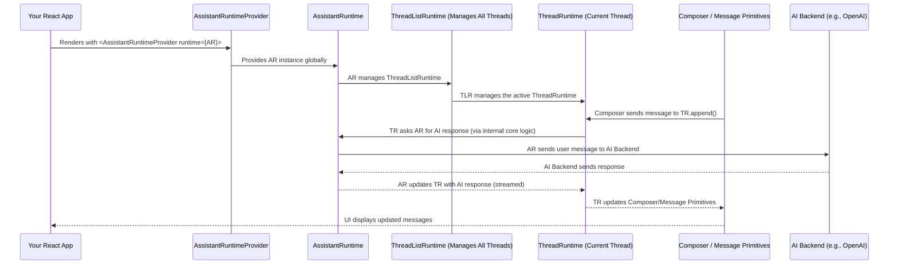

# Chapter 5: AssistantRuntime

Welcome back! So far in our journey through `assistant-ui`:
*   In [Chapter 1: ThreadMessage](01_threadmessage_.md), we learned about the individual "package" for each chat message.
*   In [Chapter 2: Thread](02_thread_.md), we saw how these messages form a complete conversation history, even with different "branches."
*   In [Chapter 3: Composer](03_composer_.md), we explored how users type and send new messages into a `Thread`.
*   And in [Chapter 4: Primitives](04_primitives_.md), we discovered how to use unstyled building blocks to create a beautiful, custom chat user interface.

Now, imagine you have all these pieces. You have messages, conversations, input areas, and display components. But how do they all connect? How do you manage not just one conversation, but potentially *many* conversations? And most importantly, how do you plug in the actual **Artificial Intelligence (AI)** that generates responses?

This is where the **`AssistantRuntime`** comes in!

## What Problem Does `AssistantRuntime` Solve?

Think of `AssistantRuntime` as the **main control panel** or the **central brain** of your entire chat application. It sits at the highest level, overseeing everything.

Without `AssistantRuntime`, your `Threads`, `Composers`, and `Primitives` would be like well-made car parts scattered on a garage floor. They're all good parts, but they can't work together to drive anywhere. `AssistantRuntime` is like the car's engine and dashboard combined – it powers everything and lets you control the whole vehicle.

The central use case for `AssistantRuntime` is: **How do I connect my entire `assistant-ui` chat application to my AI backend (e.g., OpenAI, Anthropic, or a custom one) and manage the overall behavior, including switching between different conversations?** `AssistantRuntime` is the answer. It's the glue that holds your AI chat experience together.

## Key Concepts of `AssistantRuntime`

Let's break down the essential roles of `AssistantRuntime`:

### 1. The Central Orchestrator

`AssistantRuntime` is the "big boss." It's responsible for managing the overall state and behavior of your entire chat application. All other `assistant-ui` components (like `Thread`, `Composer`, etc.) ultimately get their instructions or data from here.

### 2. Managing All Threads (Conversations)

While a `Thread` (from [Chapter 2: Thread](02_thread_.md)) manages *one* conversation, `AssistantRuntime` manages *all* of your `Threads`. It allows you to switch between different conversations, start new ones, or even access a list of past chats. This is particularly useful if your application needs to handle multiple chat sessions for a single user.

### 3. Connecting to Your AI Backend

This is a crucial role! `AssistantRuntime` is the place where you "plug in" your actual AI service. It acts as the bridge between `assistant-ui`'s frontend components and your powerful AI model (or a service that uses it). When a user sends a message, `AssistantRuntime` ensures it gets sent to your AI, and when the AI responds, `AssistantRuntime` helps display that response back to the user. We'll dive deeper into how this connection works with "Runtime Adapters" in a later chapter.

### 4. Global Configuration and Capabilities

`AssistantRuntime` also allows you to set up global configurations, such as how the AI behaves (e.g., system prompts, temperature settings), or what special "tools" the AI can use. It provides this information globally to all parts of your chat application.

## Putting It All Together: Using `AssistantRuntime` in Your App

You provide `AssistantRuntime` to your `assistant-ui` application using the `<AssistantRuntimeProvider>`. This component wraps your entire chat UI and makes the `AssistantRuntime` instance available to all the hooks and primitives within it.

Here’s a very basic example of how you'd set this up in your React application:

```tsx
import { AssistantRuntimeProvider } from "@assistant-ui/react";
import { useAssistantRuntime } from "@assistant-ui/react"; // To access the runtime
import { Core } from "@assistant-ui/react/runtimes"; // Example runtime import

// Create a dummy AssistantRuntime instance for demonstration
// In a real app, you'd use a specific runtime adapter (e.g., from AI SDK)
const myAssistantRuntime = new Core.AssistantRuntime();

function MyChatApp() {
  // You can access the AssistantRuntime anywhere inside the provider
  const runtime = useAssistantRuntime();

  console.log("Current active thread ID:", runtime.thread.id);
  console.log("Number of threads:", runtime.threads.list.length);

  // In a real application, you would render your chat UI here.
  // This UI would use Thread, Composer, and Message Primitives
  // which automatically connect to the runtime provided here.
  return (
    <div>
      <h1>My Super AI Chat</h1>
      <button onClick={() => runtime.threads.switchToNewThread()}>
        Start New Chat
      </button>
      {/* ... Your actual chat UI components go here ... */}
    </div>
  );
}

function App() {
  return (
    // We wrap our entire chat application with the AssistantRuntimeProvider
    // and pass our 'myAssistantRuntime' instance to it.
    <AssistantRuntimeProvider runtime={myAssistantRuntime}>
      <MyChatApp />
    </AssistantRuntimeProvider>
  );
}

export default App;
```

In this example:
*   We create an instance of `AssistantRuntime` (here, a `Core.AssistantRuntime` for simplicity, but you'd use a more specialized "Runtime Adapter" in a real app).
*   We wrap our `MyChatApp` component with `<AssistantRuntimeProvider runtime={myAssistantRuntime}>`. This makes `myAssistantRuntime` globally available to all `assistant-ui` components inside `MyChatApp`.
*   Inside `MyChatApp`, we use the `useAssistantRuntime()` hook to get access to the runtime instance.
*   We can then use methods like `runtime.threads.switchToNewThread()` to control the overall chat experience.

When the user types a message in a `Composer` (which you would render inside `MyChatApp`), the `Composer` will internally talk to the `ThreadRuntime` (which is part of the `AssistantRuntime`), which then talks to the AI backend connected through the `AssistantRuntime`. Everything works together seamlessly!

## How `AssistantRuntime` Works Internally (A Peek Behind the Scenes)

To understand `AssistantRuntime` better, imagine it as the CEO of a company. The CEO (`AssistantRuntime`) doesn't do every job personally, but they oversee all departments and ensure everything runs smoothly.

1.  **The CEO's Office (`AssistantRuntimeProvider`):** When you put your chat app inside `<AssistantRuntimeProvider>`, it's like setting up the CEO's main office. This office makes the CEO available to everyone in the company.
2.  **The CEO (`AssistantRuntimeImpl`):** This is the actual object that manages everything. It has direct connections to key departments:
    *   **The "Conversation Department" (`ThreadListRuntime`):** This department handles all the individual [Threads](02_thread_.md) (conversations). The CEO delegates all thread-related tasks here (like switching threads, getting a list of threads).
    *   **The "Current Conversation Manager" (`ThreadRuntime`):** This is a direct line to the *currently active* conversation, making it easy to send messages or start AI replies in the chat the user is currently viewing.
    *   **The "AI Intelligence Department" (`AssistantRuntimeCore`):** This is where the connection to your actual AI backend lives. The CEO passes user requests to this department, and this department sends back AI responses.
3.  **The Components Get What They Need:** When a component like `<Composer.Root>` needs to send a message, it asks the `ThreadRuntime` (which is under the CEO's umbrella) to `append` the message. The `ThreadRuntime` then eventually uses the "AI Intelligence Department" to get an AI reply.

Here's a simple diagram to visualize this management structure:



### Diving a Bit Deeper into the Code

The `AssistantRuntime` type and its implementation `AssistantRuntimeImpl` are defined in `packages/react/src/api/AssistantRuntime.ts`. You'll notice it brings together various parts.

```typescript
// Simplified from packages/react/src/api/AssistantRuntime.ts
import { AssistantRuntimeCore } from "../runtimes/core/AssistantRuntimeCore";
import { ThreadListRuntime, ThreadListRuntimeImpl } from "./ThreadListRuntime";
import { ThreadRuntime } from "./ThreadRuntime";

export class AssistantRuntimeImpl implements AssistantRuntime {
  public readonly threads: ThreadListRuntime; // The "Conversation Department"
  public readonly thread: ThreadRuntime; // The "Current Conversation Manager"

  // The 'core' is the internal engine that knows how to talk to the AI
  public constructor(private readonly _core: AssistantRuntimeCore) {
    // When AssistantRuntimeImpl is created, it also creates its sub-managers
    this.threads = new ThreadListRuntimeImpl(_core.threads);
    // 'thread' always points to the currently active main thread
    this.thread = this.threads.main;
  }

  // Example of a method you'd call
  public switchToNewThread() {
    return this._core.threads.switchToNewThread();
  }

  // ... (other methods like registerModelContextProvider, etc.)
}
```
As you can see, `AssistantRuntimeImpl` is essentially a wrapper around `_core: AssistantRuntimeCore`. The `_core` is where the actual low-level logic lives, including the connection to your AI backend. `AssistantRuntimeImpl` provides a cleaner, high-level interface for your application to use.

The `AssistantRuntimeProvider` (from `packages/react/src/context/providers/AssistantRuntimeProvider.tsx`) is what takes your `AssistantRuntime` instance and makes it available through React's Context system:

```typescript
// Simplified from packages/react/src/context/providers/AssistantRuntimeProvider.tsx
import { FC, PropsWithChildren, useMemo, useState } from "react";
import { AssistantContext } from "../react/AssistantContext";
import { ThreadRuntimeProvider } from "./ThreadRuntimeProvider";
import { AssistantRuntime } from "../../api/AssistantRuntime";
import { create } from "zustand"; // A library used for state management

export const AssistantRuntimeProviderImpl: FC<
  PropsWithChildren<{ runtime: AssistantRuntime }>
> = ({ children, runtime }) => {
  // We use zustand to create a store that holds the runtime instance.
  // This makes it easy for useAssistantRuntime() to access it later.
  const useAssistantRuntimeStore = useState(() => create(() => runtime))[0];

  // We then provide this store (and other things like tool UIs) via AssistantContext.
  const [context] = useState(() => {
    return {
      useToolUIs: /* ... */,
      useAssistantRuntime: useAssistantRuntimeStore,
    };
  });

  return (
    <AssistantContext.Provider value={context}>
      {/* ThreadRuntimeProvider is nested here because it also needs the runtime's thread */}
      <ThreadRuntimeProvider runtime={runtime.thread} listItemRuntime={runtime.threads.mainItem}>
        {children}
      </ThreadRuntimeProvider>
    </AssistantContext.Provider>
  );
};
```
This shows how the `AssistantRuntimeProvider` takes your `runtime` instance and makes it accessible through `AssistantContext`. Any component that uses `useAssistantRuntime()` will then get this exact instance. This is a common pattern in React for sharing complex objects down the component tree without manually passing props.

## Conclusion

In this chapter, you've learned that `AssistantRuntime` is the central orchestrator and main control panel for your entire `assistant-ui` chat application. It's responsible for managing all your conversations ([Threads](02_thread_.md)), providing global access to chat behavior, and most importantly, acting as the bridge to your AI backend. You saw how to set it up using `<AssistantRuntimeProvider>` and access it with `useAssistantRuntime()`.

Now that you understand the highest level of control, the next step is to explore how your AI can perform specific actions within your application or show custom UI, using `Tool`s.

[Chapter 6: Tool](06_tool_.md)

---

Generated by [AI Codebase Knowledge Builder](https://github.com/The-Pocket/Tutorial-Codebase-Knowledge)