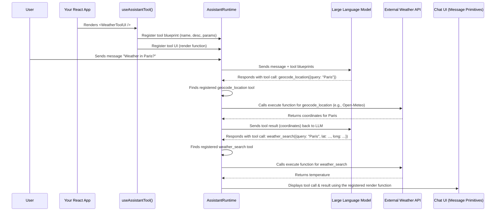

# Chapter 6: Tool

Welcome back! In [Chapter 5: AssistantRuntime](05_assistantruntime_.md), we explored the `AssistantRuntime` as the central brain and control panel for your entire `assistant-ui` chat application. It manages all your conversations and connects to your AI backend.

Now, imagine this powerful AI brain. It can understand what users say and generate text. But what if it needs to *do* something concrete in the real world or within your application? For example:
*   "I need to look up the current weather."
*   "I can set a form field in your UI for you."
*   "This action needs human approval before proceeding."

How does an AI, which typically only deals with text, bridge the gap to perform these actions? This is precisely the problem that the **`Tool`** concept solves!

## What Problem Does `Tool` Solve?

Think of a `Tool` as a **special ability** or a **magic button** that you give your AI assistant. Each tool is designed to perform a very specific task that the AI itself cannot do directly.

Without `Tools`, your AI could only chat. It couldn't interact with your application's UI, access external information (like weather data), or trigger complex workflows. `Tools` are crucial because they transform your AI from a simple conversational partner into an **AI agent** that can take actions and make your application truly intelligent and interactive.

Our central use case for this chapter is: **How can we enable our AI assistant to look up the current weather for a specific location and display that information directly within the chat interface, not just as plain text?** `Tools` are the key to making this happen.

## Key Concepts of `Tool`

Let's break down what a `Tool` is made of and how it works:

### 1. An Action for the LLM

At its core, a `Tool` represents an **action** that an LLM (Large Language Model) can "invoke" or "call." When you define a tool, you're telling the AI: "Hey, if you need to do X, here's a special function you can use."

### 2. Describing the Tool (`description` and `parameters`)

For the AI to know *when* to use a tool, you need to tell it what the tool does and what information it needs.
*   **`description`**: A plain English sentence explaining the tool's purpose (e.g., "Find the current weather for a given city.").
*   **`parameters`**: A structured description (often using `zod` for clarity in TypeScript) of the input the tool needs (e.g., `city: string`, `longitude: number`, `latitude: number`).

The LLM reads this description and these parameters to decide if it's the right tool for the user's request.

### 3. Executing the Tool (`execute`)

This is the actual code that runs when the AI decides to use the tool. It's a function that takes the `parameters` provided by the AI and performs the real-world action (e.g., making an API call to a weather service, updating a form field).

### 4. Visualizing the Tool's Output (`render`)

Often, you don't just want the AI to *tell* you it called a tool; you want to *show* the result in a rich UI. The `render` function allows you to define a custom React component that displays the tool's progress (e.g., "Searching for weather...") or its final result (e.g., "Current temperature: 25°C"). This is how you achieve "generative UI."

### 5. Types of Tools (`type`)

`assistant-ui` allows for different environments where tools might run:
*   **`frontend`**: The tool's `execute` function runs directly in the user's browser. This is great for UI interactions, local storage access, or client-side API calls.
*   **`backend`**: The tool's `execute` function runs on your server. This is typical for secure API calls, database access, or complex computations. (Note: The `execute` function for a `backend` tool would live on your server-side integration, not directly in your React component as shown in `useAssistantTool`.)
*   **`human`**: The tool requires human interaction or approval. This type of tool might pause the AI's flow and prompt the user for input.

## Putting It All Together: Using `Tool` in Your App

In `assistant-ui`, you define and register your tools using the `useAssistantTool` React hook. This hook makes your tool available to the `AssistantRuntime` (the AI's brain) and tells `assistant-ui` how to display its output.

Let's use our weather example. We'll define two tools:
1.  `geocode_location`: To convert a city name into geographic coordinates (latitude and longitude).
2.  `weather_search`: To fetch the actual weather using those coordinates.

Here's how you'd define the `weather_search` tool:

```typescript
// From apps/docs/components/tools/weather-tool.tsx (simplified)
import { useAssistantTool } from "@assistant-ui/react";
import { z } from "zod"; // For defining tool parameters

export const WeatherSearchToolUI = () => {
  useAssistantTool({
    toolName: "weather_search", // Unique name for the tool
    description: "Find the weather in a location given a longitude and latitude",
    parameters: z.object({ // What info the tool needs
      query: z.string(), // e.g., "London"
      longitude: z.number(),
      latitude: z.number(),
    }),
    execute: async (args) => { // The actual function that runs
      // This is where you'd make a real API call to a weather service
      const response = await fetch(
        `https://api.open-meteo.com/v1/forecast?latitude=${args.latitude}&longitude=${args.longitude}`
        // ... (simplified URL for brevity)
      );
      const data = await response.json();
      return { success: true, temperature: data.hourly.temperature_2m[0] };
    },
    render: ({ args, result }) => { // How to display the tool's status/result
      if (!result) return <div>Searching for weather for {args?.query}...</div>;
      if (result.success) return <div>Current temp in {args?.query}: {result.temperature}°C</div>;
      return <div>Error fetching weather for {args?.query}.</div>;
    },
  });
  return null; // This component doesn't render anything itself, just registers the tool
};
```

Let's break down this example:
*   `useAssistantTool` is the hook we use to define and register our tool.
*   `toolName: "weather_search"` gives our tool a unique identifier that the AI can use.
*   `description` is a human-readable text that helps the LLM understand when to call this tool.
*   `parameters` defines the expected input for this tool. Here, we use `z.object` (from the `zod` library) to specify that it expects a `query` (string), `longitude` (number), and `latitude` (number). The LLM will try to extract these from the user's prompt.
*   `execute` is an `async` function that takes the `args` (which will match the `parameters` schema) and performs the actual task – in this case, making a dummy API call and returning a result.
*   `render` is a React component that takes `args` (the inputs to the tool call) and `result` (the output from `execute`). It determines how the tool's activity and outcome are displayed in the chat. While the `execute` function is running, `result` will be `null`. Once `execute` resolves, `result` will contain its return value.

To use this tool, you simply need to include `WeatherSearchToolUI` (and `GeocodeLocationToolUI` similarly defined) somewhere in your component tree, ideally within the `AssistantRuntimeProvider`.

```tsx
import { AssistantRuntimeProvider } from "@assistant-ui/react";
import { Core } from "@assistant-ui/react/runtimes";
import { WeatherSearchToolUI, GeocodeLocationToolUI } from "./weather-tool"; // Our tool definitions
import { Composer } from "@assistant-ui/react/primitives"; // Example UI components
import { Thread } from "@assistant-ui/react/primitives"; // Example UI components

const myAssistantRuntime = new Core.AssistantRuntime(); // Our AI's brain

function App() {
  return (
    <AssistantRuntimeProvider runtime={myAssistantRuntime}>
      {/* These components simply register the tools with the runtime */}
      <WeatherSearchToolUI />
      <GeocodeLocationToolUI />

      <div style={{ height: '400px', display: 'flex', flexDirection: 'column' }}>
        <Thread.Root style={{ flexGrow: 1, overflowY: 'auto' }}>
          <Thread.Messages /> {/* Displays chat messages, including tool UIs */}
        </Thread.Root>
        <Composer.Root style={{ padding: '10px' }}>
          <Composer.Input placeholder="Ask about the weather!" />
          <Composer.SendButton>Send</Composer.SendButton>
        </Composer.Root>
      </div>
    </AssistantRuntimeProvider>
  );
}

export default App;
```
Now, if a user types something like "What's the weather in London?", the AI might first call `geocode_location` to get London's coordinates, then call `weather_search` with those coordinates, and the `render` function of `weather_search` will display the temperature directly in the chat!

## How `Tool` Works Internally (A Peek Behind the Scenes)

When you define a `Tool` using `useAssistantTool`, a lot happens behind the scenes to connect it to the `AssistantRuntime` and your UI.

Think of it like this:

1.  **Tool Registration:** When your `useAssistantTool` component mounts, it immediately registers two things with the central `AssistantRuntime`:
    *   **The Tool's Blueprint:** It tells the `AssistantRuntime` (and effectively the underlying LLM) about the `toolName`, `description`, and `parameters`. This is like adding a new entry to the AI's "list of capabilities."
    *   **The Tool's UI Instructions:** It also registers the `render` function with a special store (`toolUIsStore`) so that `assistant-ui` knows how to display this tool's output later.

2.  **User Request:** A user sends a message like "What's the weather in Paris?" This message is added to the [Thread](02_thread_.md).

3.  **AI Decides to Use a Tool:** The `AssistantRuntime` sends the conversation history to the LLM. The LLM, seeing your `description` and `parameters` for `geocode_location` and `weather_search`, decides that these tools are relevant. It then provides "tool calls" as part of its response, specifying the tool name and the arguments (e.g., `{ toolName: "geocode_location", args: { query: "Paris" } }`).

4.  **Executing the Tool:** The `AssistantRuntime` receives this "tool call" from the LLM. It looks up the registered tool definition based on `toolName`. If it's a `frontend` tool, it invokes the `execute` function you provided in your `useAssistantTool` hook.

5.  **Displaying Tool Progress/Result:** As the `execute` function runs, or when it returns a `result`, `assistant-ui` finds the corresponding `render` function you registered earlier. It then renders this React component directly into the chat message area as a special `ToolCallContentPart`, showing the user what the AI is doing or the outcome.

Here's a simple diagram to visualize this process:



### Diving a Bit Deeper into the Code

The main type definition for `Tool` is in `packages/assistant-stream/src/core/tool/tool-types.ts`. It includes all the properties we discussed:

```typescript
// Simplified from packages/assistant-stream/src/core/tool/tool-types.ts
export type Tool<
  TArgs extends Record<string, unknown> = Record<string, unknown>,
  TResult = unknown,
> =
  | { // Frontend Tool
      type?: "frontend" | undefined;
      description?: string | undefined;
      parameters: any; // JSONSchema7 or StandardSchemaV1
      disabled?: boolean;
      execute?: (args: TArgs, context: { toolCallId: string; abortSignal: AbortSignal }) => TResult | Promise<TResult>;
      // ... other properties
    }
  | { // Backend Tool (no execute function here, handled on server)
      type?: "backend" | undefined;
      // ... no description/parameters for backend tools directly in frontend
      // ...
    }
  | { // Human Tool (no execute function, requires human input)
      type?: "human" | undefined;
      description?: string | undefined;
      parameters: any; // JSONSchema7 or StandardSchemaV1
      disabled?: boolean;
      // ...
    };
```
As you can see, the `Tool` type is a "union" of different tool types (`frontend`, `backend`, `human`), each with slightly different properties. The `execute` function is specifically part of the `frontend` tool definition.

The `useAssistantTool` hook (from `packages/react/src/model-context/useAssistantTool.tsx`) is responsible for taking your `AssistantToolProps` (which extends `Tool`) and registering it with the `AssistantRuntime`'s internal systems.

```typescript
// Simplified from packages/react/src/model-context/useAssistantTool.tsx
import { useEffect } from "react";
import { useAssistantRuntime, useToolUIsStore } from "../context/react/AssistantContext";
import type { Tool } from "assistant-stream"; // The core Tool type

export const useAssistantTool = <
  TArgs extends Record<string, unknown>,
  TResult,
>(
  tool: { toolName: string; render?: any; } & Tool<TArgs, TResult>, // Combines tool props with base Tool
) => {
  const assistantRuntime = useAssistantRuntime(); // Get the main runtime
  const toolUIsStore = useToolUIsStore(); // Get the store for tool UI components

  useEffect(() => {
    // This useEffect registers the 'render' function for the tool's UI
    return tool.render
      ? toolUIsStore.getState().setToolUI(tool.toolName, tool.render)
      : undefined;
  }, [toolUIsStore, tool.toolName, tool.render]);

  useEffect(() => {
    // This useEffect registers the tool's definition (name, description, parameters, execute)
    const { toolName, render, ...rest } = tool; // Separate render and toolName for registration
    const context = {
      tools: {
        [toolName]: rest, // The 'rest' contains the Tool definition
      },
    };
    // Register the tool with the AssistantRuntime via ModelContext
    return assistantRuntime.registerModelContextProvider({
      getModelContext: () => context,
    });
  }, [assistantRuntime, tool]); // Re-register if tool definition changes
};
```
This code snippet shows two `useEffect` hooks:
1.  The first `useEffect` is for registering the `render` function. `toolUIsStore` is a special `zustand` store (a state management library) that `assistant-ui` uses to quickly look up which React component should be used to display a tool call with a given `toolName`.
2.  The second `useEffect` is for registering the actual `Tool` definition (its `description`, `parameters`, `execute` function, etc.) with the `AssistantRuntime`. This is done via `assistantRuntime.registerModelContextProvider`, which will be the focus of our next chapter: [Chapter 7: ModelContext](07_modelcontext_.md). It's through this mechanism that the LLM becomes aware of the tools it can use.

## Conclusion

In this chapter, you've learned that `Tool`s are special abilities you give your AI assistant, allowing it to perform specific actions within your application or interact with external services. You saw how `description` and `parameters` inform the AI, `execute` performs the action, and `render` allows you to create custom UI for the tool's progress and results. You also got a glimpse of how `useAssistantTool` connects your tool definitions to the `AssistantRuntime` for seamless integration.

Now that you understand what `Tool`s are and how they are defined, the next logical step is to explore how the `AssistantRuntime` uses something called `ModelContext` to provide these tools (and other important information) to the underlying LLM.

[Chapter 7: ModelContext](07_modelcontext_.md)

---

Generated by [AI Codebase Knowledge Builder](https://github.com/The-Pocket/Tutorial-Codebase-Knowledge)