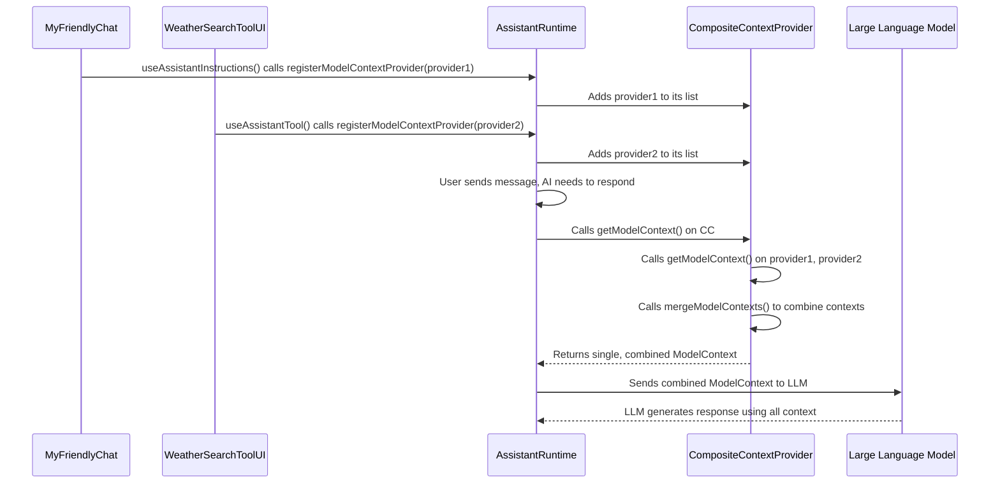

# Chapter 7: ModelContext

Welcome back! In [Chapter 6: Tool](06_tool_.md), we learned how to empower your AI assistant with special abilities called `Tool`s, allowing it to perform actions and interact with your application or external services. We saw that `useAssistantTool` is how you tell `assistant-ui` about these new tools.

Now, imagine your chat application is growing. You might have:
*   A general welcome message for the AI (a "system" instruction).
*   A specific page where the AI needs to know about "weather tools."
*   Another section where the AI needs to be told about "calendar tools."
*   And maybe a global setting that dictates how "creative" the AI should be (`temperature`).

How do all these different parts of your React application contribute their specific instructions and settings to the *same* AI model, ensuring the AI always gets the full, combined picture? This is precisely the problem that **`ModelContext`** solves!

## What Problem Does `ModelContext` Solve?

Think of `ModelContext` as a **shared instruction manual** for your AI. Different parts of your application (components) can each write a section in this manual. When the AI is about to generate a response, `assistant-ui` gathers *all* these sections, combines them into one complete manual, and hands it to the AI.

Without `ModelContext`, it would be difficult for different parts of your application to contribute specific behaviors or capabilities to the AI. You'd have to manually collect all these settings, which quickly becomes messy and error-prone.

Our central use case for this chapter is: **How can different React components dynamically provide configuration settings, like system messages, available tools, and AI parameters (e.g., `temperature`), to the underlying LLM in a combined and organized way?** `ModelContext` is the answer. It's the mechanism that gathers all relevant information for the AI, no matter where it's defined in your React component tree.

## Key Concepts of `ModelContext`

Let's break down the essential ideas behind `ModelContext`:

### 1. The "Combined Instruction Manual" (`ModelContext`)

At its heart, `ModelContext` is a simple object that holds all the configuration settings for the LLM. It includes:
*   **`system`**: General instructions or a "personality" for the AI (e.g., "You are a helpful assistant."). If multiple components provide system messages, they are combined!
*   **`tools`**: A list of all available `Tool`s that the AI can use (like our `weather_search` tool from the last chapter).
*   **`callSettings`**: Specific parameters for how the AI should generate text, such as `temperature` (how creative/random the output is) or `maxTokens` (the maximum length of the response).
*   **`config`**: General model configuration, like API keys or base URLs.

This `ModelContext` object is the final, complete set of instructions that `assistant-ui` sends to your AI model.

### 2. "Contributing a Section" (`ModelContextProvider`)

Since different components contribute, `assistant-ui` needs a way for them to "register" their piece of the `ModelContext`. This is done via a `ModelContextProvider`. It's an object that knows *how* to provide its specific part of the `ModelContext`. It simply has a `getModelContext()` function that returns a `ModelContext` object (or just a part of it, like only the `system` property).

### 3. "Registering Your Section" (`registerModelContextProvider`)

To make your `ModelContextProvider` known to the system, you call `assistantRuntime.registerModelContextProvider()`. This function tells the `AssistantRuntime` (the main brain of your chat app) about your component's contribution.

### 4. "Merging the Sections" (`mergeModelContexts`)

When the AI needs to generate a response, `assistant-ui` internally takes all the `ModelContextProvider`s that have been registered and calls their `getModelContext()` function. Then, it uses a special function called `mergeModelContexts` to combine all these individual `ModelContext` objects into one single, comprehensive `ModelContext` that is sent to the LLM.

*   **How merging works:**
    *   **`system` messages:** They are typically concatenated (joined together) with line breaks. This means you can add to the AI's general instructions from different places.
    *   **`tools`:** Tools are added to a single list. *Important*: You cannot have two different tools with the same `toolName`! If you try, `assistant-ui` will throw an error because it wouldn't know which one to use.
    *   **`callSettings` and `config`**: These are merged, with later-defined properties overriding earlier ones (though `priority` can influence this for advanced cases).

## Putting It All Together: Using `ModelContext` in Your App

You won't typically interact directly with `ModelContext` or `ModelContextProvider` types very often. Instead, `assistant-ui` provides convenient hooks that *internally* use this mechanism. We already saw one such hook in [Chapter 6: Tool](06_tool_.md): `useAssistantTool`. Another common one is `useAssistantInstructions`.

Let's see how `useAssistantInstructions` uses `ModelContext` to set a system message for the AI:

```typescript
import { useAssistantInstructions } from "@assistant-ui/react";
import { Composer, Thread } from "@assistant-ui/react/primitives"; // For UI

function MyFriendlyChat() {
  // This component adds a system instruction to the AI's ModelContext
  useAssistantInstructions("You are a super friendly assistant.");

  return (
    <div style={{ height: '400px', display: 'flex', flexDirection: 'column' }}>
      <Thread.Root style={{ flexGrow: 1, overflowY: 'auto' }}>
        <Thread.Messages />
      </Thread.Root>
      <Composer.Root style={{ padding: '10px' }}>
        <Composer.Input placeholder="Say something friendly!" />
        <Composer.SendButton>Send</Composer.SendButton>
      </Composer.Root>
    </div>
  );
}
```

In this example:
*   `useAssistantInstructions("You are a super friendly assistant.")` is called within `MyFriendlyChat`.
*   Internally, `useAssistantInstructions` creates a `ModelContextProvider` that provides `{ system: "You are a super friendly assistant." }` as its `ModelContext`.
*   It then calls `assistantRuntime.registerModelContextProvider()` to register this provider.
*   Now, whenever the AI needs to generate a response, this "friendly assistant" instruction will be part of the `ModelContext` given to the LLM.

What if you have another component that also contributes a system instruction, or a tool?

```tsx
import { useAssistantInstructions } from "@assistant-ui/react";
import { WeatherSearchToolUI } from "./weather-tool"; // Our tool from Chapter 6
import { AssistantRuntimeProvider } from "@assistant-ui/react";
import { Core } from "@assistant-ui/react/runtimes";
import { Composer, Thread } from "@assistant-ui/react/primitives";

const myAssistantRuntime = new Core.AssistantRuntime();

function MyAppComponents() {
  return (
    <>
      {/* Component 1: Sets a general friendly instruction */}
      <MyFriendlyChat />

      {/* Component 2: Registers the weather tool (which internally uses ModelContext) */}
      <WeatherSearchToolUI />

      {/* Another component could set a global temperature: */}
      <SetGlobalAITemperature />
    </>
  );
}

function SetGlobalAITemperature() {
  // This hook also internally registers a ModelContextProvider
  // for AI call settings (conceptually, not a real hook in assistant-ui)
  useAssistantInstructions("Set AI temperature to 0.7"); // Simplified for concept
  // A real hook would look like: useAICallSettings({ temperature: 0.7 });
  return null;
}

function App() {
  return (
    <AssistantRuntimeProvider runtime={myAssistantRuntime}>
      <MyAppComponents />
    </AssistantRuntimeProvider>
  );
}
```
In this combined example:
*   `MyFriendlyChat` provides a system message.
*   `WeatherSearchToolUI` provides the `weather_search` tool.
*   `SetGlobalAITemperature` (conceptually) provides a `callSettings` like `temperature`.

When the AI is asked a question, `assistant-ui`'s `AssistantRuntime` will:
1.  Collect the `ModelContext` from `MyFriendlyChat` (`{ system: "You are a super friendly assistant." }`).
2.  Collect the `ModelContext` from `WeatherSearchToolUI` (`{ tools: { weather_search: ... } }`).
3.  Collect the `ModelContext` from `SetGlobalAITemperature` (`{ callSettings: { temperature: 0.7 } }`).
4.  Merge all of them into a single `ModelContext` that looks something like:
    ```json
    {
      "system": "You are a super friendly assistant.",
      "tools": {
        "weather_search": { /* ... tool definition ... */ }
      },
      "callSettings": {
        "temperature": 0.7
      }
    }
    ```
This final, combined `ModelContext` is then sent to the LLM, giving it all the necessary context and capabilities to respond intelligently.

## How `ModelContext` Works Internally (A Peek Behind the Scenes)

When different components in your React application call `useAssistantInstructions` or `useAssistantTool`, they are all, behind the scenes, using the `ModelContext` system.

Imagine the `AssistantRuntime` having a special "collection basket" (`CompositeContextProvider`).

1.  **Component "Registers":** When your `MyFriendlyChat` component renders, its `useAssistantInstructions` hook creates a `ModelContextProvider` and adds it to the `AssistantRuntime`'s "collection basket" using `registerModelContextProvider`.
2.  **Tool "Registers":** Similarly, when `WeatherSearchToolUI` renders, its `useAssistantTool` hook also creates a `ModelContextProvider` (containing the tool definition) and adds it to the *same* "collection basket."
3.  **AI Needs Context:** When it's time for the AI to respond, the `AssistantRuntime` goes to its "collection basket."
4.  **Basket Combines:** The "collection basket" (`CompositeContextProvider`) takes all the individual `ModelContextProvider`s inside it, asks each one for its `ModelContext` (its "section of the manual"), and then uses `mergeModelContexts` to combine them into one master `ModelContext`.
5.  **Master Manual to AI:** This master `ModelContext` is then handed to the LLM, giving it all the instructions, tools, and settings it needs.

Here's a simple diagram to visualize this:



### Diving a Bit Deeper into the Code

The main types for `ModelContext` are defined in `packages/react/src/model-context/ModelContextTypes.ts`:

```typescript
// Simplified from packages/react/src/model-context/ModelContextTypes.ts
export type LanguageModelV1CallSettings = {
  temperature?: number; // How creative the AI is
  maxTokens?: number;   // Max length of AI response
  // ... other settings
};

export type ModelContext = {
  priority?: number | undefined; // For advanced merging rules
  system?: string | undefined;   // General instructions
  tools?: Record<string, Tool<any, any>> | undefined; // Available tools
  callSettings?: LanguageModelV1CallSettings | undefined; // AI generation parameters
  config?: { /* API key, base URL etc. */ } | undefined;
};

export type ModelContextProvider = {
  getModelContext: () => ModelContext; // Function to get the context
  subscribe?: (callback: () => void) => Unsubscribe; // For dynamic updates
};

export const mergeModelContexts = (
  configSet: Set<ModelContextProvider>,
): ModelContext => {
  const configs = Array.from(configSet)
    .map((c) => c.getModelContext()) // Get context from each provider
    .sort((a, b) => (b.priority ?? 0) - (a.priority ?? 0)); // Sort by priority

  return configs.reduce((acc, config) => {
    if (config.system) {
      if (acc.system) {
        acc.system += `\n\n${config.system}`; // Concatenate system messages
      } else {
        acc.system = config.system;
      }
    }
    if (config.tools) {
      for (const [name, tool] of Object.entries(config.tools)) {
        if (acc.tools?.[name] && acc.tools[name] !== tool) {
          // Error if tool name is duplicated!
          throw new Error(`You tried to define a tool with the name ${name}, but it already exists.`);
        }
        if (!acc.tools) acc.tools = {};
        acc.tools[name] = tool; // Add tool
      }
    }
    // ... similar merging logic for callSettings and config
    return acc;
  }, {} as ModelContext);
};
```
The `mergeModelContexts` function is crucial here. It iterates through all provided `ModelContext`s and combines them according to the rules (e.g., concatenating `system` messages, checking for duplicate `tool` names).

The "collection basket" we talked about is actually implemented by a class called `CompositeContextProvider` in `packages/react/src/utils/CompositeContextProvider.ts`. This class is used internally by the `AssistantRuntime` to manage all the registered `ModelContextProvider`s.

```typescript
// Simplified from packages/react/src/utils/CompositeContextProvider.ts
import { type ModelContextProvider, mergeModelContexts } from "../model-context/ModelContextTypes";

export class CompositeContextProvider implements ModelContextProvider {
  private _providers = new Set<ModelContextProvider>(); // Stores all registered providers

  getModelContext() {
    return mergeModelContexts(this._providers); // Calls the merging function
  }

  registerModelContextProvider(provider: ModelContextProvider) {
    this._providers.add(provider); // Add new provider to the set
    // Optionally subscribe to changes from the provider if it's dynamic
    const unsubscribe = provider.subscribe?.(() => {
      this.notifySubscribers(); // Tell listeners (like AssistantRuntime) about updates
    });
    this.notifySubscribers(); // Notify immediately after adding
    return () => { // Return a cleanup function
      this._providers.delete(provider); // Remove provider when it's no longer needed
      unsubscribe?.();
      this.notifySubscribers();
    };
  }

  // ... (methods for notifying subscribers about changes)
}
```
This `CompositeContextProvider` is essentially what the `AssistantRuntime` uses. When your `useAssistantInstructions` or `useAssistantTool` hook calls `assistantRuntime.registerModelContextProvider(...)`, it's ultimately adding your `ModelContextProvider` to this `CompositeContextProvider`'s internal `_providers` set.

## Conclusion

In this chapter, you've learned that `ModelContext` is the powerful mechanism that allows different parts of your `assistant-ui` application to dynamically contribute configuration settings to the underlying LLM. You saw how `ModelContext` bundles instructions, tools, and parameters, and how `ModelContextProvider`s allow individual components to provide their slice of this context. Finally, you understood how `assistant-ui` internally uses `registerModelContextProvider` and `mergeModelContexts` to combine all these contributions into a single, comprehensive "instruction manual" for your AI.

Now that you understand how AI models are configured, the next step is to dive into the core technology that powers the conversation with these models: `assistant-stream`.

[Chapter 8: assistant-stream](08_assistant_stream_.md)

---

Generated by [AI Codebase Knowledge Builder](https://github.com/The-Pocket/Tutorial-Codebase-Knowledge)