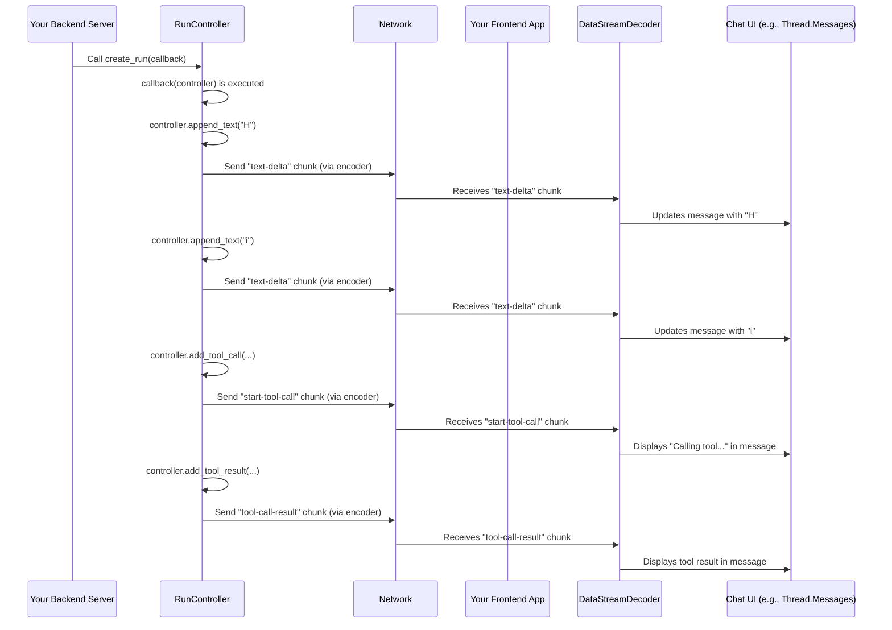

# Chapter 8: assistant-stream

Welcome back! In [Chapter 7: ModelContext](07_modelcontext_.md), we explored how `assistant-ui` allows different parts of your application to contribute crucial configuration and instructions (like system messages and `Tool`s) to your AI model using `ModelContext`.

Now, imagine your AI is generating a response. It might be typing character by character, deciding to call a tool, waiting for the tool's result, and then continuing to type. How does all this rich, dynamic information get from your AI backend (where the heavy AI computations happen) to your frontend chat UI in real-time, instantly updating what the user sees?

This is precisely the problem that the **`assistant-stream`** library solves!

## What Problem Does `assistant-stream` Solve?

Think of `assistant-stream` as a **high-speed, specialized data pipeline** or a "live news ticker" between your backend server and your frontend chat interface. When an AI responds, it's not just sending one big message. It's often sending a series of tiny, structured updates: "here's a character," "here's the start of a tool call," "here's the tool's result," "here's another character."

Without `assistant-stream`, handling these real-time, fragmented updates would be incredibly complex. You'd have to manually:
*   Manage a connection (like Server-Sent Events - SSE) that keeps sending data.
*   Figure out how to send different *types* of data (text, tool calls, errors, state updates) over that connection.
*   Piece together partial text responses character by character.
*   Ensure that when a tool call starts, the UI knows to show a loading state, and when it finishes, it displays the result.

The central use case for this chapter is: **How can we make our AI chat feel truly "live" and interactive, where text appears instantly, tool calls are visible as they happen, and even internal state changes are reflected without delay, all powered by a backend server?** `assistant-stream` handles all the complex plumbing to make this real-time magic happen.

## Key Concepts of `assistant-stream`

Let's break down the essential components of `assistant-stream`:

### 1. The High-Speed Data Pipeline

`assistant-stream` sets up a persistent connection (often using Server-Sent Events, or SSE) between your backend and frontend. This connection stays open, allowing your backend to "push" data to the frontend whenever it's ready, without the frontend having to constantly ask for updates. This is why you see text appearing character by character or tool calls pop up instantly.

### 2. Structured Data "Packets" (`AssistantStreamChunk`)

Instead of sending raw text, `assistant-stream` breaks down all communication into small, standardized "packets" called `AssistantStreamChunk`s. Each chunk has a `type` (e.g., `"text-delta"`, `"start-tool-call"`, `"tool-call-result"`, `"update-state"`) and a `value` that contains the specific data for that type. This structured approach makes it easy for the frontend to understand exactly what kind of update it's receiving.

Think of these chunks like different types of parcels being sent through the pipeline:
*   A `text-delta` chunk is a tiny parcel with a few new characters.
*   A `start-tool-call` chunk is a parcel announcing a new tool operation.
*   A `tool-call-result` chunk contains the outcome of a tool execution.
*   An `update-state` chunk tells the UI to update some internal state.

### 3. Backend "Conveyor Belt" (`create_run` and `RunController`)

On your backend (e.g., a Python server), `assistant-stream` provides a function called `create_run`. You give this function a `callback` where you tell `assistant-stream` what you want to "send" to the frontend. Inside this callback, you get a special `RunController` object. This controller is your "conveyor belt operator." You use its methods to push `AssistantStreamChunk`s onto the stream.

### 4. Frontend "Receiving End" (`DataStreamDecoder` / `DataStreamEncoder`)

On the frontend, `assistant-ui` uses `DataStreamDecoder` to listen to the incoming stream of `AssistantStreamChunk`s from your backend. It's like the receiving end of the conveyor belt, unwrapping each parcel and directing its contents to the right place in the UI. When the frontend sends a message, `DataStreamEncoder` packages it up before sending it.

## Putting It All Together: A Simple `assistant-stream` Example

Let's look at a very basic example of how you'd use `assistant-stream` on the backend to send a "Hello world" message, character by character, with a small delay to simulate typing:

First, on your Python backend (e.g., using FastAPI):

```python
# File: api/chat/completions/index.py (simplified)
from assistant_stream import create_run
from assistant_stream.serialization import DataStreamResponse
import asyncio
from fastapi import FastAPI, CORSMiddleware # For a web server

app = FastAPI()
app.add_middleware(CORSMiddleware, allow_origins=["*"], allow_methods=["*"])

@app.post("/api/chat/completions")
async def chat_completions():
    async def run(controller): # This is your "conveyor belt operator"
        controller.append_text("Hello ") # Send "Hello " chunk
        await asyncio.sleep(0.5)         # Simulate delay
        controller.append_text("world.") # Send "world." chunk

    # create_run makes the stream from your 'run' callback
    return DataStreamResponse(create_run(run))
```
In this Python backend code:
*   We define an `async` function `run` that takes a `controller`.
*   We use `controller.append_text()` to send small parts of the message ("Hello " and "world.") over the stream.
*   `asyncio.sleep(0.5)` simulates the AI "thinking" or "typing" by adding a half-second delay.
*   `create_run(run)` takes our `run` function and sets up the streaming mechanism.
*   `DataStreamResponse(...)` wraps this stream into a format that a web server (like FastAPI) can send to the frontend.

When your frontend application makes a request to this endpoint, it will receive the "Hello " part first, then after a short delay, the "world." part, making the text appear character by character in your chat UI!

To simulate a tool call, you could extend the `run` function:

```python
# File: api/chat/completions/index.py (simplified with tool call)
from assistant_stream import create_run
from assistant_stream.serialization import DataStreamResponse
import asyncio
from fastapi import FastAPI, CORSMiddleware

app = FastAPI()
app.add_middleware(CORSMiddleware, allow_origins=["*"], allow_methods=["*"])

@app.post("/api/chat/completions")
async def chat_completions():
    async def run(controller):
        controller.append_text("Okay, let me check the weather for you.")
        await asyncio.sleep(0.5)

        # 1. Announce a tool call
        weather_tool = await controller.add_tool_call(tool_name="weather_search")
        weather_tool.append_args_text('{"location": "London"}') # Stream tool arguments
        weather_tool.close_args() # Indicate args are complete
        await asyncio.sleep(1) # Simulate tool execution time

        # 2. Report the tool's result
        controller.add_tool_result(tool_call_id=weather_tool.tool_call_id, result={"temperature": "25C", "condition": "sunny"})
        await asyncio.sleep(0.5)

        controller.append_text("The weather in London is 25°C and sunny.")

    return DataStreamResponse(create_run(run))
```
In this enhanced example:
*   `controller.add_tool_call(...)` sends a chunk indicating that a tool called `weather_search` is about to be invoked.
*   `weather_tool.append_args_text(...)` streams the arguments for the tool call.
*   `controller.add_tool_result(...)` sends a chunk containing the actual result of the tool's execution.
*   On the frontend, because of `assistant-stream`'s structured data, your chat UI would automatically show "Calling weather_search tool..." then maybe the arguments, and finally the tool's output (`25°C and sunny`) before the AI continues its text response. This all happens instantly as the chunks arrive.

## How `assistant-stream` Works Internally (A Peek Behind the Scenes)

When you use `create_run` on your backend and `assistant-ui` on your frontend, `assistant-stream` acts as the translator and pipeline manager.

Imagine a specialized train track with various stations:

1.  **Backend Factory (`create_run`):** You use the `RunController` (your "train dispatcher") to load different types of cargo (`AssistantStreamChunk`s) onto the train. For example, `append_text` loads a "text update" cargo, and `add_tool_call` loads a "tool call start" cargo.
2.  **Backend Packaging Station (`DataStreamEncoder` - conceptually on the backend):** Before the train leaves the backend, a "packaging station" wraps each `AssistantStreamChunk` into a standardized, efficient format (often a JSON line, followed by a newline) that can be sent over the internet as Server-Sent Events (SSE). This is similar to how `DataStreamEncoder` works in JavaScript, but it's conceptual for the Python backend preparing the response.
3.  **The Train Travels (Network):** The wrapped chunks are streamed over the network.
4.  **Frontend Unpacking Station (`DataStreamDecoder`):** On the frontend, `DataStreamDecoder` is constantly listening. It receives these wrapped chunks, unpacks them, and converts them back into `AssistantStreamChunk` objects that `assistant-ui` understands.
5.  **Frontend Display (`AssistantStream`):** These re-created `AssistantStreamChunk`s are then fed into the `AssistantStream` on the frontend, which knows how to interpret them (e.g., append text to a message, show a tool call UI, update a message's status) and make them appear in your chat UI.

Here's a simple diagram to visualize this process:



### Diving a Bit Deeper into the Code

On the backend, `assistant-stream` provides the `create_run` function (from `python/assistant-stream/src/assistant_stream/create_run.py`). This is the entry point for producing a stream:

```python
# Simplified from python/assistant-stream/src/assistant_stream/create_run.py
class RunController:
    # ... (init and internal methods)

    def append_text(self, text_delta: str) -> None:
        """Append a text delta to the stream."""
        # Creates a TextDeltaChunk and puts it in an internal queue
        chunk = TextDeltaChunk(text_delta=text_delta)
        self._flush_and_put_chunk(chunk)

    async def add_tool_call(self, tool_name: str, tool_call_id: str = ...) -> ToolCallController:
        """Add a tool call to the stream."""
        # Creates a ToolCallStreamController which can stream args/results
        stream, controller = await create_tool_call(tool_name, tool_call_id)
        self.add_stream(stream) # Adds this new sub-stream to the main stream
        return controller

    def add_tool_result(self, tool_call_id: str, result: Any) -> None:
        """Add a tool result to the stream."""
        chunk = ToolResultChunk(tool_call_id=tool_call_id, result=result)
        self._flush_and_put_chunk(chunk)

    @property
    def state(self):
        """Access the state proxy object for making state updates."""
        return self._state_manager.state # Allows updating shared state

async def create_run(callback: Callable[[RunController], Coroutine[Any, Any, None]], *, state: Any | None = None) -> AsyncGenerator[AssistantStreamChunk, None]:
    queue = asyncio.Queue()
    controller = RunController(queue, state_data=state)

    async def background_task():
        try:
            await callback(controller) # Your 'run' function gets called here
        finally:
            asyncio.get_running_loop().call_soon_threadsafe(queue.put_nowait, None)

    asyncio.create_task(background_task()) # Run your callback in the background

    while True: # Keep yielding chunks from the queue
        chunk = await controller._queue.get()
        if chunk is None: break
        yield chunk
```
This Python code shows how `create_run` spins up a background task that executes your provided `callback` function. Inside that `callback`, you use the `RunController` methods (`append_text`, `add_tool_call`, etc.) to put `AssistantStreamChunk` objects into an internal queue. The `create_run` function then constantly pulls from this queue and `yield`s the chunks, effectively creating an asynchronous generator (a stream).

On the frontend (in TypeScript), `assistant-stream` provides `DataStreamEncoder` and `DataStreamDecoder` (from `packages/assistant-stream/src/core/serialization/data-stream/DataStream.ts`). These are `TransformStream`s that handle the conversion between `AssistantStreamChunk` objects and the raw `Uint8Array` bytes sent over the network.

Here's a simplified look at the `DataStreamEncoder`'s `transform` method, which is like the "packaging" step on the backend:

```typescript
// Simplified from packages/assistant-stream/src/core/serialization/data-stream/DataStream.ts
export class DataStreamEncoder /* ... */ {
  constructor() {
    super((readable) => {
      const transform = new TransformStream<any, any>({
        transform(chunk, controller) {
          const type = chunk.type;
          switch (type) {
            case "text-delta": {
              // When a 'text-delta' chunk comes in, convert it to a DataStreamChunkType.TextDelta
              controller.enqueue({
                type: DataStreamStreamChunkType.TextDelta,
                value: chunk.textDelta,
              });
              break;
            }
            case "part-start": {
              // When a 'part-start' chunk (e.g., for a tool call) comes in
              const part = chunk.part;
              if (part.type === "tool-call") {
                controller.enqueue({
                  type: DataStreamStreamChunkType.StartToolCall,
                  value: part, // Contains toolName, toolCallId etc.
                });
              }
              break;
            }
            case "result": {
              // For tool call results
              const part = chunk.meta;
              if (part.type === "tool-call") {
                controller.enqueue({
                  type: DataStreamStreamChunkType.ToolCallResult,
                  value: { toolCallId: part.toolCallId, result: chunk.result },
                });
              }
              break;
            }
            // ... many other chunk types handled
            case "update-state": {
              controller.enqueue({
                type: DataStreamStreamChunkType.AuiUpdateStateOperations,
                value: chunk.operations,
              });
              break;
            }
          }
        },
      });
      return readable.pipeThrough(transform).pipeThrough(new TextEncoderStream());
    });
  }
}
```
This simplified `DataStreamEncoder` shows how it takes various `AssistantStreamChunk` types (like `text-delta`, `part-start`, `result`, `update-state`) and transforms them into a standardized `DataStreamChunkType` with a `value`. This `DataStreamChunk` is then encoded into text and sent over the network. The `DataStreamDecoder` on the frontend performs the reverse operation.

These mechanisms are what allow `assistant-ui` to receive granular, real-time updates from your backend and translate them into a smooth, interactive chat experience without you needing to worry about the low-level networking details.

## Conclusion

In this chapter, you've learned that `assistant-stream` is the powerful, low-level library that enables real-time, structured data streaming between your backend and frontend. It acts as a high-speed data pipeline, ensuring that live text updates, tool calls, and state changes appear instantly in your chat UI. You saw how `create_run` and `RunController` on the backend allow you to "send" these structured data "packets" (`AssistantStreamChunk`s), and how `DataStreamEncoder`/`DataStreamDecoder` handle the efficient transfer of this data.

Now that you understand the core streaming mechanism, the next logical step is to see how `assistant-ui` provides pre-built "Runtime Adapters" that leverage `assistant-stream` to connect to popular AI services like OpenAI, simplifying the entire setup process.

[Chapter 9: Runtime Adapters](09_runtime_adapters_.md)

---

Generated by [AI Codebase Knowledge Builder](https://github.com/The-Pocket/Tutorial-Codebase-Knowledge)