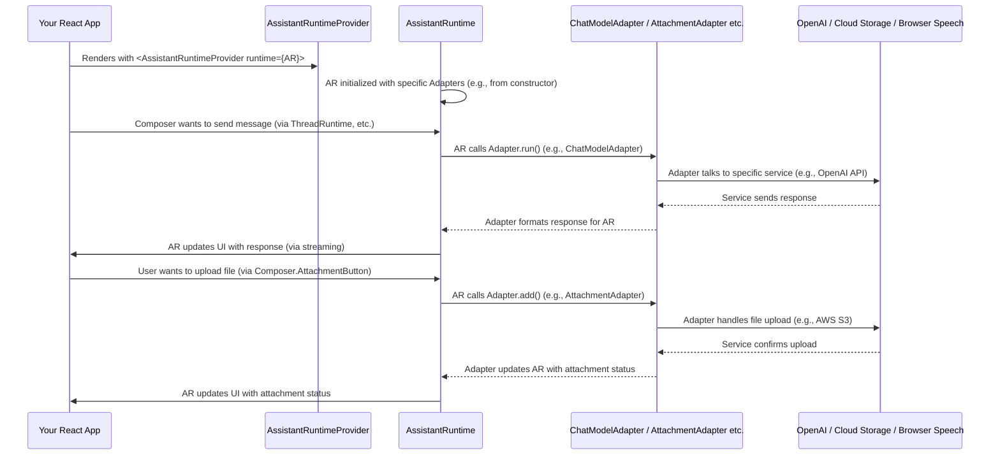

# Chapter 9: Runtime Adapters

Welcome back! In [Chapter 8: assistant-stream](08_assistant_stream_.md), we explored the powerful, low-level library that enables real-time, structured data streaming between your backend and frontend, ensuring live text updates, tool calls, and state changes appear instantly in your chat UI. You learned how `assistant-stream` handles the complex "pipeline" of data.

Now, imagine you want to connect this powerful `assistant-ui` frontend to different AI services. Maybe you started with OpenAI, but now you want to try Google Gemini, or perhaps a custom AI model you've built. What if you also want to let users upload files, or have the AI speak its responses aloud, or even save the chat history to your database?

Without a clever system, every time you switched an AI provider or added a new feature like file uploads or text-to-speech, you'd have to rewrite significant parts of your `assistant-ui` code. This would be a nightmare for maintenance and flexibility!

This is precisely the problem that **`Runtime Adapters`** solve!

Think of `Runtime Adapters` as **universal connectors** or **interchangeable power plugs** for `assistant-ui`. They are a set of modular components that allow you to "plug in" various backend services and external functionalities (like different AI providers, file storage, or text-to-speech services) without changing your main `assistant-ui` code. They provide a standardized way for `assistant-ui` to talk to *any* service that provides the required functionality.

Our central use case for this chapter is: **How can we easily switch between different AI chat model providers (like OpenAI, Vercel AI SDK, LangChain) for our `assistant-ui` application, and also enable file uploads and text-to-speech capabilities, all without modifying the core UI code?** `Runtime Adapters` make this possible.

## Key Concepts of `Runtime Adapters`

`Runtime Adapters` are specialized interfaces that `assistant-ui` defines for common functionalities. If a service "implements" one of these adapters, `assistant-ui` knows how to interact with it.

Let's look at some key types of adapters:

### 1. `ChatModelAdapter` (for AI Providers)

This is perhaps the most important adapter. It defines *how* `assistant-ui` talks to an AI chat model. Whether it's OpenAI, Anthropic, or a custom LLM, if it provides a `ChatModelAdapter` implementation, `assistant-ui` knows how to send messages to it and receive streamed responses.

The core function here is `run()`, which takes the conversation history and AI configuration ([Chapter 7: ModelContext](07_modelcontext_.md)), and returns the AI's response (often streamed, leveraging [Chapter 8: assistant-stream](08_assistant_stream_.md)).

```typescript
// Simplified from packages/react/src/runtimes/local/ChatModelAdapter.tsx
export type ChatModelAdapter = {
  run(
    options: {
      messages: readonly ThreadMessage[]; // The conversation history
      context: ModelContext;           // AI configurations (tools, system messages)
      abortSignal: AbortSignal;        // For canceling generation
      // ... other options
    },
  ): Promise<ChatModelRunResult> | AsyncGenerator<ChatModelRunResult, void>;
};
```
This means if you have an OpenAI `ChatModelAdapter`, its `run` method knows how to call the OpenAI API. If you have a LangChain `ChatModelAdapter`, its `run` method knows how to work with LangChain. The rest of your `assistant-ui` application doesn't need to know the difference!

### 2. `AttachmentAdapter` (for File Uploads)

This adapter defines how `assistant-ui` handles file uploads. When a user tries to attach a file, `assistant-ui` will use the `AttachmentAdapter` you've provided.

Key methods include:
*   `add()`: To add a file to the pending attachments.
*   `send()`: To actually upload the file (e.g., to cloud storage) and get a permanent URL.
*   `remove()`: To delete a pending attachment.

```typescript
// Simplified from packages/react/src/runtimes/adapters/attachment/AttachmentAdapter.ts
export type AttachmentAdapter = {
  accept: string; // What file types are accepted (e.g., "image/*")

  add(state: { file: File }): Promise<PendingAttachment>; // Add file, get temp ID
  send(attachment: PendingAttachment): Promise<CompleteAttachment>; // Upload, get URL
  remove(attachment: Attachment): Promise<void>; // Remove attachment
};
```
By providing an `AttachmentAdapter`, `assistant-ui`'s [Composer](03_composer_.md) component can automatically handle file uploads without you writing custom logic for every storage service.

### 3. `SpeechSynthesisAdapter` (for Text-to-Speech)

This adapter enables your AI assistant to "speak" its responses. It defines how `assistant-ui` can convert text into audio.

The primary method is:
*   `speak()`: Takes a string of text and starts playing it as speech. It returns an `Utterance` object to control or monitor the speech.

```typescript
// Simplified from packages/react/src/runtimes/adapters/speech/SpeechAdapterTypes.ts
export type SpeechSynthesisAdapter = {
  speak: (text: string) => SpeechSynthesisAdapter.Utterance;
};
```
If you provide an implementation (e.g., using a browser's built-in speech synthesis or a cloud service like Google Cloud Text-to-Speech), `assistant-ui` can then provide buttons to read out AI messages.

### Other Adapters

`assistant-ui` also offers other adapters for various purposes:
*   **`ThreadHistoryAdapter`**: For saving and loading chat [Thread](02_thread_.md) history to a backend database or local storage.
*   **`FeedbackAdapter`**: For submitting user feedback (like thumbs up/down) on AI messages.

## Putting It All Together: Using `Runtime Adapters` in Your App

You provide your `Runtime Adapters` to your `assistant-ui` application using the `<AssistantRuntimeProvider>` (which we learned about in [Chapter 5: AssistantRuntime](05_assistantruntime_.md)). Specifically, you pass them via the `runtime` prop.

`assistant-ui` provides pre-built "Runtime Adapters" for popular services. For example, to use the Vercel AI SDK as your AI model provider:

```typescript
// Simplified, assuming you have @assistant-ui/react-ai-sdk installed
import { AssistantRuntimeProvider } from "@assistant-ui/react";
import { AiSdkRuntime } from "@assistant-ui/react-ai-sdk"; // Pre-built AI SDK runtime
import { Composer, Thread } from "@assistant-ui/react/primitives"; // UI Primitives

// 1. Create an instance of the AiSdkRuntime.
// This runtime internally uses a ChatModelAdapter for Vercel AI SDK.
const aiSdkRuntime = new AiSdkRuntime({
  // Your Vercel AI SDK chat API endpoint
  chat: {
    url: "/api/chat", // Or whatever your Vercel AI SDK endpoint is
  },
});

function App() {
  return (
    // 2. Provide the runtime instance to AssistantRuntimeProvider
    <AssistantRuntimeProvider runtime={aiSdkRuntime}>
      <div style={{ height: '500px', display: 'flex', flexDirection: 'column' }}>
        <Thread.Root style={{ flexGrow: 1, overflowY: 'auto' }}>
          <Thread.Messages /> {/* Displays messages */}
        </Thread.Root>
        <Composer.Root style={{ padding: '10px' }}>
          <Composer.Input placeholder="Type your message..." />
          <Composer.SendButton>Send</Composer.SendButton>
        </Composer.Root>
      </div>
    </AssistantRuntimeProvider>
  );
}

export default App;
```
In this example:
*   `AiSdkRuntime` is a complete `AssistantRuntime` implementation provided by `assistant-ui` that comes pre-configured with a `ChatModelAdapter` for the Vercel AI SDK.
*   You simply pass an instance of `AiSdkRuntime` to your `AssistantRuntimeProvider`.
*   Now, when you type a message into `Composer.Input` and click `Send`, `assistant-ui` will use the `AiSdkRuntime`'s internal `ChatModelAdapter` to send the message to your Vercel AI SDK endpoint, and stream the response back. You didn't have to write any AI API call logic yourself!

What if you want to add an `AttachmentAdapter` and a `SpeechSynthesisAdapter`?

```typescript
// Assuming you have custom implementations for these adapters
import { AssistantRuntimeProvider } from "@assistant-ui/react";
import { Core } from "@assistant-ui/react/runtimes"; // A basic runtime for custom adapters
import { Composer, Thread } => "@assistant-ui/react/primitives";
import { LocalAttachmentAdapter } from "./my-local-attachment-adapter"; // Your custom adapter
import { BrowserSpeechSynthesisAdapter } from "./my-browser-speech-adapter"; // Your custom adapter

// 1. Create instances of your custom adapters
const myAttachmentAdapter = new LocalAttachmentAdapter();
const mySpeechAdapter = new BrowserSpeechSynthesisAdapter();

// 2. Create a Core.AssistantRuntime and pass your adapters
// The Core.AssistantRuntime is designed to accept custom adapters.
const myFullRuntime = new Core.AssistantRuntime({
  adapters: {
    attachment: myAttachmentAdapter,
    speech: { synthesis: mySpeechAdapter }, // Speech can have synthesis and recognition
    // You'd also provide a ChatModelAdapter here if not using AiSdkRuntime/LangGraphRuntime
    // chatModel: new MyCustomChatModelAdapter(),
  },
});

function App() {
  return (
    <AssistantRuntimeProvider runtime={myFullRuntime}>
      <div style={{ height: '500px', display: 'flex', flexDirection: 'column' }}>
        <Thread.Root style={{ flexGrow: 1, overflowY: 'auto' }}>
          <Thread.Messages />
        </Thread.Root>
        <Composer.Root style={{ padding: '10px' }}>
          <Composer.Input placeholder="Type your message..." />
          {/* Now you can use the AttachmentButton */}
          <Composer.AttachmentButton />
          <Composer.SendButton>Send</Composer.SendButton>
        </Composer.Root>
        {/* You could also add a button to speak the last message here */}
        {/* <SomeSpeechButton /> */}
      </div>
    </AssistantRuntimeProvider>
  );
}

export default App;
```
In this example:
*   We use `Core.AssistantRuntime` because it allows us to manually configure individual adapters.
*   We create instances of `LocalAttachmentAdapter` and `BrowserSpeechSynthesisAdapter` (these would be your own code, or pre-built ones if `assistant-ui` provides them for these specific use cases).
*   We pass these adapter instances into the `adapters` option when creating `myFullRuntime`.
*   Now, `assistant-ui` components like `Composer.AttachmentButton` will automatically use `myAttachmentAdapter` for file uploads, and a hypothetical `SomeSpeechButton` could use `mySpeechAdapter` for text-to-speech.

This shows the power of `Runtime Adapters`: they decouple the core UI logic from the specific services, allowing you to easily swap or combine functionalities.

## How `Runtime Adapters` Work Internally (A Peek Behind the Scenes)

`Runtime Adapters` are essentially interfaces that specific `AssistantRuntime` implementations (like `AiSdkRuntime` or `Core.AssistantRuntime`) look for and use.

Imagine `AssistantRuntime` as a central command center with various "ports" for different functionalities:

1.  **Providing Adapters:** When you create an `AssistantRuntime` instance (e.g., `new Core.AssistantRuntime({ adapters: { ... } })`), you're essentially plugging your specific adapters into these ports.
2.  **Internal Connection:** The `AssistantRuntime` internally stores references to these adapters. For example, its `_chatModel` property will directly hold your provided `ChatModelAdapter`.
3.  **Components Ask for Functionality:** When a UI component (like `Composer.AttachmentButton` or a feature that needs the AI model) needs to perform an action, it doesn't try to talk directly to OpenAI or your file storage. Instead, it asks the `AssistantRuntime` for the relevant adapter.
4.  **Adapter Handles Request:** The `AssistantRuntime` then delegates the task to the plugged-in adapter. For example, when `Composer.AttachmentButton` wants to add a file, `AssistantRuntime` calls `myAttachmentAdapter.add()`. When it's time to get an AI response, `AssistantRuntime` calls `myChatModelAdapter.run()`.
5.  **Standardized Interaction:** Because all adapters adhere to the same `export type` interfaces (`ChatModelAdapter`, `AttachmentAdapter`, etc.), the `AssistantRuntime` always knows *how* to interact with them, regardless of the underlying service.

Here's a simple diagram:



### Diving a Bit Deeper into the Code

The `RuntimeAdapters` type is defined in `packages/react/src/runtimes/adapters/RuntimeAdapterProvider.tsx`:

```typescript
// Simplified from packages/react/src/runtimes/adapters/RuntimeAdapterProvider.tsx
import { ChatModelAdapter } from "../local/ChatModelAdapter";
import { AttachmentAdapter } from "./attachment/AttachmentAdapter";
import { SpeechRecognitionAdapter, SpeechSynthesisAdapter } from "./speech/SpeechAdapterTypes";
// ... other adapter imports

export type RuntimeAdapters = {
  // Optional adapters you can provide
  modelContext?: ModelContextProvider;
  history?: ThreadHistoryAdapter;
  attachment?: AttachmentAdapter;
  speech?: {
    synthesis?: SpeechSynthesisAdapter;
    recognition?: SpeechRecognitionAdapter;
  };
  feedback?: FeedbackAdapter;
  chatModel?: ChatModelAdapter; // The core chat model adapter
};
```
This `RuntimeAdapters` type acts as a blueprint for all the different "plugs" you can connect to `assistant-ui`.

The `Core.AssistantRuntime` (from `packages/react/src/runtimes/core/AssistantRuntime.ts`) is designed to accept these adapters in its constructor:

```typescript
// Simplified from packages/react/src/runtimes/core/AssistantRuntime.ts
import { ChatModelAdapter } from "../local/ChatModelAdapter";
import { AttachmentAdapter } from "../adapters/attachment/AttachmentAdapter";
import { SpeechSynthesisAdapter } from "../adapters/speech/SpeechAdapterTypes";
// ... other imports

type AssistantRuntimeConstructorOptions = {
  chatModel?: ChatModelAdapter;
  attachment?: AttachmentAdapter;
  speech?: { synthesis?: SpeechSynthesisAdapter };
  // ... other optional adapters
};

export class AssistantRuntime implements AssistantRuntimeType {
  private _chatModel?: ChatModelAdapter;
  private _attachmentAdapter?: AttachmentAdapter;
  private _speechSynthesisAdapter?: SpeechSynthesisAdapter;

  constructor(options: AssistantRuntimeConstructorOptions = {}) {
    this._chatModel = options.chatModel;
    this._attachmentAdapter = options.attachment;
    this._speechSynthesisAdapter = options.speech?.synthesis;
    // ... initialize other internal components using these adapters
  }

  // Example of how the runtime uses an adapter
  public async _startRun(options: {
    messages: ThreadMessage[];
    runConfig: RunConfig;
    context: ModelContext;
    abortSignal: AbortSignal;
  }): Promise<void> {
    if (!this._chatModel) {
      throw new Error("ChatModelAdapter is not provided to AssistantRuntime.");
    }
    // Call the run method on the provided ChatModelAdapter
    const stream = await this._chatModel.run({
      messages: options.messages,
      runConfig: options.runConfig,
      context: options.context,
      abortSignal: options.abortSignal,
    });
    // ... further processing of the stream (e.g., updating ThreadMessages)
  }

  // Example of how Composer.AttachmentButton might indirectly call the adapter
  public get attachment() {
    return this._attachmentAdapter;
  }

  // ... other methods
}
```
As you can see, the `AssistantRuntime` constructor takes the individual adapters and stores them. Then, when its internal methods (like `_startRun` for AI responses or `get attachment` for file handling) are called, they delegate the actual work to the specific adapter instance you provided. This design ensures that the core `AssistantRuntime` remains generic, while the adapters handle the unique complexities of integrating with diverse external services.

## Conclusion

In this chapter, you've learned that `Runtime Adapters` are crucial modular components that connect `assistant-ui`'s core logic to various backend services and external functionalities. You saw how adapters like `ChatModelAdapter` (for AI providers), `AttachmentAdapter` (for file uploads), and `SpeechSynthesisAdapter` (for text-to-speech) allow you to "plug in" different services without changing your main UI code. By providing these adapters to your `AssistantRuntime`, you gain immense flexibility and extensibility, making it easy to swap out services or add new capabilities to your `assistant-ui` application.

This concludes our beginner-friendly tutorial series on `assistant-ui`'s core concepts. You now have a solid understanding of how messages, conversations, composers, UI primitives, the central runtime, tools, model context, streaming, and runtime adapters all work together to power your AI chat applications!

---

Generated by [AI Codebase Knowledge Builder](https://github.com/The-Pocket/Tutorial-Codebase-Knowledge)