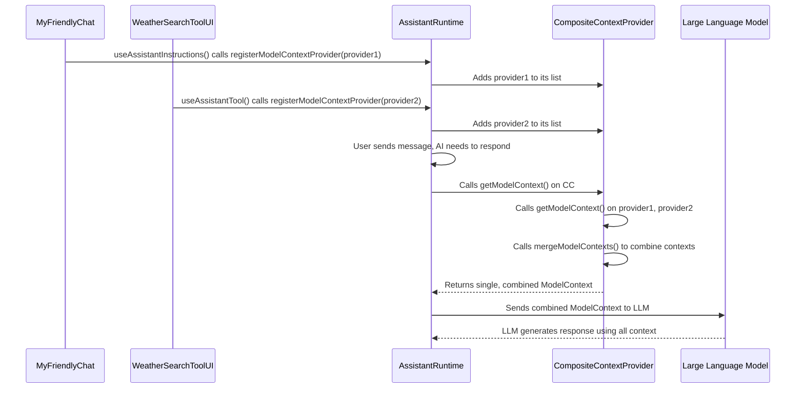
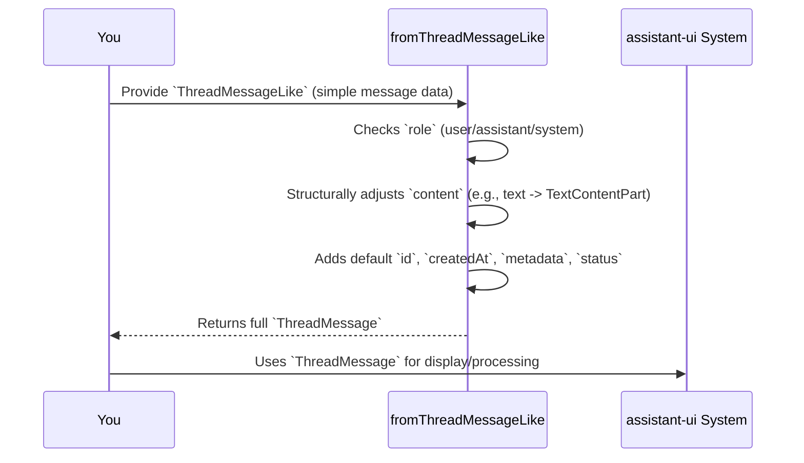
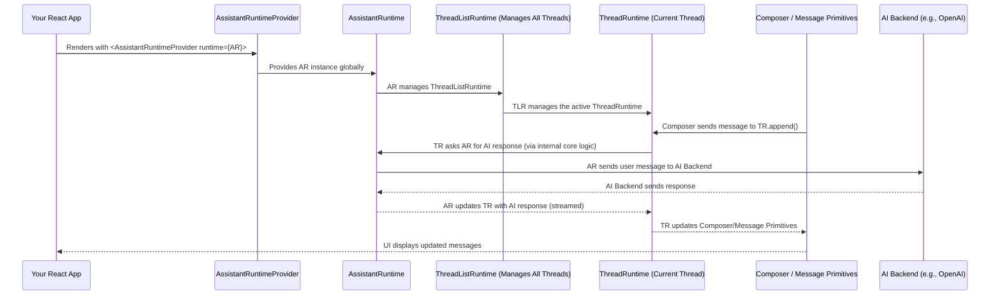
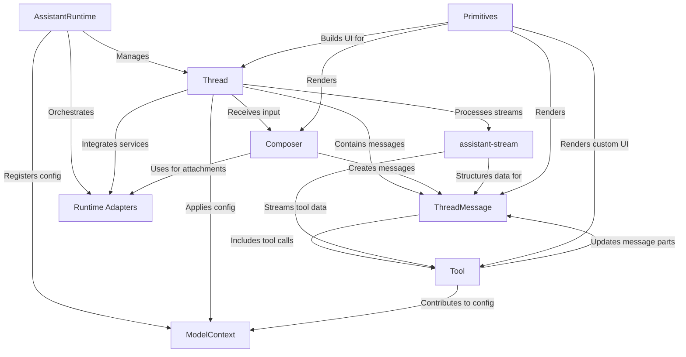
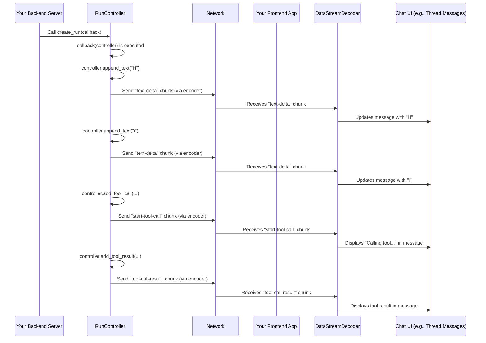
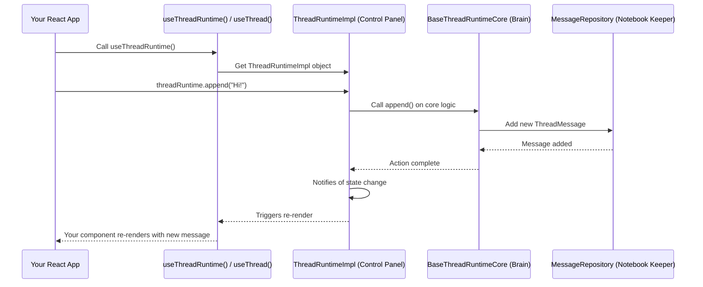
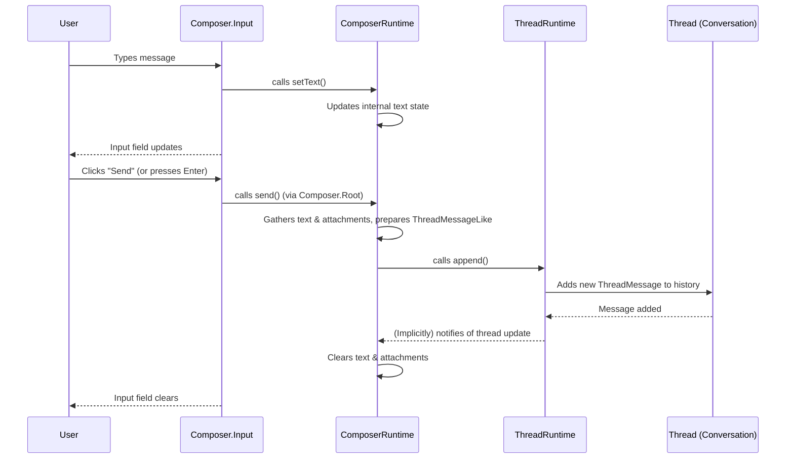
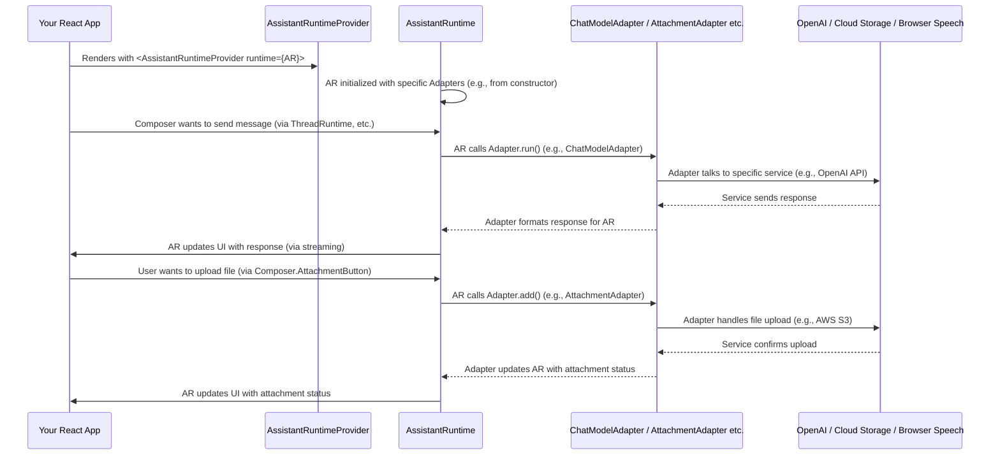
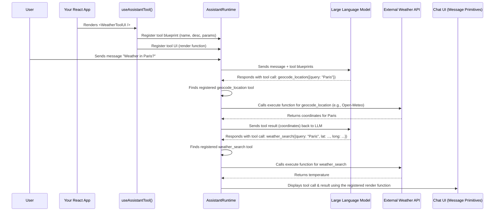

This file is a merged representation of the entire codebase, combining all repository files into a single document.
Generated by Repomix on: 2025-05-28 09:19:17

# File Summary

## Purpose:

This file contains a packed representation of the entire repository's contents.
It is designed to be easily consumable by AI systems for analysis, code review,
or other automated processes.

## File Format:

The content is organized as follows:
1. This summary section
2. Repository information
3. Repository structure
4. Multiple file entries, each consisting of:
   a. A header with the file path (## File: path/to/file)
   b. The full contents of the file in a code block

## Usage Guidelines:

- This file should be treated as read-only. Any changes should be made to the
  original repository files, not this packed version.
- When processing this file, use the file path to distinguish
  between different files in the repository.
- Be aware that this file may contain sensitive information. Handle it with
  the same level of security as you would the original repository.

## Notes:

- Some files may have been excluded based on .gitignore rules and Repomix's
  configuration.
- Binary files are not included in this packed representation. Please refer to
  the Repository Structure section for a complete list of file paths, including
  binary files.

## Additional Information:

For more information about Repomix, visit: https://github.com/andersonby/python-repomix


# Repository Structure

```
07_modelcontext_.md
04_primitives_.md
01_threadmessage_.md
05_assistantruntime_.md
index.md
08_assistant_stream_.md
02_thread_.md
03_composer_.md
09_runtime_adapters_.md
06_tool_.md
```

# Repository Files


## 07_modelcontext_.md

````markdown
# Chapter 7: ModelContext

Welcome back! In [Chapter 6: Tool](06_tool_.md), we learned how to empower your AI assistant with special abilities called `Tool`s, allowing it to perform actions and interact with your application or external services. We saw that `useAssistantTool` is how you tell `assistant-ui` about these new tools.

Now, imagine your chat application is growing. You might have:
*   A general welcome message for the AI (a "system" instruction).
*   A specific page where the AI needs to know about "weather tools."
*   Another section where the AI needs to be told about "calendar tools."
*   And maybe a global setting that dictates how "creative" the AI should be (`temperature`).

How do all these different parts of your React application contribute their specific instructions and settings to the *same* AI model, ensuring the AI always gets the full, combined picture? This is precisely the problem that **`ModelContext`** solves!

## What Problem Does `ModelContext` Solve?

Think of `ModelContext` as a **shared instruction manual** for your AI. Different parts of your application (components) can each write a section in this manual. When the AI is about to generate a response, `assistant-ui` gathers *all* these sections, combines them into one complete manual, and hands it to the AI.

Without `ModelContext`, it would be difficult for different parts of your application to contribute specific behaviors or capabilities to the AI. You'd have to manually collect all these settings, which quickly becomes messy and error-prone.

Our central use case for this chapter is: **How can different React components dynamically provide configuration settings, like system messages, available tools, and AI parameters (e.g., `temperature`), to the underlying LLM in a combined and organized way?** `ModelContext` is the answer. It's the mechanism that gathers all relevant information for the AI, no matter where it's defined in your React component tree.

## Key Concepts of `ModelContext`

Let's break down the essential ideas behind `ModelContext`:

### 1. The "Combined Instruction Manual" (`ModelContext`)

At its heart, `ModelContext` is a simple object that holds all the configuration settings for the LLM. It includes:
*   **`system`**: General instructions or a "personality" for the AI (e.g., "You are a helpful assistant."). If multiple components provide system messages, they are combined!
*   **`tools`**: A list of all available `Tool`s that the AI can use (like our `weather_search` tool from the last chapter).
*   **`callSettings`**: Specific parameters for how the AI should generate text, such as `temperature` (how creative/random the output is) or `maxTokens` (the maximum length of the response).
*   **`config`**: General model configuration, like API keys or base URLs.

This `ModelContext` object is the final, complete set of instructions that `assistant-ui` sends to your AI model.

### 2. "Contributing a Section" (`ModelContextProvider`)

Since different components contribute, `assistant-ui` needs a way for them to "register" their piece of the `ModelContext`. This is done via a `ModelContextProvider`. It's an object that knows *how* to provide its specific part of the `ModelContext`. It simply has a `getModelContext()` function that returns a `ModelContext` object (or just a part of it, like only the `system` property).

### 3. "Registering Your Section" (`registerModelContextProvider`)

To make your `ModelContextProvider` known to the system, you call `assistantRuntime.registerModelContextProvider()`. This function tells the `AssistantRuntime` (the main brain of your chat app) about your component's contribution.

### 4. "Merging the Sections" (`mergeModelContexts`)

When the AI needs to generate a response, `assistant-ui` internally takes all the `ModelContextProvider`s that have been registered and calls their `getModelContext()` function. Then, it uses a special function called `mergeModelContexts` to combine all these individual `ModelContext` objects into one single, comprehensive `ModelContext` that is sent to the LLM.

*   **How merging works:**
    *   **`system` messages:** They are typically concatenated (joined together) with line breaks. This means you can add to the AI's general instructions from different places.
    *   **`tools`:** Tools are added to a single list. *Important*: You cannot have two different tools with the same `toolName`! If you try, `assistant-ui` will throw an error because it wouldn't know which one to use.
    *   **`callSettings` and `config`**: These are merged, with later-defined properties overriding earlier ones (though `priority` can influence this for advanced cases).

## Putting It All Together: Using `ModelContext` in Your App

You won't typically interact directly with `ModelContext` or `ModelContextProvider` types very often. Instead, `assistant-ui` provides convenient hooks that *internally* use this mechanism. We already saw one such hook in [Chapter 6: Tool](06_tool_.md): `useAssistantTool`. Another common one is `useAssistantInstructions`.

Let's see how `useAssistantInstructions` uses `ModelContext` to set a system message for the AI:

```typescript
import { useAssistantInstructions } from "@assistant-ui/react";
import { Composer, Thread } from "@assistant-ui/react/primitives"; // For UI

function MyFriendlyChat() {
  // This component adds a system instruction to the AI's ModelContext
  useAssistantInstructions("You are a super friendly assistant.");

  return (
    <div style={{ height: '400px', display: 'flex', flexDirection: 'column' }}>
      <Thread.Root style={{ flexGrow: 1, overflowY: 'auto' }}>
        <Thread.Messages />
      </Thread.Root>
      <Composer.Root style={{ padding: '10px' }}>
        <Composer.Input placeholder="Say something friendly!" />
        <Composer.SendButton>Send</Composer.SendButton>
      </Composer.Root>
    </div>
  );
}
```

In this example:
*   `useAssistantInstructions("You are a super friendly assistant.")` is called within `MyFriendlyChat`.
*   Internally, `useAssistantInstructions` creates a `ModelContextProvider` that provides `{ system: "You are a super friendly assistant." }` as its `ModelContext`.
*   It then calls `assistantRuntime.registerModelContextProvider()` to register this provider.
*   Now, whenever the AI needs to generate a response, this "friendly assistant" instruction will be part of the `ModelContext` given to the LLM.

What if you have another component that also contributes a system instruction, or a tool?

```tsx
import { useAssistantInstructions } from "@assistant-ui/react";
import { WeatherSearchToolUI } from "./weather-tool"; // Our tool from Chapter 6
import { AssistantRuntimeProvider } from "@assistant-ui/react";
import { Core } from "@assistant-ui/react/runtimes";
import { Composer, Thread } from "@assistant-ui/react/primitives";

const myAssistantRuntime = new Core.AssistantRuntime();

function MyAppComponents() {
  return (
    <>
      {/* Component 1: Sets a general friendly instruction */}
      <MyFriendlyChat />

      {/* Component 2: Registers the weather tool (which internally uses ModelContext) */}
      <WeatherSearchToolUI />

      {/* Another component could set a global temperature: */}
      <SetGlobalAITemperature />
    </>
  );
}

function SetGlobalAITemperature() {
  // This hook also internally registers a ModelContextProvider
  // for AI call settings (conceptually, not a real hook in assistant-ui)
  useAssistantInstructions("Set AI temperature to 0.7"); // Simplified for concept
  // A real hook would look like: useAICallSettings({ temperature: 0.7 });
  return null;
}

function App() {
  return (
    <AssistantRuntimeProvider runtime={myAssistantRuntime}>
      <MyAppComponents />
    </AssistantRuntimeProvider>
  );
}
```
In this combined example:
*   `MyFriendlyChat` provides a system message.
*   `WeatherSearchToolUI` provides the `weather_search` tool.
*   `SetGlobalAITemperature` (conceptually) provides a `callSettings` like `temperature`.

When the AI is asked a question, `assistant-ui`'s `AssistantRuntime` will:
1.  Collect the `ModelContext` from `MyFriendlyChat` (`{ system: "You are a super friendly assistant." }`).
2.  Collect the `ModelContext` from `WeatherSearchToolUI` (`{ tools: { weather_search: ... } }`).
3.  Collect the `ModelContext` from `SetGlobalAITemperature` (`{ callSettings: { temperature: 0.7 } }`).
4.  Merge all of them into a single `ModelContext` that looks something like:
    ```json
    {
      "system": "You are a super friendly assistant.",
      "tools": {
        "weather_search": { /* ... tool definition ... */ }
      },
      "callSettings": {
        "temperature": 0.7
      }
    }
    ```
This final, combined `ModelContext` is then sent to the LLM, giving it all the necessary context and capabilities to respond intelligently.

## How `ModelContext` Works Internally (A Peek Behind the Scenes)

When different components in your React application call `useAssistantInstructions` or `useAssistantTool`, they are all, behind the scenes, using the `ModelContext` system.

Imagine the `AssistantRuntime` having a special "collection basket" (`CompositeContextProvider`).

1.  **Component "Registers":** When your `MyFriendlyChat` component renders, its `useAssistantInstructions` hook creates a `ModelContextProvider` and adds it to the `AssistantRuntime`'s "collection basket" using `registerModelContextProvider`.
2.  **Tool "Registers":** Similarly, when `WeatherSearchToolUI` renders, its `useAssistantTool` hook also creates a `ModelContextProvider` (containing the tool definition) and adds it to the *same* "collection basket."
3.  **AI Needs Context:** When it's time for the AI to respond, the `AssistantRuntime` goes to its "collection basket."
4.  **Basket Combines:** The "collection basket" (`CompositeContextProvider`) takes all the individual `ModelContextProvider`s inside it, asks each one for its `ModelContext` (its "section of the manual"), and then uses `mergeModelContexts` to combine them into one master `ModelContext`.
5.  **Master Manual to AI:** This master `ModelContext` is then handed to the LLM, giving it all the instructions, tools, and settings it needs.

Here's a simple diagram to visualize this:



### Diving a Bit Deeper into the Code

The main types for `ModelContext` are defined in `packages/react/src/model-context/ModelContextTypes.ts`:

```typescript
// Simplified from packages/react/src/model-context/ModelContextTypes.ts
export type LanguageModelV1CallSettings = {
  temperature?: number; // How creative the AI is
  maxTokens?: number;   // Max length of AI response
  // ... other settings
};

export type ModelContext = {
  priority?: number | undefined; // For advanced merging rules
  system?: string | undefined;   // General instructions
  tools?: Record<string, Tool<any, any>> | undefined; // Available tools
  callSettings?: LanguageModelV1CallSettings | undefined; // AI generation parameters
  config?: { /* API key, base URL etc. */ } | undefined;
};

export type ModelContextProvider = {
  getModelContext: () => ModelContext; // Function to get the context
  subscribe?: (callback: () => void) => Unsubscribe; // For dynamic updates
};

export const mergeModelContexts = (
  configSet: Set<ModelContextProvider>,
): ModelContext => {
  const configs = Array.from(configSet)
    .map((c) => c.getModelContext()) // Get context from each provider
    .sort((a, b) => (b.priority ?? 0) - (a.priority ?? 0)); // Sort by priority

  return configs.reduce((acc, config) => {
    if (config.system) {
      if (acc.system) {
        acc.system += `\n\n${config.system}`; // Concatenate system messages
      } else {
        acc.system = config.system;
      }
    }
    if (config.tools) {
      for (const [name, tool] of Object.entries(config.tools)) {
        if (acc.tools?.[name] && acc.tools[name] !== tool) {
          // Error if tool name is duplicated!
          throw new Error(`You tried to define a tool with the name ${name}, but it already exists.`);
        }
        if (!acc.tools) acc.tools = {};
        acc.tools[name] = tool; // Add tool
      }
    }
    // ... similar merging logic for callSettings and config
    return acc;
  }, {} as ModelContext);
};
```
The `mergeModelContexts` function is crucial here. It iterates through all provided `ModelContext`s and combines them according to the rules (e.g., concatenating `system` messages, checking for duplicate `tool` names).

The "collection basket" we talked about is actually implemented by a class called `CompositeContextProvider` in `packages/react/src/utils/CompositeContextProvider.ts`. This class is used internally by the `AssistantRuntime` to manage all the registered `ModelContextProvider`s.

```typescript
// Simplified from packages/react/src/utils/CompositeContextProvider.ts
import { type ModelContextProvider, mergeModelContexts } from "../model-context/ModelContextTypes";

export class CompositeContextProvider implements ModelContextProvider {
  private _providers = new Set<ModelContextProvider>(); // Stores all registered providers

  getModelContext() {
    return mergeModelContexts(this._providers); // Calls the merging function
  }

  registerModelContextProvider(provider: ModelContextProvider) {
    this._providers.add(provider); // Add new provider to the set
    // Optionally subscribe to changes from the provider if it's dynamic
    const unsubscribe = provider.subscribe?.(() => {
      this.notifySubscribers(); // Tell listeners (like AssistantRuntime) about updates
    });
    this.notifySubscribers(); // Notify immediately after adding
    return () => { // Return a cleanup function
      this._providers.delete(provider); // Remove provider when it's no longer needed
      unsubscribe?.();
      this.notifySubscribers();
    };
  }

  // ... (methods for notifying subscribers about changes)
}
```
This `CompositeContextProvider` is essentially what the `AssistantRuntime` uses. When your `useAssistantInstructions` or `useAssistantTool` hook calls `assistantRuntime.registerModelContextProvider(...)`, it's ultimately adding your `ModelContextProvider` to this `CompositeContextProvider`'s internal `_providers` set.

## Conclusion

In this chapter, you've learned that `ModelContext` is the powerful mechanism that allows different parts of your `assistant-ui` application to dynamically contribute configuration settings to the underlying LLM. You saw how `ModelContext` bundles instructions, tools, and parameters, and how `ModelContextProvider`s allow individual components to provide their slice of this context. Finally, you understood how `assistant-ui` internally uses `registerModelContextProvider` and `mergeModelContexts` to combine all these contributions into a single, comprehensive "instruction manual" for your AI.

Now that you understand how AI models are configured, the next step is to dive into the core technology that powers the conversation with these models: `assistant-stream`.

[Chapter 8: assistant-stream](08_assistant_stream_.md)

---

Generated by [AI Codebase Knowledge Builder](https://github.com/The-Pocket/Tutorial-Codebase-Knowledge)
````

## 04_primitives_.md

````markdown
# Chapter 4: Primitives

Welcome back! In our journey through `assistant-ui`, we've explored the core concepts that power your chat application:
*   [Chapter 1: ThreadMessage](01_threadmessage_.md) taught us about the standardized "package" for each piece of conversation.
*   [Chapter 2: Thread](02_thread_.md) showed us how these messages are organized into a complete conversation history, even with branching.
*   [Chapter 3: Composer](03_composer_.md) explained how users input messages and send them into the `Thread`.

Now, you might be thinking: "This is great, but how do I actually *display* all of this in my React app? How do I make the chat look exactly how I want, with my own styles and branding?"

This is where the concept of **`Primitives`** comes in!

## What Problem Do `Primitives` Solve?

Imagine you're building a chat application, and you want its user interface (UI) to look unique – maybe it has rounded corners, a specific font, or a custom "send" button icon. If `assistant-ui` only provided one giant, pre-styled "Chat Component," you'd be stuck with its default look. Making changes would be difficult, if not impossible.

The central problem `Primitives` solve is providing the **foundational, unstyled building blocks** for your chat UI. They give you all the core logic and accessibility features you need (like sending messages, handling attachments, or displaying AI responses) without dictating how they *look*.

Think of `Primitives` like high-quality LEGO bricks. Each brick (a `Primitive`) has a specific function and connects perfectly with other bricks, but it's up to *you* to choose the colors, sizes, and how you arrange them to build your unique structure (your chat interface).

Our central use case for this chapter is: **How can I build a chat UI with a custom-designed message input area (composer) and message display, while still leveraging `assistant-ui`'s powerful backend logic (like sending messages and managing history)?** `Primitives` are the answer.

## Key Concepts of `Primitives`

Let's break down what `Primitives` are all about:

### 1. Foundational, Unstyled Components

`Primitives` are React components that provide the "brains" but not the "beauty." They handle the underlying logic and accessibility features for elements like input fields, buttons, and message containers. This means they connect to the `assistant-ui` runtime (like `ComposerRuntime` or `ThreadRuntime`) to perform actions or read state, but they don't apply any visual styles themselves. You are free to style them with CSS frameworks like Tailwind CSS, Emotion, or plain CSS.

### 2. Small, Composable Building Blocks

Instead of a single, monolithic "chat component," `assistant-ui` provides many small, focused `Primitives`. For example, instead of one "Composer" component, you get:
*   `<Composer.Root>` (the form container)
*   `<Composer.Input>` (the text area)
*   `<Composer.SendButton>` (the send button)
*   `<Composer.AttachmentButton>` (the button for adding files)

This allows you to combine them in any layout you desire and only use the parts you need.

### 3. Core Logic & Accessibility Features

This is the magic! Even though they are unstyled, `Primitives` come packed with functionality.
*   `<Composer.Input>` automatically connects to the composer's text state and updates it as the user types.
*   `<Composer.SendButton>` (or a submit button inside `Composer.Root`) triggers the `send` action on the `ComposerRuntime`.
*   `<Message.Root>` automatically handles hover states for its message.

They also ensure essential accessibility features are built-in, like proper ARIA attributes and keyboard navigation, saving you a lot of effort.

### 4. Namespaced Exports

`Primitives` are often grouped logically using JavaScript object namespaces. This makes it easy to find related components. For example, all `Composer` related primitives are exported under the `Composer` object:

```typescript
// From packages/react/src/primitives/index.ts
export * as ComposerPrimitive from "./composer";
export * as MessagePrimitive from "./message";
export * as ThreadPrimitive from "./thread";
// ... and many more
```
When you import them, you'd typically do: `import { Composer } from "@assistant-ui/react/primitives";` and then use them like `<Composer.Root>`, `<Composer.Input>`, etc.

## Putting It All Together: Using `Primitives` in Your App

Let's revisit our `Composer` example from [Chapter 3: Composer](03_composer_.md), but now focusing on how we use `Primitives` to build it:

```tsx
import { Composer, Message } from "@assistant-ui/react/primitives"; // Primitives components
import { useComposer } from "@assistant-ui/react"; // Hook to read Composer state

function MyCustomChatUI() {
  const composerState = useComposer(); // Get current state of the composer

  return (
    <div>
      {/* Imagine messages are rendered here using Message Primitives */}
      {/* For example:
      <Message.Root>
        <Message.Content>
          <Message.Text />
        </Message.Content>
      </Message.Root>
      */}

      {/* This is our custom Composer section using Primitives */}
      <Composer.Root className="flex p-4 border-t border-gray-200">
        <Composer.Input
          className="flex-grow p-2 border rounded-lg focus:outline-none"
          placeholder="Type your message..."
        />
        <button
          type="submit"
          className="ml-2 px-4 py-2 bg-blue-500 text-white rounded-lg disabled:opacity-50"
          disabled={composerState.isEmpty}
        >
          Send Custom
        </button>
      </Composer.Root>
    </div>
  );
}
```

In this example:
*   We import `Composer` and `Message` from `@assistant-ui/react/primitives`. These are our unstyled "LEGO bricks."
*   `Composer.Root` acts as the `form` container. We've added Tailwind CSS classes like `flex`, `p-4`, `border-t` directly to it to control its layout and appearance.
*   `Composer.Input` is our text area. It's styled with `flex-grow`, `p-2`, `border`, `rounded-lg`, etc., to give it a custom look. Even with these custom styles, it still correctly connects to the `ComposerRuntime` to manage the text content.
*   Our `button` uses `type="submit"` which, because it's inside `Composer.Root`, automatically triggers the message sending logic when clicked. We've given it custom styles like `bg-blue-500`, `text-white`, and `rounded-lg`.
*   `composerState.isEmpty` (from `useComposer()` hook) is used to disable the button, ensuring the `Send Custom` button only works when there's text.

This demonstrates how `Primitives` allow you to fully control the visual design while `assistant-ui` handles the underlying chat logic.

## How `Primitives` Work Internally (A Peek Behind the Scenes)

`assistant-ui`'s `Primitives` are heavily inspired by libraries like [Radix UI](https://www.radix-ui.com/). The core idea is to wrap a basic HTML element (like a `div`, `form`, or `textarea`) and inject `assistant-ui`'s logic using React hooks, without adding any default styles.

Imagine a `Primitive` component working like a skilled artisan:

1.  **You Provide a Basic Material:** You give the artisan a plain HTML element (e.g., `<div />` for `Message.Root`, `<textarea />` for `Composer.Input`).
2.  **The Artisan Attaches Tools (`useComposer`, `useComposerRuntime`):** The `Primitive` component internally uses `assistant-ui`'s hooks to connect to the necessary chat logic (e.g., reading composer text, sending messages).
3.  **The Artisan Adds Invisible Features (Accessibility):** It automatically adds important accessibility attributes (like `aria-live` for announcements or `role` attributes) to make the component usable for everyone, including those using screen readers.
4.  **The Artisan Gives it Back for Your Design:** The `Primitive` returns the original HTML element, but now it's "enhanced" with all the necessary logic and accessibility. You can then apply any CSS classes or styles to it to make it look exactly how you want.

Here's a simple diagram for a `Composer.Root` primitive:

```mermaid
sequenceDiagram
    participant YourComponent as Your React Component
    participant ComposerRoot as <Composer.Root>
    participant UseComposerSend as useComposerSend() Hook
    participant ComposerRT as ComposerRuntime

    YourComponent->>ComposerRoot: Renders <Composer.Root className="my-styles">
    ComposerRoot->>UseComposerSend: Internally calls useComposerSend()
    UseComposerSend->>ComposerRT: Gets the send() function
    ComposerRoot->>ComposerRoot: Wraps a <form> element
    ComposerRoot->>YourComponent: Returns the styled <form> element
    YourComponent->>YourComponent: User clicks submit button inside the form
    ComposerRoot->>ComposerRT: Calls the send() function from ComposerRuntime
    ComposerRT->>ComposerRT: Handles message logic (prepares ThreadMessage, appends to Thread)
```



### Diving a Bit Deeper into the Code

Let's look at how a `Primitive` like `Composer.Root` is structured internally. As seen in [Chapter 3: Composer](03_composer_.md), it uses `forwardRef` (to allow you to pass a ref to the underlying HTML element) and wraps a `Primitive.form` from `@radix-ui/react-primitive`.

```typescript
// Simplified from packages/react/src/primitives/composer/ComposerRoot.tsx
import { composeEventHandlers } from "@radix-ui/primitive";
import { Primitive } from "@radix-ui/react-primitive"; // A base component from Radix UI
import {
  type ComponentRef,
  type FormEvent,
  forwardRef,
  ComponentPropsWithoutRef,
} from "react";
import { useComposerSend } from "./ComposerSend"; // A helper hook for sending

export namespace ComposerPrimitiveRoot {
  export type Element = ComponentRef<typeof Primitive.form>;
  export type Props = ComponentPropsWithoutRef<typeof Primitive.form>;
}

export const ComposerPrimitiveRoot = forwardRef<
  ComposerPrimitiveRoot.Element,
  ComposerPrimitiveRoot.Props
>(({ onSubmit, ...rest }, forwardedRef) => {
  // This hook gets the 'send' function from the ComposerRuntime
  const send = useComposerSend();

  const handleSubmit = (e: FormEvent) => {
    e.preventDefault(); // Stop default form submission (page reload)

    if (!send) return; // If no send function, do nothing
    send(); // Call the send function when the form is submitted
  };

  return (
    // Primitive.form is essentially a <form> element with Radix's utility features
    <Primitive.form
      {...rest} // Pass all other props (like your `className`)
      ref={forwardedRef} // Allow ref forwarding
      // Combine your onSubmit handler with the internal handleSubmit
      onSubmit={composeEventHandlers(onSubmit, handleSubmit)}
    />
  );
});

ComposerPrimitiveRoot.displayName = "ComposerPrimitive.Root";
```

Here's a breakdown:
*   `Primitive.form`: This is the base HTML `<form>` element provided by Radix UI. It acts as a blank canvas.
*   `useComposerSend()`: This is a custom hook that internally accesses the `ComposerRuntime` and provides the `send` function. This is how the `Primitive` gets its "brains."
*   `handleSubmit`: This function prevents the browser's default form submission behavior (which would reload the page) and then calls the `send()` function obtained from `useComposerSend()`.
*   `composeEventHandlers`: This utility allows `assistant-ui` to provide its own `onSubmit` logic while still letting you add your custom `onSubmit` handler if needed.

Similarly, other `Primitives` like `Message.Root` wrap a `Primitive.div` and inject logic, such as tracking hover states:

```typescript
// Simplified from packages/react/src/primitives/message/MessageRoot.tsx
import { Primitive } from "@radix-ui/react-primitive";
import {
  type ComponentRef,
  forwardRef,
  ComponentPropsWithoutRef,
  useCallback,
} from "react";
import { useMessageUtilsStore } from "../../context/react/MessageContext";
import { useManagedRef } from "../../utils/hooks/useManagedRef";
import { useComposedRefs } from "@radix-ui/react-compose-refs";

// This hook sets a hover state on the message when the mouse enters/leaves
const useIsHoveringRef = () => {
  const messageUtilsStore = useMessageUtilsStore();
  const callbackRef = useCallback(
    (el: HTMLElement) => {
      const setIsHovering = messageUtilsStore.getState().setIsHovering;

      const handleMouseEnter = () => { setIsHovering(true); };
      const handleMouseLeave = () => { setIsHovering(false); };

      el.addEventListener("mouseenter", handleMouseEnter);
      el.addEventListener("mouseleave", handleMouseLeave);

      return () => { // Cleanup function when component unmounts
        el.removeEventListener("mouseenter", handleMouseEnter);
        el.removeEventListener("mouseleave", handleMouseLeave);
        setIsHovering(false);
      };
    },
    [messageUtilsStore],
  );

  return useManagedRef(callbackRef);
};

export namespace MessagePrimitiveRoot { /* ... types ... */ }

export const MessagePrimitiveRoot = forwardRef<
  MessagePrimitiveRoot.Element,
  MessagePrimitiveRoot.Props
>((props, forwardRef) => {
  // Use the custom hover tracking hook
  const isHoveringRef = useIsHoveringRef();
  // Combine the internal ref with any ref passed by the user
  const ref = useComposedRefs<HTMLDivElement>(forwardRef, isHoveringRef);

  return <Primitive.div {...props} ref={ref} />;
});

MessagePrimitiveRoot.displayName = "MessagePrimitive.Root";
```
As you can see, `Primitives` are simple wrappers around standard HTML elements that use `assistant-ui`'s hooks to bring in the necessary chat logic and accessibility features. This design empowers you to create truly custom chat UIs without sacrificing functionality.

## Conclusion

In this chapter, you've learned that `Primitives` are the foundational, unstyled React components provided by `assistant-ui`. They give you the core logic and accessibility features for your chat UI, acting as flexible building blocks that you can combine and style with any CSS framework to create completely custom chat interfaces. You saw how they are typically imported using namespaces (e.g., `Composer.Root`) and how they internally leverage `assistant-ui`'s hooks to connect to the underlying chat logic.

Now that you understand the UI building blocks, the next logical step is to dive into the core engine that powers the AI interactions: the `AssistantRuntime`.

[Chapter 5: AssistantRuntime](05_assistantruntime_.md)

---

Generated by [AI Codebase Knowledge Builder](https://github.com/The-Pocket/Tutorial-Codebase-Knowledge)
````

## 01_threadmessage_.md

````markdown
# Chapter 1: ThreadMessage

Welcome to the exciting world of `assistant-ui`! In this first chapter, we're going to dive into the most fundamental building block of any conversation within `assistant-ui`: the **`ThreadMessage`**.

## What Problem Does `ThreadMessage` Solve?

Imagine you're building a super cool AI chat application, just like the ones you use every day. In this app, you (the user) send messages to an AI assistant, and the AI assistant sends replies back to you.

Sounds simple, right? But what if:
*   Your message isn't just text, but also includes an image?
*   The AI's reply isn't just text, but also has a "tool call" (like asking to look up the weather) or a "reasoning" step?
*   You need to know if the AI is still "typing" its response or if it has finished?
*   You want to add some secret, extra data to a message that only your app cares about?

This is where `ThreadMessage` comes in! It's like a special, standardized "container" or "package" for *every single piece of communication* in your chat. Whether it's you talking, the AI talking, or even a hidden system prompt, `ThreadMessage` makes sure all these different types of messages are structured in a consistent way. This consistency is super important because it makes it easy for `assistant-ui` to display these messages, manage their states, and process them behind the scenes.

Think of it like standardized shipping boxes: no matter if you're sending books, clothes, or electronics, they all go into a specific type of box, making it easy for the post office to handle them. `ThreadMessage` is that standardized box for your chat messages!

## Key Concepts of `ThreadMessage`

Let's break down the essential parts of a `ThreadMessage`:

### 1. Who is Talking? (The `role`)

Every message in a conversation needs to know who sent it. In `assistant-ui`, a `ThreadMessage` has a `role` property, which can be one of three types:

*   **`"user"`**: This is for messages you send to the AI.
*   **`"assistant"`**: This is for messages the AI sends back to you.
*   **`"system"`**: These are special messages that aren't usually shown to the user. They often contain instructions or context for the AI that help it understand the conversation better.

### 2. What's in the Message? (The `content`)

The `content` property is where the actual message data lives. This is where `ThreadMessage` gets really powerful because it can hold many different kinds of information, not just plain text! This is why `content` is an array of "content parts".

For example:
*   A user message might have a `text` part (e.g., "What's the weather?") and an `image` part (a picture they uploaded).
*   An assistant message might have a `text` part (e.g., "The weather is sunny!") and a `tool-call` part (e.g., "I used the weather tool to find that out").

Here are some common `content` part types you'll encounter:

*   **`TextContentPart`**: For plain text messages.
*   **`ImageContentPart`**: For images sent by the user.
*   **`ToolCallContentPart`**: For actions the AI wants to perform (like calling a function or an external service).
*   **`ReasoningContentPart`**: For the AI's internal thought process (often hidden or shown in a special debug view).

### 3. What's Happening with the Message? (The `status`)

Especially for AI assistant messages, it's useful to know their current state. The `status` property (primarily for `assistant` messages) tells you if the AI is still generating its response, if it's waiting for a tool to finish, or if it's completely done.

Common statuses include:
*   `"running"`: The AI is still generating its response.
*   `"requires-action"`: The AI needs to perform a tool call before it can continue.
*   `"complete"`: The AI has finished its response.

### 4. Any Extra Info? (The `metadata`)

The `metadata` property is like a special "notes" section for your message. It's a place where you can store any extra information that your application might need, but isn't part of the main `content` or `status`. This could include things like internal IDs, timestamps, or custom data relevant to your specific app.

## Putting It All Together: Creating a `ThreadMessage`

While `ThreadMessage` itself is a complex structure, `assistant-ui` provides a friendly helper called `ThreadMessageLike` and a function `fromThreadMessageLike` to make creating messages much easier. This lets you provide simpler inputs, and `assistant-ui` will convert them into the full `ThreadMessage` structure.

Let's imagine we want to simulate a simple chat conversation.

First, a user sends a message:

```typescript
import { fromThreadMessageLike } from "@assistant-ui/react/runtimes/external-store";

// Create a user message
const userMessage = fromThreadMessageLike(
  {
    role: "user",
    content: "Hi there! How are you?",
  },
  "user-123", // Unique ID for this message
  { type: "complete", reason: "stop" } // Status (not strictly needed for user message, but good practice)
);

console.log(userMessage);
```

This code snippet takes a simple object describing a user message and transforms it into a full `ThreadMessage` object. The `fromThreadMessageLike` function automatically adds properties like `id`, `createdAt`, and ensures the `content` is correctly structured as an array of `TextContentPart`s.

Next, the AI assistant replies:

```typescript
import { fromThreadMessageLike } from "@assistant-ui/react/runtimes/external-store";

// Create an assistant message
const assistantMessage = fromThreadMessageLike(
  {
    role: "assistant",
    content: "I'm doing great, thanks for asking! How can I help you today?",
    status: { type: "complete", reason: "stop" }, // Important for assistant messages
  },
  "assistant-456", // Unique ID for this message
  { type: "running" } // Fallback status if none is provided
);

console.log(assistantMessage);
```

Notice how the `status` is explicitly set for the assistant message. This is crucial for `assistant-ui` to know if the message is still being generated or is ready to be displayed as final.

## How `ThreadMessage` Works Internally (A Peek Behind the Scenes)

You don't need to be an expert in `assistant-ui`'s internal workings to use `ThreadMessage`, but understanding a little bit about what happens under the hood can be really helpful.

Think of it like this: When you use `fromThreadMessageLike` to create a message, it's like handing a flexible instruction sheet to a highly organized robot.

1.  **Your Instruction ( `ThreadMessageLike`):** You give the robot a simple instruction like, "Make a user message with this text."
2.  **The Robot's Job (`fromThreadMessageLike`):** The robot looks at your instruction. It notices the "role" (e.g., "user") and the "content" (e.g., plain text).
3.  **Standardization:** Based on the role, the robot knows exactly what kind of `ThreadMessage` to build. It ensures all the required fields (`id`, `createdAt`, `metadata`, `attachments` for user messages, `status` for assistant messages) are properly set, even if you didn't provide them all. It also converts your simple text string into a structured `TextContentPart`.
4.  **The Result (`ThreadMessage`):** The robot hands you back a perfectly formatted `ThreadMessage` "package," ready for use anywhere in `assistant-ui`.

Here's a simple diagram to visualize this process:



### Diving a Bit Deeper into the Code

The `ThreadMessage` structure and its related types are defined in files like `packages/react/src/types/AssistantTypes.ts`. This file defines the `ThreadMessage` itself as a combination of `ThreadSystemMessage`, `ThreadUserMessage`, and `ThreadAssistantMessage`:

```typescript
// Simplified version from packages/react/src/types/AssistantTypes.ts
export type ThreadMessage = BaseThreadMessage &
  (ThreadSystemMessage | ThreadUserMessage | ThreadAssistantMessage);

export type ThreadUserMessage = MessageCommonProps & {
  readonly role: "user";
  readonly content: readonly ThreadUserContentPart[];
  // ... other properties
};

export type ThreadAssistantMessage = MessageCommonProps & {
  readonly role: "assistant";
  readonly content: readonly ThreadAssistantContentPart[];
  readonly status: MessageStatus;
  // ... other properties
};

// ... and so on for System messages and content parts
```

And the magic of transforming a `ThreadMessageLike` into a `ThreadMessage` happens in `packages/react/src/runtimes/external-store/ThreadMessageLike.tsx`. The `fromThreadMessageLike` function contains a `switch` statement that handles each `role` differently, ensuring the correct structure and defaults are applied:

```typescript
// Simplified version from packages/react/src/runtimes/external-store/ThreadMessageLike.tsx
export const fromThreadMessageLike = (
  like: ThreadMessageLike,
  fallbackId: string,
  fallbackStatus: MessageStatus,
): ThreadMessage => {
  const { role, id, createdAt, attachments, status, metadata } = like;
  const common = {
    id: id ?? fallbackId,
    createdAt: createdAt ?? new Date(),
  };

  // Convert string content to text part if needed
  const content = typeof like.content === "string" ?
    [{ type: "text" as const, text: like.content }] :
    like.content;

  switch (role) {
    case "assistant":
      return {
        ...common,
        role,
        content: content.map((part): ThreadAssistantContentPart | null => {
          // Logic to transform various content parts for assistant messages
          // e.g., handling 'text', 'tool-call', etc.
          if (part.type === "text") return part;
          if (part.type === "tool-call") return { /* convert tool call */ };
          return null; // or throw error for unsupported types
        }).filter(c => !!c),
        status: status ?? fallbackStatus,
        metadata: { /* default metadata */ },
      } satisfies ThreadAssistantMessage;

    case "user":
      return {
        ...common,
        role,
        content: content.map((part): ThreadUserContentPart => {
          // Logic to transform various content parts for user messages
          if (part.type === "text") return part;
          if (part.type === "image") return part;
          // ...
          throw new Error(`Unsupported user content part type: ${part.type}`);
        }),
        attachments: attachments ?? [],
        metadata: { /* default metadata */ },
      } satisfies ThreadUserMessage;

    case "system":
      // ... similar logic for system messages
      if (content.length !== 1 || content[0]!.type !== "text")
        throw new Error("System messages must have exactly one text content part.");
      return {
        ...common,
        role,
        content: content as [TextContentPart],
        metadata: { custom: metadata?.custom ?? {} },
      } satisfies ThreadSystemMessage;

    default:
      throw new Error(`Unknown message role: ${role}`);
  }
};
```

As you can see, `fromThreadMessageLike` acts as a crucial "constructor" for `ThreadMessage` objects, making sure they always conform to the expected structure of `assistant-ui`.

## Conclusion

In this chapter, you've learned that `ThreadMessage` is the standardized container for all conversational data in `assistant-ui`. You now understand its key components: `role` (who's talking), `content` (what's in the message), `status` (what's happening to it), and `metadata` (extra information). You also got a glimpse of how `fromThreadMessageLike` simplifies creating these messages and how they're structured internally.

Now that you know how individual messages are represented, the next logical step is to understand how these messages come together to form a complete conversation. Get ready to explore the concept of a **`Thread`** in the next chapter!

[Chapter 2: Thread](02_thread_.md)

---

Generated by [AI Codebase Knowledge Builder](https://github.com/The-Pocket/Tutorial-Codebase-Knowledge)
````

## 05_assistantruntime_.md

````markdown
# Chapter 5: AssistantRuntime

Welcome back! So far in our journey through `assistant-ui`:
*   In [Chapter 1: ThreadMessage](01_threadmessage_.md), we learned about the individual "package" for each chat message.
*   In [Chapter 2: Thread](02_thread_.md), we saw how these messages form a complete conversation history, even with different "branches."
*   In [Chapter 3: Composer](03_composer_.md), we explored how users type and send new messages into a `Thread`.
*   And in [Chapter 4: Primitives](04_primitives_.md), we discovered how to use unstyled building blocks to create a beautiful, custom chat user interface.

Now, imagine you have all these pieces. You have messages, conversations, input areas, and display components. But how do they all connect? How do you manage not just one conversation, but potentially *many* conversations? And most importantly, how do you plug in the actual **Artificial Intelligence (AI)** that generates responses?

This is where the **`AssistantRuntime`** comes in!

## What Problem Does `AssistantRuntime` Solve?

Think of `AssistantRuntime` as the **main control panel** or the **central brain** of your entire chat application. It sits at the highest level, overseeing everything.

Without `AssistantRuntime`, your `Threads`, `Composers`, and `Primitives` would be like well-made car parts scattered on a garage floor. They're all good parts, but they can't work together to drive anywhere. `AssistantRuntime` is like the car's engine and dashboard combined – it powers everything and lets you control the whole vehicle.

The central use case for `AssistantRuntime` is: **How do I connect my entire `assistant-ui` chat application to my AI backend (e.g., OpenAI, Anthropic, or a custom one) and manage the overall behavior, including switching between different conversations?** `AssistantRuntime` is the answer. It's the glue that holds your AI chat experience together.

## Key Concepts of `AssistantRuntime`

Let's break down the essential roles of `AssistantRuntime`:

### 1. The Central Orchestrator

`AssistantRuntime` is the "big boss." It's responsible for managing the overall state and behavior of your entire chat application. All other `assistant-ui` components (like `Thread`, `Composer`, etc.) ultimately get their instructions or data from here.

### 2. Managing All Threads (Conversations)

While a `Thread` (from [Chapter 2: Thread](02_thread_.md)) manages *one* conversation, `AssistantRuntime` manages *all* of your `Threads`. It allows you to switch between different conversations, start new ones, or even access a list of past chats. This is particularly useful if your application needs to handle multiple chat sessions for a single user.

### 3. Connecting to Your AI Backend

This is a crucial role! `AssistantRuntime` is the place where you "plug in" your actual AI service. It acts as the bridge between `assistant-ui`'s frontend components and your powerful AI model (or a service that uses it). When a user sends a message, `AssistantRuntime` ensures it gets sent to your AI, and when the AI responds, `AssistantRuntime` helps display that response back to the user. We'll dive deeper into how this connection works with "Runtime Adapters" in a later chapter.

### 4. Global Configuration and Capabilities

`AssistantRuntime` also allows you to set up global configurations, such as how the AI behaves (e.g., system prompts, temperature settings), or what special "tools" the AI can use. It provides this information globally to all parts of your chat application.

## Putting It All Together: Using `AssistantRuntime` in Your App

You provide `AssistantRuntime` to your `assistant-ui` application using the `<AssistantRuntimeProvider>`. This component wraps your entire chat UI and makes the `AssistantRuntime` instance available to all the hooks and primitives within it.

Here’s a very basic example of how you'd set this up in your React application:

```tsx
import { AssistantRuntimeProvider } from "@assistant-ui/react";
import { useAssistantRuntime } from "@assistant-ui/react"; // To access the runtime
import { Core } from "@assistant-ui/react/runtimes"; // Example runtime import

// Create a dummy AssistantRuntime instance for demonstration
// In a real app, you'd use a specific runtime adapter (e.g., from AI SDK)
const myAssistantRuntime = new Core.AssistantRuntime();

function MyChatApp() {
  // You can access the AssistantRuntime anywhere inside the provider
  const runtime = useAssistantRuntime();

  console.log("Current active thread ID:", runtime.thread.id);
  console.log("Number of threads:", runtime.threads.list.length);

  // In a real application, you would render your chat UI here.
  // This UI would use Thread, Composer, and Message Primitives
  // which automatically connect to the runtime provided here.
  return (
    <div>
      <h1>My Super AI Chat</h1>
      <button onClick={() => runtime.threads.switchToNewThread()}>
        Start New Chat
      </button>
      {/* ... Your actual chat UI components go here ... */}
    </div>
  );
}

function App() {
  return (
    // We wrap our entire chat application with the AssistantRuntimeProvider
    // and pass our 'myAssistantRuntime' instance to it.
    <AssistantRuntimeProvider runtime={myAssistantRuntime}>
      <MyChatApp />
    </AssistantRuntimeProvider>
  );
}

export default App;
```

In this example:
*   We create an instance of `AssistantRuntime` (here, a `Core.AssistantRuntime` for simplicity, but you'd use a more specialized "Runtime Adapter" in a real app).
*   We wrap our `MyChatApp` component with `<AssistantRuntimeProvider runtime={myAssistantRuntime}>`. This makes `myAssistantRuntime` globally available to all `assistant-ui` components inside `MyChatApp`.
*   Inside `MyChatApp`, we use the `useAssistantRuntime()` hook to get access to the runtime instance.
*   We can then use methods like `runtime.threads.switchToNewThread()` to control the overall chat experience.

When the user types a message in a `Composer` (which you would render inside `MyChatApp`), the `Composer` will internally talk to the `ThreadRuntime` (which is part of the `AssistantRuntime`), which then talks to the AI backend connected through the `AssistantRuntime`. Everything works together seamlessly!

## How `AssistantRuntime` Works Internally (A Peek Behind the Scenes)

To understand `AssistantRuntime` better, imagine it as the CEO of a company. The CEO (`AssistantRuntime`) doesn't do every job personally, but they oversee all departments and ensure everything runs smoothly.

1.  **The CEO's Office (`AssistantRuntimeProvider`):** When you put your chat app inside `<AssistantRuntimeProvider>`, it's like setting up the CEO's main office. This office makes the CEO available to everyone in the company.
2.  **The CEO (`AssistantRuntimeImpl`):** This is the actual object that manages everything. It has direct connections to key departments:
    *   **The "Conversation Department" (`ThreadListRuntime`):** This department handles all the individual [Threads](02_thread_.md) (conversations). The CEO delegates all thread-related tasks here (like switching threads, getting a list of threads).
    *   **The "Current Conversation Manager" (`ThreadRuntime`):** This is a direct line to the *currently active* conversation, making it easy to send messages or start AI replies in the chat the user is currently viewing.
    *   **The "AI Intelligence Department" (`AssistantRuntimeCore`):** This is where the connection to your actual AI backend lives. The CEO passes user requests to this department, and this department sends back AI responses.
3.  **The Components Get What They Need:** When a component like `<Composer.Root>` needs to send a message, it asks the `ThreadRuntime` (which is under the CEO's umbrella) to `append` the message. The `ThreadRuntime` then eventually uses the "AI Intelligence Department" to get an AI reply.

Here's a simple diagram to visualize this management structure:



### Diving a Bit Deeper into the Code

The `AssistantRuntime` type and its implementation `AssistantRuntimeImpl` are defined in `packages/react/src/api/AssistantRuntime.ts`. You'll notice it brings together various parts.

```typescript
// Simplified from packages/react/src/api/AssistantRuntime.ts
import { AssistantRuntimeCore } from "../runtimes/core/AssistantRuntimeCore";
import { ThreadListRuntime, ThreadListRuntimeImpl } from "./ThreadListRuntime";
import { ThreadRuntime } from "./ThreadRuntime";

export class AssistantRuntimeImpl implements AssistantRuntime {
  public readonly threads: ThreadListRuntime; // The "Conversation Department"
  public readonly thread: ThreadRuntime; // The "Current Conversation Manager"

  // The 'core' is the internal engine that knows how to talk to the AI
  public constructor(private readonly _core: AssistantRuntimeCore) {
    // When AssistantRuntimeImpl is created, it also creates its sub-managers
    this.threads = new ThreadListRuntimeImpl(_core.threads);
    // 'thread' always points to the currently active main thread
    this.thread = this.threads.main;
  }

  // Example of a method you'd call
  public switchToNewThread() {
    return this._core.threads.switchToNewThread();
  }

  // ... (other methods like registerModelContextProvider, etc.)
}
```
As you can see, `AssistantRuntimeImpl` is essentially a wrapper around `_core: AssistantRuntimeCore`. The `_core` is where the actual low-level logic lives, including the connection to your AI backend. `AssistantRuntimeImpl` provides a cleaner, high-level interface for your application to use.

The `AssistantRuntimeProvider` (from `packages/react/src/context/providers/AssistantRuntimeProvider.tsx`) is what takes your `AssistantRuntime` instance and makes it available through React's Context system:

```typescript
// Simplified from packages/react/src/context/providers/AssistantRuntimeProvider.tsx
import { FC, PropsWithChildren, useMemo, useState } from "react";
import { AssistantContext } from "../react/AssistantContext";
import { ThreadRuntimeProvider } from "./ThreadRuntimeProvider";
import { AssistantRuntime } from "../../api/AssistantRuntime";
import { create } from "zustand"; // A library used for state management

export const AssistantRuntimeProviderImpl: FC<
  PropsWithChildren<{ runtime: AssistantRuntime }>
> = ({ children, runtime }) => {
  // We use zustand to create a store that holds the runtime instance.
  // This makes it easy for useAssistantRuntime() to access it later.
  const useAssistantRuntimeStore = useState(() => create(() => runtime))[0];

  // We then provide this store (and other things like tool UIs) via AssistantContext.
  const [context] = useState(() => {
    return {
      useToolUIs: /* ... */,
      useAssistantRuntime: useAssistantRuntimeStore,
    };
  });

  return (
    <AssistantContext.Provider value={context}>
      {/* ThreadRuntimeProvider is nested here because it also needs the runtime's thread */}
      <ThreadRuntimeProvider runtime={runtime.thread} listItemRuntime={runtime.threads.mainItem}>
        {children}
      </ThreadRuntimeProvider>
    </AssistantContext.Provider>
  );
};
```
This shows how the `AssistantRuntimeProvider` takes your `runtime` instance and makes it accessible through `AssistantContext`. Any component that uses `useAssistantRuntime()` will then get this exact instance. This is a common pattern in React for sharing complex objects down the component tree without manually passing props.

## Conclusion

In this chapter, you've learned that `AssistantRuntime` is the central orchestrator and main control panel for your entire `assistant-ui` chat application. It's responsible for managing all your conversations ([Threads](02_thread_.md)), providing global access to chat behavior, and most importantly, acting as the bridge to your AI backend. You saw how to set it up using `<AssistantRuntimeProvider>` and access it with `useAssistantRuntime()`.

Now that you understand the highest level of control, the next step is to explore how your AI can perform specific actions within your application or show custom UI, using `Tool`s.

[Chapter 6: Tool](06_tool_.md)

---

Generated by [AI Codebase Knowledge Builder](https://github.com/The-Pocket/Tutorial-Codebase-Knowledge)
````

## index.md

````markdown
# Tutorial: assistant-ui

**assistant-ui** is an open-source React and TypeScript library that helps developers quickly build *AI chat interfaces* with a similar user experience to ChatGPT. It provides flexible, unstyled UI *primitive components* and handles complex features like *real-time AI response streaming*, chat history, and accessibility, allowing deep customization while integrating with various AI backends and services.


**Source Repository:** [https://github.com/assistant-ui/assistant-ui.git](https://github.com/assistant-ui/assistant-ui.git)



## Chapters

1. [ThreadMessage
](01_threadmessage_.md)
2. [Thread
](02_thread_.md)
3. [Composer
](03_composer_.md)
4. [Primitives
](04_primitives_.md)
5. [AssistantRuntime
](05_assistantruntime_.md)
6. [Tool
](06_tool_.md)
7. [ModelContext
](07_modelcontext_.md)
8. [assistant-stream
](08_assistant_stream_.md)
9. [Runtime Adapters
](09_runtime_adapters_.md)


---

Generated by [AI Codebase Knowledge Builder](https://github.com/The-Pocket/Tutorial-Codebase-Knowledge)
````

## 08_assistant_stream_.md

````markdown
# Chapter 8: assistant-stream

Welcome back! In [Chapter 7: ModelContext](07_modelcontext_.md), we explored how `assistant-ui` allows different parts of your application to contribute crucial configuration and instructions (like system messages and `Tool`s) to your AI model using `ModelContext`.

Now, imagine your AI is generating a response. It might be typing character by character, deciding to call a tool, waiting for the tool's result, and then continuing to type. How does all this rich, dynamic information get from your AI backend (where the heavy AI computations happen) to your frontend chat UI in real-time, instantly updating what the user sees?

This is precisely the problem that the **`assistant-stream`** library solves!

## What Problem Does `assistant-stream` Solve?

Think of `assistant-stream` as a **high-speed, specialized data pipeline** or a "live news ticker" between your backend server and your frontend chat interface. When an AI responds, it's not just sending one big message. It's often sending a series of tiny, structured updates: "here's a character," "here's the start of a tool call," "here's the tool's result," "here's another character."

Without `assistant-stream`, handling these real-time, fragmented updates would be incredibly complex. You'd have to manually:
*   Manage a connection (like Server-Sent Events - SSE) that keeps sending data.
*   Figure out how to send different *types* of data (text, tool calls, errors, state updates) over that connection.
*   Piece together partial text responses character by character.
*   Ensure that when a tool call starts, the UI knows to show a loading state, and when it finishes, it displays the result.

The central use case for this chapter is: **How can we make our AI chat feel truly "live" and interactive, where text appears instantly, tool calls are visible as they happen, and even internal state changes are reflected without delay, all powered by a backend server?** `assistant-stream` handles all the complex plumbing to make this real-time magic happen.

## Key Concepts of `assistant-stream`

Let's break down the essential components of `assistant-stream`:

### 1. The High-Speed Data Pipeline

`assistant-stream` sets up a persistent connection (often using Server-Sent Events, or SSE) between your backend and frontend. This connection stays open, allowing your backend to "push" data to the frontend whenever it's ready, without the frontend having to constantly ask for updates. This is why you see text appearing character by character or tool calls pop up instantly.

### 2. Structured Data "Packets" (`AssistantStreamChunk`)

Instead of sending raw text, `assistant-stream` breaks down all communication into small, standardized "packets" called `AssistantStreamChunk`s. Each chunk has a `type` (e.g., `"text-delta"`, `"start-tool-call"`, `"tool-call-result"`, `"update-state"`) and a `value` that contains the specific data for that type. This structured approach makes it easy for the frontend to understand exactly what kind of update it's receiving.

Think of these chunks like different types of parcels being sent through the pipeline:
*   A `text-delta` chunk is a tiny parcel with a few new characters.
*   A `start-tool-call` chunk is a parcel announcing a new tool operation.
*   A `tool-call-result` chunk contains the outcome of a tool execution.
*   An `update-state` chunk tells the UI to update some internal state.

### 3. Backend "Conveyor Belt" (`create_run` and `RunController`)

On your backend (e.g., a Python server), `assistant-stream` provides a function called `create_run`. You give this function a `callback` where you tell `assistant-stream` what you want to "send" to the frontend. Inside this callback, you get a special `RunController` object. This controller is your "conveyor belt operator." You use its methods to push `AssistantStreamChunk`s onto the stream.

### 4. Frontend "Receiving End" (`DataStreamDecoder` / `DataStreamEncoder`)

On the frontend, `assistant-ui` uses `DataStreamDecoder` to listen to the incoming stream of `AssistantStreamChunk`s from your backend. It's like the receiving end of the conveyor belt, unwrapping each parcel and directing its contents to the right place in the UI. When the frontend sends a message, `DataStreamEncoder` packages it up before sending it.

## Putting It All Together: A Simple `assistant-stream` Example

Let's look at a very basic example of how you'd use `assistant-stream` on the backend to send a "Hello world" message, character by character, with a small delay to simulate typing:

First, on your Python backend (e.g., using FastAPI):

```python
# File: api/chat/completions/index.py (simplified)
from assistant_stream import create_run
from assistant_stream.serialization import DataStreamResponse
import asyncio
from fastapi import FastAPI, CORSMiddleware # For a web server

app = FastAPI()
app.add_middleware(CORSMiddleware, allow_origins=["*"], allow_methods=["*"])

@app.post("/api/chat/completions")
async def chat_completions():
    async def run(controller): # This is your "conveyor belt operator"
        controller.append_text("Hello ") # Send "Hello " chunk
        await asyncio.sleep(0.5)         # Simulate delay
        controller.append_text("world.") # Send "world." chunk

    # create_run makes the stream from your 'run' callback
    return DataStreamResponse(create_run(run))
```
In this Python backend code:
*   We define an `async` function `run` that takes a `controller`.
*   We use `controller.append_text()` to send small parts of the message ("Hello " and "world.") over the stream.
*   `asyncio.sleep(0.5)` simulates the AI "thinking" or "typing" by adding a half-second delay.
*   `create_run(run)` takes our `run` function and sets up the streaming mechanism.
*   `DataStreamResponse(...)` wraps this stream into a format that a web server (like FastAPI) can send to the frontend.

When your frontend application makes a request to this endpoint, it will receive the "Hello " part first, then after a short delay, the "world." part, making the text appear character by character in your chat UI!

To simulate a tool call, you could extend the `run` function:

```python
# File: api/chat/completions/index.py (simplified with tool call)
from assistant_stream import create_run
from assistant_stream.serialization import DataStreamResponse
import asyncio
from fastapi import FastAPI, CORSMiddleware

app = FastAPI()
app.add_middleware(CORSMiddleware, allow_origins=["*"], allow_methods=["*"])

@app.post("/api/chat/completions")
async def chat_completions():
    async def run(controller):
        controller.append_text("Okay, let me check the weather for you.")
        await asyncio.sleep(0.5)

        # 1. Announce a tool call
        weather_tool = await controller.add_tool_call(tool_name="weather_search")
        weather_tool.append_args_text('{"location": "London"}') # Stream tool arguments
        weather_tool.close_args() # Indicate args are complete
        await asyncio.sleep(1) # Simulate tool execution time

        # 2. Report the tool's result
        controller.add_tool_result(tool_call_id=weather_tool.tool_call_id, result={"temperature": "25C", "condition": "sunny"})
        await asyncio.sleep(0.5)

        controller.append_text("The weather in London is 25°C and sunny.")

    return DataStreamResponse(create_run(run))
```
In this enhanced example:
*   `controller.add_tool_call(...)` sends a chunk indicating that a tool called `weather_search` is about to be invoked.
*   `weather_tool.append_args_text(...)` streams the arguments for the tool call.
*   `controller.add_tool_result(...)` sends a chunk containing the actual result of the tool's execution.
*   On the frontend, because of `assistant-stream`'s structured data, your chat UI would automatically show "Calling weather_search tool..." then maybe the arguments, and finally the tool's output (`25°C and sunny`) before the AI continues its text response. This all happens instantly as the chunks arrive.

## How `assistant-stream` Works Internally (A Peek Behind the Scenes)

When you use `create_run` on your backend and `assistant-ui` on your frontend, `assistant-stream` acts as the translator and pipeline manager.

Imagine a specialized train track with various stations:

1.  **Backend Factory (`create_run`):** You use the `RunController` (your "train dispatcher") to load different types of cargo (`AssistantStreamChunk`s) onto the train. For example, `append_text` loads a "text update" cargo, and `add_tool_call` loads a "tool call start" cargo.
2.  **Backend Packaging Station (`DataStreamEncoder` - conceptually on the backend):** Before the train leaves the backend, a "packaging station" wraps each `AssistantStreamChunk` into a standardized, efficient format (often a JSON line, followed by a newline) that can be sent over the internet as Server-Sent Events (SSE). This is similar to how `DataStreamEncoder` works in JavaScript, but it's conceptual for the Python backend preparing the response.
3.  **The Train Travels (Network):** The wrapped chunks are streamed over the network.
4.  **Frontend Unpacking Station (`DataStreamDecoder`):** On the frontend, `DataStreamDecoder` is constantly listening. It receives these wrapped chunks, unpacks them, and converts them back into `AssistantStreamChunk` objects that `assistant-ui` understands.
5.  **Frontend Display (`AssistantStream`):** These re-created `AssistantStreamChunk`s are then fed into the `AssistantStream` on the frontend, which knows how to interpret them (e.g., append text to a message, show a tool call UI, update a message's status) and make them appear in your chat UI.

Here's a simple diagram to visualize this process:



### Diving a Bit Deeper into the Code

On the backend, `assistant-stream` provides the `create_run` function (from `python/assistant-stream/src/assistant_stream/create_run.py`). This is the entry point for producing a stream:

```python
# Simplified from python/assistant-stream/src/assistant_stream/create_run.py
class RunController:
    # ... (init and internal methods)

    def append_text(self, text_delta: str) -> None:
        """Append a text delta to the stream."""
        # Creates a TextDeltaChunk and puts it in an internal queue
        chunk = TextDeltaChunk(text_delta=text_delta)
        self._flush_and_put_chunk(chunk)

    async def add_tool_call(self, tool_name: str, tool_call_id: str = ...) -> ToolCallController:
        """Add a tool call to the stream."""
        # Creates a ToolCallStreamController which can stream args/results
        stream, controller = await create_tool_call(tool_name, tool_call_id)
        self.add_stream(stream) # Adds this new sub-stream to the main stream
        return controller

    def add_tool_result(self, tool_call_id: str, result: Any) -> None:
        """Add a tool result to the stream."""
        chunk = ToolResultChunk(tool_call_id=tool_call_id, result=result)
        self._flush_and_put_chunk(chunk)

    @property
    def state(self):
        """Access the state proxy object for making state updates."""
        return self._state_manager.state # Allows updating shared state

async def create_run(callback: Callable[[RunController], Coroutine[Any, Any, None]], *, state: Any | None = None) -> AsyncGenerator[AssistantStreamChunk, None]:
    queue = asyncio.Queue()
    controller = RunController(queue, state_data=state)

    async def background_task():
        try:
            await callback(controller) # Your 'run' function gets called here
        finally:
            asyncio.get_running_loop().call_soon_threadsafe(queue.put_nowait, None)

    asyncio.create_task(background_task()) # Run your callback in the background

    while True: # Keep yielding chunks from the queue
        chunk = await controller._queue.get()
        if chunk is None: break
        yield chunk
```
This Python code shows how `create_run` spins up a background task that executes your provided `callback` function. Inside that `callback`, you use the `RunController` methods (`append_text`, `add_tool_call`, etc.) to put `AssistantStreamChunk` objects into an internal queue. The `create_run` function then constantly pulls from this queue and `yield`s the chunks, effectively creating an asynchronous generator (a stream).

On the frontend (in TypeScript), `assistant-stream` provides `DataStreamEncoder` and `DataStreamDecoder` (from `packages/assistant-stream/src/core/serialization/data-stream/DataStream.ts`). These are `TransformStream`s that handle the conversion between `AssistantStreamChunk` objects and the raw `Uint8Array` bytes sent over the network.

Here's a simplified look at the `DataStreamEncoder`'s `transform` method, which is like the "packaging" step on the backend:

```typescript
// Simplified from packages/assistant-stream/src/core/serialization/data-stream/DataStream.ts
export class DataStreamEncoder /* ... */ {
  constructor() {
    super((readable) => {
      const transform = new TransformStream<any, any>({
        transform(chunk, controller) {
          const type = chunk.type;
          switch (type) {
            case "text-delta": {
              // When a 'text-delta' chunk comes in, convert it to a DataStreamChunkType.TextDelta
              controller.enqueue({
                type: DataStreamStreamChunkType.TextDelta,
                value: chunk.textDelta,
              });
              break;
            }
            case "part-start": {
              // When a 'part-start' chunk (e.g., for a tool call) comes in
              const part = chunk.part;
              if (part.type === "tool-call") {
                controller.enqueue({
                  type: DataStreamStreamChunkType.StartToolCall,
                  value: part, // Contains toolName, toolCallId etc.
                });
              }
              break;
            }
            case "result": {
              // For tool call results
              const part = chunk.meta;
              if (part.type === "tool-call") {
                controller.enqueue({
                  type: DataStreamStreamChunkType.ToolCallResult,
                  value: { toolCallId: part.toolCallId, result: chunk.result },
                });
              }
              break;
            }
            // ... many other chunk types handled
            case "update-state": {
              controller.enqueue({
                type: DataStreamStreamChunkType.AuiUpdateStateOperations,
                value: chunk.operations,
              });
              break;
            }
          }
        },
      });
      return readable.pipeThrough(transform).pipeThrough(new TextEncoderStream());
    });
  }
}
```
This simplified `DataStreamEncoder` shows how it takes various `AssistantStreamChunk` types (like `text-delta`, `part-start`, `result`, `update-state`) and transforms them into a standardized `DataStreamChunkType` with a `value`. This `DataStreamChunk` is then encoded into text and sent over the network. The `DataStreamDecoder` on the frontend performs the reverse operation.

These mechanisms are what allow `assistant-ui` to receive granular, real-time updates from your backend and translate them into a smooth, interactive chat experience without you needing to worry about the low-level networking details.

## Conclusion

In this chapter, you've learned that `assistant-stream` is the powerful, low-level library that enables real-time, structured data streaming between your backend and frontend. It acts as a high-speed data pipeline, ensuring that live text updates, tool calls, and state changes appear instantly in your chat UI. You saw how `create_run` and `RunController` on the backend allow you to "send" these structured data "packets" (`AssistantStreamChunk`s), and how `DataStreamEncoder`/`DataStreamDecoder` handle the efficient transfer of this data.

Now that you understand the core streaming mechanism, the next logical step is to see how `assistant-ui` provides pre-built "Runtime Adapters" that leverage `assistant-stream` to connect to popular AI services like OpenAI, simplifying the entire setup process.

[Chapter 9: Runtime Adapters](09_runtime_adapters_.md)

---

Generated by [AI Codebase Knowledge Builder](https://github.com/The-Pocket/Tutorial-Codebase-Knowledge)
````

## 02_thread_.md

````markdown
# Chapter 2: Thread

Welcome back! In [Chapter 1: ThreadMessage](01_threadmessage_.md), we explored the fundamental building block of any conversation in `assistant-ui`: the `ThreadMessage`. You learned that `ThreadMessage` is like a standardized package for individual pieces of communication in your chat.

Now, imagine you have many of these `ThreadMessage` packages. How do you organize them to form a complete, coherent conversation? How do you manage the flow, the history, and even alternative responses within that conversation? This is precisely the problem that the **`Thread`** concept solves!

## What Problem Does `Thread` Solve?

Think of a `Thread` as a single, dedicated **notebook for one specific conversation or chat session**. Every page in this notebook is a `ThreadMessage` (which we learned about in the last chapter).

Without a `Thread`, managing a conversation would be like having a pile of loose message notes. You wouldn't easily know which message came after which, or if you tried a different response at some point.

`Thread` provides the structure for your chat. It ensures:
*   All messages from a single chat session are kept together.
*   The order of messages is maintained.
*   You can easily see the history of the conversation.
*   Crucially, it handles more advanced features like **branching**, where you can explore alternative AI responses without losing the original conversation path.
*   It gives you tools to interact with the conversation as a whole, like sending new messages or re-running an AI's response.

So, `Thread` is the central hub that makes your chat application actually *feel* like a conversation, not just a series of disconnected messages.

## Key Concepts of `Thread`

Let's break down what a `Thread` does:

### 1. The Conversation Container

At its core, a `Thread` is simply the container for all the `ThreadMessage` objects that belong to a single conversation. When you start a new chat, you're essentially creating a new `Thread`. As messages are sent by the user or generated by the AI, they are added to this `Thread`.

### 2. Managing Conversation History

The `Thread` keeps track of the entire sequence of messages. This is vital for AI assistants, as they often need to remember past interactions to provide relevant responses.

### 3. Branching: Exploring Alternative Paths

This is one of the most powerful features of `Thread`! Imagine you ask an AI, "What's the weather like?", and it replies, "It's sunny." Then you think, "Hmm, what if I had asked about tomorrow's weather instead?"

With `Thread` and its branching capability, you can often go back to a specific point in the conversation and explore a different path without losing the original. It's like taking a different turn on a road; `Thread` lets you navigate these turns and switch between them. Each "branch" is an alternative sequence of messages.

### 4. Interaction Methods

A `Thread` isn't just a passive storage for messages. It also provides methods (functions you can call) to actively manage the conversation:
*   **Sending new messages:** Add a user's input to the conversation.
*   **Starting an AI response:** Tell the AI to generate a reply.
*   **Editing messages:** Modify a message (often a user message).
*   **Reloading/Re-running:** Ask the AI to try generating a response again.
*   **Switching branches:** Jump between different conversation paths.

## Putting It All Together: Using `Thread` in Your App

In `assistant-ui`, you primarily interact with a `Thread` using a React Hook called `useThreadRuntime`. This hook gives you access to a `ThreadRuntime` object, which is your main control panel for the conversation. You can also use `useThread` to get the current state (like messages) of the active thread.

Let's see how you might use it in a very simplified example.

```typescript
import { useThreadRuntime, useThread } from "@assistant-ui/react";
import { useEffect } from "react";

function MyChatComponent() {
  // Get the ThreadRuntime for actions
  const threadRuntime = useThreadRuntime();
  // Get the current state of the thread for display
  const threadState = useThread();

  // Let's automatically send a message when the component loads
  useEffect(() => {
    // Check if the thread is empty before sending
    if (threadState.messages.length === 0) {
      console.log("Appending initial user message...");
      threadRuntime.append("Hello, assistant-ui!");
    }
  }, [threadRuntime, threadState.messages.length]); // Dependencies for useEffect

  // In a real app, you'd display messages here
  console.log("Current messages in thread:", threadState.messages.map(m => m.content[0]?.text));

  // Example of sending another message after some user action
  const sendAnotherMessage = () => {
    threadRuntime.append("Tell me more about Threads!");
  };

  // Example of starting an AI response (e.g., after user sends a message)
  const startAIResponse = (parentId: string) => {
    threadRuntime.startRun({ parentId });
  };

  return (
    <div>
      <h1>My Simple Chat</h1>
      {/* Imagine messages are rendered here based on threadState.messages */}
      <button onClick={sendAnotherMessage}>Send another message</button>
      {/* If there are messages, we can start a run from the last message */}
      {threadState.messages.length > 0 && (
        <button onClick={() => startAIResponse(threadState.messages.at(-1)!.id)}>
          Get AI Reply
        </button>
      )}
    </div>
  );
}
```

In this simplified example:
*   We use `useThreadRuntime()` to get an object (`threadRuntime`) that allows us to perform actions on the conversation, such as `append()` (to add a new message) or `startRun()` (to tell the AI to generate a response).
*   We use `useThread()` to get `threadState`, which contains the current `messages` in the thread. This is what you would render in your UI to show the conversation history.
*   When the component first appears, we `append` an initial user message.
*   You can imagine buttons that, when clicked, trigger `sendAnotherMessage` or `startAIResponse` to continue the conversation.

This is the basic flow: you use `threadRuntime` to *change* the conversation, and `threadState` to *read* the current state of the conversation and display it.

## How `Thread` Works Internally (A Peek Behind the Scenes)

You don't need to understand every detail of `assistant-ui`'s internals to use `Thread`, but a high-level overview can demystify things.

Imagine `Thread` as having a few key parts working together:

1.  **The "Control Panel" (`ThreadRuntimeImpl`):** This is the object you get from `useThreadRuntime()`. It's the friendly interface that translates your actions (like "append this message" or "start AI reply") into commands the core system understands.

2.  **The "Brain" (`BaseThreadRuntimeCore`):** This is where the actual logic for managing the conversation lives. When the `Control Panel` receives your command, it sends it here. The `Brain` knows how to add messages, handle branching, and tell the AI to generate responses.

3.  **The "Notebook Keeper" (`MessageRepository`):** This is the memory of the `Thread`. It's a specialized data structure that stores all the `ThreadMessage` objects and, crucially, keeps track of the different branches or alternative conversation paths.

Here's a simple flow:



### Diving a Bit Deeper into the Code

The `ThreadRuntime` interface and its implementation `ThreadRuntimeImpl` (found in `packages/react/src/api/ThreadRuntime.ts`) are what `useThreadRuntime` provides to your application. They expose the methods for interacting with the thread.

Here's a simplified look at how `ThreadRuntimeImpl` connects to the `ThreadRuntimeCore`:

```typescript
// Simplified from packages/react/src/api/ThreadRuntime.ts
export class ThreadRuntimeImpl implements ThreadRuntime {
  private readonly _threadBinding: ThreadRuntimeCoreBinding; // This holds the "brain"

  constructor(threadBinding: ThreadRuntimeCoreBinding, /* ... */) {
    this._threadBinding = threadBinding;
    // ...
  }

  // Method to append a message
  public append(message: CreateAppendMessage) {
    // Calls the 'append' method on the underlying ThreadRuntimeCore
    this._threadBinding.getState().append(/* ... converted message ... */);
  }

  // Method to start a run
  public startRun(config: CreateStartRunConfig) {
    // Calls the 'startRun' method on the underlying ThreadRuntimeCore
    this._threadBinding.getState().startRun(/* ... converted config ... */);
  }

  // ... other methods like cancelRun, export, import, etc.
}
```

As you can see, the `ThreadRuntimeImpl` acts as a proxy, forwarding your calls to the actual "brain" of the operation, the `ThreadRuntimeCore`.

The `ThreadRuntimeCore` interface and its base implementation `BaseThreadRuntimeCore` (located in `packages/react/src/runtimes/core/BaseThreadRuntimeCore.tsx`) contain the core logic. This is where the `MessageRepository` is managed:

```typescript
// Simplified from packages/react/src/runtimes/core/BaseThreadRuntimeCore.tsx
import { MessageRepository } from "../utils/MessageRepository";
import { ThreadMessage } from "../../types";

export abstract class BaseThreadRuntimeCore implements ThreadRuntimeCore {
  protected readonly repository = new MessageRepository(); // The "notebook keeper"

  public get messages() {
    return this.repository.getMessages(); // Get all messages from the notebook
  }

  public append(message: AppendMessage): void {
    // Logic to convert AppendMessage into a full ThreadMessage
    // ...
    this.repository.addMessage(message.parentId, newMessage); // Add message to notebook
    this._notifySubscribers(); // Tell everyone the messages have changed
  }

  public startRun(config: StartRunConfig): void {
    // Logic to initiate an AI response
    // ...
    this._notifySubscribers();
  }

  public getBranches(messageId: string): string[] {
    return this.repository.getBranches(messageId); // Ask notebook keeper for branches
  }

  public switchToBranch(branchId: string): void {
    this.repository.switchToBranch(branchId); // Tell notebook keeper to switch branches
    this._notifySubscribers();
  }

  // ... many other methods for managing state, capabilities, speech, etc.
}
```

The `MessageRepository` is a crucial internal utility that handles the actual storage and retrieval of `ThreadMessage` objects, especially when dealing with branches. It ensures that when you switch branches, you get the correct sequence of messages for that particular conversational path.

In essence, `ThreadRuntimeImpl` is your easy-to-use remote control, while `BaseThreadRuntimeCore` is the sophisticated engine that, along with the `MessageRepository`, powers your conversation experience.

## Conclusion

In this chapter, you've learned that `Thread` is the central concept for managing a single conversation in `assistant-ui`. It holds all your `ThreadMessage` objects, manages the conversation history, and, very powerfully, allows for **branching** to explore different AI responses. You also saw how `useThreadRuntime` and `useThread` are your primary tools for interacting with a `Thread` in your React application, and got a glimpse of how the underlying "control panel," "brain," and "notebook keeper" components work together.

Now that you know how conversations are managed, the next step is to understand how users actually type and send new messages into these `Thread`s. Get ready to explore the **`Composer`** in the next chapter!

[Chapter 3: Composer](03_composer_.md)

---

Generated by [AI Codebase Knowledge Builder](https://github.com/The-Pocket/Tutorial-Codebase-Knowledge)
````

## 03_composer_.md

````markdown
# Chapter 3: Composer

Welcome back! In [Chapter 1: ThreadMessage](01_threadmessage_.md), we learned about `ThreadMessage` as the fundamental building block for individual chat messages. Then, in [Chapter 2: Thread](02_thread_.md), we saw how a `Thread` organizes these messages into a complete conversation history.

But how do you *add* new messages to a `Thread`? How does the user actually type their questions, attach files, and send them to the AI assistant? This is precisely the problem that the **`Composer`** concept solves!

## What Problem Does `Composer` Solve?

Imagine your favorite chat app. At the bottom, there's always a text box where you type your messages. Maybe there's also a button to add an image or a "send" button. This entire interactive area is what `assistant-ui` calls the `Composer`.

The `Composer` is the user's direct **"message writing station"** for interacting with the AI assistant. It's responsible for:
*   Providing the text input field where users type.
*   Handling attachments (like images or documents) that users want to send.
*   Offering actions like sending the message or canceling an ongoing AI operation.

Without a `Composer`, your users wouldn't have a way to initiate or continue conversations with the AI. It ensures that user input is captured, structured correctly, and then sent off to the AI to generate a response.

Our central use case for this chapter is simple: **How does a user type a message, optionally add an attachment, and then send it to the AI using `assistant-ui`?** The `Composer` is key to making this happen.

## Key Concepts of `Composer`

Let's break down the main jobs of the `Composer`:

### 1. The Text Input Field

This is the most obvious part: the area where users type their questions or statements. The `Composer` manages the text that is currently being typed, allowing you to easily read its value or update it.

### 2. Handling Attachments

Modern chat applications often allow sending more than just text. The `Composer` provides ways to accept files (like images, PDFs, etc.) from the user. It keeps track of these pending attachments before the message is sent.

### 3. Actions: Send, Cancel, Reset

Once a user has composed their message (text + attachments), they need to send it. The `Composer` provides a `send` action for this. It also offers `cancel` (to stop an ongoing AI response) and `reset` (to clear everything in the input area).

### 4. Composer's State

Just like a `ThreadMessage` has a `status` and a `Thread` has `messages`, the `Composer` also has a state. This state tells you:
*   What text is currently in the input field.
*   What attachments are ready to be sent.
*   If the input field is currently empty.
*   If there's an ongoing operation that can be `cancel`ed.

## Putting It All Together: Using `Composer` in Your App

In `assistant-ui`, you'll primarily interact with the `Composer` using two React Hooks:
*   **`useComposerRuntime()`**: This hook gives you an object that lets you *perform actions* on the composer (like `setText`, `send`, `addAttachment`). Think of it as your remote control for the composer.
*   **`useComposer()`**: This hook lets you *read the current state* of the composer (like the current `text`, `attachments`, or if it's `isEmpty`). This is what you'd use to display the text or conditionally enable/disable buttons.

`assistant-ui` provides ready-to-use components like `<Composer.Root>` and `<Composer.Input>` that make integrating the `Composer` super easy. These components internally use `useComposerRuntime()` and `useComposer()` so you don't have to wire everything up yourself!

Let's see how you'd set up a simple `Composer` in your React application:

```typescript
import { Composer } from "@assistant-ui/react/primitives"; // Components for the UI
import { useComposer, useComposerRuntime } from "@assistant-ui/react"; // Hooks for logic

function MySimpleComposer() {
  // Use useComposer to read the current state of the composer.
  // For example, we want to know if the input is empty to disable the send button.
  const composerState = useComposer();

  // Use useComposerRuntime to perform actions, like cancelling.
  const composerRuntime = useComposerRuntime();

  return (
    // Composer.Root is a <form> component that handles submitting the message.
    // When you click a <button type="submit"> inside it, it calls composerRuntime.send().
    <Composer.Root>
      {/* Composer.Input is a <textarea> component where users type. */}
      {/* It automatically connects to the composer's text state. */}
      <Composer.Input placeholder="Type your message..." />

      {/* A simple send button. It's disabled if the composer is empty. */}
      <button type="submit" disabled={composerState.isEmpty}>
        Send
      </button>

      {/* A button to cancel an ongoing AI response, only visible if cancellation is possible. */}
      {composerState.canCancel && (
        <button onClick={() => composerRuntime.cancel()}>Cancel</button>
      )}

      {/* You would typically add an attachment button here.
          We'll learn more about Primitives like this in the next chapter! */}
      {/* <Composer.AttachmentButton /> */}
    </Composer.Root>
  );
}
```
In this example:
*   The `<Composer.Root>` component acts as the `form` for your input area. When a submit button inside it is clicked, it automatically calls `composerRuntime.send()`, sending the message you've composed.
*   The `<Composer.Input>` component is your text input field. As the user types, it automatically updates the internal `Composer` state. It also displays the text from the `Composer`'s state.
*   We use `composerState.isEmpty` to decide if the `Send` button should be clickable.
*   We use `composerState.canCancel` and `composerRuntime.cancel()` to provide a way to stop an AI response.

This setup makes it incredibly easy to get a functional composer working in your `assistant-ui` application!

## How `Composer` Works Internally (A Peek Behind the Scenes)

Understanding the internal flow can help you grasp how `Composer` fits into the `assistant-ui` ecosystem.

Think of it like this:

1.  **User Types:** When a user types into the `<Composer.Input>` field, the `ComposerRuntime` is instantly notified. It updates its internal `text` state.
2.  **User Adds Attachment (Optional):** If a user adds a file, the `ComposerRuntime` uses its `addAttachment` method to store the file and manage its upload status.
3.  **User Sends Message:** When the user clicks `Send` (or presses Enter in the `<Composer.Input>`, thanks to `Composer.Root` handling the form submission), the `composerRuntime.send()` method is called.
4.  **Preparing the Message:** `composerRuntime.send()` gathers the current text and any attachments. It then formats this data into a `ThreadMessageLike` object, similar to what we saw in [Chapter 1: ThreadMessage](01_threadmessage_.md).
5.  **Adding to the Thread:** The `ComposerRuntime` then hands this prepared message over to the `ThreadRuntime` (from [Chapter 2: Thread](02_thread_.md)) by calling its `append` method. This adds the user's message to the conversation history.
6.  **Clearing Input:** Finally, the `Composer` clears its own text input and attachments, ready for the next message.

Here's a simple diagram to visualize this process:



### Diving a Bit Deeper into the Code

The core logic of the `Composer` is defined in `packages/react/src/runtimes/core/ComposerRuntimeCore.tsx` (the interface) and `packages/react/src/runtimes/composer/BaseComposerRuntimeCore.tsx` (the base implementation).

Let's look at a simplified version of `BaseComposerRuntimeCore` to see how `setText` and `send` work:

```typescript
// Simplified from packages/react/src/runtimes/composer/BaseComposerRuntimeCore.tsx
import { BaseSubscribable } from "../remote-thread-list/BaseSubscribable";
import { AppendMessage } from "../../types"; // Used for the message structure

export abstract class BaseComposerRuntimeCore
  extends BaseSubscribable // Allows components to "subscribe" to changes
  implements ComposerRuntimeCore
{
  private _text = ""; // Internal storage for the text

  get text() {
    return this._text;
  }

  public setText(value: string) {
    if (this._text === value) return; // Only update if text actually changed

    this._text = value;
    this._notifySubscribers(); // Tell any listening React components to re-render
  }

  // ... (properties for attachments, role, runConfig, etc.)

  public async send() {
    // 1. Logic to gather text and attachments
    const message: Omit<AppendMessage, "parentId" | "sourceId"> = {
      createdAt: new Date(),
      role: this.role,
      content: this.text ? [{ type: "text", text: this.text }] : [],
      attachments: /* ... processed attachments ... */,
      // ... other message properties
    };

    // 2. Clear the composer input area immediately after sending
    this._emptyTextAndAttachments(); // Sets _text = "" and _attachments = []
    
    // 3. Hand the message to the "thread" to be added
    this.handleSend(message); // This is an abstract method, implemented by specific runtimes
    this._notifyEventSubscribers("send"); // Notify internal event listeners
  }

  // This method is abstract because *how* the message is actually sent
  // depends on whether it's a thread composer or an edit composer.
  // For a thread composer, this will call threadRuntime.append().
  protected abstract handleSend(
    message: Omit<AppendMessage, "parentId" | "sourceId">,
  ): void;

  // ... (methods like addAttachment, removeAttachment, reset, cancel)
}
```
The `_notifySubscribers()` call is what triggers your React components (that use `useComposer()`) to re-render and display the updated `text`. The `handleSend` method is the critical "bridge" that connects the `Composer` to the larger `Thread` system.

Now, let's peek at how the `<Composer.Input>` primitive uses these methods:

```typescript
// Simplified from packages/react/src/primitives/composer/ComposerInput.tsx
import TextareaAutosize from "react-textarea-autosize";
import { useComposer, useComposerRuntime } from "../../context/react/ComposerContext";

export const ComposerPrimitiveInput = forwardRef(
  (
    {
      /* ...props like placeholder, autoFocus, etc. ... */
      onChange, // Original onChange prop if user provides one
      /* ... */
    },
    forwardedRef,
  ) => {
    const composerRuntime = useComposerRuntime(); // Get the runtime for actions
    const value = useComposer((c) => c.text); // Get the current text from Composer's state

    return (
      <TextareaAutosize
        value={value} // The displayed text comes from composer's state
        ref={forwardedRef}
        onChange={composeEventHandlers(onChange, (e) => {
          // When the textarea's value changes (user types),
          // update the ComposerRuntime's internal text state.
          composerRuntime.setText(e.target.value);
        })}
        // ... (other event handlers for keyboard, paste, etc.)
      />
    );
  },
);
```
As you can see, `<Composer.Input>` simply reads the `value` from `useComposer()` and updates it using `composerRuntime.setText()` as the user types. This is the pattern `assistant-ui` uses for many of its primitives.

Finally, the `<Composer.Root>` primitive is responsible for connecting a form submission to the `composerRuntime.send()` method:

```typescript
// Simplified from packages/react/src/primitives/composer/ComposerRoot.tsx
import { Primitive } from "@radix-ui/react-primitive";
import { useComposerSend } from "./ComposerSend"; // A helper hook

export const ComposerPrimitiveRoot = forwardRef(
  ({ onSubmit, ...rest }, forwardedRef) => {
    // useComposerSend is a simple helper that internally calls useComposerRuntime().send()
    const send = useComposerSend();

    const handleSubmit = (e: FormEvent) => {
      e.preventDefault(); // Prevent default form submission (page reload)
      if (send) send(); // Call the send function when the form is submitted
    };

    return (
      <Primitive.form
        {...rest}
        ref={forwardedRef}
        onSubmit={composeEventHandlers(onSubmit, handleSubmit)}
      />
    );
  },
);
```
This shows how `<Composer.Root>` uses the `useComposerSend()` hook to trigger the message sending when the form is submitted, providing a seamless experience for the user.

## Conclusion

In this chapter, you've learned that the `Composer` is the interactive input area where users compose and send messages to the AI assistant. It manages the text input, handles attachments, and provides actions like `send` and `cancel`. You saw how `useComposerRuntime` allows you to control the composer's actions and `useComposer` lets you read its state. Finally, you got a glimpse of how `assistant-ui`'s primitives like `<Composer.Root>` and `<Composer.Input>` abstract away the complexity, making it easy to build your chat UI.

Now that you understand how individual messages (`ThreadMessage`) form conversations (`Thread`) and how users input them (`Composer`), it's time to dive deeper into `assistant-ui`'s building blocks. Get ready to explore the flexible and customizable **`Primitives`** in the next chapter!

[Chapter 4: Primitives](04_primitives_.md)

---

Generated by [AI Codebase Knowledge Builder](https://github.com/The-Pocket/Tutorial-Codebase-Knowledge)
````

## 09_runtime_adapters_.md

````markdown
# Chapter 9: Runtime Adapters

Welcome back! In [Chapter 8: assistant-stream](08_assistant_stream_.md), we explored the powerful, low-level library that enables real-time, structured data streaming between your backend and frontend, ensuring live text updates, tool calls, and state changes appear instantly in your chat UI. You learned how `assistant-stream` handles the complex "pipeline" of data.

Now, imagine you want to connect this powerful `assistant-ui` frontend to different AI services. Maybe you started with OpenAI, but now you want to try Google Gemini, or perhaps a custom AI model you've built. What if you also want to let users upload files, or have the AI speak its responses aloud, or even save the chat history to your database?

Without a clever system, every time you switched an AI provider or added a new feature like file uploads or text-to-speech, you'd have to rewrite significant parts of your `assistant-ui` code. This would be a nightmare for maintenance and flexibility!

This is precisely the problem that **`Runtime Adapters`** solve!

Think of `Runtime Adapters` as **universal connectors** or **interchangeable power plugs** for `assistant-ui`. They are a set of modular components that allow you to "plug in" various backend services and external functionalities (like different AI providers, file storage, or text-to-speech services) without changing your main `assistant-ui` code. They provide a standardized way for `assistant-ui` to talk to *any* service that provides the required functionality.

Our central use case for this chapter is: **How can we easily switch between different AI chat model providers (like OpenAI, Vercel AI SDK, LangChain) for our `assistant-ui` application, and also enable file uploads and text-to-speech capabilities, all without modifying the core UI code?** `Runtime Adapters` make this possible.

## Key Concepts of `Runtime Adapters`

`Runtime Adapters` are specialized interfaces that `assistant-ui` defines for common functionalities. If a service "implements" one of these adapters, `assistant-ui` knows how to interact with it.

Let's look at some key types of adapters:

### 1. `ChatModelAdapter` (for AI Providers)

This is perhaps the most important adapter. It defines *how* `assistant-ui` talks to an AI chat model. Whether it's OpenAI, Anthropic, or a custom LLM, if it provides a `ChatModelAdapter` implementation, `assistant-ui` knows how to send messages to it and receive streamed responses.

The core function here is `run()`, which takes the conversation history and AI configuration ([Chapter 7: ModelContext](07_modelcontext_.md)), and returns the AI's response (often streamed, leveraging [Chapter 8: assistant-stream](08_assistant_stream_.md)).

```typescript
// Simplified from packages/react/src/runtimes/local/ChatModelAdapter.tsx
export type ChatModelAdapter = {
  run(
    options: {
      messages: readonly ThreadMessage[]; // The conversation history
      context: ModelContext;           // AI configurations (tools, system messages)
      abortSignal: AbortSignal;        // For canceling generation
      // ... other options
    },
  ): Promise<ChatModelRunResult> | AsyncGenerator<ChatModelRunResult, void>;
};
```
This means if you have an OpenAI `ChatModelAdapter`, its `run` method knows how to call the OpenAI API. If you have a LangChain `ChatModelAdapter`, its `run` method knows how to work with LangChain. The rest of your `assistant-ui` application doesn't need to know the difference!

### 2. `AttachmentAdapter` (for File Uploads)

This adapter defines how `assistant-ui` handles file uploads. When a user tries to attach a file, `assistant-ui` will use the `AttachmentAdapter` you've provided.

Key methods include:
*   `add()`: To add a file to the pending attachments.
*   `send()`: To actually upload the file (e.g., to cloud storage) and get a permanent URL.
*   `remove()`: To delete a pending attachment.

```typescript
// Simplified from packages/react/src/runtimes/adapters/attachment/AttachmentAdapter.ts
export type AttachmentAdapter = {
  accept: string; // What file types are accepted (e.g., "image/*")

  add(state: { file: File }): Promise<PendingAttachment>; // Add file, get temp ID
  send(attachment: PendingAttachment): Promise<CompleteAttachment>; // Upload, get URL
  remove(attachment: Attachment): Promise<void>; // Remove attachment
};
```
By providing an `AttachmentAdapter`, `assistant-ui`'s [Composer](03_composer_.md) component can automatically handle file uploads without you writing custom logic for every storage service.

### 3. `SpeechSynthesisAdapter` (for Text-to-Speech)

This adapter enables your AI assistant to "speak" its responses. It defines how `assistant-ui` can convert text into audio.

The primary method is:
*   `speak()`: Takes a string of text and starts playing it as speech. It returns an `Utterance` object to control or monitor the speech.

```typescript
// Simplified from packages/react/src/runtimes/adapters/speech/SpeechAdapterTypes.ts
export type SpeechSynthesisAdapter = {
  speak: (text: string) => SpeechSynthesisAdapter.Utterance;
};
```
If you provide an implementation (e.g., using a browser's built-in speech synthesis or a cloud service like Google Cloud Text-to-Speech), `assistant-ui` can then provide buttons to read out AI messages.

### Other Adapters

`assistant-ui` also offers other adapters for various purposes:
*   **`ThreadHistoryAdapter`**: For saving and loading chat [Thread](02_thread_.md) history to a backend database or local storage.
*   **`FeedbackAdapter`**: For submitting user feedback (like thumbs up/down) on AI messages.

## Putting It All Together: Using `Runtime Adapters` in Your App

You provide your `Runtime Adapters` to your `assistant-ui` application using the `<AssistantRuntimeProvider>` (which we learned about in [Chapter 5: AssistantRuntime](05_assistantruntime_.md)). Specifically, you pass them via the `runtime` prop.

`assistant-ui` provides pre-built "Runtime Adapters" for popular services. For example, to use the Vercel AI SDK as your AI model provider:

```typescript
// Simplified, assuming you have @assistant-ui/react-ai-sdk installed
import { AssistantRuntimeProvider } from "@assistant-ui/react";
import { AiSdkRuntime } from "@assistant-ui/react-ai-sdk"; // Pre-built AI SDK runtime
import { Composer, Thread } from "@assistant-ui/react/primitives"; // UI Primitives

// 1. Create an instance of the AiSdkRuntime.
// This runtime internally uses a ChatModelAdapter for Vercel AI SDK.
const aiSdkRuntime = new AiSdkRuntime({
  // Your Vercel AI SDK chat API endpoint
  chat: {
    url: "/api/chat", // Or whatever your Vercel AI SDK endpoint is
  },
});

function App() {
  return (
    // 2. Provide the runtime instance to AssistantRuntimeProvider
    <AssistantRuntimeProvider runtime={aiSdkRuntime}>
      <div style={{ height: '500px', display: 'flex', flexDirection: 'column' }}>
        <Thread.Root style={{ flexGrow: 1, overflowY: 'auto' }}>
          <Thread.Messages /> {/* Displays messages */}
        </Thread.Root>
        <Composer.Root style={{ padding: '10px' }}>
          <Composer.Input placeholder="Type your message..." />
          <Composer.SendButton>Send</Composer.SendButton>
        </Composer.Root>
      </div>
    </AssistantRuntimeProvider>
  );
}

export default App;
```
In this example:
*   `AiSdkRuntime` is a complete `AssistantRuntime` implementation provided by `assistant-ui` that comes pre-configured with a `ChatModelAdapter` for the Vercel AI SDK.
*   You simply pass an instance of `AiSdkRuntime` to your `AssistantRuntimeProvider`.
*   Now, when you type a message into `Composer.Input` and click `Send`, `assistant-ui` will use the `AiSdkRuntime`'s internal `ChatModelAdapter` to send the message to your Vercel AI SDK endpoint, and stream the response back. You didn't have to write any AI API call logic yourself!

What if you want to add an `AttachmentAdapter` and a `SpeechSynthesisAdapter`?

```typescript
// Assuming you have custom implementations for these adapters
import { AssistantRuntimeProvider } from "@assistant-ui/react";
import { Core } from "@assistant-ui/react/runtimes"; // A basic runtime for custom adapters
import { Composer, Thread } => "@assistant-ui/react/primitives";
import { LocalAttachmentAdapter } from "./my-local-attachment-adapter"; // Your custom adapter
import { BrowserSpeechSynthesisAdapter } from "./my-browser-speech-adapter"; // Your custom adapter

// 1. Create instances of your custom adapters
const myAttachmentAdapter = new LocalAttachmentAdapter();
const mySpeechAdapter = new BrowserSpeechSynthesisAdapter();

// 2. Create a Core.AssistantRuntime and pass your adapters
// The Core.AssistantRuntime is designed to accept custom adapters.
const myFullRuntime = new Core.AssistantRuntime({
  adapters: {
    attachment: myAttachmentAdapter,
    speech: { synthesis: mySpeechAdapter }, // Speech can have synthesis and recognition
    // You'd also provide a ChatModelAdapter here if not using AiSdkRuntime/LangGraphRuntime
    // chatModel: new MyCustomChatModelAdapter(),
  },
});

function App() {
  return (
    <AssistantRuntimeProvider runtime={myFullRuntime}>
      <div style={{ height: '500px', display: 'flex', flexDirection: 'column' }}>
        <Thread.Root style={{ flexGrow: 1, overflowY: 'auto' }}>
          <Thread.Messages />
        </Thread.Root>
        <Composer.Root style={{ padding: '10px' }}>
          <Composer.Input placeholder="Type your message..." />
          {/* Now you can use the AttachmentButton */}
          <Composer.AttachmentButton />
          <Composer.SendButton>Send</Composer.SendButton>
        </Composer.Root>
        {/* You could also add a button to speak the last message here */}
        {/* <SomeSpeechButton /> */}
      </div>
    </AssistantRuntimeProvider>
  );
}

export default App;
```
In this example:
*   We use `Core.AssistantRuntime` because it allows us to manually configure individual adapters.
*   We create instances of `LocalAttachmentAdapter` and `BrowserSpeechSynthesisAdapter` (these would be your own code, or pre-built ones if `assistant-ui` provides them for these specific use cases).
*   We pass these adapter instances into the `adapters` option when creating `myFullRuntime`.
*   Now, `assistant-ui` components like `Composer.AttachmentButton` will automatically use `myAttachmentAdapter` for file uploads, and a hypothetical `SomeSpeechButton` could use `mySpeechAdapter` for text-to-speech.

This shows the power of `Runtime Adapters`: they decouple the core UI logic from the specific services, allowing you to easily swap or combine functionalities.

## How `Runtime Adapters` Work Internally (A Peek Behind the Scenes)

`Runtime Adapters` are essentially interfaces that specific `AssistantRuntime` implementations (like `AiSdkRuntime` or `Core.AssistantRuntime`) look for and use.

Imagine `AssistantRuntime` as a central command center with various "ports" for different functionalities:

1.  **Providing Adapters:** When you create an `AssistantRuntime` instance (e.g., `new Core.AssistantRuntime({ adapters: { ... } })`), you're essentially plugging your specific adapters into these ports.
2.  **Internal Connection:** The `AssistantRuntime` internally stores references to these adapters. For example, its `_chatModel` property will directly hold your provided `ChatModelAdapter`.
3.  **Components Ask for Functionality:** When a UI component (like `Composer.AttachmentButton` or a feature that needs the AI model) needs to perform an action, it doesn't try to talk directly to OpenAI or your file storage. Instead, it asks the `AssistantRuntime` for the relevant adapter.
4.  **Adapter Handles Request:** The `AssistantRuntime` then delegates the task to the plugged-in adapter. For example, when `Composer.AttachmentButton` wants to add a file, `AssistantRuntime` calls `myAttachmentAdapter.add()`. When it's time to get an AI response, `AssistantRuntime` calls `myChatModelAdapter.run()`.
5.  **Standardized Interaction:** Because all adapters adhere to the same `export type` interfaces (`ChatModelAdapter`, `AttachmentAdapter`, etc.), the `AssistantRuntime` always knows *how* to interact with them, regardless of the underlying service.

Here's a simple diagram:



### Diving a Bit Deeper into the Code

The `RuntimeAdapters` type is defined in `packages/react/src/runtimes/adapters/RuntimeAdapterProvider.tsx`:

```typescript
// Simplified from packages/react/src/runtimes/adapters/RuntimeAdapterProvider.tsx
import { ChatModelAdapter } from "../local/ChatModelAdapter";
import { AttachmentAdapter } from "./attachment/AttachmentAdapter";
import { SpeechRecognitionAdapter, SpeechSynthesisAdapter } from "./speech/SpeechAdapterTypes";
// ... other adapter imports

export type RuntimeAdapters = {
  // Optional adapters you can provide
  modelContext?: ModelContextProvider;
  history?: ThreadHistoryAdapter;
  attachment?: AttachmentAdapter;
  speech?: {
    synthesis?: SpeechSynthesisAdapter;
    recognition?: SpeechRecognitionAdapter;
  };
  feedback?: FeedbackAdapter;
  chatModel?: ChatModelAdapter; // The core chat model adapter
};
```
This `RuntimeAdapters` type acts as a blueprint for all the different "plugs" you can connect to `assistant-ui`.

The `Core.AssistantRuntime` (from `packages/react/src/runtimes/core/AssistantRuntime.ts`) is designed to accept these adapters in its constructor:

```typescript
// Simplified from packages/react/src/runtimes/core/AssistantRuntime.ts
import { ChatModelAdapter } from "../local/ChatModelAdapter";
import { AttachmentAdapter } from "../adapters/attachment/AttachmentAdapter";
import { SpeechSynthesisAdapter } from "../adapters/speech/SpeechAdapterTypes";
// ... other imports

type AssistantRuntimeConstructorOptions = {
  chatModel?: ChatModelAdapter;
  attachment?: AttachmentAdapter;
  speech?: { synthesis?: SpeechSynthesisAdapter };
  // ... other optional adapters
};

export class AssistantRuntime implements AssistantRuntimeType {
  private _chatModel?: ChatModelAdapter;
  private _attachmentAdapter?: AttachmentAdapter;
  private _speechSynthesisAdapter?: SpeechSynthesisAdapter;

  constructor(options: AssistantRuntimeConstructorOptions = {}) {
    this._chatModel = options.chatModel;
    this._attachmentAdapter = options.attachment;
    this._speechSynthesisAdapter = options.speech?.synthesis;
    // ... initialize other internal components using these adapters
  }

  // Example of how the runtime uses an adapter
  public async _startRun(options: {
    messages: ThreadMessage[];
    runConfig: RunConfig;
    context: ModelContext;
    abortSignal: AbortSignal;
  }): Promise<void> {
    if (!this._chatModel) {
      throw new Error("ChatModelAdapter is not provided to AssistantRuntime.");
    }
    // Call the run method on the provided ChatModelAdapter
    const stream = await this._chatModel.run({
      messages: options.messages,
      runConfig: options.runConfig,
      context: options.context,
      abortSignal: options.abortSignal,
    });
    // ... further processing of the stream (e.g., updating ThreadMessages)
  }

  // Example of how Composer.AttachmentButton might indirectly call the adapter
  public get attachment() {
    return this._attachmentAdapter;
  }

  // ... other methods
}
```
As you can see, the `AssistantRuntime` constructor takes the individual adapters and stores them. Then, when its internal methods (like `_startRun` for AI responses or `get attachment` for file handling) are called, they delegate the actual work to the specific adapter instance you provided. This design ensures that the core `AssistantRuntime` remains generic, while the adapters handle the unique complexities of integrating with diverse external services.

## Conclusion

In this chapter, you've learned that `Runtime Adapters` are crucial modular components that connect `assistant-ui`'s core logic to various backend services and external functionalities. You saw how adapters like `ChatModelAdapter` (for AI providers), `AttachmentAdapter` (for file uploads), and `SpeechSynthesisAdapter` (for text-to-speech) allow you to "plug in" different services without changing your main UI code. By providing these adapters to your `AssistantRuntime`, you gain immense flexibility and extensibility, making it easy to swap out services or add new capabilities to your `assistant-ui` application.

This concludes our beginner-friendly tutorial series on `assistant-ui`'s core concepts. You now have a solid understanding of how messages, conversations, composers, UI primitives, the central runtime, tools, model context, streaming, and runtime adapters all work together to power your AI chat applications!

---

Generated by [AI Codebase Knowledge Builder](https://github.com/The-Pocket/Tutorial-Codebase-Knowledge)
````

## 06_tool_.md

````markdown
# Chapter 6: Tool

Welcome back! In [Chapter 5: AssistantRuntime](05_assistantruntime_.md), we explored the `AssistantRuntime` as the central brain and control panel for your entire `assistant-ui` chat application. It manages all your conversations and connects to your AI backend.

Now, imagine this powerful AI brain. It can understand what users say and generate text. But what if it needs to *do* something concrete in the real world or within your application? For example:
*   "I need to look up the current weather."
*   "I can set a form field in your UI for you."
*   "This action needs human approval before proceeding."

How does an AI, which typically only deals with text, bridge the gap to perform these actions? This is precisely the problem that the **`Tool`** concept solves!

## What Problem Does `Tool` Solve?

Think of a `Tool` as a **special ability** or a **magic button** that you give your AI assistant. Each tool is designed to perform a very specific task that the AI itself cannot do directly.

Without `Tools`, your AI could only chat. It couldn't interact with your application's UI, access external information (like weather data), or trigger complex workflows. `Tools` are crucial because they transform your AI from a simple conversational partner into an **AI agent** that can take actions and make your application truly intelligent and interactive.

Our central use case for this chapter is: **How can we enable our AI assistant to look up the current weather for a specific location and display that information directly within the chat interface, not just as plain text?** `Tools` are the key to making this happen.

## Key Concepts of `Tool`

Let's break down what a `Tool` is made of and how it works:

### 1. An Action for the LLM

At its core, a `Tool` represents an **action** that an LLM (Large Language Model) can "invoke" or "call." When you define a tool, you're telling the AI: "Hey, if you need to do X, here's a special function you can use."

### 2. Describing the Tool (`description` and `parameters`)

For the AI to know *when* to use a tool, you need to tell it what the tool does and what information it needs.
*   **`description`**: A plain English sentence explaining the tool's purpose (e.g., "Find the current weather for a given city.").
*   **`parameters`**: A structured description (often using `zod` for clarity in TypeScript) of the input the tool needs (e.g., `city: string`, `longitude: number`, `latitude: number`).

The LLM reads this description and these parameters to decide if it's the right tool for the user's request.

### 3. Executing the Tool (`execute`)

This is the actual code that runs when the AI decides to use the tool. It's a function that takes the `parameters` provided by the AI and performs the real-world action (e.g., making an API call to a weather service, updating a form field).

### 4. Visualizing the Tool's Output (`render`)

Often, you don't just want the AI to *tell* you it called a tool; you want to *show* the result in a rich UI. The `render` function allows you to define a custom React component that displays the tool's progress (e.g., "Searching for weather...") or its final result (e.g., "Current temperature: 25°C"). This is how you achieve "generative UI."

### 5. Types of Tools (`type`)

`assistant-ui` allows for different environments where tools might run:
*   **`frontend`**: The tool's `execute` function runs directly in the user's browser. This is great for UI interactions, local storage access, or client-side API calls.
*   **`backend`**: The tool's `execute` function runs on your server. This is typical for secure API calls, database access, or complex computations. (Note: The `execute` function for a `backend` tool would live on your server-side integration, not directly in your React component as shown in `useAssistantTool`.)
*   **`human`**: The tool requires human interaction or approval. This type of tool might pause the AI's flow and prompt the user for input.

## Putting It All Together: Using `Tool` in Your App

In `assistant-ui`, you define and register your tools using the `useAssistantTool` React hook. This hook makes your tool available to the `AssistantRuntime` (the AI's brain) and tells `assistant-ui` how to display its output.

Let's use our weather example. We'll define two tools:
1.  `geocode_location`: To convert a city name into geographic coordinates (latitude and longitude).
2.  `weather_search`: To fetch the actual weather using those coordinates.

Here's how you'd define the `weather_search` tool:

```typescript
// From apps/docs/components/tools/weather-tool.tsx (simplified)
import { useAssistantTool } from "@assistant-ui/react";
import { z } from "zod"; // For defining tool parameters

export const WeatherSearchToolUI = () => {
  useAssistantTool({
    toolName: "weather_search", // Unique name for the tool
    description: "Find the weather in a location given a longitude and latitude",
    parameters: z.object({ // What info the tool needs
      query: z.string(), // e.g., "London"
      longitude: z.number(),
      latitude: z.number(),
    }),
    execute: async (args) => { // The actual function that runs
      // This is where you'd make a real API call to a weather service
      const response = await fetch(
        `https://api.open-meteo.com/v1/forecast?latitude=${args.latitude}&longitude=${args.longitude}`
        // ... (simplified URL for brevity)
      );
      const data = await response.json();
      return { success: true, temperature: data.hourly.temperature_2m[0] };
    },
    render: ({ args, result }) => { // How to display the tool's status/result
      if (!result) return <div>Searching for weather for {args?.query}...</div>;
      if (result.success) return <div>Current temp in {args?.query}: {result.temperature}°C</div>;
      return <div>Error fetching weather for {args?.query}.</div>;
    },
  });
  return null; // This component doesn't render anything itself, just registers the tool
};
```

Let's break down this example:
*   `useAssistantTool` is the hook we use to define and register our tool.
*   `toolName: "weather_search"` gives our tool a unique identifier that the AI can use.
*   `description` is a human-readable text that helps the LLM understand when to call this tool.
*   `parameters` defines the expected input for this tool. Here, we use `z.object` (from the `zod` library) to specify that it expects a `query` (string), `longitude` (number), and `latitude` (number). The LLM will try to extract these from the user's prompt.
*   `execute` is an `async` function that takes the `args` (which will match the `parameters` schema) and performs the actual task – in this case, making a dummy API call and returning a result.
*   `render` is a React component that takes `args` (the inputs to the tool call) and `result` (the output from `execute`). It determines how the tool's activity and outcome are displayed in the chat. While the `execute` function is running, `result` will be `null`. Once `execute` resolves, `result` will contain its return value.

To use this tool, you simply need to include `WeatherSearchToolUI` (and `GeocodeLocationToolUI` similarly defined) somewhere in your component tree, ideally within the `AssistantRuntimeProvider`.

```tsx
import { AssistantRuntimeProvider } from "@assistant-ui/react";
import { Core } from "@assistant-ui/react/runtimes";
import { WeatherSearchToolUI, GeocodeLocationToolUI } from "./weather-tool"; // Our tool definitions
import { Composer } from "@assistant-ui/react/primitives"; // Example UI components
import { Thread } from "@assistant-ui/react/primitives"; // Example UI components

const myAssistantRuntime = new Core.AssistantRuntime(); // Our AI's brain

function App() {
  return (
    <AssistantRuntimeProvider runtime={myAssistantRuntime}>
      {/* These components simply register the tools with the runtime */}
      <WeatherSearchToolUI />
      <GeocodeLocationToolUI />

      <div style={{ height: '400px', display: 'flex', flexDirection: 'column' }}>
        <Thread.Root style={{ flexGrow: 1, overflowY: 'auto' }}>
          <Thread.Messages /> {/* Displays chat messages, including tool UIs */}
        </Thread.Root>
        <Composer.Root style={{ padding: '10px' }}>
          <Composer.Input placeholder="Ask about the weather!" />
          <Composer.SendButton>Send</Composer.SendButton>
        </Composer.Root>
      </div>
    </AssistantRuntimeProvider>
  );
}

export default App;
```
Now, if a user types something like "What's the weather in London?", the AI might first call `geocode_location` to get London's coordinates, then call `weather_search` with those coordinates, and the `render` function of `weather_search` will display the temperature directly in the chat!

## How `Tool` Works Internally (A Peek Behind the Scenes)

When you define a `Tool` using `useAssistantTool`, a lot happens behind the scenes to connect it to the `AssistantRuntime` and your UI.

Think of it like this:

1.  **Tool Registration:** When your `useAssistantTool` component mounts, it immediately registers two things with the central `AssistantRuntime`:
    *   **The Tool's Blueprint:** It tells the `AssistantRuntime` (and effectively the underlying LLM) about the `toolName`, `description`, and `parameters`. This is like adding a new entry to the AI's "list of capabilities."
    *   **The Tool's UI Instructions:** It also registers the `render` function with a special store (`toolUIsStore`) so that `assistant-ui` knows how to display this tool's output later.

2.  **User Request:** A user sends a message like "What's the weather in Paris?" This message is added to the [Thread](02_thread_.md).

3.  **AI Decides to Use a Tool:** The `AssistantRuntime` sends the conversation history to the LLM. The LLM, seeing your `description` and `parameters` for `geocode_location` and `weather_search`, decides that these tools are relevant. It then provides "tool calls" as part of its response, specifying the tool name and the arguments (e.g., `{ toolName: "geocode_location", args: { query: "Paris" } }`).

4.  **Executing the Tool:** The `AssistantRuntime` receives this "tool call" from the LLM. It looks up the registered tool definition based on `toolName`. If it's a `frontend` tool, it invokes the `execute` function you provided in your `useAssistantTool` hook.

5.  **Displaying Tool Progress/Result:** As the `execute` function runs, or when it returns a `result`, `assistant-ui` finds the corresponding `render` function you registered earlier. It then renders this React component directly into the chat message area as a special `ToolCallContentPart`, showing the user what the AI is doing or the outcome.

Here's a simple diagram to visualize this process:



### Diving a Bit Deeper into the Code

The main type definition for `Tool` is in `packages/assistant-stream/src/core/tool/tool-types.ts`. It includes all the properties we discussed:

```typescript
// Simplified from packages/assistant-stream/src/core/tool/tool-types.ts
export type Tool<
  TArgs extends Record<string, unknown> = Record<string, unknown>,
  TResult = unknown,
> =
  | { // Frontend Tool
      type?: "frontend" | undefined;
      description?: string | undefined;
      parameters: any; // JSONSchema7 or StandardSchemaV1
      disabled?: boolean;
      execute?: (args: TArgs, context: { toolCallId: string; abortSignal: AbortSignal }) => TResult | Promise<TResult>;
      // ... other properties
    }
  | { // Backend Tool (no execute function here, handled on server)
      type?: "backend" | undefined;
      // ... no description/parameters for backend tools directly in frontend
      // ...
    }
  | { // Human Tool (no execute function, requires human input)
      type?: "human" | undefined;
      description?: string | undefined;
      parameters: any; // JSONSchema7 or StandardSchemaV1
      disabled?: boolean;
      // ...
    };
```
As you can see, the `Tool` type is a "union" of different tool types (`frontend`, `backend`, `human`), each with slightly different properties. The `execute` function is specifically part of the `frontend` tool definition.

The `useAssistantTool` hook (from `packages/react/src/model-context/useAssistantTool.tsx`) is responsible for taking your `AssistantToolProps` (which extends `Tool`) and registering it with the `AssistantRuntime`'s internal systems.

```typescript
// Simplified from packages/react/src/model-context/useAssistantTool.tsx
import { useEffect } from "react";
import { useAssistantRuntime, useToolUIsStore } from "../context/react/AssistantContext";
import type { Tool } from "assistant-stream"; // The core Tool type

export const useAssistantTool = <
  TArgs extends Record<string, unknown>,
  TResult,
>(
  tool: { toolName: string; render?: any; } & Tool<TArgs, TResult>, // Combines tool props with base Tool
) => {
  const assistantRuntime = useAssistantRuntime(); // Get the main runtime
  const toolUIsStore = useToolUIsStore(); // Get the store for tool UI components

  useEffect(() => {
    // This useEffect registers the 'render' function for the tool's UI
    return tool.render
      ? toolUIsStore.getState().setToolUI(tool.toolName, tool.render)
      : undefined;
  }, [toolUIsStore, tool.toolName, tool.render]);

  useEffect(() => {
    // This useEffect registers the tool's definition (name, description, parameters, execute)
    const { toolName, render, ...rest } = tool; // Separate render and toolName for registration
    const context = {
      tools: {
        [toolName]: rest, // The 'rest' contains the Tool definition
      },
    };
    // Register the tool with the AssistantRuntime via ModelContext
    return assistantRuntime.registerModelContextProvider({
      getModelContext: () => context,
    });
  }, [assistantRuntime, tool]); // Re-register if tool definition changes
};
```
This code snippet shows two `useEffect` hooks:
1.  The first `useEffect` is for registering the `render` function. `toolUIsStore` is a special `zustand` store (a state management library) that `assistant-ui` uses to quickly look up which React component should be used to display a tool call with a given `toolName`.
2.  The second `useEffect` is for registering the actual `Tool` definition (its `description`, `parameters`, `execute` function, etc.) with the `AssistantRuntime`. This is done via `assistantRuntime.registerModelContextProvider`, which will be the focus of our next chapter: [Chapter 7: ModelContext](07_modelcontext_.md). It's through this mechanism that the LLM becomes aware of the tools it can use.

## Conclusion

In this chapter, you've learned that `Tool`s are special abilities you give your AI assistant, allowing it to perform specific actions within your application or interact with external services. You saw how `description` and `parameters` inform the AI, `execute` performs the action, and `render` allows you to create custom UI for the tool's progress and results. You also got a glimpse of how `useAssistantTool` connects your tool definitions to the `AssistantRuntime` for seamless integration.

Now that you understand what `Tool`s are and how they are defined, the next logical step is to explore how the `AssistantRuntime` uses something called `ModelContext` to provide these tools (and other important information) to the underlying LLM.

[Chapter 7: ModelContext](07_modelcontext_.md)

---

Generated by [AI Codebase Knowledge Builder](https://github.com/The-Pocket/Tutorial-Codebase-Knowledge)
````

## Statistics

- Total Files: 10
- Total Characters: 137656
- Total Tokens: 0
