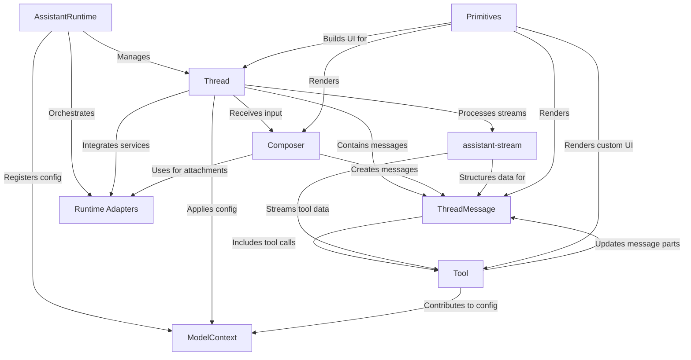

# Tutorial: assistant-ui

**assistant-ui** is an open-source React and TypeScript library that helps developers quickly build *AI chat interfaces* with a similar user experience to ChatGPT. It provides flexible, unstyled UI *primitive components* and handles complex features like *real-time AI response streaming*, chat history, and accessibility, allowing deep customization while integrating with various AI backends and services.

**Source Repository:** [https://github.com/assistant-ui/assistant-ui.git](https://github.com/assistant-ui/assistant-ui.git)

## Chapters

1. [ThreadMessage
](01_threadmessage_.md)
2. [Thread
](02_thread_.md)
3. [Composer
](03_composer_.md)
4. [Primitives
](04_primitives_.md)
5. [AssistantRuntime
](05_assistantruntime_.md)
6. [Tool
](06_tool_.md)
7. [ModelContext
](07_modelcontext_.md)
8. [assistant-stream
](08_assistant_stream_.md)
9. [Runtime Adapters
](09_runtime_adapters_.md)

---

Generated by [AI Codebase Knowledge Builder](https://github.com/The-Pocket/Tutorial-Codebase-Knowledge)